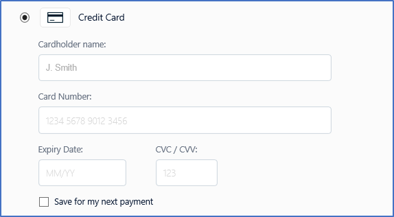
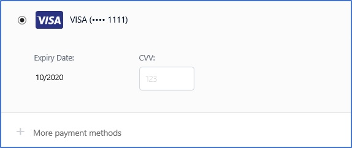

---
# required metadata

title: Processing credit cards without hardware station
description: This topic describes how to configure the point of sale to process card not present transactions in POS clients that do not include a hardware station. 
author: rubendel
manager: AnnBe
ms.date: 05/13/2019
ms.topic: article
ms.prod: 
ms.service: dynamics-365-retail
ms.technology: 

# optional metadata

# ms.search.form: 
# ROBOTS: 
audience: IT Pro
# ms.devlang: 
ms.reviewer: rhaertle
ms.search.scope: Operations, Retail
# ms.tgt_pltfrm: 
ms.custom: 141393
ms.assetid: e23e944c-15de-459d-bcc5-ea03615ebf4c
ms.search.region: Global
ms.search.industry: Retail
ms.author: rubendel
ms.search.validFrom: 2019-01-01
ms.dyn365.ops.version: AX 7.0.1

---

# Processing credit cards without hardware station

[!include [banner](../includes/banner.md)]

This topic describes how to configure all POS clients to process card not present transactions without the need for a hardware station. This capability is currently limited to processing existing credit card payments and does not include creation of new credit card not present payments through an iFrame or some other method within the point of sale. The core scenario targted for this feature is buy online, pick up in store(BOPIS) or curbside pickup.

## Key terms

| Term | Description |
|---|---|
| BOPIS | BOPIS is the common abbreviation for buy online, pick up in store. |
| Curbside pickup | This scenario is similar to BOPIS, but rather than picking up in store, the customer generally does not enter the store and in many cases does not leave their car. |
| Card not present | Sometimes abbreviated as CNP, card not present describes scenarios where the credit card or other form of electronic payment is not phyically present. In the case of BOPIS and curbside pickup, the customer makes their payment online or over the phone and the payment is then captured from the point of sale at the time of pick up. 
| Hardware station | Used to describe the business logic that drives interactions between the point of sale and payment terminals or retail peripherals such as receipt printers. The hardware station is built into the Modern POS for Windows and Modern POS for Android. Modern POS for iOS and Cloud POS require standalone deployed hardware station to interact with physical devices. |

## Overview

While credit card processing in the point of sale has traditionally relied upon a communication with a physical payment terminal, 
## Prerequisites

The List PI capability requires the following elements:

- An e-commerce integration with Microsoft Dynamics 365 Commerce
- A payment connector that is compatible with the List PI capability
- A payment processor that maps unique customer IDs to the payment instruments that the customers want that payment processor to save

For more information about how to implement payment connectors and the software development kit (SDK) in general, visit the [Commerce for IT pros and developers home page](https://docs.microsoft.com/dynamics365/unified-operations/retail/dev-itpro/dev-retail-home-page#payment-connectors).

## Setup

The List PI capability requires the following components and setup steps:

- **E-commerce integration** – An online storefront integration with Commerce is required. For more information about the e-Commerce SDK, see [e-Commerce platform software development kit (SDK)](https://docs.microsoft.com/dynamics365/unified-operations/retail/dev-itpro/ecommerce-platform-sdk).
- **Online payments configuration** – The Dynamics 365 Payment Connector for Adyen supports List PI out of the box. For information about how to configure payments for online stores, see [Dynamics 365 Payment Connector for Adyen](https://docs.microsoft.com/dynamics365/unified-operations/retail/dev-itpro/adyen-connector?tabs=8-1-3#e-commerce). 

    In addition to completing the ecommerce setup steps that are described in that topic, you must set the **Allow saving payment information in e-commerce** option in the Payment accounts fasttab of the **Online store** form to **Yes**. 

- **Omni-channel payments configuration** – In the back office, go to **Retail and Commerce \> Headquarters setup \> Parameters \> Commerce shared parameters**. Then, on the **Omni-channel payments** tab, set the **Use omni-channel payments** option to **Yes**. 

## Functional experience

### Guest checkout

When e-commerce visitors choose to check out as guests, customer records aren't created during checkout, and the customers can't save payment instruments for their next visit. 

### Named user checkout

When named users (signed-in customers) go to the payment step of the checkout process, they will experience the List PI capability. The first time that a named user checks out, a **Save for my next payment** check box appears in the section where credit card information is entered. 

If this check box is selected, when a new credit card is submitted for payment, the named user's unique customer ID is sent to the payment processor, and the credit card is securely saved and mapped to the that unique customer ID. 

If the same customer signs in during future visits to the storefront, he or she will be able to select the same credit card for payment at checkout. 

### Order fulfillment and processing

E-Commerce orders where the customer applied a tender line by using the List PI capability work in the same way as orders that were created without using a saved card payment. From the standpoint of order processing and fulfillment, the two types of payment are indistinguishable. 

## Details of eCommerce payment card tokenization

### Standard flow

In e-Commerce integrations, the payment card is typically entered as part of the checkout process and is saved together with the order before finalization. The card details are entered directly on a payment acceptance page that a payment processor provides. After card details are entered and the customer moves on to the next step of the checkout process, the processor creates a token that is used later in the order creation process. 

When the customer finalizes the online order, the payment card token is sent to the payment processor as part of an authorization request. If the payment authorization request is successful, the payment processor replies by sending an authorization token. This authorization token is saved together with the customer's order and is referenced when that order is fulfilled from the back office. 

### List PI flow

The main difference between the standard flow and the List PI flow is that the customer doesn't have to enter the full credit card number. Instead, the customer just has to select a previously saved credit card and provide the Card Verification Value (CVV number). If the customer provides the correct CVV number and moves on to the next step of the checkout process, the payment processor provides a payment card token that will be included in the authorization request. 

## Related articles

- [Payments FAQ](https://docs.microsoft.com/dynamics365/unified-operations/retail/dev-itpro/payments-retail)
