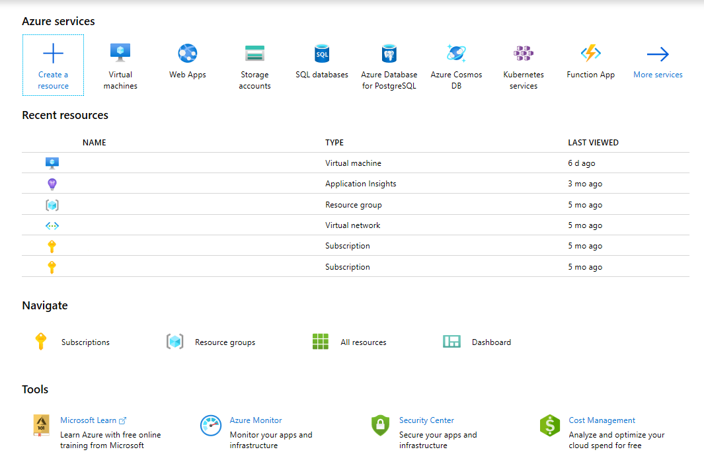
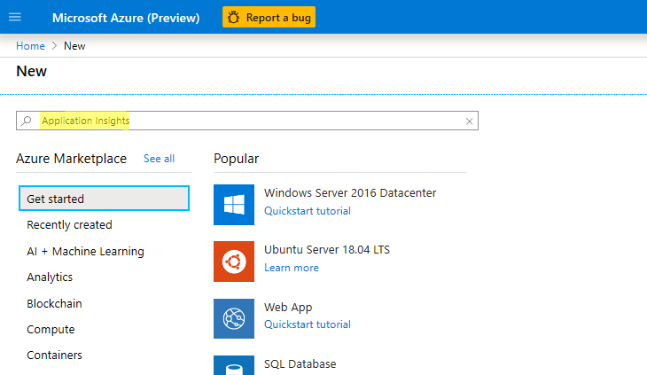
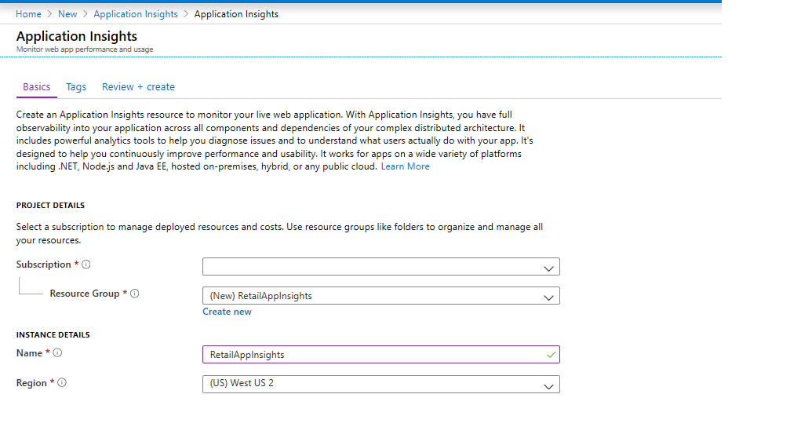
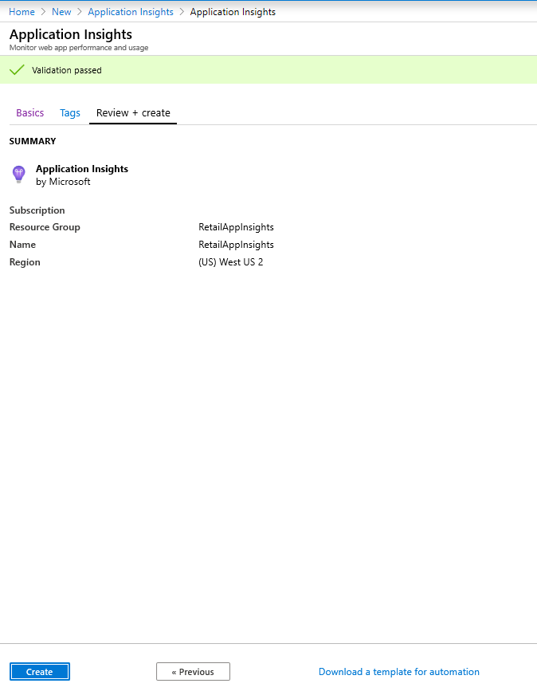
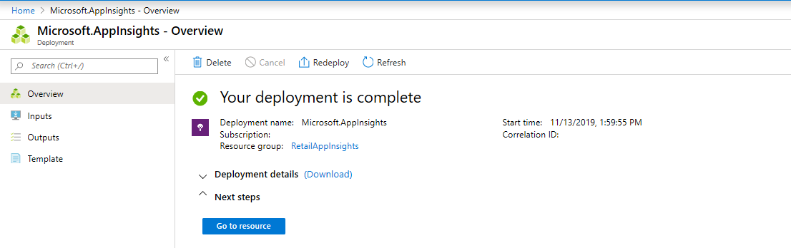
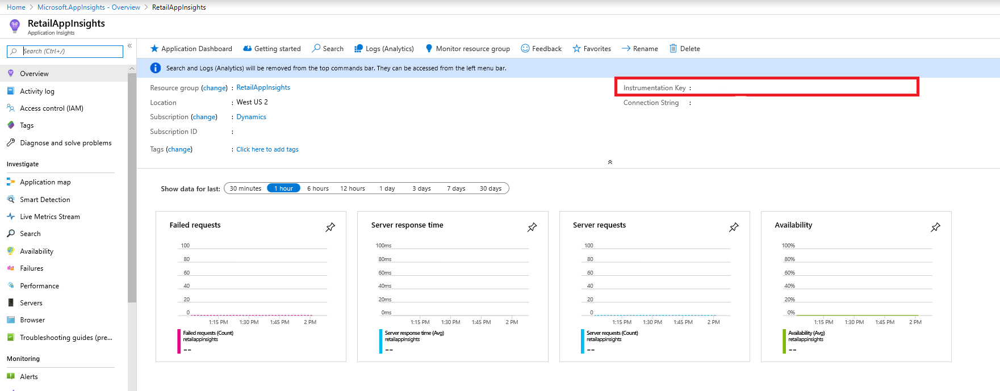
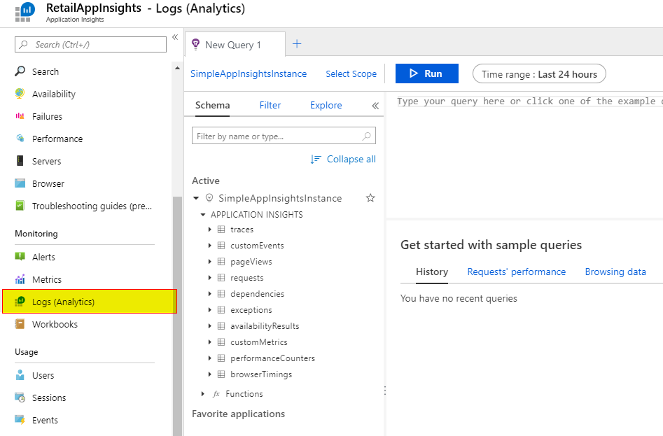
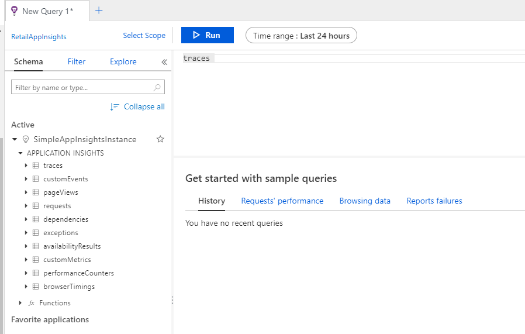
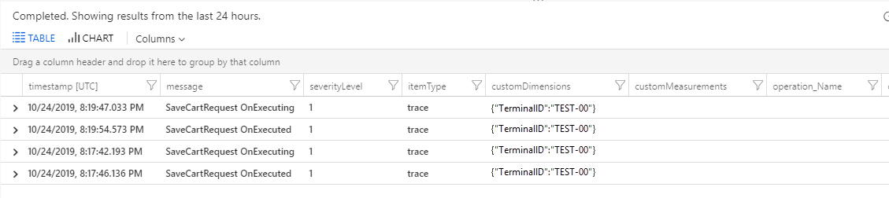

---
# required metadata

title: Log extension events to Application Insights
description: This topic explains how to log events to Customer Application Insights from Commerce runtime (CRT) extensions.
author: mugunthanm
manager: AnnBe
ms.date: 04/29/2020
ms.topic: article
ms.prod: 
ms.service: dynamics-365-retail
ms.technology: 

# optional metadata

# ms.search.form: 
# ROBOTS: 
audience: Developer
# ms.devlang: 
ms.reviewer: rhaertle
ms.search.scope: Operations, Retail
# ms.tgt_pltfrm: 
ms.custom: 28021
ms.assetid: 
ms.search.region: Global
# ms.search.industry: 
ms.author: mumani
ms.search.validFrom: 2019-08-2019
ms.dyn365.ops.version: AX 10.0.7

---

# Log extension events to Application Insights

[!include [banner](../includes/banner.md)]

This topic explains how to log events to [Customer Application Insights](https://docs.microsoft.com/azure/azure-monitor/app/app-insights-overview) from Commerce runtime (CRT) extensions.

## Log an event to Application Insights

1. Set up Application Insights in the [Microsoft Azure portal](https://portal.azure.com), and generate the instrumentation key.
2. Extend CRT to log events to Application Insights by using the instrumentation key that you generated.

> [!NOTE]
> The **RetailLogger** class is no longer supported. Existing extensions that use this class must be migrated to the new model.

## Set up and configure Application Insights in Azure

1. Open the [Azure portal](https://portal.azure.com), and sign in by using your Azure subscription credentials.
2. Select **Create a resource**.

    > [!div class="mx-imgBorder"]
    > 

3. Search for **Application Insights**.

    > [!div class="mx-imgBorder"]
    > 

4. Select **Create**.

    > [!div class="mx-imgBorder"]
    > 

5. On the **Basic** tab, set the **Subscription**, **Resource group**, **Name**, and **Region** fields.

    > [!div class="mx-imgBorder"]
    > 

6. On the **Review + create** tab, select **Create**.

    > [!div class="mx-imgBorder"]
    > 

7. Wait for the deployment to be completed.

    > [!div class="mx-imgBorder"]
    > 

8. Go to the resource, and copy the **Instrumentation Key** value. You will use this value in the CRT code or CRT extension configuration file.

    > [!div class="mx-imgBorder"]
    > 

## Extend the CRT extension project to log events to Application Insights

1. Create a new C\# class library project, and name it **Contoso.Diagnostic**.

    > [!div class="mx-imgBorder"]
    > 

2. Add references to the following libraries:

    + Microsoft.ApplicationInsights
    + Netstandard
    + Microsoft.Dynamics.Commerce.Runtime.Framework

    > [!NOTE]
    > To install the **Microsoft.ApplicationInsights** assembly reference, install the [Application Insights SDK for ASP.NET Core](https://nuget.org/packages/Microsoft.ApplicationInsights.AspNetCore). The reference to **Microsoft.Dynamics.Commerce.Runtime.Framework** can be added from the **..\\RetailSDK\\Reference** folder.

3. Add a new class file that is named **ContosoLogger**, and copy the following code into it.

    ```C#
    using Microsoft.ApplicationInsights;
    using Microsoft.ApplicationInsights.Extensibility;
    using Microsoft.Dynamics.Commerce.Runtime;
    using Microsoft.Dynamics.Commerce.Runtime.Extensions;
    namespace Contoso.Diagnostic
    {
        public static class ContosoLogger
        {
            private static readonly object lockObject = new object();
            private static TelemetryClient client = null;
            public static TelemetryClient GetLogger(RequestContext context)
            {
                if (client == null)
                {
                    lock (lockObject)
                    {
                        if (client == null)
                        {
                            string key = context.Runtime.Configuration.GetSettingValue("ext.AppInsightsKey");
                            client = new TelemetryClient(new TelemetryConfiguration(key));
                        }
                    }
                }
                return client;
            }
        }
    }
    ```

4. Build the project, and copy the output library and the **Microsoft.ApplicationInsights.dll** file to the **..\\RetailServer\\webroot\\bin\\Ext** folder for manual deployment and testing.
5. In the **..\\RetailServer\\webroot\\bin\\Ext** folder, open the **CommerceRuntime.Ext.config** file, and update the **\<settings\>** section with the Applications Insights instrumentation key that you generated earlier. Here is an example.

    ```xml
    <add name="ext.AppInsightsKey" value="xxxxxxx"/>
    ```

6. Restart your Commerce Scale Unit.

## Consume the logger in the CRT extension

1. To consume the **ContosoLogger** in the extension, add the **ContosoDiagnostic** and **Microsoft.ApplicationInsights** assembly references to the extension project.
2. To log events, use the **TraceTelemetry** class, and create the traces. Here is an example.

    ```C#
    using Contoso.Diagnostic;
    using Microsoft.ApplicationInsights.DataContracts;
    var trace = new TraceTelemetry("CRT executing request", SeverityLevel.Information);
    trace.Properties.Add("CustomDimensionColumn1", request.RequestContext.GetTerminalId().ToString());
    trace.Properties.Add("CustomDimensionColumn2", "CRT demo - Save Cart request");
    ContosoLogger.GetLogger(request.RequestContext).TrackTrace(trace);
    ```

    > [!NOTE]
    > Trace properties are custom dimensions that you can easily add to query the traces.

## Validate the trace events

1. Open the [Azure portal](https://portal.azure.com), and sign in by using your Azure subscription credentials.
2. Go to the Application Insights instance, and then, under **Monitoring**, select **Logs (Analytics)** to open a new query editor.

    > [!div class="mx-imgBorder"]
    > 

3. On the **Schema** tab, double-click **traces** to add it to the query editor. The default time range is **Last 24 hours**.

    > [!div class="mx-imgBorder"]
    > 

4. Select **Run** to run the query. The logged event will appear in the results.

    > [!div class="mx-imgBorder"]
    > 

## Build the deployable package

For detailed information about how to build deployable packages, see [Create deployable packages](retail-sdk/retail-sdk-packaging.md).

1. Copy the **Contoso.Diagnostic** and **Microsoft.ApplicationInsights** assemblies to the **\\RetailSDK\\References** folder.
2. Update the **BuildTools\\Customization.settings** file, and add the following entries in the **\<ItemGroup\>** section.

    ```xml
    <ISV_CommerceRuntime_CustomizableFile Include="$(SdkReferencesPath)\\Contoso.Diagnostic.dll" />
    <ISV_CommerceRuntime_CustomizableFile Include="$(SdkReferencesPath)\\Microsoft.ApplicationInsights.dll" />;
    ```

3. Open an MSBuild **Command Prompt** window for Microsoft Visual Studio 2015, and run the **build** command in the root of your Retail SDK folder.
4. Enter the following command to generate the deployable package.

    ```Console
    msbuild /t:rebuild
    ```

5. In the **RetailSDK\\Packages\\RetailDeployablePackage** folder, find the deployable package. Go to the **content.folder** folder, and make sure that your three files are in the package (**Packages\\RetailDeployablePackage\\content.folder\\RetailServer\\Code\\bin\\ext**).
6. Upload the deployable package to your Shared asset library in Microsoft Dynamics Lifecycle Services (LCS).
7. In LCS, open your environment's main page, and select **Environment Features** \> **Retail and Commerce** \> **Manage**.
8. Select **Apply Extension**, and select the extension from your library.
9. After the extension has been successfully deployed, open an instance of Modern POS (MPOS) or POS (CPOS) that has been activated against the Commerce Scale Unit.
10. Run the extension scenario that that uses custom Application Insights logging.
11. Refresh the query in Application Insights to verify that the traces from the extension are logged correctly.
