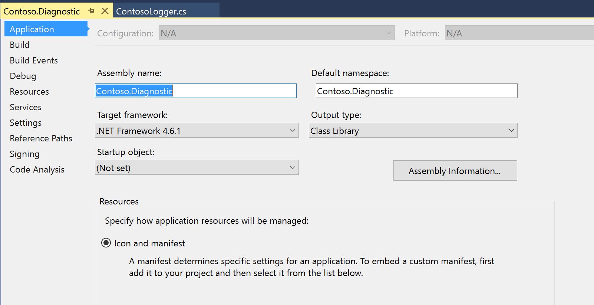

# Log extension events to Application Insights

[!include [banner](../includes/banner.md)]

This article explains how to log events to [Customer Application Insights](/azure/azure-monitor/app/app-insights-overview) from Microsoft Dynamics 365 Commerce runtime (CRT) and POS extensions.

## Log an event to Application Insights

1. Set up Application Insights in the [Microsoft Azure portal](https://portal.azure.com), and generate the instrumentation key.
1. Extend CRT to log events to Application Insights by using the instrumentation key that you generated.

> [!NOTE]
> The **RetailLogger** class is deprecated. Migrate existing extensions that use this class to the new model.

## Set up and configure Application Insights in Azure

Follow the steps in [Create an Application Insights resource](/azure/azure-monitor/app/create-new-resource) to generate the instrumentation key or the connection string.

Copy the instrumentation key, which you use in the CRT. For recent updates and new recommended options to log events, see [Azure Application Insights documentation](/azure/azure-monitor/app/app-insights-overview).

## Extend the CRT extension project to log events to Application Insights

1. Create a new C# class library project, and name it **Contoso.Diagnostic**.

    > [!div class="mx-imgBorder"]
    > 

1. Add NuGet package references to the following libraries:

    + Microsoft.ApplicationInsights
    + Netstandard
    + Microsoft.Dynamics.Commerce.Runtime.Framework

    > [!NOTE]
    > To install the **Microsoft.ApplicationInsights** assembly reference, install the [Application Insights SDK for ASP.NET Core](https://nuget.org/packages/Microsoft.ApplicationInsights.AspNetCore). Add the reference to **Microsoft.Dynamics.Commerce.Runtime.Framework** from the **..\\RetailSDK\\Reference** folder.

1. Add a new class file named **ContosoLogger**, and copy the following code into it.

    ```C#
    using Microsoft.ApplicationInsights;
    using Microsoft.ApplicationInsights.Extensibility;
    using Microsoft.Dynamics.Commerce.Runtime;
    using Microsoft.Dynamics.Commerce.Runtime.Extensions;
    namespace Contoso.Diagnostic
    {
        public static class ContosoLogger
        {
            private static readonly object lockObject = new object();
            private static TelemetryClient client = null;
            public static TelemetryClient GetLogger(RequestContext context)
            {
                if (client == null)
                {
                    lock (lockObject)
                    {
                        if (client == null)
                        {
                            string key = context.Runtime.Configuration.GetSettingValue("ext.AppInsightsKey") ?? string.Empty;
                            client = new TelemetryClient(new TelemetryConfiguration(key));
                        }
                    }
                }
                return client;
            }
        }
    }
    ```

1. Build the project. For manual deployment and testing, copy the output library and the **Microsoft.ApplicationInsights.dll** file to the **..\\RetailServer\\webroot\\bin\\Ext** folder.
1. In the **..\\RetailServer\\webroot\\bin\\Ext** folder, open the **CommerceRuntime.Ext.config** file. Update the **\<settings\>** section with the Applications Insights instrumentation key that you generated earlier. Here's an example.

    ```xml
    <add name="ext.AppInsightsKey" value="xxxxxxx"/>
    ```

1. Restart your Commerce Scale Unit.

## Consume the logger in the CRT extension

1. To consume the **ContosoLogger** in the extension, add the **ContosoDiagnostic** and **Microsoft.ApplicationInsights** assembly references to the extension project.
1. To log events, use the **TraceTelemetry** class, and create the traces. Here's an example.

    ```C#
    using Contoso.Diagnostic;
    using Microsoft.ApplicationInsights.DataContracts;
    var trace = new TraceTelemetry("CRT executing request", SeverityLevel.Information);
    trace.Properties.Add("CustomDimensionColumn1", request.RequestContext.GetTerminalId().ToString());
    trace.Properties.Add("CustomDimensionColumn2", "CRT demo - Save Cart request");
    ContosoLogger.GetLogger(request.RequestContext).TrackTrace(trace);
    ```

    > [!NOTE]
    > Trace properties are custom dimensions that you can easily add to query the traces.

## Validate the trace events

1. Open the [Azure portal](https://portal.azure.com), and sign in by using your Azure subscription credentials.
1. Go to the Application Insights instance, and then, under **Monitoring**, select **Logs (Analytics)** to open a new query editor.

    > [!div class="mx-imgBorder"]
    > 

1. On the **Schema** tab, double-click **traces** to add it to the query editor. The default time range is **Last 24 hours**.

    > [!div class="mx-imgBorder"]
    > 

1. Select **Run** to run the query. The logged event appears in the results.

    > [!div class="mx-imgBorder"]
    > 

## Build the deployable package

For detailed information about how to build deployable packages, see [Create deployable packages](retail-sdk/retail-sdk-packaging.md).

1. Copy the **Contoso.Diagnostic** and **Microsoft.ApplicationInsights** assemblies to the **\\RetailSDK\\References** folder.
1. Update the **BuildTools\\Customization.settings** file, and add the following entries in the **\<ItemGroup\>** section.

    ```xml
    <ISV_CommerceRuntime_CustomizableFile Include="$(SdkReferencesPath)\\Contoso.Diagnostic.dll" />
    <ISV_CommerceRuntime_CustomizableFile Include="$(SdkReferencesPath)\\Microsoft.ApplicationInsights.dll" />;
    ```

1. Open an MSBuild **Command Prompt** window for Microsoft Visual Studio 2015, and run the **build** command in the root of your Retail SDK folder.
1. Enter the following command to generate the deployable package.

    ```Console
    msbuild /t:rebuild
    ```

1. In the **RetailSDK\\Packages\\RetailDeployablePackage** folder, find the deployable package. Go to the **content.folder** folder, and make sure that your three files are in the package (**Packages\\RetailDeployablePackage\\content.folder\\RetailServer\\Code\\bin\\ext**).
1. Upload the deployable package to your Shared asset library in Microsoft Dynamics Lifecycle Services (LCS).
1. In LCS, open your environment's main page, and select **Environment Features** \> **Retail and Commerce** \> **Manage**.
1. Select **Apply Extension**, and select the extension from your library.
1. After the extension is successfully deployed, open an instance of Store Commerce that is activated against the Commerce Scale Unit.
1. Run the extension scenario that uses custom Application Insights logging.
1. Refresh the query in Application Insights to verify that the traces from the extension are logged correctly.

## Log events to Application Insights in the POS extension projects

1. In the **RetailSDK\POS\Extensions** folder, create a new folder named  **Libraries**.
1. Open a command prompt and go to the **Libraries** folder.
1. Install **npm**. You can download and install the **npm** package from [OpenJS](https://nodejs.org).
1. Run this command to install the **npm** package for the JavaScript Application Insights package.

    ```console run the
    npm i --save @microsoft/applicationinsights-web@2.5.8
    ```
 
 > [!NOTE]
 > The sample documented here's based on applicationinsights-web npm package version 2.5.1. The sample might not work as-is in the updated applicationinsights-web package.

After the package is installed, the **POS/Extensions/Libraries** folder contains the **node_modules** folder. The **node_modules** folder contains the Application Insights library files.

1. Check that the file **POS/Extensions/Libraries/node_modules/@microsoft/applicationinsights-web/dist/applicationinsights-web.js** exists in the library.

    The file name might change in future versions of the Application Insights library. If the path changes, update the library path in steps 8 and 10 to a path that points to the main Application Insights library.

1. Open **ModernPOS.sln** or **CloudPos.sln** from **RetailSDK\POS**.
1. Open the **tsconfig.json** file from the **POS.Extensions** project. Under the **exclude** section, add an entry to the **Libraries** folder.

    ```typescript
    "exclude": [
        "Libraries"
      ],
    ```

1. Open the **tsconfig.json** file from the **POS.Extensions** project. Under the **compilerOptions** section, add the following properties.

    ```typescript
    "baseUrl": "./",
    "paths": {
        "applicationinsights-web": [ "Libraries/node_modules/@microsoft/applicationinsights-web/dist/applicationinsights-web" ]
    }
    ```

1. Edit the **Pos.Extensions.csproj** file in the **CopyPosExtensionsFiles** section. Add the following targets to copy the Application Insights library to the POS application, so that the targets can be consumed by the extension code.

    ```typescript
    <JavaScriptFileList Include="Libraries\\**\\*.js">
        <InProject>false</InProject>
        <Visible>false</Visible>
    </JavaScriptFileList>
    ```

1. Include the following node in the **manifest.json** file of the POS extension folder (package) that consumes the Application Insights library.

    ```typescript
    {
      "dependencies": [
        {
          "alias": "applicationinsights-web",
          "format": "amd",
          "modulePath": "../Libraries/node_modules/@microsoft/applicationinsights-web/dist/applicationinsights-web"
        }
      ]
    }
    ```

The Application Insights library is now ready to use in POS.

## Consume the library and log events

1. Open the **ModernPOS.sln** or **CloudPos.sln** solution from **RetailSDK\POS**.
1. Create a new TypeScript file inside the POS extension folder (package) and name it **AppInsights.ts**.
1. Copy the following code to the file. The extensions use this code to track events by using Application Insights. Use the instrumentation key created in Azure App Insights.

    ```typescript
    import { ApplicationInsights } from "applicationinsights-web";

    /**
     * Example implementation of an Application Insights singleton that can be used to log events and metrics on Application Insights.
     */
    export class AppInsights {
        private static _instance: AppInsights = null;
        private _applicationInsights: ApplicationInsights = null;

        /**
         * Gets a global reference to an Application Insights reference that can be used by other extension code.
         * @returns {ApplicationInsights} The ApplicationInsights instance that can be used to log events.
         */
        public static get instance(): ApplicationInsights {
            if (AppInsights._instance === null) {
                AppInsights._instance = new AppInsights();
            }

            return AppInsights._instance._applicationInsights;
        }

        /**
         * Initializes a new instance of AppInsights.
         */
        constructor() {
            this._applicationInsights = new ApplicationInsights({
                config: {
                    instrumentationKey: 'YOUR_INSTRUMENTATION_KEY_GOES_HERE'
                    /* ...Other Configuration Options... */
                }
            });
            this._applicationInsights.loadAppInsights();
        }
    }
    ```

1. In the extension code, log the events by calling the AppInsights class as shown in the following code example.

    ```typescript
    AppInsights.instance.trackEvent({
        name: "extensionTest",
        properties: {
            "property1": "value1",
            "property2": "value2",
        },
        measurements: {
            "measurement1": 1,
            "measurement2": 2,
        },
    });
    ```

[!INCLUDE[footer-include](../../includes/footer-banner.md)]
