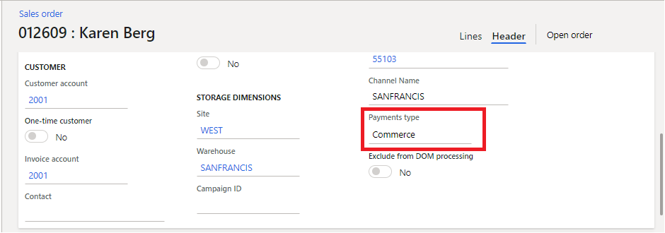

---
# required metadata

title: Omni-channel order payments
description: This topic describes Omni-channel order payments in Dynamics 365 Commerce.
author: rubendel
manager: annbe
ms.date: 07/28/2020
ms.topic: article
ms.prod: 
ms.service: dynamics-365-retail
ms.technology: 

# optional metadata

# ms.search.form: 
# ROBOTS: 
audience: IT Pro
# ms.devlang: 
ms.reviewer: josaw
ms.search.scope: Operations, Retail
# ms.tgt_pltfrm: 
ms.custom: 141393
ms.assetid: e23e944c-15de-459d-bcc5-ea03615ebf4c
ms.search.region: Global
ms.search.industry: Retail
ms.author: rubendel
ms.search.validFrom: 2019-01-01
ms.dyn365.ops.version: AX 7.0.1

---

# Omni-channel Commerce order payments

[!include [banner](../includes/banner.md)]

This topic describes omni-channel Commerce order payments functionality in Dynamics 365 Commerce. With this functionality, you can edit e-commerce and point of sale (POS) order payments from Commerce headquarters (HQ).

## Key terms

| Term | Description |
|---|---|
| Commerce payment | A payment associated with a customer order generated at the POS or in the e-commerce storefront. |
| Order completion | Order completion is the business logic in the call center that ensures payments have been collected before the order is submitted. The **Enable order completion** setting in the call center parameters is used to enable this business logic. For more details, read the [Enable order completion](https://docs.microsoft.com/en-us/dynamics365/commerce/set-up-order-processing-options#enable-order-completion) section of the [Set up call center channels](https://docs.microsoft.com/en-us/dynamics365/commerce/set-up-order-processing-options) topic. 
| Call center order | An order created in Commerce headquarters (HQ) by a call center user. |
| AR sales orders | Orders created through accounts receivable in Commerce headquarters (HQ) by a non-call center user. Payments for these orders may not be edited through call center order completion. |

## Overview

Dynamics 365 Commerce consists of three main channels: POS, e-commerce, and call center. In Commerce versions 10.0.12 and earlier, the management of payment lines for orders created in each channel is not uniform. For example, when creating and editing orders the call center, there's an order completion flow that ensures payments are designated for those orders prior to fulfillment. Alternatively, POS and e-commerce orders have not supported call center order completion. To illustrate the lack of parity, go to the **Customer service** page in Commerce headquarters (HQ) and note which orders have an active link to the **Payments** form. 

Order created in call center:

Order created in POS:

In Commerce versions 10.0.13 and later, you can access the payments page for orders created in e-commerce and the POS. With omni-channel Commerce order payments enabled, the orders can be edited using the order completion function that was previously only available for call center orders.  

Order completion:

## Prerequisites

To enable omni-channel Commerce payments, you must first enable several other features and configurations. The features should be enabled as a best practice because they address functional gaps related to orders. After the omni-channel Commerce payments feature is enabled, you can disable some of the other functionality, but that is not recommended. 

The configurations listed below are required for omni-channel Commerce payments to function properly. 

| Feature name | Description | May be disabled later |
| --- | --- | --- |
| Omni-channel payments | Enables omni-channel payment scenarios such as buy online, pick up in store. For more information, refer to the [Omni-channel payments overview](https://docs.microsoft.com/en-us/dynamics365/commerce/omni-channel-payments) topic. | No | 
| Unified payment posting journal defaults for Commerce | When this feature is enabled, business logic is changed in regards to how customer payment and customer refund payment journals are created for orders created through call center, POS, or e-commerce channels.  | Yes |
| Duplicate payment protection on invoicing | Enables duplicate payment protection for invoicing scenarios. Commerce payments functionality may affect customizations in invoicing scenarios. If your organization has invoicing customizations, make sure that the customizations are refactored before you enable Commerce payments functionality on production environments. | Yes |
| Enable refunds over multiple captures | This functionality improves performing multiple linked refunds against an order. | Yes |

### Configure prerequisites

#### Map payment methods to operations

You must map payment methods in all channels to a corresponding operation, so that the management of order payments is supported in Commerce headquarters (HQ). Map payment methods before you enable omni-channel Commerce payments to avoid receiving warnings for each payment method that doesn't have an equivalent operation mapping. 

The image below illustrates a payment to operation mapping in call center.

#### Configure call center

You must configure at least one call center channel in order to manage POS and e-commerce order payments through Commerce headquarters (HQ). For more information on creating a call center, refer to the [Set up a call center channel](https://docs.microsoft.com/en-us/dynamics365/commerce/channel-setup-callcenter#overview) topic. 

#### Set up users as call center users

Users who will edit Commerce payments in Commerce headquarters (HQ) must be set up as call center channel users. For more details on setting up call center users, refer to the [Set up a call center channel user](https://docs.microsoft.com/en-us/dynamics365/commerce/channel-setup-callcenter#set-up-channel-users) section of the call center article. 

#### Enable order completion for call enters

Order completion must be enabled for call centers. This enforces business logic to ensure orders can be paid during fulfillment. For more information on order completion, refer to the [Enable order completion](https://docs.microsoft.com/en-us/dynamics365/commerce/set-up-order-processing-options#enable-order-completion) section of the article explaining call center order processing options.

#### Disable "Pay later"

When customer orders are created at the POS, the store associate has the option to collect a card payment for fulfillment or they can select **Pay later** to skip collection of card details. When omni-channel Commerce payments is enabled, the **Pay later** option should be removed from the POS. To remove that option, search for **Functionality profiles**. In the **General** fasttab for the functionality profile, change **Require payment for fulfillment** to **Card required**. These changes must be synced to the channel database to take effect at the POS. 

## Enabling omni-channel order payments

Once the prerequisites above are fulfilled, go to the **Feature management** workspace. Click **All** to remove the **New** filter from the list of features, then search for **Omni-channel Commerce order payments**. 

Select the feature from the list and then select **Enable now**.

> [!IMPORTANT]
> The omni-channel Commerce order payments feature includes many changes to payments and order management workflows. Exhaustive testing should be performed before you enable it in production.

To distinguish between channel orders created with omni-channel Commerce payments enabled from other orders, a **Payments type** field is displayed on the order header when omni-channel Commerce order payments funtionality is enabled. POS and e-commerce orders appear as payments type **Commerce** on the order header.

Call center orders appear as payments type **Call Center**. For sales orders created in Accounts Receivable, this field is not present. 

## Fullfill orders after omni-channel Commerce order payments is disabled

POS and e-commerce orders created while omni-channel Commerce order payments is enabled must be fulfilled while the feature is enabled. If the feature is later disabled, the orders will be prevented from further processing while the feature until it is re-enabled.

## Manage orders created before omni-channel Commerce order payments is enabled

Orders that were created before omni-channel Commerce order payments is enabled may be processed after the feature is enabled. The experience for editing those orders won't change once the feature is enabled, and the orders won't be modified to accomodate omni-channel Commerce order payment workflows. In addition, sales orders generated in **Accounts Receivable** by non-call center users will continue behave as they did prior to enabling omni-channel Commerce order payments. 

## Key scenarios

When the omni-channel Commerce order payments feature is enabled, e-commerce and POS order credit card payments can be managed through order completion. For example, if a customer places an online order, then calls into the call center to request a change to the order, the order completion function allows for the payments on that order to be adjusted to support the new balance due.

The properties on an order line that can be edited before payment capture are:
- Card type
- Card number
- Payment amount
- Percent amount

### Edit order payments

The following scenarios in call center order completion apply to order payments that were created in POS or the e-commerce storefront: 

#### Uncaptured card payments

The following properties can be edited prior to payment capture for any card payment line on an order that has not yet been partially invoiced:
- Card type
- Card number
- Payment amount
- Percent amount

After the payments are edited, the order submittal process rectifies any changes required for edited payment lines. 

| Scenario | Description | Supported |
| --- | --- | --- |
| **Edit to specify a higher amount** | For card payments that have been authorized but not yet captured, the payment amount may be increased. A new authorization will be created for the new amount and the old authorization will be voided. | Yes |
| **Edit to specify a lower amount** | Card payments that have been authorized but not yet captured may be reduced. When a payment line amount is reduced, the previous authorization is cancelled and a new authorization is created for the lower amount. | Yes |
| **Remove an old card and add a new one** | Uncaptured card payment authorizations may be removed from orders and replaced by a payment on a different card. The authorization for the first card is cancelled and an authorization for the new card will be obtained when the order is submitted. | Yes |

#### Partially and fully captured card payments

| Scenario | Description | Supported |
| --- | --- | --- |
| **Edit a payment that was used to invoice part of the order** | When an order with omni-channel Commerce payments was partially invoiced, the card payment amount for the existing card can be edited through call center order completion down to the amount that has already been captured. A new card can then be applied to cover the balance due for the order.  | Yes |
| **Edit fully captured card payment lines to specify a higher amount** | If a card payment was fully captured, but the amount for that card payment is increased through call center order completion, a new authorization for the card is created for the increased amount upon submittal. | Yes |

### Remove order payments

| Scenario | Description | Supported |
| --- | --- | --- |
| **Authorized payments** | Omni-channel Commerce order card payments can be removed through order completion only if they weren't partially captured. | Yes |
| **Prepayments** | Prepayments can't be removed through order completion. Prepayments have payment vouchers already associated with them and can't be removed from an order once they are applied. | No |
| **Partially captured payments** | If the payment is in a **Paid** state but has not been fully captured, the payment can't be removed. However, the payment amount can be reduced to the already posted amount and the uncaptured amount is voided from the authorization. | No | 
| **Fully captured credit card payments and prepayments** | Can't be removed from the order. | No |

### Cancel order and sales lines

| Scenario | Description | Supported |
| --- | --- | --- |
| **Order cancellation for credit card payments that aren't captured** | If an order is cancelled, card payment authorizations that have not yet been captured are cancelled. | Yes |
| **Order cancellation for credit card payments that are captured, but not invoiced** | If an order is created at the POS and a card payment is used to capture a deposit, the order is cancelled prior to invoicing. The card payment is automatically refunded as part of order cancellation. | Yes |
| **Order cancellation for orders that are partially shipped and invoiced** | For orders that have been partially shipped and invoiced, cancellation will cancel the fulfillment of lines that aren't invoiced. Open credit card authorizations for the the remaining balance on the order aren't automaticaly cancelled. | Requires manual refund |
| **Order cancellation for orders that are invoiced, but not shipped** | If an order is fully invoiced, but any of the items haven't shipped, the order can be cancelled, but payments that are captured for that order won't automatically be refunded. Open authorizations for items that aren't invoiced won't be cancelled, but will expire based on the card issuing bank's authorization expiration policies. | Requires manual refund |
| **Line cancellation for items that aren't fulfilled or invoiced** | If an order line that isn't fulfilled or invoiced is cancelled, the order completion process will require that payments for the order balance with the order total. If removing a line decreases the amount due, then the payment amount should be reduced accordingly. 

### Refunds  

| Scenario | Description | Supported |
| --- | --- | --- |
| **Linked refunds for POS and e-commerce orders** | Return orders generated from orders originating in POS and e-commerce channels can issue linked refunds against the cards charged during invoicing. | Yes |
| **Linked refunds for AR sales order** | While the payments may not be edited in order completion, returns issued for Accounts Receivable sales orders can be subject to a linked refund to the original card charged during invoicing. | 
| **Unlinked refunds** | If allowed by the merchant's return policies and payment processor, unlinked refunds can be designated for return orders in cases where the order was originally paid in cash, for example, or in cases where the original card used for payment is no longer active. | Yes |
| **Refunds to non-card prepayments** | Return orders that are orignally paid with non-card prepayments, such as cash or credit memo payments, won't be subject to linked refund. An appropriate payment method such as **Check** must be designated for the refund payment. Organizations that allow unlinked refunds may refund non-card prepayments to credit cards that weren't previously used for the order if allowed by the payment processor. | Yes |

### Edit and remove orders with prepayments

| Scenario | Description | Supported |
| --- | --- | --- |
| **Edit prepayment tender lines** | Prepayment tender lines have payment vouchers associated with them and can't be edited or removed. | No |

## Related changes 

To support onmi-channel Commerce payments, changes to existing functionality were introduced in Commerce versions 10.0.13. 

### Consistent selection of payment journals when posting sales orderd and refund payments

In Commerce versions 10.0.12 and earlier, payment journal designation is inconsistent across channels. In Commerce versions 10.0.13 and later, if omni-channel Commerce payments is enabled, all channels use payment vouchers designated in **Commerce parameters** on the **Posting** tab. 

### Check payment method

Orders created in POS don't include check number when they're created in the Commerce headquarters (HQ). When omni-channel Commerce payments is enabled, orders created in POS that are paid for by check will have **9999** entered as the check number.

Furthermore, the check number won't be required when designating **Check** as the refund method of payment.  

