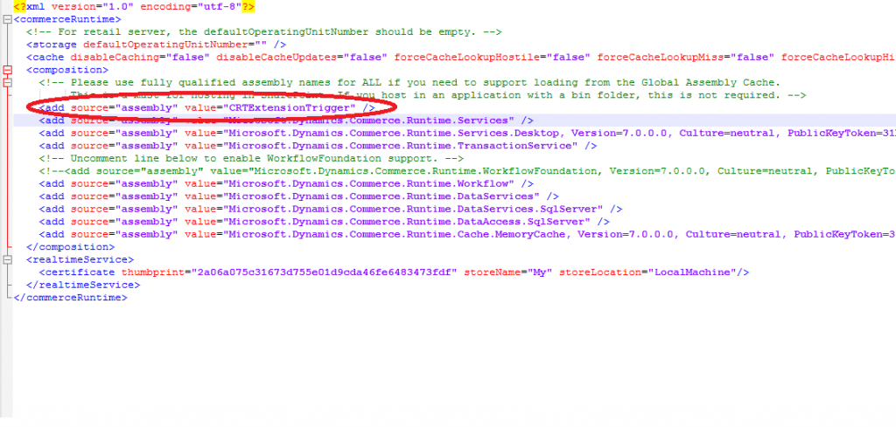

---
# required metadata

title: Commerce runtime (CRT) extensibility and triggers
description: This article explains trigger support for the Microsoft Dynamics 365 commerce runtime (CRT). CRT supports pre-triggers and post-triggers for every request.
author: RobinARH
manager: AnnBe
ms.date: 06/20/2017
ms.topic: article
ms.prod: 
ms.service: dynamics-365-retail
ms.technology: 

# optional metadata

# ms.search.form: 
# ROBOTS: 
audience: Developer
# ms.devlang: 
ms.reviewer: rhaertle
ms.search.scope: Operations, Retail
# ms.tgt_pltfrm: 
ms.custom: 17731
ms.assetid: 2d6ec331-b266-4dbc-97c5-db2919b662dc
ms.search.region: Global
ms.search.industry: Retail
ms.author: sijoshi
ms.search.validFrom: 2016-02-28
ms.dyn365.ops.version: AX 7.0.0, Retail July 2017 update

---

# Commerce runtime (CRT) extensibility and triggers

[!include [banner](../includes/banner.md)]

This article explains trigger support for the Dynamics 365 commerce runtime (CRT). CRT supports pre-triggers and post-triggers for every request.

## CRT trigger overview

Commerce runtime (CRT) triggers give you a way to extend the CRT workflow, and let you add business logic before and after every CRT request is executed. The following two methods are used:

-   **OnExecuting** – This method is invoked before a request has been processed by a corresponding **IRequestHandler** implementation.
-   **OnExecuted** – This method is invoked after the request has been processed by a corresponding **IRequestHandler** implementation.

## CRT trigger interface
To implement a trigger, you must complete these tasks, as shown in the code example that follows:

1.  Implement **IRequestTrigger**.
2.  Specify **SupportedRequestTypes** to define the request types that the trigger must be executed for.
3.  Write a trigger implementation in the **OnExecuting** method if business logic must be run before the request is addressed.
4.  Write a trigger implementation in the **OnExecuted** method if business logic must be run after the request is addressed.

    ```xml
    /// <summary>
    /// The interface for request trigger.
    /// </summary>
    public interface IRequestTrigger
    {
        /// <summary>
        /// Gets the collection of request types supported by this trigger.
        /// </summary>
        /// <remarks>If null or empty collection returned trigger will be called for all request.</remarks>
        IEnumerable<Type> SupportedRequestTypes { get; }
        /// <summary>
        /// Invoked before request has been processed by <see cref="IRequestHandler"/>.
        /// </summary>
        /// <param name="request">The incoming request message.</param>
        void OnExecuting(Request request);
        /// <summary>
        /// Invoked after request has been processed by <see cref="IRequestHandler"/>.
        /// </summary>
        /// <param name="request">The request message processed by handler.</param>
        /// <param name="response">The response message generated by handler.</param>
        void OnExecuted(Request request, Response response);
    }

    Sample trigger implemntation for Get customer data request:

            public class GetCustomerTriggers : IRequestTrigger
        {
            /// <summary>
            /// Gets the supported requests for this trigger.
            /// </summary>
            public IEnumerable<Type> SupportedRequestTypes
            {
                get
                {
                    return new[] { typeof(GetCustomerDataRequest) };
                }
            }

            /// <summary>
            /// Post trigger code to retrieve extension properties.
            /// </summary>
            /// <param name="request">The request.</param>
            /// <param name="response">The response.</param>
            public void OnExecuted(Request request, Response response)
            {
                ThrowIf.Null(request, "request");
                ThrowIf.Null(response, "response");

                //Custom logic
            }

            /// <summary>
            /// Pre trigger code.
            /// </summary>
            /// <param name="request">The request.</param>
            public void OnExecuting(Request request)
            {
                //Custom logic
            }
        }
    ```

## Trigger CommerceRunTime.config updates for 7.0
When you extend the CRT, you must write your extension in your own assembly. After you write the trigger extension in your assembly, you must copy the extension library to the Commerce Scale Unit bin folder and add an entry in the **composition** section of the commerceRuntime.config file for the CRT, so that the trigger is loaded at run time. The following example shows a .config file that includes an entry for a trigger implementation in the **CRTExtensionTrigger** assembly. 

[](./media/crtextensiontrigger.png)

For the CRT extension to work in offline mode update **...\Microsoft Dynamics 365\70\Retail Modern POS\ClientBroker\CommerceRuntime.MPOSOffline.config** with the extension library information under the composition section and copy and paste the extension library to **...\Microsoft Dynamics 365\70\Retail Modern POS\ClientBroker**.

## Trigger CommerceRunTime.config updates for 7.1 (with May 2017 monthly update), 7.2 and 7.3
Copy and paste the extension library to **...\RetailServer\webroot\bin\ext folder** and update the **commerceRuntime.ext.config** file with the custom extension library information under composition section. In this example, **Contoso.Commerce.Runtime.Services** is the  custom extension name.
    <add source="assembly" value="Contoso.Commerce.Runtime.Services" /> 

For the CRT extension to work in offline mode update **...\Microsoft Dynamics 365\70\Retail Modern POS\ClientBroker\extCommerceRuntime.MPOSOffline.ext.config** with the extension library information under the composition section and copy and paste the extension library to **...\Microsoft Dynamics 365\70\Retail Modern POS\ClientBroker\ext**.
