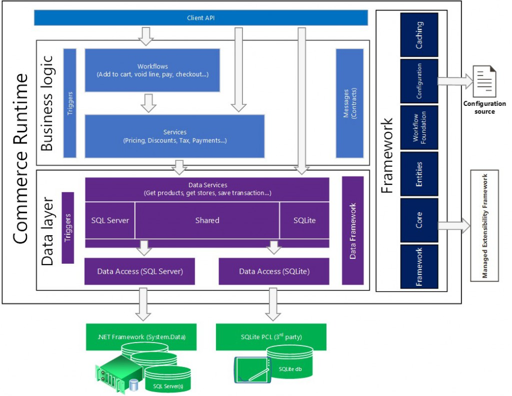

# Commerce runtime (CRT) architecture and configuration

[!include [banner](../includes/banner.md)]

This article provides information about the architecture and configuration of Commerce Runtime (CRT). The CRT is a collection of portable .NET libraries that encapsulate business logic. It serves as the engine for the commerce channel. 

## Commerce Runtime architecture

The following diagram shows the components of the Microsoft Dynamics 365 Commerce Runtime (CRT). 

### Data access

On top of the database is a data access layer. In the data access layer, raw data is translated into objects in memory. For example, an object might be a product. Products have attributes, such as price and color. The data access layer has functions that you can use to manipulate the objects. Stored procedures pass packets of data from the database to data entities that can be used in services and workflows. You can update the packets of data to include new fields that you add in Commerce.

### Services

On top of the data access layer is a services layer. Services query for real-time data. You can use these services to customize existing functionality, or you can add your own services that include new functionality.

### Workflows

On top of the services layer is the workflow layer. A workflow is a collection of services and business logic that, together, define business processes. For example, when a customer adds an item to the cart, you can use a workflow to get the price, perform validation, check the inventory quantity, calculate shipping charges, calculate tax, and calculate discounts. You can use the workflows that are included in Commerce, or you can create new workflows. You can even use a workflow to connect to a third-party system as part of your business processes.

### API

On top of the workflow layer is the application programming interface (API) layer. You can use the API for tasks such as getting information about items, calculating prices, calculating shipping charges, and placing orders. You can extend the API to fit your business processes.

## Commerce Runtime configuration

Services are enumerated as types in the CRT configuration file. You can add types in the CRT configuration file to control which services are loaded in the CRT. Services are loaded in the order in which they are listed in the configuration file. All the default services are loaded automatically. However, if you add a new service above one of the default services, the new service replaces the default service.

[!INCLUDE[footer-include](../../includes/footer-banner.md)]
