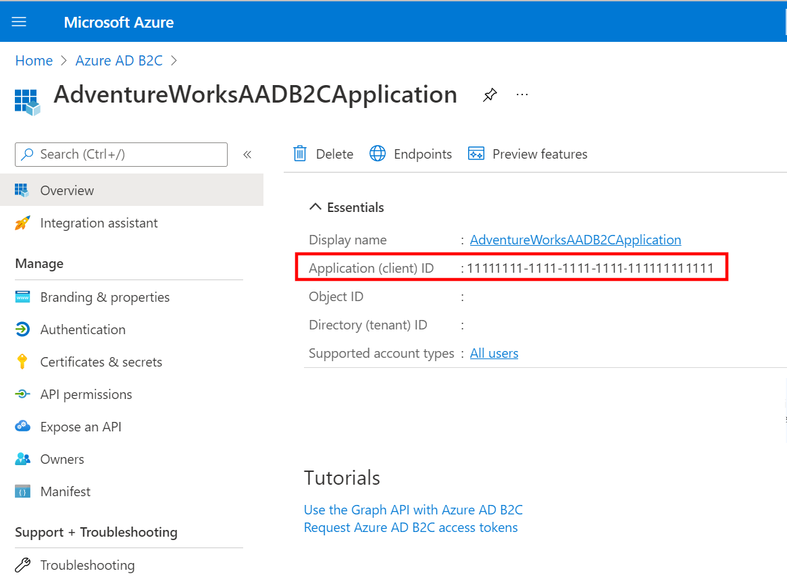
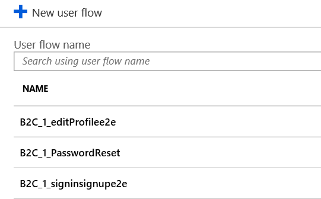

# Configure your B2C tenant in Commerce site builder

[!include [banner](../includes/banner.md)]

This article describes how to configure your business-to-consumer (B2C) tenant in Microsoft Dynamics 365 Commerce site builder.

Once the setup of your Microsoft Entra B2C tenant is completed, you must configure the B2C tenant in Commerce site builder. Configuration steps include collecting B2C application information from the Azure portal, entering that B2C application information into site builder, and then associating the B2C application with your site and channel.

### Collect the required application information

To collect the required application information, follow these steps.

1. In the Azure portal, go to **Home \> Microsoft Entra ID B2C - App registrations**.
1. Select your application, and then in the left navigation pane select **Overview** to obtain the application details.
1. From the **Application (client) ID** reference, collect the application ID of the B2C application created in your B2C tenant. You will enter this ID later as the **Client GUID** in site builder.
1. Select **Redirect URIs** and collect the reply URL shown for your site (the reply URL entered at setup).
1. Go to **Home \> Microsoft Entra B2C – User flows**, and then collect the full names of each user flow policy.

The following image shows an example of the **Microsoft Entra ID B2C - App registrations** overview page.

The following image shows an example of user flow policies on the **Microsoft Entra B2C – User flows (policies)** page.

### Enter your Microsoft Entra B2C tenant application information into Commerce

You must enter details of the Microsoft Entra B2C tenant into Commerce site builder before associating the B2C tenant with your sites.

To add your Microsoft Entra B2C tenant application information to Commerce, follow these steps.

1. Sign in as an administrator to Commerce site builder for your environment.
1. In the left navigation pane, select **Tenant Settings**  to expand it.
1. Under **Tenant Settings**, select **Site authentication setup**. 
1. In the main window next to **Site authentication profiles**, select **Manage**. (If your tenant appears in the site authentication profiles list, it has already added by an administrator. Verify that the items in step 6 below match the items for your intended B2C setup. A new profile can also be created using similar Microsoft Entra B2C tenants or applications to account for minor differences, such as differing user policy IDs).
1. Select **Add site authentication profile**.
1. Enter the following required items in the form displayed, using values from your B2C tenant and application. Fields that aren't required (without an asterisk) may be left blank.

    - **Application Name**: The name for your B2C Application, for example "Fabrikam B2C".
    - **Tenant Name**: The name of your B2C tenant (for example, use "fabrikam" if the domain appears as "fabrikam.onmicrosoft.com" for the B2C tenant). 
    - **Forget Password Policy ID**: The forget password user flow policy ID, for example "B2C_1_PasswordReset".
    - **Signup Signin Policy ID**: The sign-up and sign-in user flow policy ID, for example "B2C_1_signup_signin".
    - **Client GUID**: The B2C application ID, for example "22290eb2-c52e-42e9-8b35-a2b0a3bcb9e6".
    - **Edit Profile Policy ID**: The profile editing user flow policy ID, for example "B2C_1A_ProfileEdit".

1. Select **OK**. You should now see the name of your B2C application appear in the list.
1. Select **Save** to save your changes.

The optional **Login custom domain** field should only be used if you're setting up a custom domain for the Microsoft Entra B2C tenant. For additional details and considerations regarding the usage of the **Login custom domain** field, see [Additional B2C information](additional-b2c-info.md).

### Associate the B2C application to your site and channel

> [!WARNING]
> - If your site is already associated with a B2C application, changing to a different B2C application will remove the current references established for users already signed up in this environment. If changed, any credentials associated with the currently-assigned B2C application will not be available to users. 
> - Only update the B2C application if you're setting up the channel's B2C application for the first time or if you intend to have users sign up again with new credentials to this channel with the new B2C application. Take caution when associating channels to B2C applications, and name applications clearly. If a channel is not associated to a B2C application in the steps below, users signing into that channel for your site will be entered into the B2C application showing as **default** in the **Tenant Settings \> B2C Settings** list of B2C applications.

To associate the B2C application to your site and channel, follow these steps.

1. Navigate to your site in Commerce site builder.
1. In the left navigation pane, select **Site Settings** to expand it.
1. Below **Site Settings**, select **Channels**.
1. In the main window under **Channels**, select your channel.
1. In the channel properties pane on the right, select your B2C application name from the **Select B2C Application** drop-down menu.
1. Select **Close**, and then select **Save and Publish**.

## Next steps

To continue the process of setting up a B2C tenant in Commerce, proceed to [Additional B2C information](additional-b2c-info.md).

## Additional resources

[Set up a B2C tenant in Commerce](set-up-B2C-tenant.md)

[Create or link to an existing Microsoft Entra B2C tenant in the Azure portal](create-link-aad-b2c-tenant.md)

[Create the B2C application](create-b2c-app.md)

[Create user flow policies](create-user-flow-policies.md)

[Add social identity providers (Optional)](add-social-identity-providers.md)

[Update Commerce headquarters with the new Microsoft Entra B2C information](update-hq-aad-b2c-info.md)

[Additional B2C information](additional-b2c-info.md)

[!INCLUDE[footer-include](../../includes/footer-banner.md)]
