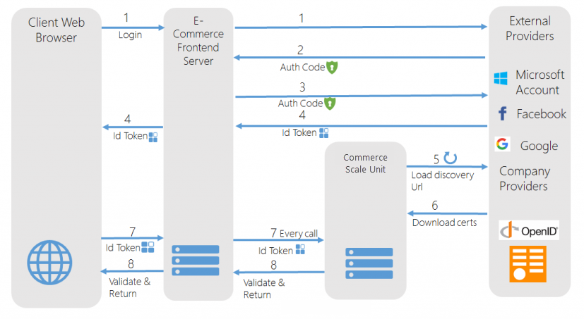

# Configure authentication providers

[!include [banner](../includes/banner.md)]

This article provides an overview of the process for configuring a new OpenID authentication provider.

The E-Commerce platform uses industry-standard [OpenID Connect](https://openid.net/connect/) as the mechanism for authentication. This article covers the pages that you use to register the OpenID providers that are used in an online store. Commerce Scale Unit uses OpenID Connect as the mechanism to support authenticated customers. OpenID Connect is a universally accepted standard that acts as simple and evolved identity provider on top of OAuth 2.0. Commerce Scale Unit can be integrated with both ready-to-use OpenID providers through the Microsoft Azure Access Control service and other independently available providers. In addition, any custom providers that support OpenID connect can be integrated and registered. The following illustration shows the step-by-step handshake that occurs between the Commerce Scale Unit and the E-Commerce front-end server to pass the authentication token for subsequent calls. 

[](./media/openid.png) 

Here is a walkthrough of the process for registering OpenID providers so that they can be used in Commerce Scale Unit.

1.  From the Retail and Commerce IT workspace, go to **Commerce shared parameters** &gt; **Identity providers**. You can use the **Identity providers** page to register additional providers. For every provider that you support, enter the details of the OpenID provider and the details of the relying parties. Commerce Scale Unit uses this information to request and use an authentication token for subsequent calls.
2.  Run distribution schedule 1110.
3.  For the test online store, edit the web.config file so that it specifies the correct redirect URL and domain, as shown in the following example. If you're using a third-party online store, this information can be stored as required.

    ```xml
    redirectUrl=https://usnconeboxax1ecom.cloud.onebox.dynamics.com/en/Pages/OauthV2Redirect/OauthV2Redirect.aspx
    ```


[!INCLUDE[footer-include](../../includes/footer-banner.md)]
