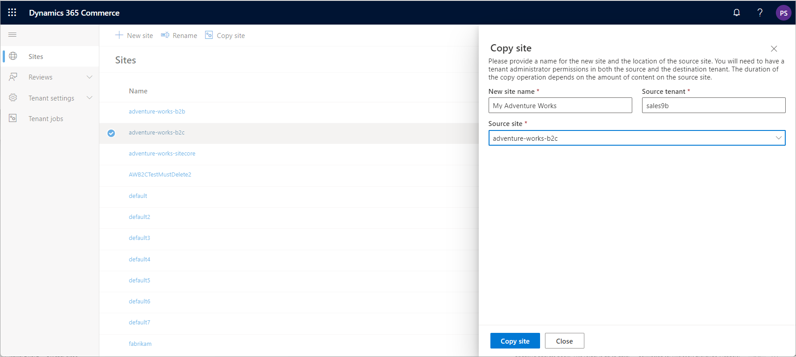
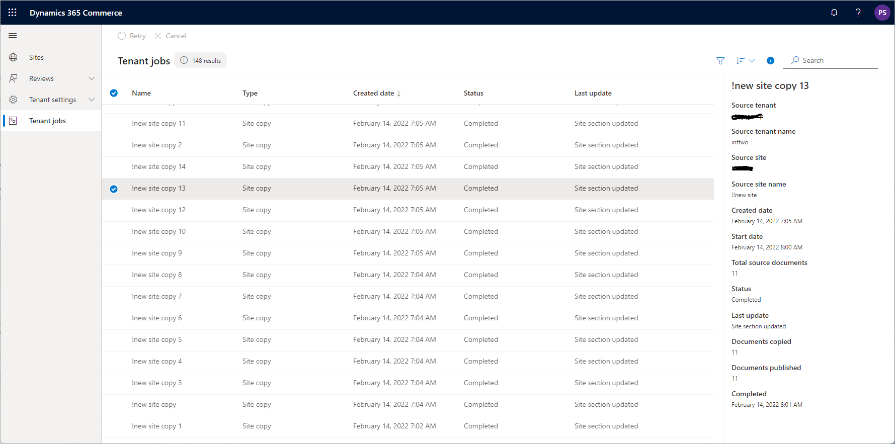
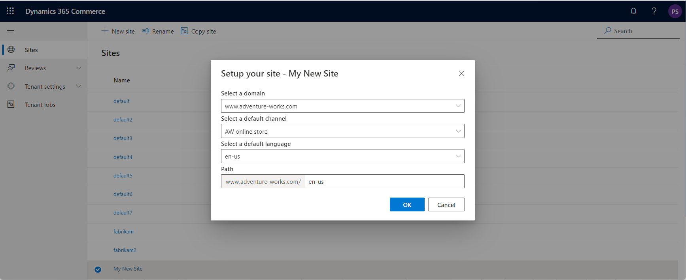

# Copy an e-commerce site

[!include [banner](../../finance/includes/banner.md)]

This article explains how to copy an existing e-commerce site within or between e-commerce environments in Microsoft Dynamics 365 Commerce site builder.

Dynamics 365 Commerce supports copying or cloning sites as a self-serve operation in Commerce site builder. You can copy sites within a single e-commerce environment or between two e-commerce environments. The user who initiates the site copy operation must be a tenant administrator in both the source and destination e-commerce environments.

The site copy operation copies all e-commerce content of the source site. This content includes pages, fragments, templates, URLs, and assets. Before you can use a new site, you must initialize it through the first run experience (FRE) process. You can map and manage channels in site builder, at **Site Settings \> Channels**.

The duration of the site copy operation depends primarily on the number of assets on the source site. For exceptionally large sites, consider using the environment copy operation instead. This operation is also known as the data portability operation.

> [!NOTE]
> - The source site is read-only during the site copy operation.
> - Only published versions of documents are copied. If no versions are published, only the latest versions are copied.
> - Version history for content isn't available on the destination site.

## Copy a site within an e-commerce environment

To copy a site within an e-commerce environment, follow these steps:

1. Sign in to site builder for the environment where you want to perform the copy operation.
1. Open the site list view by selecting **Site switcher** in the upper-right corner and then selecting **Manage sites**.
1. Find the site that you want to copy or clone, and select it by selecting the checkbox next to the site name.
1. On the command bar, select **Copy site**.
1. In the **Copy site** flyout menu, in the **New site name** field, enter a name for the new site. The new site name must be unique in the e-commerce environment. The **Source tenant** and **Source site** fields automatically set to the information for the current tenant and the selected site.
1. Select **Create copy**.

After the information is validated, a notification indicates that a new site copy job is created. You can monitor the progress of the job in the [right pane of the **Tenant jobs** page](#monitor-the-site-copy-operation). When the copy operation is successfully completed, the new site appears in the list of sites in site list view.

The following illustration shows an example of the **Copy site** flyout menu in site builder.

:::image type="content" source="../media/site-copy_1.png" alt-text="Screenshot of the Copy site flyout menu in Commerce site builder.":::

## Copy a site between two e-commerce environments

To copy a site between two e-commerce environments, follow these steps:

1. Sign in to site builder for the destination e-commerce environment.
1. On the command bar, select **Copy site**.
1. In the **Copy site** flyout menu, in the **New site name** field, enter a name for the new site. The new site name must be unique in the e-commerce environment.
1. In the **Source tenant** field, select the name of the source tenant.
1. In the **Source site** field, select the source site.
1. Select **Create copy**.

> [!NOTE]
> You need tenant administrator permissions for both the source and destination e-commerce environments.

After the information is validated, a notification indicates that a new site copy job is created. You can monitor the progress of the job in the [right pane of the **Tenant jobs** page](#monitor-the-site-copy-operation). When the copy operation is successfully completed, the new site appears in the list of sites in site list view.

## Map channels during the site copy operation (optional)

You can map source channels and locales to destination channels and locales during the site copy operation. If you map channels during the site copy operation, you don't need to initialize the site by using the FRE process or configure the channels in site settings. 

To map all the channels and locales as is (1-to-1) in site builder, follow these steps:

1. Open the site list view by selecting **Site switcher** in the upper-right corner and then selecting **Manage sites**.
1. Find the site that you want to copy or clone, and select it by selecting the checkbox next to the site name.
1. On the command bar, select **Copy site**.
1. In the **Copy site** flyout menu, enter values for **New site name**, **Source tenant**, and **Source site** (if not present already).
1. Select **Add channel mappings**.
1. In the **Configure site channels and locales** flyout menu, select **Source channel**, and then select the source channel.  
1. Select **Destination channel** and then select the same channel as the source channel. 
1. Select **Add locale**.
1. Select **Source locale**, and then select the source locale.
1. Select **Destination locale**, and then select the same locale as the source locale. 
1. For **URL path**, enter a unique URL path that isn't currently used in the destination environment.
1. Repeat steps 8-11 for each locale to be mapped for the channel.
1. Select **Apply**.
1. Repeat steps 6-11 for each source channel.
1. Select **Close**.
1. Review the configuration for accuracy, and then select **Copy site**.

> [!NOTE]
> You must map all source channels and locales, and you can only map each one once.

## Monitor the site copy operation

To monitor the progress of the site copy operation, follow these steps:

1. Sign in to site builder for the destination e-commerce environment.
1. In the left pane, select **Tenant jobs**.
1. On the **Tenant jobs** page, find and select the site copy job in the list. A pane appears that shows the status and details of the selected job.

You can cancel a job that has a status of **In progress**. Select the job in the list, and then select **Cancel** on the command bar.

You can retry a job that has a status of **Failed** or **Completed with errors**. Select the job in the list, and then select **Retry** on the command bar.

> [!NOTE]
> Processing of video assets might continue after a site copy job is completed.

The following illustration shows an example of the right pane of the **Tenant jobs** page in site builder.

:::image type="content" source="../media/site-copy_2.png" alt-text="Screenshot of job details in the right pane of the Tenant jobs page in Commerce site builder.":::

## Initialize a new site by using the FRE process

Before you can use the new site, you must initialize it through the FRE process.

To initialize a new site by using the FRE process, follow these steps:

1. Sign in to site builder for the new site.
1. Open the site list view by selecting **Site switcher** in the upper-right corner and then selecting **Manage sites**.
1. Find and select the new site that you want to initialize.
1. In the **Setup your site** dialog box, in the **Select a domain** field, select a domain. All domains that are associated with the e-commerce environment during initialization are available for selection.
1. In the **Select a default channel** field, select the associated online store channel. The selected channel provides assortments and other information that Commerce headquarters stores.
1. In the **Select a default language** field, select the default authoring language. All languages that are configured for the selected online store channel are available for selection.
1. In the **Path** field, the value consists of the base domain and an optional URL path that you can enter. You can leave the URL path blank if the channel is served from the domain root, or if you want to enter this information later in the channel configuration view in site builder. The site path must be unique in the e-commerce environment.
1. Select **OK**. The site is initialized with the information that you provided, and you're sent to the site management view.

The following illustration shows an example of the **Setup your site** dialog box in site builder.

:::image type="content" source="../media/site-copy_3.png" alt-text="Screenshot of the Setup your site dialog box in Commerce site builder.":::

## Additional resources

[Configure your domain name](../configure-your-domain-name.md)

[Deploy a new e-commerce tenant](../deploy-ecommerce-site.md)

[Associate a Dynamics 365 Commerce site with an online channel](../associate-site-online-store.md)

[Manage robots.txt files](../manage-robots-txt-files.md)

[Upload URL redirects in bulk](upload-bulk-redirects.md)

[Set up a B2C tenant in Commerce](set-up-B2C-tenant.md)

[Set up custom pages for user logins](../custom-pages-user-logins.md)

[Configure multiple B2C tenants in a Commerce environment](../configure-multi-b2c-tenants.md)

[Add support for a content delivery network (CDN)](../add-cdn-support.md)

[Enable location-based store detection](../enable-store-detection.md)

[!INCLUDE[footer-include](../../includes/footer-banner.md)]