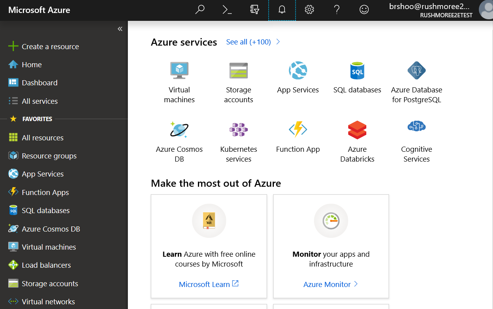
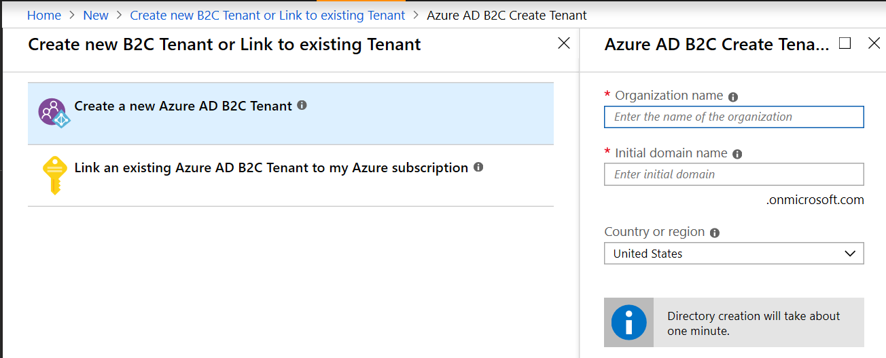
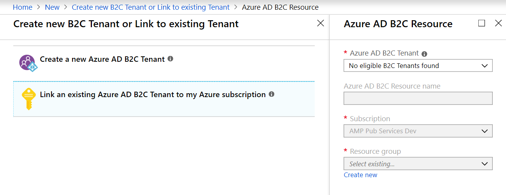
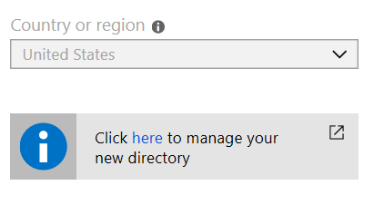
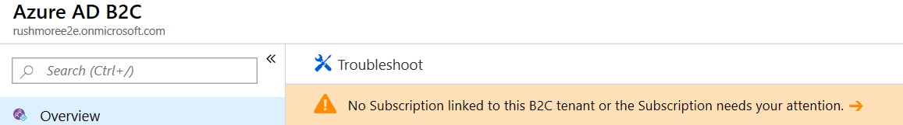

# Create or link to an existing Microsoft Entra B2C tenant in the Azure portal

[!include [banner](../includes/banner.md)]

This article describes how create or link to a Microsoft Entra business-to-consumer (B2C) tenant in the Microsoft Azure portal. For more information, see [Tutorial: Create a Microsoft Entra B2C tenant](/azure/active-directory-b2c/tutorial-create-tenant).

To create or link to an existing Microsoft Entra B2C tenant in the Azure portal, follow these steps.

1. Sign in to the [Azure portal](https://portal.azure.com/).
1. From the Azure portal menu, select **Create a resource**. Be sure to use the subscription and directory that you'll connect with your Commerce environment.

    

1. Go to **Identity \> Microsoft Entra ID B2C**.
1. Once on the **Create New B2C Tenant or Link to existing Tenant** page, use one of the options below that best suits your company's needs:

    - **Create a new Microsoft Entra B2C Tenant**: Use this option to create a new Microsoft Entra B2C tenant.
        1. Select **Create a new Microsoft Entra B2C Tenant**.
        1. Under **Organization name**, enter the organization name.
        1. Under **Initial domain name**, enter the initial domain name.
        1. For **Country or region**, select the country or region.
        1. Select **Create** to create the tenant.

     

     - **Link an existing Microsoft Entra B2C Tenant to my Azure subscription**: Use this option if you already have a Microsoft Entra B2C tenant you want to link to.
        1. Select **Link an existing Microsoft Entra B2C Tenant to my Azure subscription**.
        1. For **Microsoft Entra B2C Tenant**, select the appropriate B2C tenant. If the message "No eligible B2C Tenants found" appears in the selection box, you don't have an existing eligible B2C tenant and must create a new one.
        1. For **Resource group**, select **Create new**. Enter a **Name** for the resource group that contains the tenant, select the **Resource group location**, and then select **Create**.

    

1. Once the new Microsoft Entra B2C directory is created (this may take a few moments), a link to the new directory appears on the dashboard. This link directs you to the "Welcome to Microsoft Entra B2C" page.

    

> [!NOTE]
> If you have multiple subscriptions within your Azure account or have set up the B2C tenant without linking to an active subscription, a **Troubleshoot** banner will direct you to link the tenant to a subscription. Select the troubleshooting message and follow the instructions to resolve the subscription issue.

The following image shows an example of a Microsoft Entra B2C **Troubleshoot** banner.

## Next steps

To continue the process of setting up a B2C tenant in Commerce, proceed to [Create the B2C application](create-b2c-app.md).

## Additional resources

[Set up a B2C tenant in Commerce](set-up-B2C-tenant.md)

[Create the B2C application](create-b2c-app.md)

[Create user flow policies](create-user-flow-policies.md)

[Add social identity providers (Optional)](add-social-identity-providers.md)

[Update Commerce headquarters with the new Microsoft Entra B2C information](update-hq-aad-b2c-info.md)

[Configure your B2C tenant in Commerce site builder](config-b2c-tenant-site-builder.md)

[Additional B2C information](additional-b2c-info.md)

[!INCLUDE[footer-include](../../includes/footer-banner.md)]
