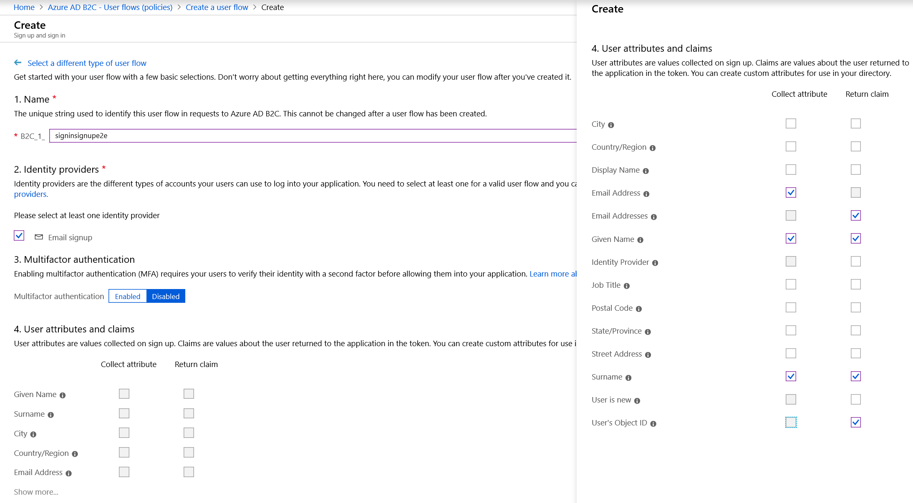
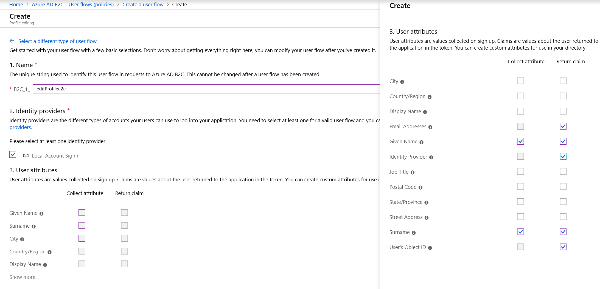
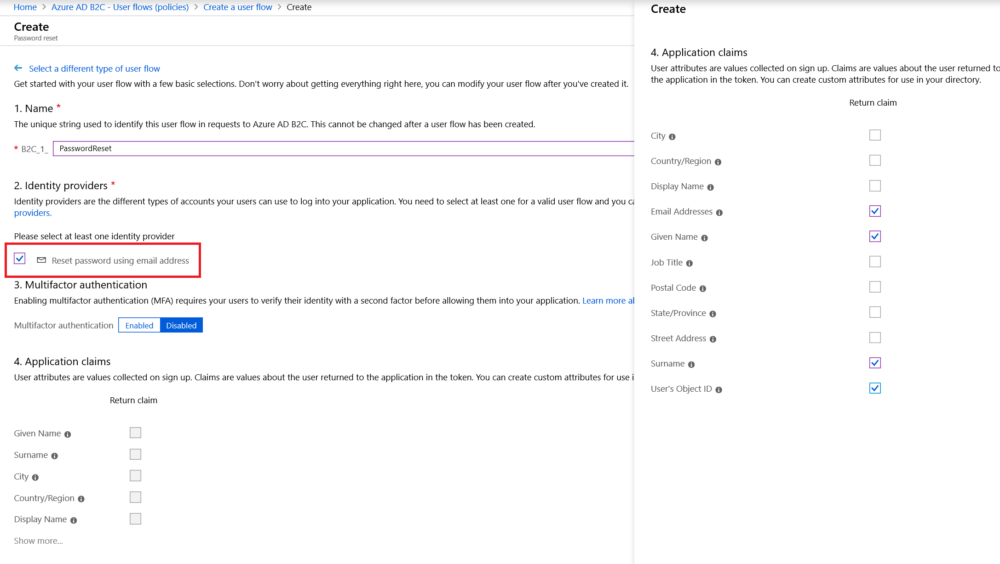

# Create user flow policies

[!include [banner](../includes/banner.md)]

This article describes how to create user flow policies in the Microsoft Azure portal.

User flows are the policies Microsoft Entra business-to-consumer (B2C) uses to provide secure sign in, sign up, edit profile, and forget password user experiences. Dynamics 365 Commerce uses these flows to perform the policy actions to interact with the Microsoft Entra B2C tenant. When a user interacts with these policies, they're redirected to the Microsoft Entra B2C tenant to perform the actions.

Microsoft Entra ID B2C provides three basic user flow types:
- Sign up and sign in
- Profile editing
- Password reset

You can choose to use the default user flows provided by Microsoft Entra ID, which displays a page hosted by Microsoft Entra ID B2C. Alternately, you can create an HTML page to control the look and feel of these user flow experiences. 

To customize the user policy pages with pages built in Dynamics 365 Commerce, see [Set up custom pages for user logins](../custom-pages-user-logins.md). For more information, see [Customize the interface of user experiences in Microsoft Entra ID B2C](/azure/active-directory-b2c/tutorial-customize-ui).

### Create a sign-up and sign-in user flow policy

To create a sign-up and sign-in user flow policy, follow these steps.

1. In the Azure portal, select **User flows (policies)** in the left navigation pane.
1. On the **Microsoft Entra B2C – User flows (policies)** page, select **New User Flow**.
1. Select the **Sign up and sign in** policy, and then select the **Recommended** version.
1. Under **Name**, enter a policy name. This name displays afterwards with a prefix the portal assigns (for example, "B2C_1_").
1. Under **Identity providers**, in the **Local accounts** section, select **Email signup**. Email authentication is used in most common scenarios for Commerce. If you're also using social identity provider authentication, you can also select them at this time.
1. Under **Multifactor Authentication**, select the appropriate choice for your company. 
1. Under **User attributes and claims**, select options to collect attributes or return claims as appropriate. Select **Show more...** to get the full list of attributes and claims options. Commerce requires the following default options:

    | **Collect  attribute** | **Return  claim** |
    | ---------------------- | ----------------- |
    | Email Address          | Email Addresses   |
    | Given Name             | Given Name        |
    |                        | Identity Provider |
    | Surname                | Surname           |
    |                        | User’s Object ID  |

1. Select **Create**.

> [!NOTE]
> The **Email address**, **Given Name**, and **Surname** attributes are mandatory for correct implementation and functionality of the policies.

The following image is an example of the Microsoft Entra B2C sign-up and sign-in user flow.

   
### Create a profile editing user flow policy

To create a profile editing user flow policy, follow these steps.

1. In the Azure portal, select **User flows (policies)** in the left navigation pane.
1. On the **Microsoft Entra B2C – User flows (policies)** page, select **New User Flow**.
1. Select **Profile editing**, and then select the **Recommended** version.
1. Under **Name**, enter the profile editing user flow. This name displays afterwards with a prefix the portal assigns (for example, "B2C_1_").
1. Under **Identity providers**, in the **Local accounts** section, select **Email SignIn**.
1. Under **User attributes**, select the following check boxes:
    
    | **Collect  attribute** | **Return  claim** |
    | ---------------------- | ----------------- |
    |                        | Email Addresses   |
    | Given Name             | Given Name        |
    |                        | Identity Provider |
    | Surname                | Surname           |
    |                        | User's Object ID  |
    
1. Select **Create**.

The following image shows an example of the Microsoft Entra B2C profile editing user flow.

### Create a password reset user flow policy

To create a password reset user flow policy, follow these steps.

1. In the Azure portal, select **User flows (policies)** in the left navigation pane.
1. On the **Microsoft Entra B2C – User flows (policies)** page, select **New User Flow**.
1. Select **Password Reset**, and then select the **Recommended** version.
1. Under **Name**, enter a name for the password reset user flow.
1. Under **Identity providers**, select **Reset password using email address**.
1. Select **Create**.
1. Under **Application claims**, select the following check boxes:
    - **Email addresses**
    - **Given Name**
    - **Surname**
    - **User's Object ID**
1. Select **Create**.

The following image shows where to set **Reset Password using mail address** in the Microsoft Entra B2C password reset user flow.

## Next steps

To continue the process of setting up a B2C tenant in Commerce, proceed to [Add social identity providers](add-social-identity-providers.md).

## Additional resources

[Set up a B2C tenant in Commerce](set-up-B2C-tenant.md)

[Create or link to an existing Microsoft Entra B2C tenant in the Azure portal](create-link-aad-b2c-tenant.md)

[Create the B2C application](create-b2c-app.md)

[Add social identity providers (Optional)](add-social-identity-providers.md)

[Update Commerce headquarters with the new Microsoft Entra B2C information](update-hq-aad-b2c-info.md)

[Configure your B2C tenant in Commerce site builder](config-b2c-tenant-site-builder.md)

[Additional B2C information](additional-b2c-info.md)

[!INCLUDE[footer-include](../../includes/footer-banner.md)]
