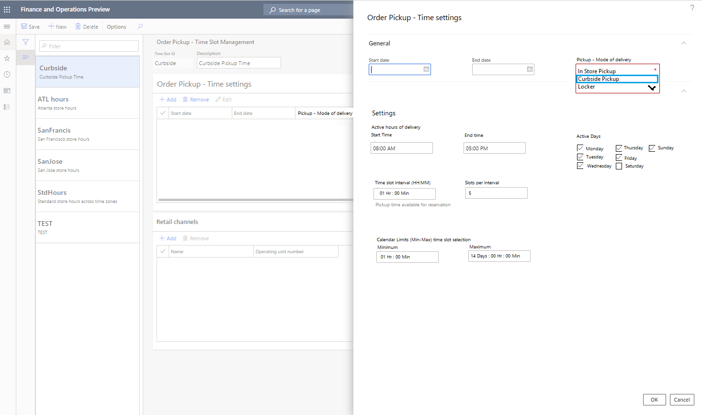
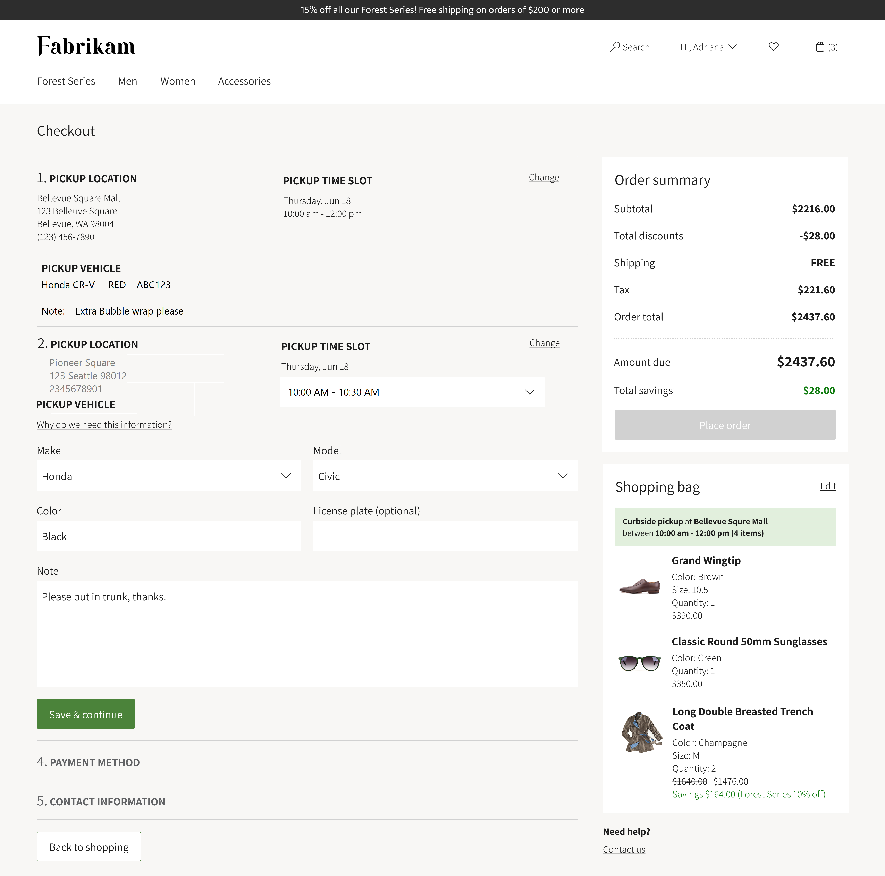

---
# required metadata

title: Create and update timeslots for 'Pickup' delivery mode(s)
description: This topic describes how to create and update 'Timeslots' in Commerce Headquarters and enable them for the 'Pickup' delivery mode(s).
author: josaw1
manager: AnnBe
ms.date: 9/20/2020
ms.topic: article
ms.prod: 
ms.service: dynamics-365-retail
ms.technology: 

# optional metadata

# ms.search.form: 
# ROBOTS: 
audience: Application User
# ms.devlang: 
ms.reviewer: josaw
ms.search.scope: Operations, Retail
# ms.tgt_pltfrm: 
ms.custom: 
ms.search.region: Global
ms.search.industry: Retail
ms.author: rapraj
ms.search.validFrom: 2020-09-20
ms.dyn365.ops.version: Retail 10.0.15 update

---

# Create and update timeslots for 'Pickup' delivery mode(s)

[!include [banner](../../includes/banner.md)]

## Overview

This functionality is available in Microsoft Dynamics 365 Commerce versions 10.0.15 and later.

Dynamics 365 Commerce will now enable the Retailers to be able to specify and create 'Timeslots' for the 'Pickup' mode(s) of delivery. 
- Timeslot is a specific interval of time, where the customer can choose to pickup thier order form a specific store/location. 
- Timelsot management is only available to the 'Pickup' mode of delivery in Dynamics 365 Commerce. 

Retailers can choose to specify the following attributes within a 'Timeslot' template. 
- *Time Interval*: The time duration that can be alloted per timeslot. (15 mins / 30 mins / 1 hour etc...) 
- *Slots per interval*: The number of customers that can be served per time interval. ( 1,2... only whole numbers)
- *Active hours of delivery*: The time period between which the 'Pickup' is allowed. 
- *Active Days*: Days on which the above timeslots can be applied. 
- *Start & End Date*: Start and end date from which the timeslots are applicable. (Does not effect any active pickup orders)
- *Minumum & Maximum calendar limit*: The closest or farthest timeslots that can be selected for a pickup order. 

Only a single Timeslot template can be configured per channel. These channels include brick-and-mortar stores, call centers, mobile devices, and e-Commerce sites.

If a customer has a pickup order for a different store, the cashier can select dates when the pickup will be available in that store. The store lookup will provide a reference to the dates and store times. 

## Enable 'Timeslot' for pickup mode of delivery.

To be able to create and use the 'Timeslot' for the 'Pickup' mode of delivery, the 'Curbside' feature needs to be enabled on the 'Feature Management' workspace. 

<INSERT IMAGE FOR THE FEATURE FLAG & FINAL NAME>

## Configure 'Timeslot' per 'Pickup' mode of delivery.

Follow these steps to configure 'Timeslot' for the 'pickup' mode of delivery.

1. Go to **Commerce** \> **Channel Setup** \> **Timeslot management**.
2. Select **New** to create a new Timeslot template & provide a *ID* and *Description*. To use an existing template, select the template in the left pane.
3. In the **Time settings** TAB, click *Add* to open a slider control and define the date range, Time period, Time slot durartion, active days etc...

    - If Timeslots are going to be as-is for long time, leave the **End date** field 'BLANK'.
    - If the Timeslots in a day are going to vary - create additional entries on the **Time settings** TAB - ensure that the date and times do not overlap. 

    > [!NOTE]
    > You can create multiple templates, but only one template can be associated with a single channel/store. 

    

4. Associate the 'Timeslot' template with the stores/channels where it will be used. In the **Choose organization nodes** dialog box, select the stores, regions, and organizations that the template should be associated with.

    - Only one 'Timeslot' template can be associated with each store/channel.
    - Use the arrow buttons to select stores, regions, or organizations. The calendar will be available to the stores or store groups, and it will be visible at the POS for reference.

    

5. On the **Distribution schedule** page, run the **1070** and **1090** jobs to make the Timeslot details are available to the POS.

## Timeslot selection on POS orders 

## Timeslot selection on eCommerce orders 

