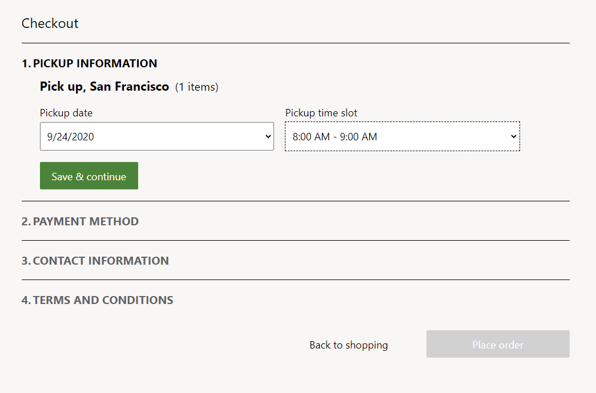
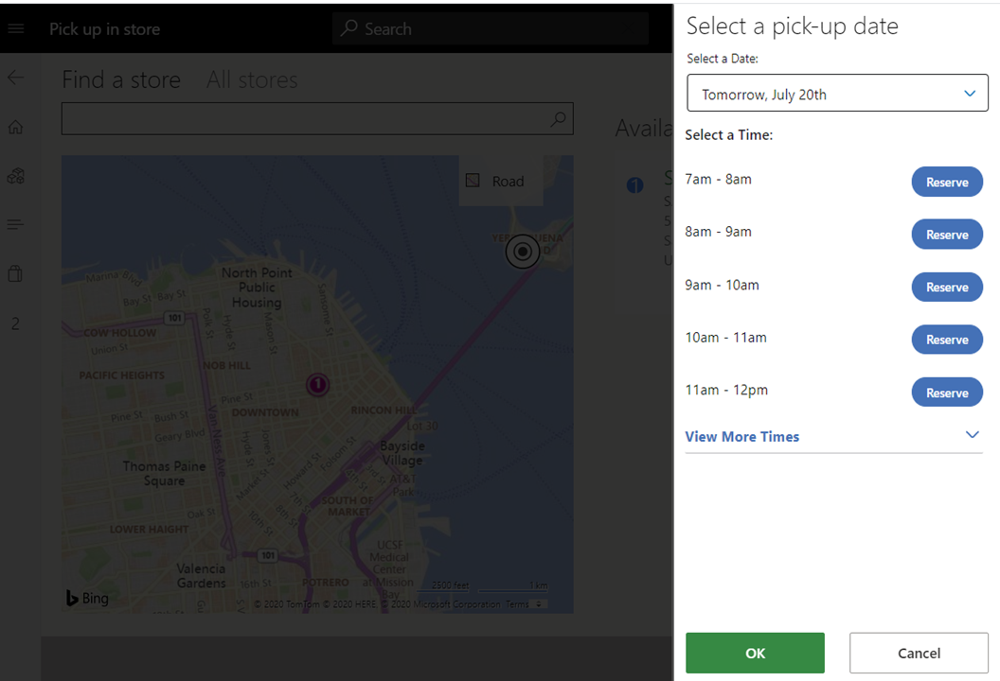

---
# required metadata

title: Create and update timeslots for 'Pickup' delivery mode(s).
description: This topic describes how to create and update 'Timeslots' in Commerce Headquarters and enable them for the 'Pickup' delivery mode(s).
author: josaw1
manager: AnnBe
ms.date: 10/01/2020
ms.topic: article
ms.prod: 
ms.service: dynamics-365-retail
ms.technology: 

# optional metadata

# ms.search.form: 
# ROBOTS: 
audience: Application User
# ms.devlang: 
ms.reviewer: josaw
ms.search.scope: Operations, Retail
# ms.tgt_pltfrm: 
ms.custom: 
ms.search.region: Global
ms.search.industry: Retail
ms.author: rapraj
ms.search.validFrom: 2020-09-20
ms.dyn365.ops.version: Retail 10.0.15 update

---

# Create and update timeslots for Pickup' delivery mode(s)

[!include [banner](../../includes/banner.md)]

## Overview

The timeslot feature provides a way for retailers to define a time slot for items that have pickup delivery mode(s). A timeslot allows the retailer to define what days and times orders can be picked up from a store. In addition, they can also define the number of orders that can be picked up in a given time window. This way a retailer can limit  the number of orders that can be picked up at a given day and time, which results in a better quality experience for their customers. 

> [!NOTE] 
> This functionality is available in Microsoft Dynamics 365 Commerce versions 10.0.15 and later.

The following image shows an example of timeslot selection during e-Commerce checkout.

## Timeslots 

A timeslot is a specific interval of time when a customer can choose to pick up their order from a specific store or location. This timeslot management feature is only available with the "Pickup" mode of delivery in Dynamics 365 Commerce.

A timeslot can be defined using the following properties:

**Mode of delivery**: This is the pickup mode of delivery that the timeslot applies to. 

**Minimum and maximum**: This is the earliest and latest days that can be selected for pickup relative to the day that the order is placed. "Minimum" ensures there is enough time for the retailer to process the order before it's ready for pickup. "Maximum" ensures that the user cannot pick a date that is too far into the future. For example, with a minimum of "1", if an order is placed on September 20th, the earliest day available for pickup will be the next eligible day (September 21st). Similarly, you can also define a maximum number of days within which to pick up an order. With minimum and maximum values defined, a site user can only see and pick a certain set of days during their checkout experience. Minimum can be expressed in decimals ifn the value is less than 1 E.g. 4 hours should be represent as minimum value of 4 / 24 = 0.17. If Minimum value is higher than 1, it will be always rounded even if its a decimal. The value for the Maximum will always be rounded up. E.g. 1.2 will be rounded up to 2.

**Start and end date**: Each timeslot entry has a start and end date. This provides the flexibility to add different timeslots throughout the year (for example, holiday hours). Once an order is placed, changing the start and end date on the timeslots will not apply to the existing order. When defining start and end dates, you must take into account store closure dates (for example, Christmas day), and ensure that a timeslot is not defined for these days.

**Active hours of pickup**: This defines the time period withing which pickup is allowed (for example, you can define the pickup times to be between 2 PM and 5 PM every day). This allows the pickup times to be independent of store hours and allows a retailer to configure them for their specific business needs. When defining the active hours of pickup, you must ensure that store hours are taken into account and that pickup time is not defined for when the store is closed.

>[!NOTE]
> The hours for the store pickup have to be defined in the timezone of the respective store.

**Time interval**: This defines the time duration that can be allotted for each timeslot (for example, the time duration of each timeslot could be in increments of 15 minutes, 30 minutes, 1 hour, or some other duration).

**Slots per interval**: This defines the number of orders that can be served in each time interval (for example, 1, 2, 3, or any whole number). This allows the retailer to define how many customers or orders they want to serve for pickup within a given time interval.

**Active days**: This defines the days during which the pick up timeslots are active (for example, Monday, Tuesday, Wednesday, Sunday, etc.). This allows retailers to define the days they want to support pickup orders.

**Retail channel**: Each timeslot can be associated with one or more retail stores. Depending on each store's hours of operation, one or more timeslot entries can be created and associated with a channel. 

Only a single timeslot template can be configured per channel. These channels include brick-and-mortar stores, call centers, mobile devices, and e-Commerce sites.

## Configure the timeslot feature in Commerce headquarters

Timeslots must be defined in Commerce headquarters for each pickup mode of delivery so that point of sale (POS) and e-Commerce channels can reference them.

To configure the timeslot feature in Commerce headquarters, follow these steps.

1. Go to **Commerce** \> **Channel Setup** \> **Store pickup time slot**.
1. Select **New** to create a new timeslot template. To use an existing template, select the template in the left navigation pane.
1. Enter an **ID** and **Description**.
1. On the **Time settings** tab, select **Add** to open a slider control to define the date range, time period, time slot duration, active days, and other settings.

    - If timeslots are going to be static for the forseeable future, leave **End date** blank.
    - If the timeslots in a day are going to vary, create additional entries on the **Time settings** tab to ensure that the dates and times do not overlap. 

    > [!NOTE]
    > You can create multiple templates, but only one template can be associated with a single channel or store. 

    

1. Associate the 'Timeslot' template with the stores/channels where it will be used. In the **Choose organization nodes** dialog box, select the stores, regions, and organizations that the template should be associated with.

    - Only one 'Timeslot' template can be associated with each store/channel.
    - Use the arrow buttons to select stores, regions, or organizations. The calendar will be available to the stores or store groups, and it will be visible at the POS for reference.

    

1. On the **Distribution schedule** page, run the **1070** and **1135** jobs to sync the data to the channels.

> [!NOTE]
> The time slot  created should be unique per delivery mode within each template.

## Timeslot selection on POS orders 

In POS, when an order / order line is identified for 'Pickup',  Cashier can select the 'Pickup' store/location and choose a date and timeslot.

On POS, if a customer has a pickup order for a different store, the cashier can select dates when the pickup will be available in that store. The store lookup will provide a reference to the dates and store times. 

Below is an example of time slot selection in a POS order

## Timeslot selection on eCommerce orders 

To enable timeslot selection on an e-commerce order, see Pickup information module for details. 

> [!NOTE]
> An e-Commerce checkout page has to be authored with the Pickup information module for a user to view/edit the pickup time slots. In the absence of the module, an order will be placed without the timeslot information. 

The following image shows an example of an e-Commerce order with timeslot information selected for pickup.

## Additional resources

[Checkout pickup information](checkout-pickupinfo.md)

