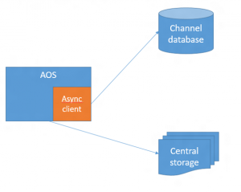
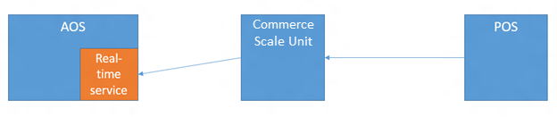

# Commerce Data Exchange and commerce channel communications

[!include [banner](../includes/banner.md)]

This article provides an overview of Commerce Data Exchange and its components. It explains the part that each component plays in the transfer of data between Microsoft Dynamics 365 Commerce Headquarters and channels.

Commerce Data Exchange is a system that transfers data between Headquarters and channels, such as online stores or brick-and-mortar stores. The database that stores data for a channel is separate from the Commerce database. The channel database holds only the data that is required for transactions. Master data is configured in Headquarters and distributed to channels. Transactional data is created in the point of sale (POS) system or the online store, and then uploaded to Headquarters. Data distribution is asynchronous. In other words, the process of gathering and packaging data at the source occurs separately from the process of receiving and applying data at the destination. For some scenarios, such as price and inventory lookups, data must be retrieved in real time. To support these scenarios, Commerce Data Exchange also includes a service that enables real-time communication between Headquarters and a channel. 

## Async Service

Microsoft SQL Server change tracking on the Commerce database is used to determine the data changes that must be sent to channels. Based on a distribution schedule, Headquarters packages that data and saves it to central storage (Azure blob storage). A separate batch process uses the Commerce Data Exchange: Async Client library to insert this data package into the channel database. 

### Commerce scheduler

Scheduler jobs are the mechanism for distributing data to and from locations. Jobs are made up of subjobs, which specify the tables and table fields that contain the data to distribute. Headquarters includes predefined scheduler jobs and subjobs that meet the replication requirements of most organizations. The following types of predefined jobs are created:

- **Download jobs** – Download jobs send data that has changed from Headquarters to channel databases. Modifications to records are tracked through SQL Server change tracking.
- **Upload jobs (P jobs)** – Upload jobs pull sales transactions from a channel into the Commerce database. P jobs upload data incrementally. When a P job runs, the Async Client library checks the replication counter for records that have already been received from a location. A record is uploaded only if its replication counter is more than the largest value that is found. P jobs don't update data that was previously uploaded.

The distribution schedule is used to run the data transfer, either manually or by scheduling a batch job in Headquarters. A distribution schedule can contain one or more channel data groups, and one or more scheduler jobs. To ensure that the scheduler jobs are running smoothly, do not rename the "Default" database configured for the instance, and do not create a second database. All non-Commerce Scale Unit databases are managed by Microsoft, and only one default database is expected. 

## Realtime Service

Commerce Data Exchange: Real-time Service is an integrated service that provides real-time communication between Headquarters and channels. Real-time Service enables individual POS computers and online stores to retrieve specific data from Headquarters in real time. Although most key operations can be performed in the local channel database, the following scenarios require direct access to the data that is stored in Headquarters:

- Issuing and redeeming gift cards
- Redeeming loyalty points
- Issuing and redeeming credit memos
- Creating and updating customer records
- Creating, updating, and completing sales orders
- Receiving inventory against a purchase order or transfer order
- Performing inventory counts
- Retrieving sales transactions across stores and completing return transactions

 

A predefined Real-time Service profile is created.

[!INCLUDE[footer-include](../../includes/footer-banner.md)]
