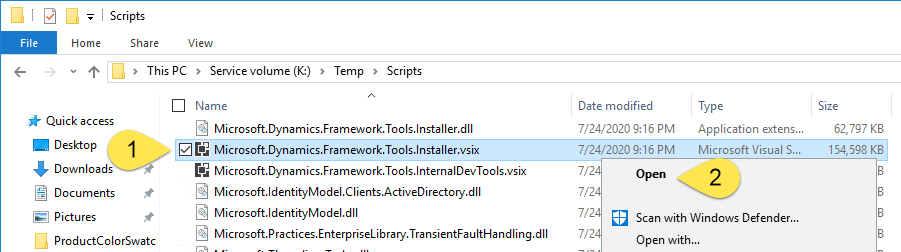

---
# required metadata

title: Important development and ALM changes from version 10.0.10 to 10.0.13 
description: This topic highlights the major changes in the development tools, software development kits (SDKs), and Application Lifecycle Management (ALM).
author: RobBertram 
manager: AnnBe
ms.date: 07/28/2020
ms.topic: article
ms.prod: 
ms.service: dynamics-365-commerce
ms.technology: 

# optional metadata

# ms.search.form: 
# ROBOTS: 
audience: Developer
# ms.devlang: 
ms.reviewer: rhaertle
# ms.tgt_pltfrm: 
ms.custom: 
ms.assetid: 
ms.search.region: global
ms.search.industry: Retail
ms.author: mumani
ms.search.validFrom: 2020-04-10
ms.dyn365.ops.version: 10.0.10
---

# Important development and ALM changes from version 10.0.10 to 10.0.13

[!include [banner](../../includes/banner.md)]

It's common for admins of Microsoft Dynamics 365 Commerce environments to pause updates and then leapfrog to the current version. This topic will help ensure that you land safely. There are significant changes and updates to the development and build tools.

Microsoft tries to provide updates that include no breaking changes, and you won't have to refactor your customizations because of these changes. Customizations that follow best practice patterns and that were developed on earlier versions can be deployed on the latest service update.

## Who should read this topic

If you're in a technical role (developer, administrator, or manager) and work with Dynamics 365 Commerce, continue to read this topic. There have been substantial improvements and changes, and there is a wealth of information and documentation that describes what has changed and what other changes are coming. The purpose of this topic is to bring all that information together into a single place, so that you have a better understanding of specific changes that you will have to make to update your development environments or adjust your Application Lifecycle Management (ALM) processes.

## Overall improvements, changes, and notes

The following features are available across products and users. Some features apply to all versions, whereas others apply only to version 10.0.10 and later.

- [All-in-one deployable packages](../../fin-ops-core/dev-itpro/dev-tools/aio-deployable-packages.md) for X++ will merge all your custom code and independent software vendor (ISV) models into a single custom package.

    - In version 10.0.10 and later, custom payment connectors for card-not-present can be included in your deployable package.
    - In version 10.0.13, all-in-one packages will be **mandatory**.

- The commerce deployable package that is created by using the [Retail software development kit (SDK)](retail-sdk/retail-sdk-overview.md) is no longer deployed to Application Object Server (AOS). Instead, you upload your self-service installers to Microsoft Dynamics Lifecycle Services (LCS) and use synchronization. For more information, see [Synchronize self-service installers in Dynamics 365 Commerce](synchronize-installers.md).
- Use a Microsoft-hosted build agent instead of a dedicated build machine for these purposes:

    - To build [application deployable packages](../../fin-ops-core/dev-itpro/dev-tools/hosted-build-automation.md)
    - To build [commerce deployable packages](retail-sdk/sdk-build-pipeline.md)

    > [!NOTE]
    > By using a build agent, you will increase your Azure consumption. However, you should see cost savings if you can decommission your dedicated build server.

For a general overview of each application release, always check the "What's new or changed" topics:

- [What's new or changed in Finance and Operations apps home page](https://docs.microsoft.com/dynamics365/fin-ops-core/fin-ops/get-started/whats-new-changed?toc=/dynamics365/commerce/toc.json)
- [What's new or changed in Dynamics 365 Commerce](../get-started/whats-new-home-page.md)
- [What's new and changed in Platform updates](../../fin-ops-core/dev-itpro/get-started/whats-new-home-page.md)

## What's changed in the 10.0.10 release

- Custom payment connectors for card-not-present can be included natively in your X++ application deployable package. For more information, see [All-in-one deployable packages](../../fin-ops-core/dev-itpro/dev-tools/aio-deployable-packages.md).
- Upload your self-service installers to LCS, and use synchronization. For more information, see [Synchronize self-service installers in Dynamics 365 Commerce](synchronize-installers.md).

    > [!NOTE]
    > The process for uploading the installer is a manual process. However, Microsoft is working to incorporate the new Commerce asset types into the [DevOps pipeline tools for Dynamics 365 Finance and Operations](https://marketplace.visualstudio.com/items?itemName=Dyn365FinOps.dynamics365-finops-tools), so that you will be able automate the upload to LCS.

- Custom retail deployable packages no longer have to include the Adyen payment dynamic-link libraries (DLLs).

## What's changed in the 10.0.11 release

- The Retail SDK has been updated to Visual Studio 2017. Visual Studio 2015 is installed on the templates for preconfigured virtual machines (VMs) for developers. However, to build the Retail SDK, you must have Visual Studio 2017 installed. Therefore, you will have to [manually update Visual Studio](retail-sdk/migrate-sdk.md#migrate-to-the-sdk-for-visual-studio-2017) and rebuild the Retail SDK.

    Microsoft is working to rebuild the virtual hard disk (VHD) templates that are used to provision developer and test environments. When this work is completed, the VHD templates will automatically include Visual Studio 2017. Although there is no confirmed date for when the rebuilt templates will be available, Microsoft expects them to be ready soon after version 10.0.13 is generally available in September 2020. For more information, see [Action Required - .NET version and Visual Studio 2017](https://community.dynamics.com/365/financeandoperations/b/newdynamicsax/posts/action-required---net-version-and-visual-studio-2017).

    - Install the Visual Studio tools by installing the Visual Studio extension. To download the extension, follow these steps:

        1. Download the latest service update package from the Shared asset library in LCS. This package is a zip file.
        2. Open the zip file, and find the **DevToolsService\\Scripts** folder. 
        3. Extract the **Scripts** folder to your local computer (for example, **K:\\Temp\\Scripts**).
        4. Find the **Microsoft.Dynamics.Framework.Tools.Installer.vsix** file. The size of this file should be about 150 megabytes (MB).
        5. Right-click the file, and then select **Open**.

            

        For more information, see [Update the Visual Studio development tools](../../fin-ops-core/dev-itpro/dev-tools/update-development-tools.md).

    - Rebuild the Retail SDK.

        1. Go to the folder that contains your unmodified version 10.0.11 Retail SDK.
        2. Create a backup copy of the Retail SDK for safekeeping.
        3. Open Visual Studio 2017 as an admin, and then open each standard solution file in the SDK folder. You will probably receive a message that states that Visual Studio will close and reopen, and that a computer restart might be required. Select **Continue**.
        4. Open the Visual Studio 2017 Command Prompt window as an admin, and verify that you're using the correct version of the Visual Studio developer command prompt. Visual Studio 2017 uses version 15 of the developer command prompt (whereas Visual Studio 2015 uses version 14). The version number appears in the command window when it opens.
        5. Verify that the standard SDK can be compiled. Go to the root of the **RetailSDK** folder, and run the following command.

            ```plaintext
            msbuild /t:rebuild
            ```

        If the build fails, you probably skipped one of the earlier steps.

- References to PackageReference (NuGet package reference) are updated. Because of this change, project references are much easier to maintain. Additionally, because of this change, you must manually update *every* custom project in the Retail SDK. Expect to spend about five minutes per project. Look at how the standard projects were updated, and use those updates as a model.

    1. Make sure that everything can be compiled, and that a package can be created from your local developer machine.
    2. Make sure that your build server is updated to Visual Studio 2017.

    > [!WARNING]
    > Your build server will probably fail, because the names of the NuGet reference folders are very long and will exceed the file path limit of 260 characters.

- Retail SDK file size: The size of an unmodified retail deployable package is now about 340 MB. If customizations are included, the file size might increase to 350 MB. If you try to deploy the file to your Commerce Scale Unit (cloud) (previously known as Retail Cloud Scale Unit \[RCSU\]), you will receive an error message that states that you can't deploy [packages that are larger than 300 MB](retail-sdk/retail-sdk-packaging.md#deploy-the-packages). Follow these steps to fix this issue:

    1. Follow the instructions in [Deploy the deployable packages](retail-sdk/retail-sdk-packaging.md#deploy-the-packages), and manually remove the self-service installer files.
    2. Upload the much smaller package to LCS, and then continue your deployment as usual.

    > [!NOTE]
    > The build and deployment scripts that are embedded in the deployable package are hard-coded to check for the self-service installers.

## What's changed in the 10.0.12 release

- It's easier to generate the [Commerce proxy](typescript-proxy-retail-pos.md).

## What's changed in the 10.0.13 release

- In version 10.0.13, application development that uses X++ requires Visual Studio 2017. If you haven't yet updated to Visual Studio 2017, review the section about version 10.0.11 earlier in this topic.
- Microsoft is working to rebuild the VHD templates that are used to provision developer and test environments. When this work is completed, the VHD templates will automatically include Visual Studio 2017. Although there is no confirmed date for when the rebuilt templates will be available, Microsoft expects them to be ready soon after version 10.0.13 is generally available in September 2020. For more information, see [Action Required - .NET version and Visual Studio 2017](https://community.dynamics.com/365/financeandoperations/b/newdynamicsax/posts/action-required---net-version-and-visual-studio-2017).

## Where to go for help

1. First, double-check and triple-check to make sure that you followed every step in the relevant topics that are listed earlier in this topic.
2. Check with your partner. Your partner is familiar with your business and setup. Your setup might involve a unique customization that your partner can quickly identify and address.
3. Check the [Retail SDK FAQ](retail-sdk/sdk-faq.md). It's updated as common issues are identified.
4. Submit a support request through LCS. Provide as much information as you can about the issue. When you submit the request, send a copy to your FastTrack solution architect.
5. Expect to share your screen with your partner, the support specialist, your solution architect, or even a combination of the three. Be prepared to reproduce the error.
