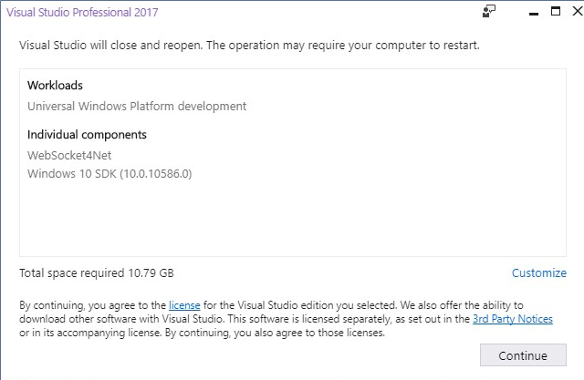
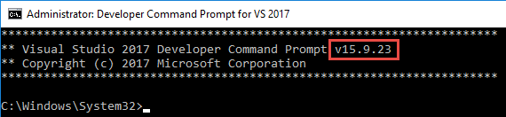

---
# required metadata

title: Important development and ALM changes from version 10.0.10 to 10.0.13 
description: This topic highlights the major changes in the development tools, SDKs, and ALM.
author: RobBertram 
manager: AnnBe
ms.date: 07/28/2020
ms.topic: article
ms.prod: 
ms.service: dynamics-365-commerce
ms.technology: 

# optional metadata

# ms.search.form: 
# ROBOTS: 
audience: Developer
# ms.devlang: 
ms.reviewer: rhaertle
ms.search.scope: Operations, Retail 
# ms.tgt_pltfrm: 
ms.custom: 
ms.assetid: 
ms.search.region: global
ms.search.industry: Retail
ms.author: mumani
ms.search.validFrom: 2020-04-10
ms.dyn365.ops.version: 10.0.10
---

# Important development and ALM changes from version 10.0.10 to 10.0.13

[!include [banner](../../includes/banner.md)]

It's common for admins of Dynamics 365 Commerce environments to pause updates and then leapfrog to the current version. Please read this doc so that you land safely. There are significant changes and updates to the development and build tools.

Microsoft strives to provide updates with no breaking changes, and you won't have to refactor your customizations based on these changes. Customizations that follow best practice patterns and developed on prior versions are deployable on the latest service update.

## Who should read this doc

If you're in a technical role (developer, administrator, or manager) and work with Dynamics 365 Commerce, then continue reading. There have been substantial improvements and changes, and there's a wealth of information and documentation about what has changed and what is coming. The goal of this topic is to combine all of that information into a single spot so that you have better clarity on specific changes that will be required to update your development environments or adjust your ALM processes.  

## Overall improvements, changes, and notes

The following features are available to across products and users. Some features apply to all versions and some apply to version 10.0.10 and later.

- [All-in-one deployable packages](../../fin-ops-core/dev-itpro/dev-tools/aio-deployable-packages.md) for X++ will merge all of your custom code and ISV models into a single custom package.

    - Custom payment connectors for card-not-present can be included in your deployable package starting in version 10.0.10.
    - All-in-one packages will be **mandatory** in version 10.0.13.

- The commerce deployable package created using the [Retail SDK](retail-sdk/retail-sdk-overview.md) is not deployed to the AOS anymore. Instead, upload your self-service installers to LCS and use synchronization. For more information, see [Synchronize self-service installers in Dynamics 365 Commerce](synchronize-installers.md).

- Use a Microsoft-hosted build agent instead of a dedicated build machine.

    - For building [application deployable packages](../../fin-ops-core/dev-itpro/dev-tools/hosted-build-automation.md).
    - For building [commerce deployable packages](retail-sdk/sdk-build-pipeline.md).

    > [!NOTE]
    > Using a build agent will increase your Azure consumption. However, you should see cost savings if you can decommission your dedicated build server.

Always check to see what's new and changed for a general overview of each application release.

- [What's new or changed in Finance and Operations apps home page](https://docs.microsoft.com/dynamics365/fin-ops-core/fin-ops/get-started/whats-new-changed?toc=/dynamics365/commerce/toc.json)
- [What's new or changed in Dynamics 365 Commerce](../whats-new-home-page.md)
- [What's new and changed in Platform updates](../../fin-ops-core/dev-itpro/get-started/whats-new-home-page.md)

## What's changed in the 10.0.10 release

- Custom payment connectors for card-not-present can be included natively in your X++ application deployable package. For more information, see [All-in-one deployable packages](../../fin-ops-core/dev-itpro/dev-tools/aio-deployable-packages.md).

- Upload your self-service installers to LCS and use synchronization. For more information, see [Synchronize self-service installers in Dynamics 365 Commerce](synchronize-installers.md).

    > [!NOTE]
    > Uploading the installer is a manual process. We're working to incorporate the new Commerce asset types into the [DevOps pipeline tools for Dynamics 365 Finance and Operations](https://marketplace.visualstudio.com/items?itemName=Dyn365FinOps.dynamics365-finops-tools) so that you can automate the upload to LCS.

- Custom retail deployable packages no longer need to include the Adyen payment DLLs.

## What's changed in the 10.0.11 release

- The Retail SDK has been updated to Visual Studio 2017. The templates for pre-configured virtual machines for developers have Visual Studio 2015 installed. You need Visual Studio 2017 installed to build the Retail SDK. So you'll need to [update Visual Studio manually](retail-sdk/migrate-sdk#migrate-to-the-sdk-for-visual-studio-2017.md).

    We're working to rebuild the VHD templates that are used to provision developer and test environments so that they include Visual Studio 2017 automatically. There's no confirmed date when it will be available, but we expect it to be ready shortly after 10.0.13 is generally available in September 2020. For more information, see [Action Required - .NET version and Visual Studio 2017](https://community.dynamics.com/365/financeandoperations/b/newdynamicsax/posts/action-required---net-version-and-visual-studio-2017)

  - Install the Visual Studio tools by installing the Visual Studio extension. To download the extension, follow these steps:

    1. Download the latest service update package from the shared asset library.  
    2. It's a .zip file. Open it and find the **DevToolsService\\Scripts** folder. 
    3. Extract the **Scripts** folder to your local computer, for example, **K:\\Temp\\Scripts**.
    4. Find the **Microsoft.Dynamics.Framework.Tools.Installer.vsix** file, which should be around 150 megabytes.  
    5. Right-click the **.vsix** file and choose **Open**.

        

    For more information, see [Update the Visual Studio development tools](../../fin-ops-core/dev-itpro/dev-tools/update-development-tools.md).

  - Rebuild the Retail SDK.
    1. Navigate to the folder containing your unmodified 10.0.11 Retail SDK.
    2. Create a backup copy of the Retail SDK for safe keeping.
    3. Open Visual Studio 2017 as an administrator, and then open each standard solution file in the SDK folder. You'll likely encounter a message like the one below. Click **Continue**.

        [](./media/vs2017-extensions.png)

    4. Open the Visual Studio 2017 command prompt as an administrator, and verify that you're using the correct version of the Visual Studio command prompt. Visual Studio 2017 uses version 15 of the developer command prompt. (Visual Studio 2015 uses version 14.) The version number appears in the window, as shown in the following screenshot.

        > 

    5. Verify that the standard SDK compiles. Navigate to the root of the **RetailSDK** folder and execute the following command:  

        ```plaintext
        msbuild /t:rebuild
        ```

        If the build fails, you probably skipped a step from above.

- References to PackageReference (NuGet package reference) are updated. This change means that project references are much easier to maintain. It also means that you have to manually update *every* custom project in the Retail SDK. Expect to spend about 5 minutes per project. Look at how the standard projects were updated and emulate that.

    1. Make sure that everything compiles and a package can be created from your local dev box.
    2. Make sure that your build server is updated to Visual Studio 2017.

    > [!WARNING]
    > Your build server will likely fail as the NuGet reference folders are exceptionally long and will exceed the 260 character file path limit.  

- Retail SDK file size: An unmodified retail deployable package is now around 340 MB. With customizations, the file size might increase to 350 MB. If you try to deploy the file to your Commerce Scale Unit (cloud) (formerly Retail Cloud Scale Unit, RCSU), you will get an error message informing you that [packages larger than 300 megabytes](retail-sdk/retail-sdk-packaging.md#deploy-the-deployable-packages.md) can't be deployed.

    1. Follow the instructions in [Deploy the deployable packages](retail-sdk/retail-sdk-packaging.md#deploy-the-deployable-packages.md), and manually remove the self-service installer files.  
    2. Upload the much smaller package to LCS and continue with your deployment as usual.

    > [!NOTE]
    > The build and deployment scripts embedded in the deployable package are hard-coded to check for the self-service installers.

## What's changed in 10.0.12

- Generating the [Commerce proxy](typescript-proxy-retail-pos.md) gets easier.

## What's changed in 10.0.13

- Application development with X++ requires Visual Studio 2017 in version 10.0.13. If you haven't updated yet, review the section above on 10.0.11.  

- We're working to rebuild the VHD templates that are used to provision developer and test environments so that they include Visual Studio 2017 automatically. There's no confirmed date when it will be available, but we expect it to be ready shortly after 10.0.13 is generally available in September 2020. For more information, see [Action Required - .NET version and Visual Studio 2017](https://community.dynamics.com/365/financeandoperations/b/newdynamicsax/posts/action-required---net-version-and-visual-studio-2017)

## Where to go for help

1. First, double and triple check to make sure that you followed each step already listed in the relevant articles listed above.
2. Check with your partner. They know your business and setup better than anyone else. There might be a unique customization with your setup that they can quickly identify and address.
3. Check the [Retail SDK FAQ](retail-sdk/sdk-faq.md). It's updated as common issues are identified.
4. Submit a support request through LCS. Provide as much information as you can about the problem. Copy your FastTrack solution architect when you submit the request.
5. Expect to do a screen share with your partner, the support specialist, your solution architect, or possibly a combination of the three. Be prepared to reproduce the error.
