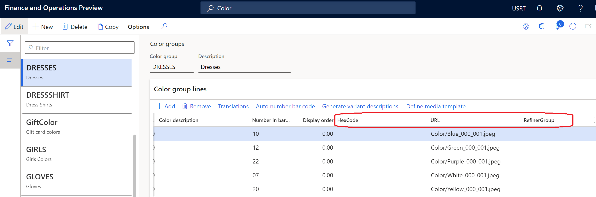
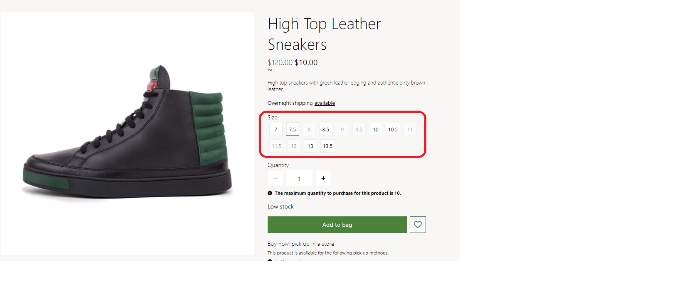

---
# required metadata

title: Configure product dimension values to appear as swatches
description: This topic describes how to configure product dimension values as swatches in Microsoft Dynamics 365 Commerce headquarters.
author: anupamar-ms
ms.date: 08/02/2021
ms.topic: article
ms.prod: 
ms.technology: 

# optional metadata

# ms.search.form: 
# ROBOTS: 
audience: Application User
# ms.devlang: 
ms.reviewer: v-chgri
# ms.tgt_pltfrm: 
ms.custom: 
ms.search.region: Global
ms.search.industry: Retail
ms.author: rapraj
ms.search.validFrom: 2020-09-20
ms.dyn365.ops.version: Retail 10.0.20 update

---

# Configure product dimension values to appear as swatches

[!include [banner](../../includes/banner.md)]

This topic describes how to configure product dimension values as swatches in Microsoft Dynamics 365 Commerce headquarters. For information about product dimensions, see [Product dimensions](../../supply-chain/pim/product-dimensions.md).

Dynamics 365 Commerce supports the use of size, style, and color dimensions to represent product variants. Product dimensions have friendly names that are shown on product details pages (PDPs) so that product variants can be selected. Examples of these friendly names include "Small," "Medium," and "Large" for sizes, and "Black" and "Brown" for colors. However, if a product supports many variations, multiple selections are required to view the image for each product variant. Therefore, it can be slow and tedious for customers to browse and select product variants.

When dimensions are shown as swatches on PDPs, customers get a visual preview of a product's variations. They can easily browse a large variety of colors, patterns, and textures, and can quickly view different combinations of product variations.

The display dimensions as swatches feature enables Commerce to use hexadecimal (hex) codes and images to show dimensions as swatches. In addition, similar dimensions, such as colors, can be grouped on product list pages. For example, a customer is searching for products that are blue. If the various blue dimension values are grouped together, the search results list page shows products that have the different shades of blue. Dimension grouping significantly improves the product refinement experience and helps customers find more products through a single product search query.

> [!NOTE]
> The display dimensions as swatches feature is available as of the Dynamics 365 Commerce version 10.0.20 release.

The following illustration shows an example where colors appear as swatches on a Commerce PDP.

The following illustration shows an example where colors appear as swatches on a Commerce search results list page.

## Enable the display dimensions as swatches feature in Commerce headquarters

To enable the display dimensions as swatches feature in Commerce headquarters, go to **Workspaces \> Feature management**, and turn on the **Enable a mechanism to represent dimensions as swatch** feature. When this feature flag is enabled, three new fields are added for each dimension in the appropriate tables in Commerce headquarters: **Hexcode**, **URL** (for images), and **RefinerGroup**.

## Configure dimension values in Commerce headquarters

The display dimensions as swatches feature is supported for size, style, and color dimensions. Hex code and image URL values for the appropriate dimensions can be specified in Commerce headquarters. By default, if hex code and image URL values aren't provided for a dimension, the system will show the text of the dimension's friendly name.

The configuration can be done at any of the following levels:

- **Dimension** – In Commerce headquarters, open the page for a dimension by searching for **Color**, **Size**, or **Style**. On each page, a grid lists the dimension values. You can manage the display order, hex code, and image URL values. The following illustration shows an example configuration on the **Colors** page.

    

- **Dimension group** – In Dynamics 365 Commerce, you can use the **RefinerGroup** property to create dimension groups. If dimension groups are defined, open the appropriate page by searching for **Color group**, **Size group**, or **Style group**. On each page, you can manage hex code, image URL, and refiner group values. The following illustration shows an example configuration on the **Color groups** page.

    

- **Product dimension (during product creation)** – When you create a new product, you can use the **Product dimensions** page to enter the dimension values. For existing products, the **Hexcode**, **URL** (for images), and **RefinerGroup** fields might already be set. However, you can change the values as you require. The following illustration shows an example configuration on the **Product dimensions** page.

    

> [!NOTE]
> The process of managing hex code and image URL configurations follows the same pattern that is used to manage the display order of dimensions.

## Configure dimension values by using hex codes

For most color dimensions, a hex code color value should be provided on dimension pages in Commerce headquarters. For example, the color black should have a hex code value of **#00000**. When Commerce renders a site page, the hex code is represented by a colored swatch.

The following illustration shows an example where color dimensions are configured by using hex code values.

## Configure dimension values by using image URLs

Some color dimensions represent patterns, not solid colors. For example, a color dimension might be described as 'leopard.' In these cases, you can more effectively represent the color dimensions by using published images instead of hex codes for swatches.

You must upload each image to Commerce site builder and publish it. Then enter the image URL for the published image on the appropriate dimension pages in Commerce headquarters. If a dimension has been selected for display as a swatch, but a hex code isn't defined, Commerce will do an image lookup when it renders the page. If the image lookup fails, Commerce will show the text of the dimension's friendly name.

The following illustration shows an example where image URLs are used for the configuration on the **Colors** page.

You can use a media template to define image URLs, just as you can for product and category images. When you upload images to site builder, file name conventions and file paths must be consistent.

The following illustration shows an example where image URLs are used for the configuration of a media template.

## Configure dimension values by using both hex codes and image URLs

For most color dimensions, you can configure both hex codes and image URLs. Commerce rendering fallback logic will automatically look for either a hex code or an image URL to show a color swatch. By using both hex codes and image URLs to configure color dimensions, you help simplify image management when the number of colors is large.

The following illustration shows an example where both hex codes and image URLs are used for the configuration on the **Colors** page.

## Configure refiner groups

When you define a hex code or image URL for a dimension value, you can also specify a value for the **RefinerGroup** field. This field defines the dimension that should be used to group similar dimension values in the refiner experience.

For example, if your color dimension values are "blue," "blue plaid," "blue wash," and "dark blue," each value is mapped to a different hex code or image URL. Therefore, each value will appear as a different color on PDPs and product cards for the appropriate products. However, if you map all those color dimension values to a **RefinerGroup** value of **Blue**, a search for "blue" products will generate list page search results for products that have dimension color values of "blue," "blue plaid," "blue wash," and "dark blue".

The example in the following illustration shows the relationship between the **Color** and **RefinerGroup** properties in Commerce headquarters.

## Manage images in Commerce site builder

If image URLs are used for any dimension values, the corresponding images must be uploaded to Commerce site builder. The location of each image should match the file name and folder path that are defined for the image in Commerce headquarters. Image files must be uploaded to the appropriate category locations in site builder. For example, color images must be uploaded to the **Color** category folder. For more information about how to upload images to site builder, see [Upload images](../dam-upload-images.md).

The following illustration shows an example where the **Upload files** dialog box is being used to upload images to the site builder media library. It highlights the **Size**, **Color**, and **Style** categories that are available for selection.

## Enable swatch display on e-commerce site pages

Before swatches can appear on e-commerce site pages that require dimension selection, such as PDPs and list pages, you must configure dimension site settings in Commerce headquarters. For more information, see [Apply site settings for dimensions](../dimension-settings.md).

In addition, you should enable the **Include product attributes in search results** property for search results modules. If your site uses customized category pages, you should update the search results modules that are used on those pages, so that the **Include product attributes in search results** property is enabled. For more information, see [Search results module](../search-result-module.md).

## Inventory awareness on swatches

Swatches have an optional capability to show the inventory availability of a product variant color or dimension. For example, a product is sold in multiple sizes, but some sizes are out of stock. In this case, the swatches for the out-of-stock products are rendered differently to indicate that they are unavailable. This capability helps reduce the number of customer clicks that are required to determine product availability.

The swatch inventory availability feature can be configured for use on both PDPs and search or category list pages where swatches are displayed. To activate it, you must set the **Update media on dimension selection** property to **True** in the [media gallery module](../media-gallery-module.md). That setting enables media gallery images to be updated when dimensions are selected. 

> [!IMPORTANT]
> The swatch inventory availability feature is available as of the Commerce version 10.0.21 release. It requires that Commerce module library package version 9.31 be installed.

The following illustration shows an example of inventory awareness on the size swatches of a PDP.

## Display swatches in POS and other channels

Commerce doesn't currently have an out-of-box implementation that supports the display of swatches in point of sale (POS) and other channels. However, you can implement swatch display functionality as an extension, because channel APIs return the hex codes and image URLs that are required to render swatches.

## Additional resources

[Search results module](../search-result-module.md)

[Apply site settings for dimensions](../dimension-settings.md)

[Product dimensions](../../supply-chain/pim/product-dimensions.md)

[Upload image](../dam-upload-images.md)

[!INCLUDE[footer-include](../../includes/footer-banner.md)]
