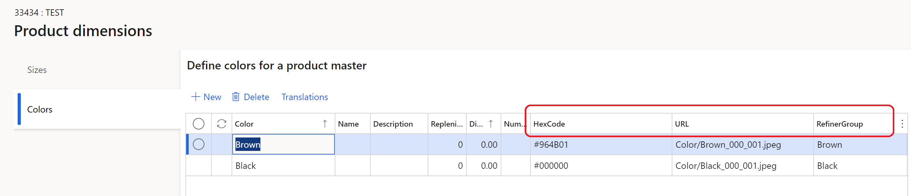
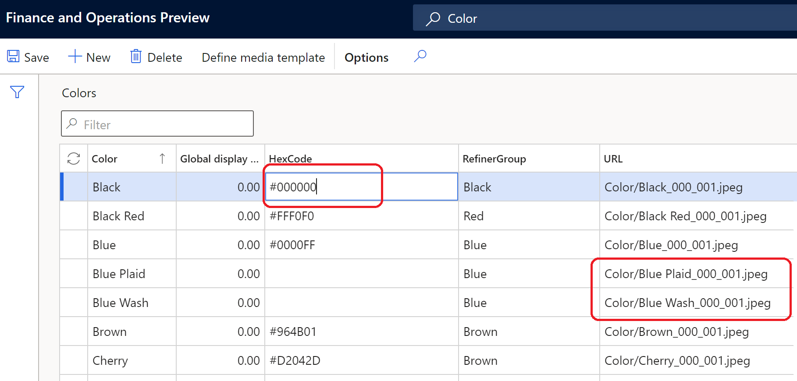
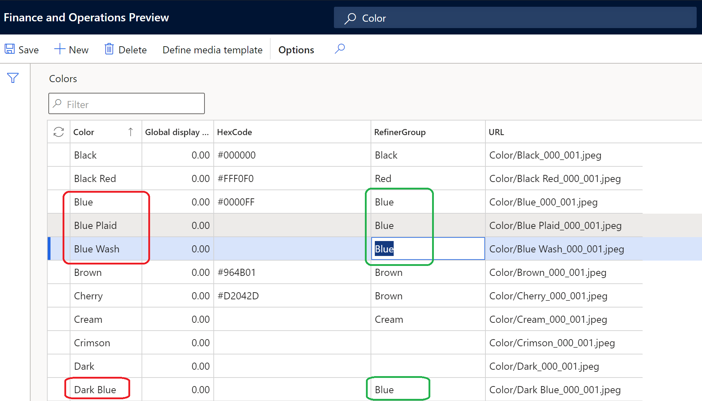

---
# required metadata

title: Configure product dimension values to display as swatches 
description: This topic describes how to configure product dimension values as swatches in Microsoft Dynamics 365 Commerce headquarters.
author: anupamar-ms
ms.date: 05/28/2021
ms.topic: article
ms.prod: 
ms.technology: 

# optional metadata

# ms.search.form: 
# ROBOTS: 
audience: Application User
# ms.devlang: 
ms.reviewer: v-chgri
# ms.tgt_pltfrm: 
ms.custom: 
ms.search.region: Global
ms.search.industry: Retail
ms.author: rapraj
ms.search.validFrom: 2020-09-20
ms.dyn365.ops.version: Retail 10.0.20 update

---

# Configure product dimension values to display as swatches 

[!include [banner](../../includes/banner.md)]
[!include [banner](../../includes/preview-banner.md)]

This topic describes how to configure product dimension values to display as swatches in Microsoft Dynamics 365 Commerce.

For more information on product dimensions, see [Product Dimensions](../../supply-chain/pim/product-dimensions.md).

Dynamics 365 Commerce supports size, style, and color dimensions for representing product variants. Product dimensions have friendly names that are displayed on product details pages (PDPs) for product variant selection, such as "Small," "Medium," and "Large" for sizes, and "Black" and "Brown" for colors. However, for products with many variations, browsing through product variants requires multiple selections to view each product variant image, which can make the browsing and selection process slow and tedious for customers.

Displaying dimensions as swatches on PDPs provides a visual preview a product's variations, allowing customers to easily browse a large variety of colors, patterns, and textures and quickly view different product variation combinations. With this feature Commerce introduces the capability to display dimensions as a swatch using images and hexadecimal (hex) codes. In addition to displaying dimensions as swatches, Commerce also provides the capability to group dimensions such as colors on the product list pages. For example, when a customer searches for products that are blue, when blue dimensions are grouped together the search results product list page displays products with the different shades of blue. Dimension grouping significantly improves the product refinement experience and allows customers to find more products with a single product search query. 

> [!NOTE]
> The display dimensions as swatches feature is available as of the Dynamics 365 Commerce version 10.0.20 release.

The following example image shows colors displayed as swatches on a Commerce PDP. 

The following example image shows colors displayed as swatches on a Commerce search results list page.

## Enable the display dimensions as swatches feature in Commerce headquarters

To enable the display dimensions as swatches feature in Commerce headquarters, go to **Workspaces \> Feature management** and turn on the **Enable image support for product dimension values** feature. When this feature flag is enabled, three new fields are added for each dimension in the respective tables: **Hexcode**, **Image Url**, and **Refiner Group**. 

## Configure dimension values in Commerce headquarters

Dimension Size, Style and Color dimensions support swatch. Both hex code and image URL configurations must be provided for the respective values in headquarters. If a value is not provided, it will default to a dimension friendly name for display. This can be configured in any of the following forms. 

> [!NOTE]
> Managing hex code and image URL configurations follows the same pattern used for managing dimension display order.

- Dimension: Search for each dimension **Color**, **Size** or **Style**. In each of the respective forms, the dimension values will be shown. Here in addition to managing display order, you can also manage Hexcode and Image Url. The following is an example of the configuration on Color form. 

- Dimension groups: Dynamics 365 Commerce allows the capability to create dimension groups. If you have dimension groups defined, search for **Color group**, **Size group**, **Style group**. In the respective forms, you can manage the Hexcode or ImageUrl.The following is an example of the configuration on Color group form.  

- Product dimension when creating a product. When creating a new product,  **Product Dimensions** form can be used to enter the dimension values. For an existing dimension value, where Hexcode, Url, Refiner Group will be pre-populated. If needed these values can be changed here. In each form, three new fields are included – Hexcode, Image Url and  Refiner Group. In the next few sections, we will discuss how these values should be provided.The following is an example of the configuration on Product dimensions form. 

## Configure dimension values using Hexcode
If a dimension say Color needs to represented using hexcode, the respective hexcode value should be provided in the table as described in the previous section. E.g.  Color=Black should have Hexcode #00000. In Commerce headquarters, for each dimension value, the respective Hexcode value should be provided in the hexcode format. On e-commerce rendering, this hexcode will be represented as a swatch. 
Below is an example of Color configured as Hexcode on Color form in Headquarters. 
 

## Managing dimension values using Image Url
If a dimension say Color needs to represented using image, the respective image url should be provided in the dimension table as described in the previous section.  For example, Color=Leopard, can be best represented only as an image. The Image Url should be defined for Color-Leopard in Commerce Headquarters. The respective image should then be uploaded to Site Builder. On e-commerce rendering, if a dimension is chosen to be displayed as a swatch and a hexcode is not defined, an image look up will be done. If the image look-up also fails, e-commerce rendering will fallback to the dimension friendly name (text). 

Like Products and Category images, a Media template can be used to define the Image Url.  Below is an example of Color using Media template url to define the file path of the images. The name of the file and file path are important as they need to be consistent when uploading the images to Site Builder.

Below is an example of Color configured with Image Urls

Below is an example of Media Template configuration for Color

## Managing dimension values using both Hexcode and Image url
For a dimension say Color, some values can be hexcode while others can be Image url. With the e-commerce rendering fallback logic, it will automatically look for either hexcode or an image url to display the Color.  This simplifies the image management experience when dealing with large numbers of colors.

Below is an example of Color configured with Hexcode and Image Urls

## Configure Refiner Group in Commerce Headquarters
While defining Hexcode or Image Url for a dimension value, you can also state the Refiner Group value. The Refiner Group value will be name of the dimension that should be used in the refiner experience. For instance in the below example we have Color values Blue, Blue Plaid, Blue Wash, and Dark Blue, each mapped to a different  hexcode and will appear as different colors in the product details page and product cards of respective products. On the refiner experience, since these dimension values are mapped to Refiner Group = Blue, on a list page, refining on Blue will show products that have Color = Blue, Blue Plaid, Blue Wash, and Dark Blue on the page.

Below is an example of Refiner group management

## Image Management in Site Builder
If image Urls are used for any dimension value, the respective image need to be uploaded to Site Builder. They should follow the same folder path and file name as defined in Commerce Headquarters.  Image management follows the same pattern we use for Products and Categories, refer [Upload Image](../dam-upload-images.md). 

Files must be uploaded to the respective dimensions. E.g Color images should be uploaded to **Color** entity in Site Builder

Below is an example of uploading images via Site builder for the Dimensions.

## Swatch display in e-commerce
On e-commerce, swatches can displayed in experiences that require a dimension selection i.e. Product details page, Product cards on list pages, Quick view module, refiners on list pages. To enable the experience on e-commerce, you need to opt-into the Dimension site settings. Refer to [Apply site settings for dimensions](../dimension_settings.md)

In addition, the Search Results module property **Include product attributes** should be enabled on the Search Results module. If there are any enriched category pages, each of these pages should also be updated respectively. For more details, refer [Search results module](../search-result-module.md)

## Swatch display in POS and other channels
We don’t have an out-of-box implementation to display swatches on POS and other channels. If required it can be achieved as an extension. The channel APIs return the hexcode and image url information needed to render the images.

## Additional resources

[Search results module](../search-result-module.md)

[Apply site settings for dimensions](../dimension_settings.md)

[Product Dimensions](../../supply-chain/pim/product-dimensions.md)

[Upload Image](../dam-upload-images.md).

[!INCLUDE[footer-include](../../includes/footer-banner.md)]
