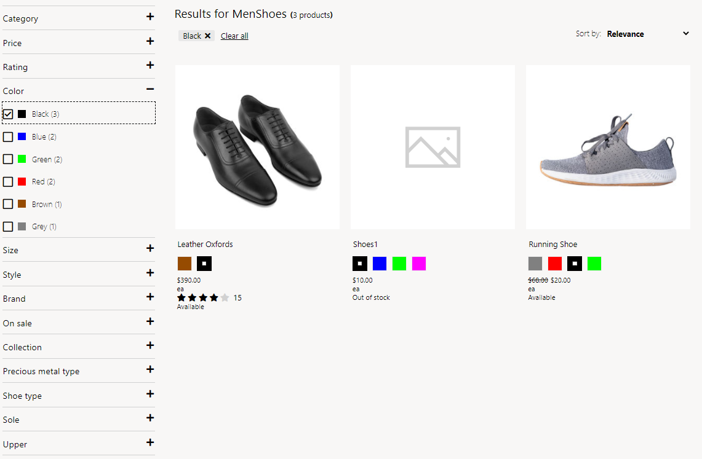
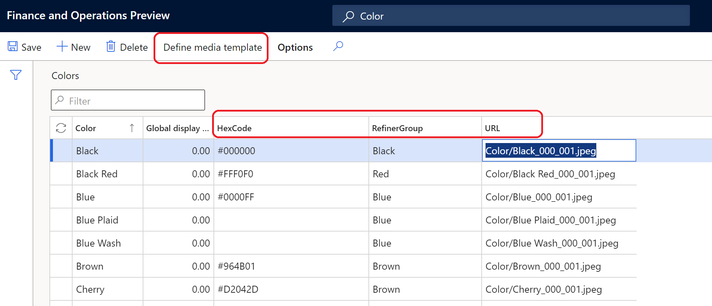
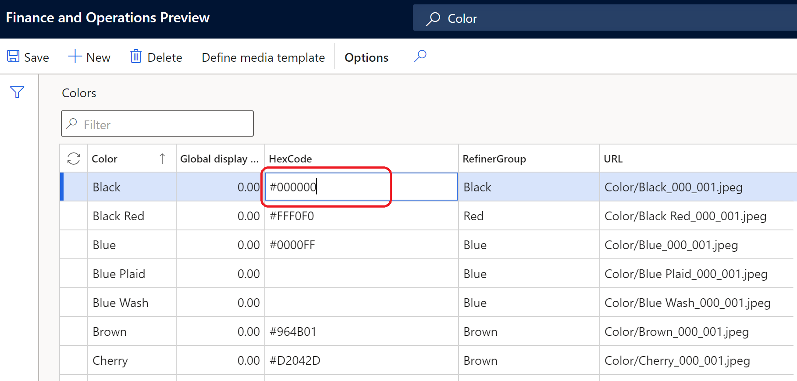
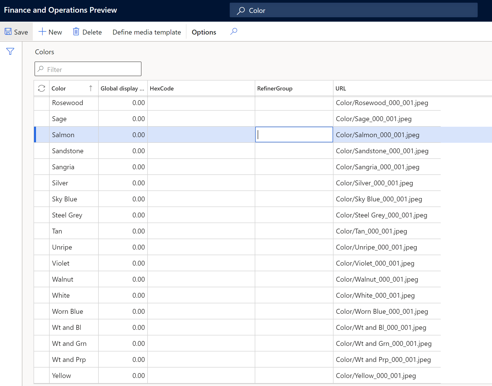
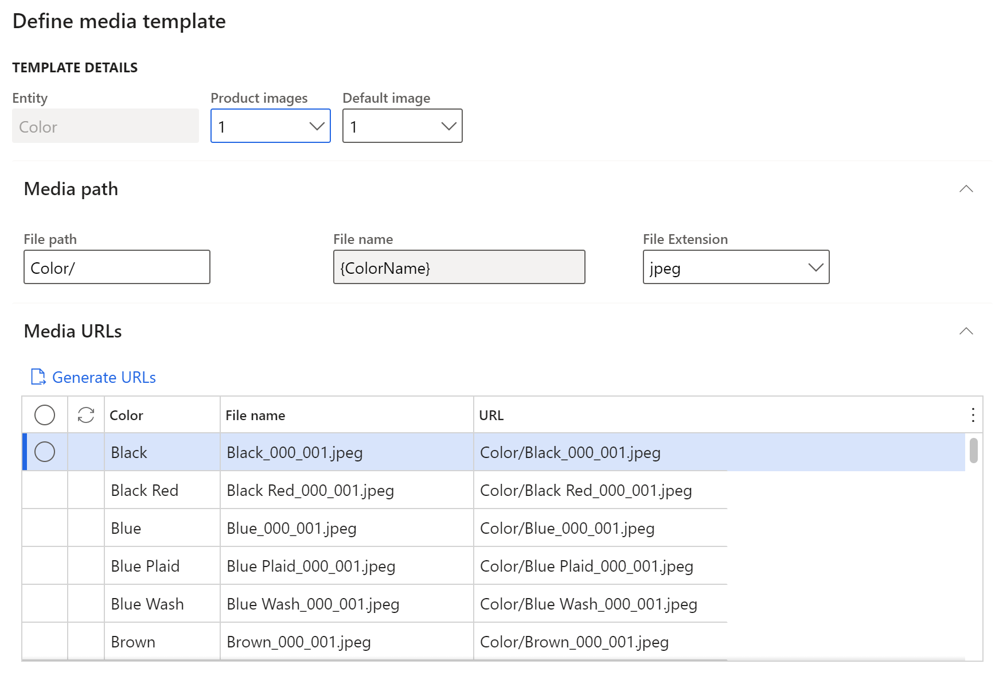

---
# required metadata

title: Configure product dimension values to display as swatches 
description: This topic describes how to configure product dimension values as swatches in Microsoft Dynamics 365 Commerce headquarters.
author: anupamar-ms
ms.date: 05/28/2021
ms.topic: article
ms.prod: 
ms.technology: 

# optional metadata

# ms.search.form: 
# ROBOTS: 
audience: Application User
# ms.devlang: 
ms.reviewer: v-chgri
# ms.tgt_pltfrm: 
ms.custom: 
ms.search.region: Global
ms.search.industry: Retail
ms.author: rapraj
ms.search.validFrom: 2020-09-20
ms.dyn365.ops.version: Retail 10.0.20 update

---

# Configure product dimension values to display as swatches 

[!include [banner](../../includes/banner.md)]
[!include [banner](../../includes/preview-banner.md)]

This topic describes how to configure product dimension values to display as swatches in Microsoft Dynamics 365 Commerce.

For more information on product dimensions, see [Product dimensions](../../supply-chain/pim/product-dimensions.md).

Dynamics 365 Commerce supports size, style, and color dimensions for representing product variants. Product dimensions have friendly names that are displayed on product details pages (PDPs) for product variant selection, such as "Small," "Medium," and "Large" for sizes, and "Black" and "Brown" for colors. However, for products with many variations, browsing through product variants requires multiple selections to view each product variant image, which can make the browsing and selection process slow and tedious for customers.

Displaying dimensions as swatches on PDPs provides a visual preview of a product's variations, allowing customers to easily browse a large variety of colors, patterns, and textures and quickly view different product variation combinations. With this feature Commerce introduces the capability to display dimensions as a swatch using images and hexadecimal (hex) codes. In addition to displaying dimensions as swatches, Commerce also provides the capability to group dimensions such as colors on the product list pages. For example, when a customer searches for products that are blue, when blue dimensions are grouped together the search results product list page displays products with the different shades of blue. Dimension grouping significantly improves the product refinement experience and allows customers to find more products with a single product search query. 

> [!NOTE]
> The display dimensions as swatches feature is available as of the Dynamics 365 Commerce version 10.0.20 release.

The following example image shows colors displayed as swatches on a Commerce PDP. 

The following example image shows colors displayed as swatches on a Commerce search results list page.

## Enable the display dimensions as swatches feature in Commerce headquarters

To enable the display dimensions as swatches feature in Commerce headquarters, go to **Workspaces \> Feature management** and turn on the **Enable image support for product dimension values** feature. When this feature flag is enabled, three new fields are added for each dimension in the respective tables: **Hexcode**, **Image Url**, and **Refiner Group**. 

## Configure dimension values in Commerce headquarters

The display dimensions as swatches feature is supported for size, style, and color dimensions. Hex code and image URL values must be provided in headquarters for the respective dimensions. If a value is not provided for a dimension, the system will default to a friendly name for display. This can be configured in any of the following forms. 

- **Dimension** - Search for each dimension form in headquarters by **Color**, **Size** or **Style**. In each respective forms, the dimension values will be listed, and you can manage display order, hex code, and image URL values. The following image shows an example configuration on the **Colors** form. 

    

- **Dimension groups** - Dynamics 365 Commerce allows the capability to create dimension groups. If you have dimension groups defined, search for **Color group**, **Size group**, **Style group**. In each respective form, you can manage hex code and image URL values. The following image shows an example configuration on the **Color groups** form.  
    
    

- **Product dimension when creating a product** - When creating a new product, the **Product dimensions** form can be used to enter the dimension values. For existing products, the **Hexcode**, **URL**, and **RefinerGroup** values may be prepopulated, but if needed these values can be changed here. In each form, three new fields are included: **Hexcode**, image **URL**, and **RefinerGroup**. The following example image shows the configuration on the **Product dimensions** form. 

    

> [!NOTE]
> Managing hex code and image URL configurations follows the same pattern used for managing dimension display order.

## Configure dimension values using hex codes

For most color dimensions, a hex code color value should be provided on the dimension form(s) in headquarters. For example, the color black should have a hex code value of **#00000**. When Commerce renders the site page, the hex code is represented as a colored swatch. 

The following image shows an example configuration for a color dimension configured with a hex code value. 
 

## Configure dimension values using image URLs

For some color dimensions, the color can best be represented using a published image rather than a hex code. For example, if a color dimension is described as "leopard," an image would best represent that color in a swatch. The image should be uploaded to site builder and published, and then the image URL should be entered in the appropriate dimension form(s) in headquarters. When Commerce renders an image, if a dimension is chosen to be displayed as a swatch and a hex code is not defined, an image lookup will be performed. If the image lookup fails, Commerce will default to rendering text of the dimension's friendly name. 

The following image shows an example **Colors** form configuration using image URLs.

Like product and category images, a media template can be used to define image URLs. The name of the file and file path are important as they need to be consistent when uploading images to site builder.

Below is an example of Media Template configuration for Color

The following image shows an example media template configuration using image URLs.

## Configure dimension values using both hex codes and image URLs

The majority of color dimensions can be configured with both hex codes and image URLs. Commerce rendering fallback logic will automatically look for either a hex code or an image URL to display the color swatch. Using both hex codes and image URLs to configure dimension colors can simplify image management when dealing with large numbers of colors.

The following image shows an example **Colors** form configuration with both hex codes and image URLs.

## Configure refiner groups

When defining a hex code or image URL for a dimension value, you can also specify the **RefinerGroup** value, which is the name of the dimension that should be used to group similar dimension values in the refiner experience. For example, if you have color dimension values blue, blue plaid, blue wash, and dark blue, each color value is mapped to a different hex code or image URL and will appear as different colors on PDPs and product cards of respective products. But if these dimension values are mapped to the **RefinerGroup** value **Blue**, refining on "blue" will show products that have dimension color values of blue, blue plaid, blue wash, and dark blue on the search list page.

The following example image shows the relationship between **Color** and **RefinerGroup** properties in Commerce headquarters.

## Image management in Commerce site builder

If image URLs are used for any dimension value, the respective images must be uploaded to Commerce site builder. The image location should follow the same folder path and file name as that defined in Commerce headquarters. For more information on uploading images to site builder, see [Upload images](../dam-upload-images.md). 

Image files must be uploaded to their respective categories in site builder, for example color images should be uploaded to the **Color** category.

Below is an example of uploading images via Site builder for the Dimensions.

The following example image highlights the **Size**, **Color**, and **Style** categories displayed in the **Upload files** dialog box when uploading images to the site builder media library.

## Enable swatch display on e-commerce site pages

For swatches to be displayed on e-commerce site pages such as PDPs and list pages that require a dimension selection , you must first configure dimension site settings in Commerce headquarters. For more information, see [Apply site settings for dimensions](../dimension-settings.md).

In addition, the search results module property **Include product attributes in search results** should be enabled. If your site uses any customized category pages, search results modules used on those pages should also be updated to enable the **Include product attributes in search results** property. For more information, see [Search results module](../search-result-module.md).

## Display swatches in POS and other channels

Commerce doesn't currently have an out-of-box implementation to support the display of swatches on POS and other channels. If required, swatch display functionality can be implemented as an extension that makes channel APIs return the hex code and image URL information needed to render the swatches.

## Additional resources

[Search results module](../search-result-module.md)

[Apply site settings for dimensions](../dimension-settings.md)

[Product dimensions](../../supply-chain/pim/product-dimensions.md)

[Upload image](../dam-upload-images.md)

[!INCLUDE[footer-include](../../includes/footer-banner.md)]
