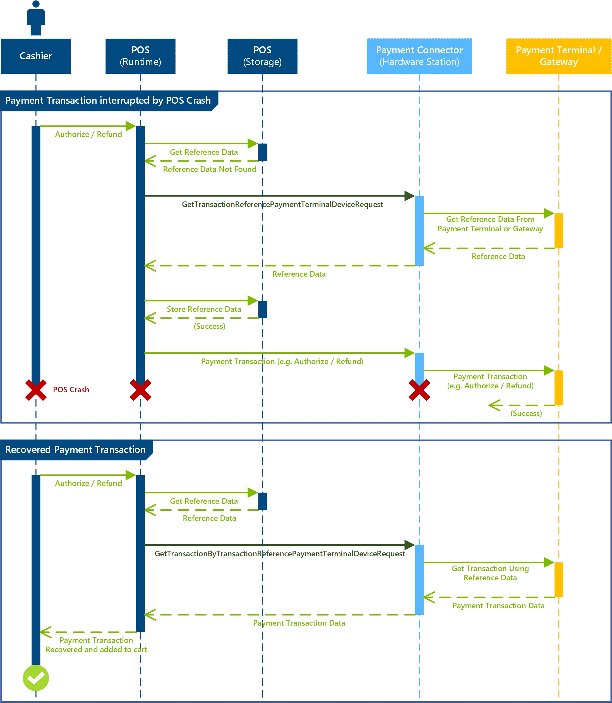

# Enable duplicate payment protection for payment connector

[!include [banner](../../includes/banner.md)]

This article describes how to enable duplicate payment protection functionality in a payment connector that manages the integration with a payment terminal. A *payment connector* is an extension library that is written to integrate the POS with a payment terminal.

## Overview

- [Required reading](#required-reading) - List of articles that you should be read before starting the implementation of the duplicate payment protection functionality in a payment connector. 
- [Prerequisites](#prerequisites) - List of prerequisites to enable duplicate payment protection in a payment connector implementation.
- [Understanding duplicate payment protection flows](#understanding-duplicate-payment-protection-flows) - Describes the various flows where the duplicate payment protection is invoked in the POS.
- [Implement duplicate payment requests](#implement-duplicate-payment-requests) - Describes the various payment-related requests that need to be implemented to support the duplicate payment protection feature.

## Required reading
Be sure to read the following article before enabling duplicate payment protection for a given payment connector.

- [Create an end-to-end payment integration for a payment terminal](end-to-end-payment-extension.md) - The duplicate payment protection feature builds on the payment integration for a payment terminal described in this article.

## Prerequisites
The following prerequisites must be met before duplicate payment protection can be enabled for a payment connector implementation.

### Support for unique transaction scope in payment terminal or payment gateway/processor
In order to enable support for duplicate payment protection, the corresponding payment terminal or payment gateway/processor must provide support for unique transaction scopes. This support is usually handled through a unique payment reference identifier that can be generated by the payment terminal or payment gateway/processor before the payment is being processed. Without support for this unique identifier, the connector will not be able to uniquely match a previously initiated transaction with a successful payment authorization, which is at the core of the duplicate payment protection feature.

## Understanding duplicate payment protection flows
The Retail POS has been extended to invoke the new requests, `GetTransactionReferencePaymentTerminalDeviceRequest` and `GetTransactionByTransactionReferencePaymentTerminalDeviceRequest` in various scenarios across the POS, such as immediately before an **Authorize** request is issued to the payment connector. The purpose of these new requests is to detect and recover successfully processed payment through the payment connector before a new payment request is issued. The following diagram illustrates a simple scenario where a payment request is successfully processed through the payment connector but the POS has crashed before it can receive the response. Subsequently, the POS is able to recover the previously processed payment through the duplicate payment protection feature. 




### Supported POS flows
The following list describes all of the POS flows where the `GetTransactionByTransactionReferencePaymentTerminalDeviceRequest` is invoked to recover an existing payment. These are the most commonly executed flows when the POS crashes or loses connectivity to the payment terminal or payment gateway during the processing of a payment transaction.

- Cashier invokes payment for any amount using a card payment
- Cashier invokes payment for any amount using a cash payment
- Cashier attempts to void a line on the cart
- Cashier attempts to void the transaction
- Cashier attempts to suspend the transaction

## Implement duplicate payment requests
The following sample illustrates the requests on the `INamedRequestHandler` payment connector implementation that are required to fully enable the duplicate payment protection feature.

``` csharp
namespace Contoso.Commerce.HardwareStation.PaymentSample 
{ 
    /// <summary>
    /// <c>Simulator</c> manager payment device class.
    /// </summary>
    public class PaymentDeviceSample : INamedRequestHandler
    {
        /// <summary>
        /// Gets the collection of supported request types by this handler.
        /// </summary>
        public IEnumerable<Type> SupportedRequestTypes
        {
            get
            {
                return new[]
                {
                    // New request types specific to the duplicate payment protection feature.
                    typeof(GetTransactionReferencePaymentTerminalDeviceRequest),
                    typeof(GetTransactionByTransactionReferencePaymentTerminalDeviceRequest),
                    
                    // Extended with new functionality.
                    typeof(AuthorizePaymentTerminalDeviceRequest)
                };
            }
        }

        /// <summary>
        /// Executes the payment device simulator operation based on the incoming request type.
        /// </summary>
        /// <param name="request">The payment terminal device simulator request message.</param>
        /// <returns>Returns the payment terminal device simulator response.</returns>
        public Response Execute(Microsoft.Dynamics.Commerce.Runtime.Messages.Request request)
        {
            ThrowIf.Null(request, nameof(request));

            Type requestType = request.GetType();

            if (requestType == typeof(GetTransactionReferencePaymentTerminalDeviceRequest))
            {
                return this.GetTransactionReference((GetTransactionReferencePaymentTerminalDeviceRequest)request);
            }
            else if (requestType == typeof(GetTransactionByTransactionReferencePaymentTerminalDeviceRequest))
            {
                return this.GetTransactionByTransactionReference((GetTransactionByTransactionReferencePaymentTerminalDeviceRequest)request);
            }
            else if (requestType == typeof(AuthorizePaymentTerminalDeviceRequest))
            {
                return this.AuthorizePayment((AuthorizePaymentTerminalDeviceRequest)request);
            }
            ...

            return new NullResponse();
        }
    }
}
```

### GetTransactionReferencePaymentTerminalDeviceRequest / GetTransactionReferencePaymentTerminalDeviceResponse

#### Description
The `GetTransactionReferencePaymentTerminalDeviceRequest` is invoked by the Retail POS at the beginning of a payment transaction and sets the scope of the payment. The scope of this request ends once the payment line is successfully added to the cart or an error, indicating that a card cannot be used and returned from the payment connector. The corresponding `GetTransactionReferencePaymentTerminalDeviceResponse` response will contain the corresponding unique identifier generated by the payment connector to look up a payment transaction. Note that the payment connector implementation must not cache the generated ID because the ID must survive the application's restarts, typically the ID should be generated by the Payment Gateway.

#### Request signature
``` csharp
public GetTransactionReferencePaymentTerminalDeviceRequest(string lockToken, string posTerminalId, string eftTerminalId);
```

#### Request variables
| Variable | Description |
|---|---|
| lockToken | Unique token value that is generated when the payment terminal is initially locked for the transaction. |
| posTerminalId | Unique name of the POS register. |
| eftTerminalId | EFT POS terminal number configured either on the POS register or the shared Hardware Station. |

#### Response signature
``` csharp
public GetTransactionReferencePaymentTerminalDeviceResponse(string id);
```

#### Response variables
| Variable | Description |
|---|---|
| id | Unique identifier used for the scope of the payment transaction. |

### PaymentTransactionReferenceData 
After the `GetTransactionReferencePaymentTerminalDeviceRequest` is executed, the Retail POS will generate a new instance of the `PaymentTransactionReferenceData` class to carry the required contextual data that is needed for the POS to maintain the duplicate payment protection scope. This variable will be stored and maintained in the POS and then used to check for existing transactions during key payment operations. 

#### Properties
| Variable | Description |
|---|---|
| Command | Payment related command that was invoked. Possible values are `Sale`, `Refund`, `Activate`, or `Load`. |
| IdFromConnector | Unique identifier generated through the `GetTransactionReferencePaymentTerminalDeviceRequest` request. |
| InitiatedDate | Date and time when the original payment-related transaction was initiated. |
| UniqueTransactionId | Unique identifier for the cart transaction (not specific to a payment itself). |
| Amount | Amount of the payment transaction being handled. |

### AuthorizePaymentTerminalDeviceRequest

#### Description
`AuthorizePaymentTerminalDeviceRequest` parameter has now been extended to provide a new constructor that supports the new request, `PaymentTransactionReferenceData`. The purpose of this parameter is to maintain the contextual reference data and stamp the authorization request to the payment terminal or payment gateway/processor with the unique identifier generated by the payment connector and used by the POS to later query for and identify duplicate payments. 

### GetTransactionByTransactionReferencePaymentTerminalDeviceRequest / GetTransactionByTransactionReferencePaymentTerminalDeviceResponse
`GetTransactionByTransactionReferencePaymentTerminalDeviceRequest` is invoked by the Retail POS immediately before certain payment-related operations to identify whether an existing payment transaction was already invoked and handled by the payment terminal or payment gateway/processor. If an existing transaction is recovered by the payment connector, it will be returned and short circuit subsequent calls to the connector to trigger a new transaction.

#### Request signature
``` csharp
public GetTransactionByTransactionReferencePaymentTerminalDeviceRequest(string lockToken, PaymentTransactionReferenceData transactionReferenceData);
```

#### Request variables
| Variable | Description |
|---|---|
| lockToken | Unique token value that is generated when the payment terminal is initially locked for the transaction. |
| transactionReferenceData | Property bag containing various properties used to uniquely identify a payment transaction. For more information, see the section [PaymentTransactionReferenceData](#paymenttransactionreferencedata) in this article. |

#### Response signature
``` csharp
public GetTransactionByTransactionReferencePaymentTerminalDeviceResponse(PaymentInfo paymentInfo);
```

#### Response variables
| Variable | Description |
|---|---|
| paymentInfo | The recovered payment transaction. This is identical to the payment response returned for any other payment request, such as **Authorize** or **Refund**. |
                                                                                                                                                                                                                                                                                                            


[!INCLUDE[footer-include](../../includes/footer-banner.md)]
