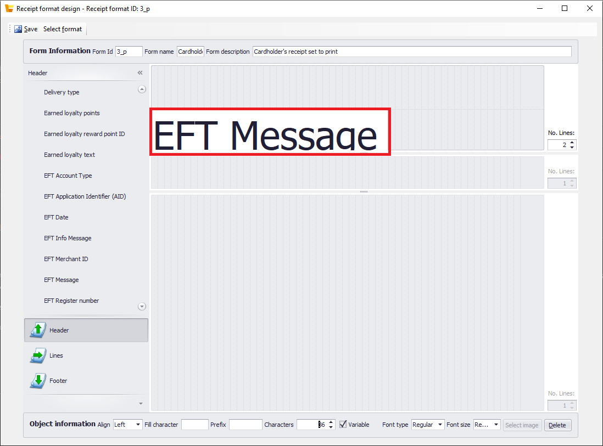
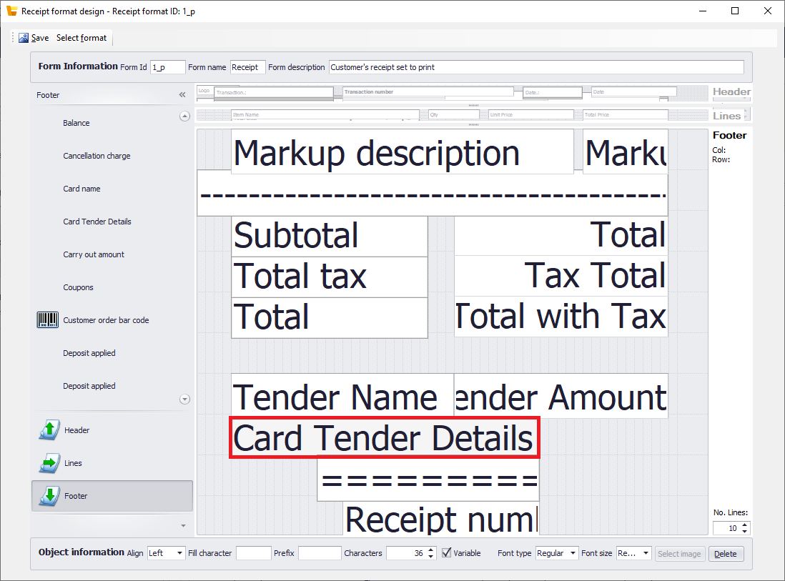
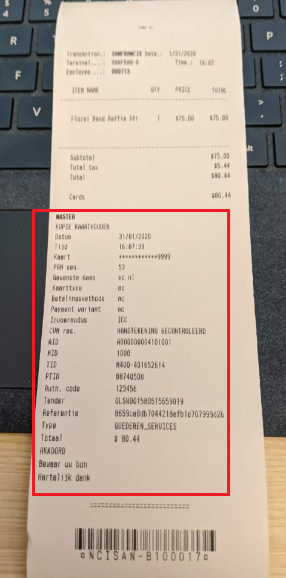

# Embed processor credit card receipts in customer receipts

[!include [banner](../includes/banner.md)]

This article describes how to embed a credit card receipt from a payment processor directly into a customer's itemized transaction receipt in Microsoft Dynamics 365 Commerce. This capability is available as of the Commerce version 10.0.8 release.

In Dynamics 365 Retail version 10.0.7 and earlier, several elements from a customer's credit card receipt could be embedded into the customer's itemized transaction receipt. However, the actual receipt that comes from the payment processor could not be included. That solution wasn't acceptable for all retailers, because the configurable receipt fields in the customer's credit card receipt didn't always include all the details that local statutory requirements stipulate.

## Key terms

| Term | Description |
|---|---|
| Customer's receipt | The receipt that is generated for a cash-and-carry transaction at the point of sale (POS). |
| Customer's credit card receipt | The credit card receipt that is printed as a record of the credit card payment or other electronic payment that is used in a transaction. |

## Prerequisites

The following items are required to embed processor credit card receipts into customer receipts:

- A payment connector that is implemented in accordance with the payments software development kit (SDK)
- A POS that has a working printer

## Set up receipts

1. In the POS, search for "receipt formats" to open the **Receipt formats** page.
2. Select the receipt of the **Customer's credit card receipt** type that will be used at the POS. If you're using demo data, select receipt format **3\_P**, and set the **Print Behavior** field to **Do not print**.
3. Select **Designer** to open the receipt designer.
4. Remove all the fields from the receipt format.

    To edit a section of the receipt, you must first select that section at the bottom of the left pane in the receipt designer. Then select the desired receipt variable in the selected section. Finally, to delete the selected variable, you can use the **Alt+D** keyboard shortcut.

5. Select the **Header** section at the bottom of the left pane, and then drag the **EFT Message** receipt variable into the header.

    

6. Select **Save**.
7. While the receipt designer is still open, select **Select format** in the upper-left corner to open the receipt selector.
8. In the receipt selector, select the receipt of the **Receipt** type that will be used at the POS. If you're using demo data, select receipt format **1\_p**.
9. In the receipt designer, select the **Footer** section at the bottom of the left pane, and then drag the **Card Tender Details** receipt variable into the footer.

    > [!NOTE]
    > If the credit card receipt isn't printed correctly, move the **Card Tender Details** field all the way to the left side, and increase the field length to at least 55 characters.

    

10. Select **Save**.
11. Sync the changes to the POS by using the **1090** distribution schedule.
12. Close the shift in the POS, and then open a new shift.
13. Perform a credit card transaction to confirm that the processor's credit card receipt is embedded into the customer's receipt.

    

[!INCLUDE[footer-include](../../includes/footer-banner.md)]
