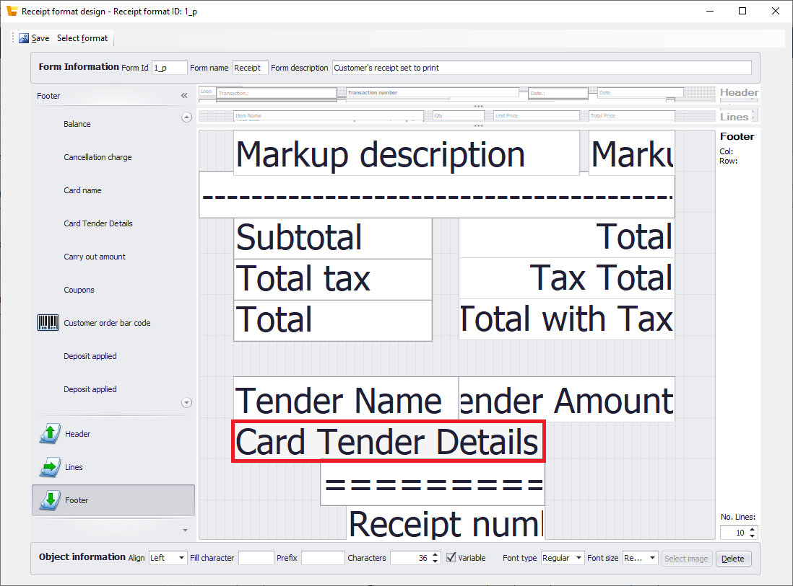
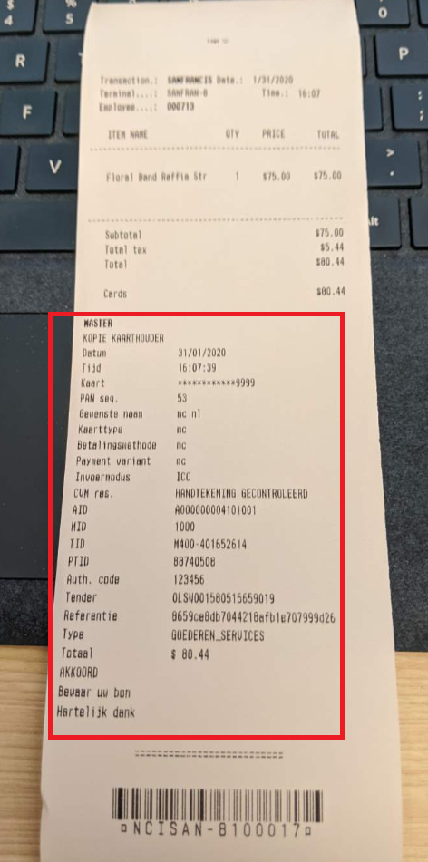

---
# required metadata

title: Embedding processor credit card receipts in customer receipts
description: This topic describes how to embed receipts from payment processors into the customer's itemized transaction receipt
author: rubendel
manager: Tonya.Fehr
ms.date: 04/03/2020
ms.topic: article
ms.prod: 
ms.service: dynamics-365-retail
ms.technology: 

# optional metadata

# ms.search.form: 
# ROBOTS: 
audience: IT Pro
# ms.devlang: 
ms.reviewer: josaw
ms.search.scope: Operations, Retail
# ms.tgt_pltfrm: 
ms.custom: 141393
ms.assetid: e23e944c-15de-459d-bcc5-ea03615ebf4c
ms.search.region: Global
ms.search.industry: Retail
ms.author: rubendel
ms.search.validFrom: 2019-01-01
ms.dyn365.ops.version: AX 7.0.1

---

# Embedding processor credit card receipts in customer receipts

[!include [banner](../includes/banner.md)]

This topic describes how to embed payment processor receipts in the customer's receipt

## Key terms

| Term | Description |
|---|---|
| Customer's receipt | The receipt generated at the point of sale for a cash and carry transaction |
| Customer's credit card receipt | The credit card receipt that prints as a record of the credit card or other electronic payment used in a transaction |

## Overview

This document descibes the steps needed to embed the credit card receipt receipt from the payment processor directly into the customer's receipt. previously, several elements from the customer's credit card receipt could be embedded in the customer's itemized transaction receipt, but the actual receipt coming from the processor was not included. That solution did not work for all retailers as the configurable receipt fields in the customer's credit card receipt did not always include all of the details required according to local statutory requirements. The solution is to embed the actual receipt from the processor, which always includes the required payment details. 

## Prerequisites

**Payment connector** A payment connector which is implemented in accordance with the payments SDK

## Setup

1. Search for **Receipt formats** to open the recept formats form. 
2. Select the receipt of type **Customer's credit card receipt** that will be used at the point of sale. If using demo data, select receipt format **3_P** and set **Print Behavior** to **Do not print**.
3. Click **Designer** to launch the receipt designer and make changes to the receipt format. 
4. Remove all fields from the receipt format. To edit a section of the receipt, you must first select the section in the bottom lefthand side of the designer window, then selecting the targeted receipt variable within the selected section. The keystroke **ALT+D** deletes the selected variable.
5. Select the **Header** section of the receipt and drag the **EFT Message** variable into the header. 

6. Click **Save**
7. With the receipt designer still open, click **Select format** in the top lefthand corner. This will launch a receipt selector in a separate window. 
8. In the receipt selector, select the receipt of type **Receipt** that will be at the point of sale. If using demo data, select receipt format **1_p**. 
9. Select **Footer** in the lower lefthand section of the window and drag the **Card tender details** receipt variable into the footer.

10. Click **Save**. 
11. Sync the changes to the point of sale using the **1090** distribution schedule.
12. Close the shift in POS and open a new shift. 
13. Perform a credit card transaction and observe the processor's credit card receipt embedded in the customer's receipt. 

