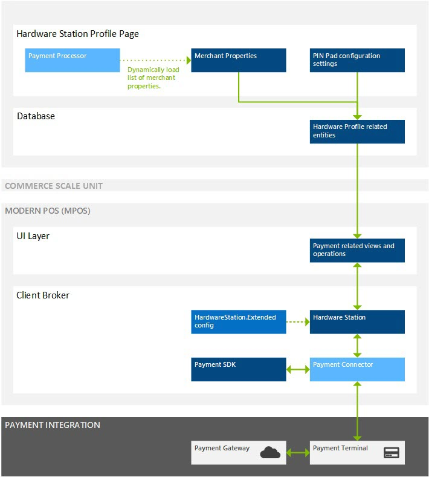
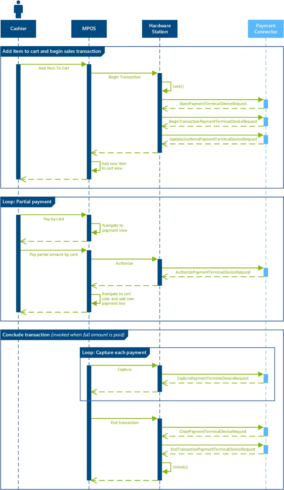
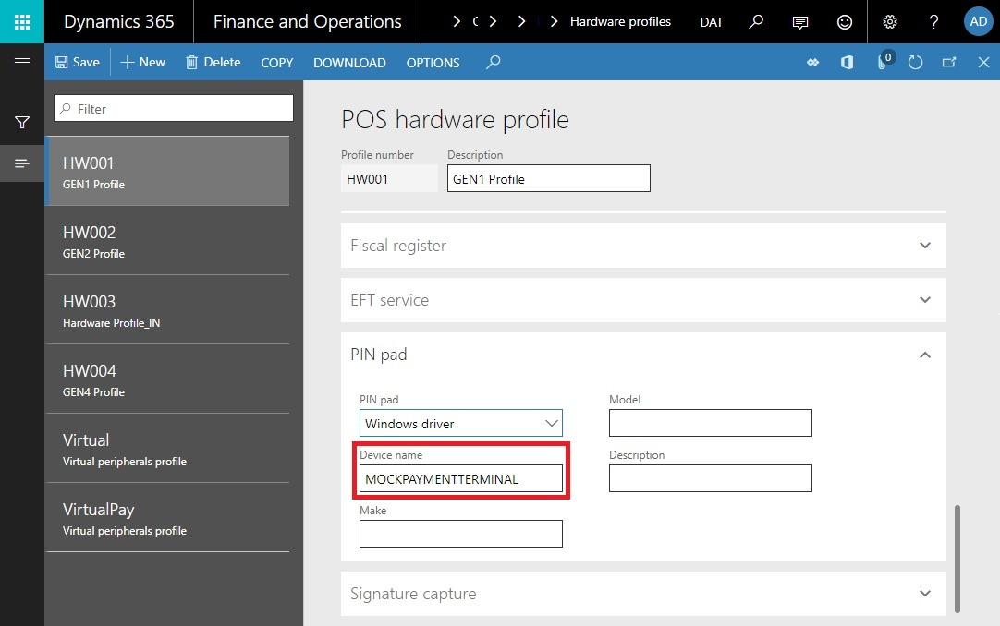
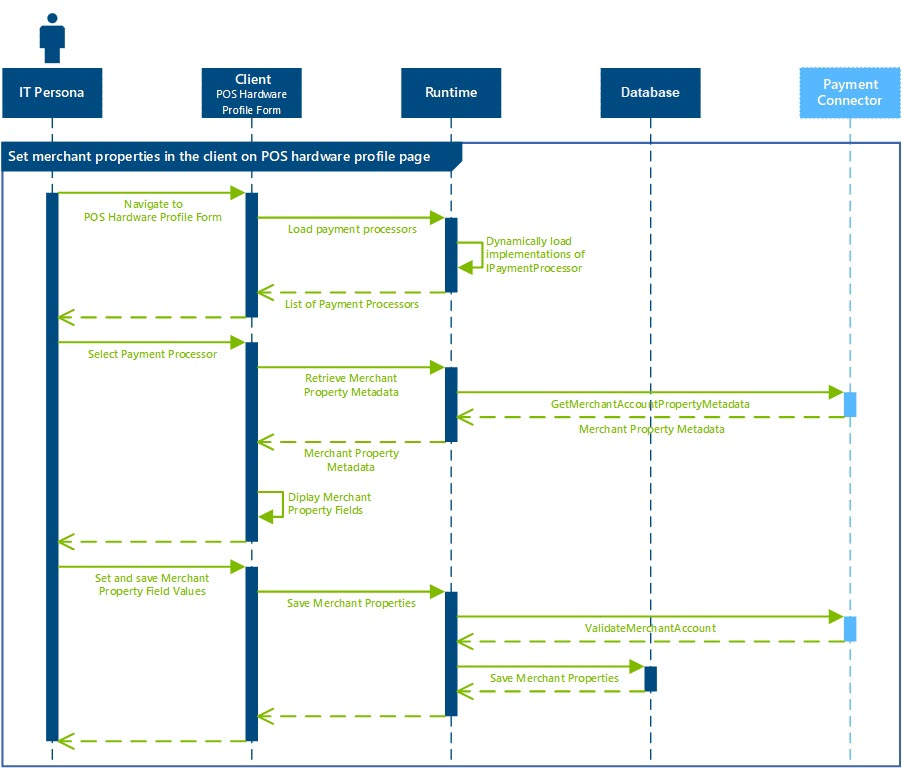
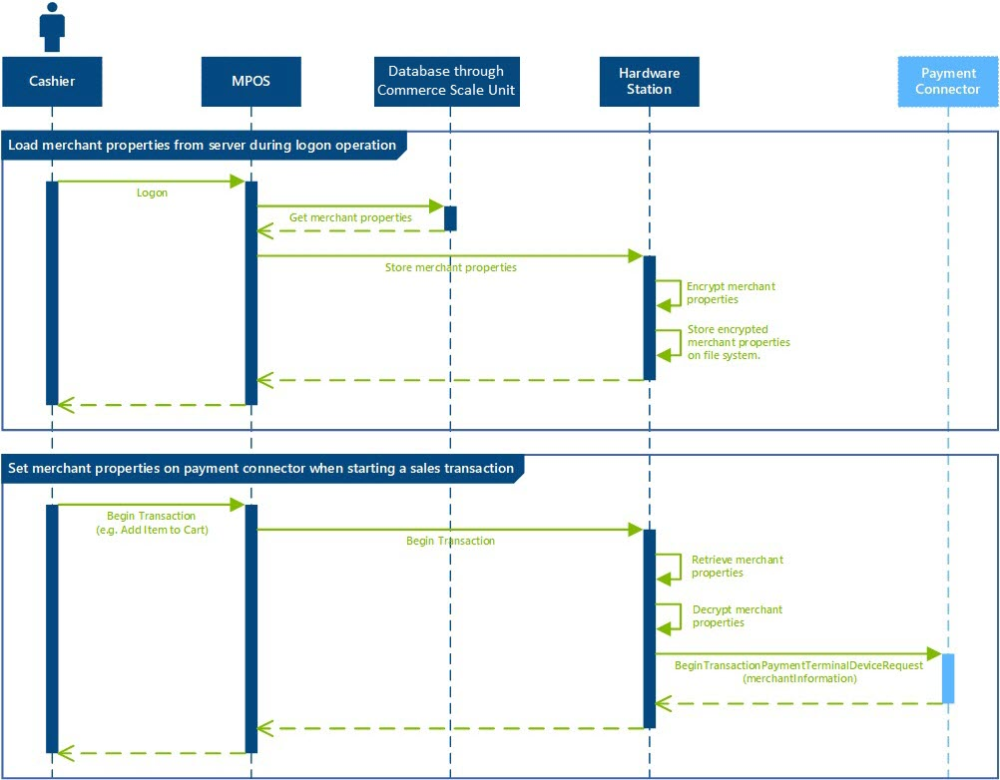

# Create an end-to-end payment integration for a payment terminal

[!include [banner](../../includes/banner.md)]

This article describes how to create an end-to-end payment integration in Microsoft Dynamics 365 Commerce Store Commerce for a payment terminal that can directly communicate with the payment gateway.

## Key terms

| Term | Description |
|---|---|
| Payment connector | An extension library that is written to integrate the POS with a payment terminal. |
| Payment processor | An extension library that is written to retrieve merchant properties that the payment connector uses. |

## Overview
The following illustration shows a high-level overview of the payment terminal integration through the POS. Although this illustration assumes that a local Hardware Station is used to communicate with the payment terminal, the same patterns apply to a shared Hardware Station.



This article describes the following steps that are required to create an end-to-end payment integration for a payment terminal:

- **[Write a payment connector](#write-a-payment-connector):** The payment connector is the main integration point between the POS and the payment terminal. The section for this step describes how to implement and configure a new payment connector that can relay payment requests (for example, authorize, refund, and void requests) to the payment terminal. 
- **[Write a payment processor](#write-a-payment-processor):** The payment processor is used to define the merchant properties that are used as part of the payment integration. The section for this step describes how to implement a new payment processor. It includes information about the interfaces that you should implement and patterns that you should follow.

## Write a payment connector
This section describes how to write a new payment connector.

### Understanding the payment flows
The following illustration shows a high-level overview of several payment flows (Begin Transaction, Update Cart Lines, Authorize, Capture, and End Transaction) across the POS, Hardware Station, and payment connector.



### Implement a payment connector
This section below describes how to implement a new payment connector. The examples that are shown here can be found in the **PaymentDeviceSample** class that is located under the **SampleExtensions\HardwareStation\Extension.PaymentSample** folder in the Retail software development kit (SDK).

#### Implement the INamedRequestHandler interface
All POS payment-related flows are handled through request/response patterns in the Hardware Station. The first step in the process of writing a new payment connector is to create a class that implements the **INamedRequestHandler** interface that is defined in the **Microsoft.Dynamics.Commerce.Runtime.Framework** library.

``` csharp
namespace Contoso.Commerce.HardwareStation.PaymentSample 
{ 
    public class PaymentDeviceSample : INamedRequestHandler
    {
        private const string PaymentTerminalDevice = "MOCKPAYMENTTERMINAL";

        /// <summary>
        /// Gets the specify the name of the request handler.
        /// </summary>
        public string HandlerName
        {
              get
            {
                return PaymentDeviceSample.PaymentTerminalDevice;
            }
        }
    }
}
```

The **HandlerName** string is used to configure the payment connector that is used on a given POS register through the client (see the information later in this article).

#### Implement supported payment requests
To process payment-related flows, the payment connector must define the supported request types that it can handle. Additionally, the **Execute** method must be implemented to route each request that the connector supports to a given method. The following example shows the complete list of supported request types and an example of a specific request (that is, an authorize request).

``` csharp
namespace Contoso.Commerce.HardwareStation.PaymentSample 
{ 
    /// <summary>
    /// <c>Simulator</c> manager payment device class.
    /// </summary>
    public class PaymentDeviceSample : INamedRequestHandler
    {
        /// <summary>
        /// Gets the collection of supported request types by this handler.
        /// </summary>
        public IEnumerable<Type> SupportedRequestTypes
        {
            get
            {
                return new[]
                {
                        typeof(LockPaymentTerminalDeviceRequest),
                        typeof(OpenPaymentTerminalDeviceRequest),
                        typeof(ClosePaymentTerminalDeviceRequest),
                        typeof(BeginTransactionPaymentTerminalDeviceRequest),
                        typeof(EndTransactionPaymentTerminalDeviceRequest),
                        typeof(UpdateLineItemsPaymentTerminalDeviceRequest),
                        typeof(AuthorizePaymentTerminalDeviceRequest),
                        typeof(CapturePaymentTerminalDeviceRequest),
                        typeof(VoidPaymentTerminalDeviceRequest),
                        typeof(RefundPaymentTerminalDeviceRequest),
                        typeof(FetchTokenPaymentTerminalDeviceRequest),
                        typeof(ExecuteTaskPaymentTerminalDeviceRequest),
                        typeof(ActivateGiftCardPaymentTerminalRequest),
                        typeof(AddBalanceToGiftCardPaymentTerminalRequest),
                        typeof(GetGiftCardBalancePaymentTerminalRequest),
                        typeof(GetPrivateTenderPaymentTerminalDeviceRequest),
                        typeof(CancelOperationPaymentTerminalDeviceRequest),
                        typeof(GetTransactionReferencePaymentTerminalDeviceRequest),
                        typeof(GetTransactionByTransactionReferencePaymentTerminalDeviceRequest),
                        typeof(CashoutGiftCardPaymentTerminalRequest)
                };
            }
        }


        /// <summary>
        /// Executes the payment device simulator operation based on the incoming request type.
        /// </summary>
        /// <param name="request">The payment terminal device simulator request message.</param>
        /// <returns>Returns the payment terminal device simulator response.</returns>
        public Response Execute(Microsoft.Dynamics.Commerce.Runtime.Messages.Request request)
        {
            ThrowIf.Null(request, "request");

            Type requestType = request.GetType();

            if (requestType == typeof(AuthorizePaymentTerminalDeviceRequest))
            {
                return this.AuthorizePayment((AuthorizePaymentTerminalDeviceRequest)request);
            }
            else if (...)
            {
                ...
            }

            return new NullResponse();
        }

        /// <summary>
        /// Authorize payment.
        /// </summary>
        /// <param name="request">The authorize payment request.</param>
        /// <returns>The authorize payment response.</returns>
        public AuthorizePaymentTerminalDeviceResponse AuthorizePayment(AuthorizePaymentTerminalDeviceRequest request)
        {
            ThrowIf.Null(request, "request");

            PaymentInfo paymentInfo = Utilities.WaitAsyncTask(() => this.AuthorizePaymentAsync(request.Amount, request.Currency, request.VoiceAuthorization, request.IsManualEntry, request.ExtensionTransactionProperties));

            return new AuthorizePaymentTerminalDeviceResponse(paymentInfo);
        }
    }
}
```

#### Full list of supported request types
The following table describes all supported requests types that a payment connector can implement.

| Request class | Payment flow description |
|---|---|
| OpenPaymentTerminalDeviceRequest | This request is called before a sales transaction is initiated. It is used to establish a connection to the payment terminal. |
| BeginTransactionPaymentTerminalDeviceRequest | This request is called when a new sales transaction is initiated. It is used to handle any initialization on the payment terminal (for example, by initializing the transaction screen). |
| LockPaymentTerminalDeviceRequest | This request is called when a payment terminal is locked for a transaction. |
| UpdateLineItemsPaymentTerminalDeviceRequest | This request is called when line items in the cart are updated. |
| AuthorizePaymentTerminalDeviceRequest | This request is called when a payment is initiated in the POS payment view. |
| CancelOperationPaymentTerminalDeviceRequest | This request is called when a user selects the **Cancel** button in the payment view dialog box after the payment is initiated but before the payment is completed on the payment terminal. |
| CapturePaymentTerminalDeviceRequest | This request is called for each payment line when the whole amount in the cart is paid but before the sales transaction is concluded. |
| VoidPaymentTerminalDeviceRequest | This request is called when a payment line is voided in the cart. |
| RefundPaymentTerminalDeviceRequest | This request is called when a refund is issued. |
| FetchTokenPaymentTerminalDeviceRequest | This request is called to fetch a payment token to support deferred payments for customer orders. |
| EndTransactionPaymentTerminalDeviceRequest | This request is called when the sales transaction is concluded and all payments have been captured. |
| ClosePaymentTerminalDeviceRequest | This request is called after the sales transaction is concluded. It is used to close the connection to the payment terminal. |
| ActivateGiftCardPaymentTerminalRequest | This request is called when an external gift card is being activated through the POS. |
| AddBalanceToGiftCardPaymentTerminalRequest | This request is called when a balance is being added to an external gift card. |
| GetGiftCardBalancePaymentTerminalRequest | This request is called when the balance on the gift card is being retrieved. |
| GetPrivateTenderPaymentTerminalDeviceRequest | This request is called when gift card numbers are retrieved from the payment terminal for gift card flows (for example, Issue gift card, Pay by gift card, or Add to gift card). |
| ExecuteTaskPaymentTerminalDeviceRequest | This extension request can be invoked from the POS through customizations. It is used to enable additional payment-related flows. |
| GetTransactionReferencePaymentTerminalDeviceRequest | This request is called to check the correlation ID. It is used for duplicate payment protection. |
| GetTransactionByTransactionReferencePaymentTerminalDeviceRequest | This request is used to obtain the previous transaction by correlation ID. |
| CashoutGiftCardPaymentTerminalRequest | This request is called when a the cash out gift card operation is executed from the POS. |


##### OpenPaymentTerminalDeviceRequest
###### Signature
``` csharp
public OpenPaymentTerminalDeviceRequest(string token, string deviceName, SettingsInfo terminalSettings, PeripheralConfiguration deviceConfig, ExtensionTransaction extensionTransactionProperties);
```

###### Variables

| Variable | Description |
|---|---|
| token | The unique token value that is generated when the payment terminal is initially locked for the transaction. |
| deviceName | The name of the device, as defined on the **POS hardware profile** page in the client. |
| terminalSettings | The set of payment terminal–specific configuration properties that are defined in the client, such as the minimum amount for signature capture and the debit cash-back limit. |
| deviceConfig | The set of payment terminal–specific configuration properties in the form of name/value pairs, such as the IP address and port in the case of network devices. |
| extensionTransactionProperties | The set of extension configuration properties in the form of name/value pairs. |

##### BeginTransactionPaymentTerminalDeviceRequest
###### Signature
``` csharp
public BeginTransactionPaymentTerminalDeviceRequest(string token, string paymentConnectorName, string merchantInformation, string invoiceNumber, bool isTestMode, ExtensionTransaction extensionTransactionProperties)
```

###### Variables

| Variable | Description |
|---|---|
| token | The unique token value that is generated when the payment terminal is initially locked for the transaction. |
| paymentConnectorName | The name of the payment connector that is used as part of the payment flow. This variable is used if you plan to integrate with payment flows that use the **IPaymentProcessor** interface. |
| merchantInformation | The merchant information that is defined on the **POS hardware profile** page in the client. |
| invoiceNumber | The unique invoice number that the POS generates to track the sales transaction. |
| isTestMode | A value that indicates whether the payment connector is being used in testing mode. |
| extensionTransactionProperties | The set of extension configuration properties in the form of name/value pairs. |

##### LockPaymentTerminalDeviceRequest
###### Signature
``` csharp
public LockPaymentTerminalDeviceRequest(string clientDeviceNumber, string deviceType, string deviceName, bool isExclusive, bool isOverride)
```

###### Variables

| Variable | Description |
|---|---|
| clientDeviceNumber | The unique POS device number that is acquiring the lock. |
| deviceType | The device type that the lock is acquired for as configured in the POS hardware profile (such as "Windows"). |
| deviceName | The device type that the lock is acquired for as configured in the POS hardware profile (such as "MOCKPAYMENTTERMINAL"). |
| isExclusive | Determines whether the lock that is acquired is exclusive. | 
| isOverride | Determines whether this request will override any existing lock. |

##### UpdateLineItemsPaymentTerminalDeviceRequest
###### Signature
``` csharp
public UpdateLineItemsPaymentTerminalDeviceRequest(string token, string totalAmount, string taxAmount, string discountAmount, string subTotalAmount, IEnumerable<ItemInfo> items, ExtensionTransaction extensionTransactionProperties = null)
```

###### Variables

| Variable | Description |
|---|---|
| token | The unique token value that is generated when the payment terminal is initially locked for the transaction. |
| totalAmount | The total amount on the current sales transaction. |
| taxAmount | The tax amount on the current sales transaction. |
| discountAmount | The discount amount on the current sales transaction. |
| subTotalAmount | The subtotal amount on the current sales transaction. |
| items | The list of line items to show. |
| extensionTransactionProperties | The set of extension configuration properties in the form of name/value pairs. |

##### AuthorizePaymentTerminalDeviceRequest
###### Signature
``` csharp
public AuthorizePaymentTerminalDeviceRequest(string token, string paymentConnectorName, decimal amount, string currency, TenderInfo tenderInfo, string voiceAuthorization, bool isManualEntry, Retail.PaymentSDK.Portable.PaymentTransactionReferenceData transactionReferencedata, bool isTippingEnabled, ExtensionTransaction extensionTransactionProperties)
```

###### Variables

| Variable | Description |
|---|---|
| token | The unique token value that is generated when the payment terminal is initially locked for the transaction. |
| paymentConnectorName | The name of the payment connector that is used as part of the payment flow. This variable is used if there is an integration with payment flows that use the **IPaymentProcessor** interface. |
| amount | The amount to authorize. |
| currency | The currency for the amount to authorize. |
| tenderInfo | The card information that is sent from the POS that is retrieved from an external source (if an external source is present). |
| voiceAuthorization | The voice approval code that is sent from the POS if voice authorization is required. |
| isManualEntry | A value that defines whether the card number was entered manually. |
| transactionReferenceData | Merchant's transaction reference that is sent to the processor. |
| isTippingEnabled | Indicates if tipping is supported by the payment connector. Optional. The default value is **false**. |
| extensionTransactionProperties | The set of extension configuration properties in the form of name/value pairs. Optional. The default value is **null**. |


###### Response
The **AuthorizePaymentCardPaymentResponse** response object must be returned when the **AuthorizePaymentTerminalDeviceRequest** request is handled. The response must contain an instance of the **PaymentInfo** object that has the following required properties.

| Property | Description |
|---|---|
| ApprovedAmount | The amount that was approved for the transaction. Includes tip amount if tipping is enabled. |
| CardNumberMasked | The masked credit card number. The value must contain at least the first digit of the credit card to support bin range lookup in the POS. (Most devices return the first six digits and the last four digits.) |
| CardType | The type of card that was used for the payment (for example, **Credit** or **Debit**) by using the **Microsoft.Dynamics.Commerce.HardwareStation.CardPayment.CardType** entity. |
| CashbackAmount | For debit transactions, the cash-back amount that was defined on the payment terminal. |
| Errors | The list of errors that occurred during the authorize call. |
| IsApproved | A flag that indicates whether the payment was approved. |
| PaymentSdkData | The response data that is used to support state between the authorize/refund and capture/void calls or cross-channel payment operations. |
| TipAmount | The tip amount that was selected by the customer on the device. |

The **PaymentSdkData** property must contain the following data.

| Namespace | Name | Description | Sample value |
|---|---|---|---|
| Connector | ConnectorName | The name of the **IPaymentProcessor** interface that is used for the transactions, as described in the "Write a payment processor" section later in this article. |
| AuthorizationResponse | Properties | The list of authorization responses. | See the next table. |

The **Properties** field of the **PaymentSdkData** property must contain the following fields.

| Namespace | Name | Description | Sample value |
|---|---|---|---|
| AuthorizationResponse | ApprovedAmount | The amount that was approved for the transaction. | 28.08m |
| AuthorizationResponse | AvailableBalance | The available balance on the card. | 100.00m |
| AuthorizationResponse | ApprovalCode | The approval code for the transaction. | Z123456 |
| AuthorizationResponse | ProviderTransactionId | The transaction identifier of the payment provider. | 123456789 |
| AuthorizationResponse | AuthorizationResult | The result of the authorization call. | AuthorizationResult.Success.ToString() |
| AuthorizationResponse | ExternalReceipt | The external receipt data from the payment provider. | \<ReceiptData\>...\</ReceiptData\> |
| AuthorizationResponse | TerminalId | The unique identifier of the terminal that handled the payment. | 000001 |

The following example shows how to construct the **PaymentSdkData** object.

``` csharp
List<PaymentProperty> paymentSdkProperties = new List<PaymentProperty>();
paymentSdkProperties.Add(new PaymentProperty(GenericNamespace.Connector, ConnectorProperties.ConnectorName, "TestConnector"));

List<PaymentProperty> paymentSdkAuthorizationProperties = new List<PaymentProperty>();
paymentSdkAuthorizationProperties.Add(new PaymentProperty(GenericNamespace.AuthorizationResponse, AuthorizationResponseProperties.ApprovedAmount, 28.08m));
paymentSdkAuthorizationProperties.Add(new PaymentProperty(GenericNamespace.AuthorizationResponse, AuthorizationResponseProperties.AvailableBalance, 100.00m));
paymentSdkAuthorizationProperties.Add(new PaymentProperty(GenericNamespace.AuthorizationResponse, AuthorizationResponseProperties.ApprovalCode, "Z123456"));
paymentSdkAuthorizationProperties.Add(new PaymentProperty(GenericNamespace.AuthorizationResponse, AuthorizationResponseProperties.ProviderTransactionId, "123456789"));
paymentSdkAuthorizationProperties.Add(new PaymentProperty(GenericNamespace.AuthorizationResponse, AuthorizationResponseProperties.AuthorizationResult, AuthorizationResult.Success.ToString()));
paymentSdkAuthorizationProperties.Add(new PaymentProperty(GenericNamespace.AuthorizationResponse, TransactionDataProperties.TerminalId, "000001"));

paymentSdkProperties.Add(new PaymentProperty(GenericNamespace.AuthorizationResponse, AuthorizationResponseProperties.Properties, paymentSdkAuthorizationProperties.ToArray()));

string paymentSdkData = PaymentProperty.ConvertPropertyArrayToXML(paymentSdkProperties.ToArray());
```

If the payment terminal returns a receipt, you can print it through the POS by setting the following data on the **ExternalReceipt** object that was described earlier.

```xml
<ReceiptData>
    <Receipt Type='Customer'>
        <Line>Line 1 of receipt.</Line>
        <Line>Line 2 of receipt.</Line>
    </Receipt>
    <Receipt Type='Merchant'>
        <Line>Line 1 of receipt.</Line>
        <Line>Line 2 of receipt.</Line>
    </Receipt>
</ReceiptData>
```

###### Other considerations
If the payment terminal handles the authorize and capture requests in a single call (that is, if *immediate capture* occurs), and the cashier wants to void the transaction, the payment terminal must support reversal of an immediate capture. When an immediate capture is voided, if the void request fails, the cashier will be asked whether they want to locally void the payment. If the cashier selects **Yes**, the tender is voided only in the POS. No call is made to the payment terminal to void the payment. Basically, this behavior lets the cashier unblock the POS if it can no longer void the payment on the payment terminal. However, this behavior can cause issues, because a lock lasts for three to five days, until the bank reverses it, but the payment is made for immediate capture. Therefore, duplicate payments can occur.

##### CancelOperationPaymentTerminalDeviceRequest
###### Signature
``` csharp
public CancelOperationPaymentTerminalDeviceRequest(string token)
```

###### Variables

| Variable | Description |
|---|---|
| token | The unique token value that is generated when the payment terminal is initially locked for the transaction. |

##### CapturePaymentTerminalDeviceRequest
###### Signature
``` csharp
public CapturePaymentTerminalDeviceRequest(string token, decimal amount, string currency, string paymentPropertiesXml, ExtensionTransaction extensionTransactionProperties)
```

###### Variables

| Variable | Description |
|---|---|
| token | The unique token value that is generated when the payment terminal is initially locked for the transaction. |
| amount | The amount to capture. |
| currency | The currency for the amount to capture. |
| paymentPropertiesXml | The content of the **PaymentSdkData** object that is returned by the **AuthorizePaymentTerminalDeviceRequest** or **RefundPaymentTerminalDeviceRequest** request, and that is used to support stateful properties between the requests. |
| extensionTransactionProperties | The set of extension configuration properties in the form of name/value pairs. |

###### Other considerations
If the payment terminal handles the authorize and capture requests in a single call, the **CapturePaymentTerminalDeviceRequest** request should be a no-op and should immediately return.

If the payment terminal requires state from the authorize requests to handle the capture call, the properties should be stored in the **PaymentSdkData** object of the **AuthorizePaymentTerminalDeviceResponse** request that is described earlier, and passed through the **paymentPropertiesXml** variable of the **CapturePaymentTerminalDeviceRequest** request.

##### VoidPaymentTerminalDeviceRequest
###### Signature
``` csharp
public VoidPaymentTerminalDeviceRequest(string token, string paymentConnectorName, decimal amount, string currency, TenderInfo tenderInfo, string paymentPropertiesXml, ExtensionTransaction extensionTransactionProperties)
```

###### Variables

| Variable | Description |
|---|---|
| token | The unique token value that is generated when the payment terminal is initially locked for the transaction. |
| paymentConnectorName | The name of the payment connector that is used as part of the payment flow. This variable is used if there is an integration with payment flows that use the **IPaymentProcessor** interface. |
| amount | The amount for the payment to void. |
| currency | The currency for the payment to void. |
| tenderInfo | The card information that is sent from the POS that is retrieved from an external source (if an external source is present). |
| paymentPropertiesXml | The content of the **PaymentSdkData** object that is returned by the **AuthorizePaymentTerminalDeviceRequest** or **RefundPaymentTerminalDeviceRequest** request, and that is used to support stateful properties between the requests. |
| extensionTransactionProperties | The set of extension configuration properties in the form of name/value pairs. |

##### RefundPaymentTerminalDeviceRequest
###### Signature
``` csharp
public RefundPaymentTerminalDeviceRequest(string token, string paymentConnectorName, TenderInfo tenderInfo, decimal amount, string currency, bool isManualEntry, ExtensionTransaction extensionTransactionProperties)
```

###### Variables

| Variable | Description |
|---|---|
| token | The unique token value that is generated when the payment terminal is initially locked for the transaction. |
| paymentConnectorName | The name of the payment connector that is used as part of the payment flow. This variable is used if there is an integration with payment flows that use the **IPaymentProcessor** interface. |
| tenderInfo | The card information that is sent from the POS that is retrieved from an external source (if an external source is present). |
| amount | The amount to refund. |
| currency | The currency for the amount to refund. |
| isManualEntry | A value that defines whether the card number was entered manually. |
| extensionTransactionProperties | The set of extension configuration properties in the form of name/value pairs. |

##### FetchTokenPaymentTerminalDeviceRequest
###### Signature
``` csharp
public FetchTokenPaymentTerminalDeviceRequest(string token, bool isManualEntry, ExtensionTransaction extensionTransactionProperties)
```

###### Variables

| Variable | Description |
|---|---|
| token | The unique token value that is generated when the payment terminal is initially locked for the transaction. |
| isManualEntry | A value that defines whether the card number was entered manually. |
| extensionTransactionProperties | The set of extension configuration properties in the form of name/value pairs. |

##### EndTransactionPaymentTerminalDeviceRequest
##### Signature
``` csharp
public EndTransactionPaymentTerminalDeviceRequest(string token, ExtensionTransaction extensionTransactionProperties)
```

###### Variables

| Variable | Description |
|---|---|
| token | The unique token value that is generated when the payment terminal is initially locked for the transaction. |
| extensionTransactionProperties | The set of extension configuration properties in the form of name/value pairs. |

##### ClosePaymentTerminalDeviceRequest
###### Signature
``` csharp
public ClosePaymentTerminalDeviceRequest(string token, ExtensionTransaction extensionTransactionProperties)
```

###### Variables

| Variable | Description |
|---|---|
| token | The unique token value that is generated when the payment terminal is initially locked for the transaction. |
| extensionTransactionProperties | The set of extension configuration properties in the form of name/value pairs. |

##### ActivateGiftCardPaymentTerminalRequest
###### Signature
``` csharp
public ActivateGiftCardPaymentTerminalRequest(string token, string paymentConnectorName, decimal amount, string currencyCode, TenderInfo tenderInfo, ExtensionTransaction extensionTransactionProperties)
```

###### Variables

| Variable | Description |
|---|---|
| token | The unique token value that is generated when the payment terminal is initially locked for the transaction. |
| paymentConnectorName | The name of the payment connector that is used as part of the payment flow. This variable is used if there is an integration with payment flows that use the **IPaymentProcessor** interface. |
| amount | The initial amount to add to the gift card during activation. |
| currency | The currency for the initial amount to add to the gift card during activation. |
| tenderInfo | The card information that is sent from the POS that is retrieved from an external source (if an external source is present). |
| extensionTransactionProperties | The set of extension configuration properties in the form of name/value pairs. |

##### AddBalanceToGiftCardPaymentTerminalRequest
###### Signature
``` csharp
public AddBalanceToGiftCardPaymentTerminalRequest(string token, string paymentConnectorName, decimal amount, string currencyCode, TenderInfo tenderInfo, ExtensionTransaction extensionTransactionProperties)
```

###### Variables

| Variable | Description |
|---|---|
| token | The unique token value that is generated when the payment terminal is initially locked for the transaction. |
| paymentConnectorName | The name of the payment connector that is used as part of the payment flow. This variable is used if there is an integration with payment flows that use the **IPaymentProcessor** interface. |
| amount | The amount to add to the gift card. |
| currency | The currency for the amount to add to the gift card balance. |
| tenderInfo | The card information that is sent from the POS that is retrieved from an external source (if an external source present). |
| extensionTransactionProperties | The set of extension configuration properties in the form of name/value pairs. |

##### GetGiftCardBalancePaymentTerminalRequest
###### Signature
``` csharp
public GetGiftCardBalancePaymentTerminalRequest(string token, string paymentConnectorName, string currencyCode, TenderInfo tenderInfo, ExtensionTransaction extensionTransactionProperties)
```

###### Variables

| Variable | Description |
|---|---|
| token | The unique token value that is generated when the payment terminal is initially locked for the transaction. |
| paymentConnectorName | The name of the payment connector that is used as part of the payment flow. This variable is used if there is an integration with payment flows that use the **IPaymentProcessor** interface. |
| currency | The currency to retrieve the gift card balance in. |
| tenderInfo | The card information that is sent from the POS that is retrieved from an external source (if an external source present). |
| extensionTransactionProperties | The set of extension configuration properties in the form of name/value pairs. |

##### GetPrivateTenderPaymentTerminalDeviceRequest
###### Signature
``` csharp
public GetPrivateTenderPaymentTerminalDeviceRequest(string token, decimal amount, bool declined, bool isSwipe, ExtensionTransaction extensionTransactionProperties)
```

###### Variables

| Variable | Description |
|---|---|
| token | The unique token value that is generated when the payment terminal is initially locked for the transaction. |
| amount | The amount that is set on the POS. (Typically, this variable is used to show the amount on the payment terminal when the card number is retrieved.) |
| declined | This variable is obsolete. |
| isSwipe | A value that determines whether the card number should be retrieved through a swipe or manual entry on the payment terminal. |
| extensionTransactionProperties | The set of extension configuration properties in the form of name/value pairs. |

##### ExecuteTaskPaymentTerminalDeviceRequest
###### Signature
``` csharp
public ExecuteTaskPaymentTerminalDeviceRequest(string token, string task, ExtensionTransaction extensionTransactionProperties)
```

###### Variables

| Variable | Description |
|---|---|
| token | The unique token value that is generated when the payment terminal is initially locked for the transaction. |
| task | The unique identifier for the task that is being run. |
| extensionTransactionProperties | The set of extension configuration properties in the form of name/value pairs. |

##### GetTransactionReferencePaymentTerminalDeviceRequest
###### Signature
``` csharp
 public GetTransactionReferencePaymentTerminalDeviceRequest(string lockToken, string posTerminalId, string eftTerminalId)
```

###### Variables

| Variable | Description |
|---|---|
| locktoken | Gets the unique lock token that was generated when the payment terminal was initially locked for the transaction. |
| posTerminalId | Gets the POS terminal ID associated with the lock token. |
| extensionTransactionProperties | Gets the EFT terminal ID associated witht the transaction and lock token. |

##### GetTransactionByTransactionReferencePaymentTerminalDeviceRequest
###### Signature
``` csharp
 public GetTransactionByTransactionReferencePaymentTerminalDeviceRequest(string lockToken, Retail.PaymentSDK.Portable.PaymentTransactionReferenceData transactionReferenceData)
```

###### Variables

| Variable | Description |
|---|---|
| locktoken | Gets the unique lock token that was generated when the payment terminal was initially locked for the transaction. |
| Retail.PaymentSDK.Portable.PaymentTransactionReferenceData TransactionReferenceData | Gets reference data for the for payment transactions in case the correlation ID is out of sync. |


##### CashoutGiftCardPaymentTerminalRequest
###### Signature
``` csharp
 public CashoutGiftCardPaymentTerminalRequest(
            string paymentConnectorName,
            decimal amount,
            string currencyCode,
            TenderInfo tenderInfo,
            ExtensionTransaction extensionTransactionProperties)
```

###### Variables

| Variable | Description |
|---|---|
| paymentConnectorName | The name of the payment connector that is used as part of the payment flow. This variable is used if there is an integration with payment flows that use the IPaymentProcessor interface. |
| amount | The amount gift card cash out request. |
| currencyCode | The currency for the gift card cash out request. |
| tenderinfo | The card information that is sent from the POS that is retrieved from an external source (if an external source is present). |
| extensionTransactionProperties | The set of extension configuration properties in the form of name/value pairs. |


#### State in the payment connector
The payment connector can be hosted as part of the dllhost.exe process when it's hosted through the in-process Hardware Station inside the POS. Alternatively, the payment connector can be hosted as a w3wp.exe process when it's hosted in the Hardware Station that is based on Microsoft Internet Information Services (IIS). In some circumstances, both processes can be terminated or stop responding between or during payment flows. Therefore, we recommend that payment connectors not have state dependencies, and that they be able to recover if they are terminated at any point during the payment flow–related requests that are described earlier.

### Configure the payment connector in the Hardware Station config
To help guarantee that the Hardware Station loads the payment connector, you must set the corresponding assembly reference in the **HardwareStation.Extension.config** file that is located in the **Assets** folder in the Retail SDK.

``` xml
<?xml version="1.0" encoding="utf-8"?>
<hardwareStationExtension>
    <composition>
        <!-- 
        Register your own assemblies or types here. The following example registers NewPeripheralDevice 
        (and all its request handlers). Any other services are not being overridden:

        <add source="type" 
            value="Contoso.Commerce.HardwareStation.NewPeripheralDevice, Contoso.Commerce.HardwareStation.NewPeripheralDevice" />
        <add source="assembly" 
            value="Contoso.Commerce.HardwareStation.NewPeripheralDevice” />
        -->
        <add source="assembly" value="Contoso.Commerce.HardwareStation.PaymentSample" />
    </composition>
</hardwareStationExtension>
```

### Configure the payment connector on the POS hardware profile page in the client
To determine the correct payment connector that should be loaded on the POS, you must set the value of the **PaymentTerminalDevice** property in the **Device name** field on the **PIN pad** FastTab of the **POS hardware profile** page in the client, as shown in the following illustration.



## Write a payment processor
Payment processes are usually used only if a direct connection to a payment gateway is established. This scenario most often occurs in card-not-present sales transactions or more complex card-present scenarios. Additionally, the payment processor is used to process the merchant properties that are configured through the **POS hardware profile** page in the client.

> [!NOTE]
> The payment processor is currently required, even if all payment requests are handled directly through the payment terminal and no merchant properties must be set through the POS. For more information about implementing the **IPaymentProcessor** interface, read the [Implementing a payment connector and payment device](https://download.microsoft.com/download/e/2/7/e2735c65-1e66-4b8d-8a3c-e6ef3a319137/The%20Guide%20to%20Implementing%20Payment%20Connector%20and%20Payment%20Device_update.pdf) white paper.

### Understanding the merchant properties flows
The following sections describe how the merchant properties are set on the **POS hardware profile** page in the client, and how they are passed to the payment connector during payment flows on the POS.

#### Set merchant properties on the POS hardware profile page in the client
The following illustration shows how the merchant properties are set through the **POS hardware profile** page in the client. To enable the merchant properties to be set, the **IPaymentProcessor** interface that is defined in the **Microsoft.Dynamics.Retail.PaymentSDK** library must be implemented. Two interface methods are required: **GetMerchantAccountPropertyMetadata** and **ValidateMerchantAccount**.



#### Set merchant properties on payment connector during POS sales transaction
The following illustration shows how the merchant properties are retrieved from the database through the Commerce Scale Unit and passed to the payment connector during the **BeginTransactionPaymentTerminalDeviceRequest** request.



### Implement the IPaymentProcessor interface
To handle merchant properties that are related to payment flows, the **IPaymentProcessor** interface that is defined in the **Microsoft.Dynamics.Retail.PaymentSDK** library must be implemented. The following example shows how to implement the two required interface methods, **GetMerchantAccountPropertyMetadata** and **ValidateMerchantAccount**. Other interface methods can be left blank (for example, they can return **FeatureNotSupportedException**).

``` csharp
/// <summary>
/// SampleConnector class (Portable Class Library version).
/// </summary>
public class SampleConnector : IPaymentProcessor
{
    /// <summary>
    /// GetMerchantAccountPropertyMetadata returns the merchant account properties need by the payment provider.
    /// </summary>
    /// <param name="request">Request object.</param>
    /// <returns>
    /// Response object.
    /// </returns>
    public Response GetMerchantAccountPropertyMetadata(Request request)
    {
        string methodName = "GetMerchantAccountPropertyMetadata";

        // Check null request
        List<PaymentError> errors = new List<PaymentError>();
        if (request == null)
        {
            errors.Add(new PaymentError(ErrorCode.InvalidRequest, "Request is null."));
            return PaymentUtilities.CreateAndLogResponseForReturn(methodName, this.Name, Platform, locale: null, properties: null, errors: errors);
        }

        // Prepare response
        List<PaymentProperty> properties = new List<PaymentProperty>();
        PaymentProperty property;
        property = new PaymentProperty(
            GenericNamespace.MerchantAccount,
            MerchantAccountProperties.AssemblyName,
            this.GetAssemblyName());
        property.SetMetadata("Assembly Name:", "The assembly name of the test provider", false, true, 0);
        properties.Add(property);

        Response response = new Response();
        response.Locale = request.Locale;
        response.Properties = properties.ToArray();
        if (errors.Count > 0)
        {
            response.Errors = errors.ToArray();
        }

        PaymentUtilities.LogResponseBeforeReturn(methodName, this.Name, Platform, response);
        return response;
    }

    /// <summary>
    /// ValidateMerchantAccount the passed merchant account properties with the payment provider.
    /// </summary>
    /// <param name="request">Request object to validate.</param>
    /// <returns>
    /// Response object.
    /// </returns>
    public Response ValidateMerchantAccount(Request request)
    {
        string methodName = "ValidateMerchantAccount";

        // Convert request
        ValidateMerchantAccountRequest validateRequest = null;
        try
        {
            validateRequest = ValidateMerchantAccountRequest.ConvertFrom(request);
        }
        catch (SampleException ex)
        {
            return PaymentUtilities.CreateAndLogResponseForReturn(methodName, this.Name, Platform, locale: request == null ? null : request.Locale, properties: null, errors: ex.Errors);
        }

        // Validate merchant account
        List<PaymentError> errors = new List<PaymentError>();
        ValidateMerchantProperties(validateRequest, errors);
        if (errors.Count > 0)
        {
            return PaymentUtilities.CreateAndLogResponseForReturn(methodName, this.Name, Platform, validateRequest.Locale, errors);
        }

        // Create response
        var validateResponse = new ValidateMerchantAccountResponse(validateRequest.Locale, validateRequest.ServiceAccountId, this.Name);

        // Convert response and return
        Response response = ValidateMerchantAccountResponse.ConvertTo(validateResponse);
        PaymentUtilities.LogResponseBeforeReturn(methodName, this.Name, Platform, response);
        return response;
    }
}
```

#### Required merchant property fields
The following table shows the required merchant property fields that must be set as part of the **GetMerchantAccountPropertyMetadata** method.

| Namespace | Name | Sample value\* |
|---|---|---|
| MerchantAccount | PortableAssemblyName | Contoso.Microsoft.PaymentsSample |
| MerchantAccount | ServiceAccountId | f35989c8-e571-4de1-862a-996c82a2e6b6 |
| MerchantAccount | SupportedCurrencies | AUD;BRL;CAD;CHF;CNY;CZK;DKK;EUR;GBP;HKD;HUF;INR;JPY;KPW;KRW;MXN;NOK;NZD;PLN;SEK;SGD;TWD;USD;ZAR |
| MerchantAccount | SupportedTenderTypes | Visa;MasterCard;Amex;Discover;Debit |

\* You **must** replace the sample values in this column with unique values for your own payment processor.


[!INCLUDE[footer-include](../../includes/footer-banner.md)]
