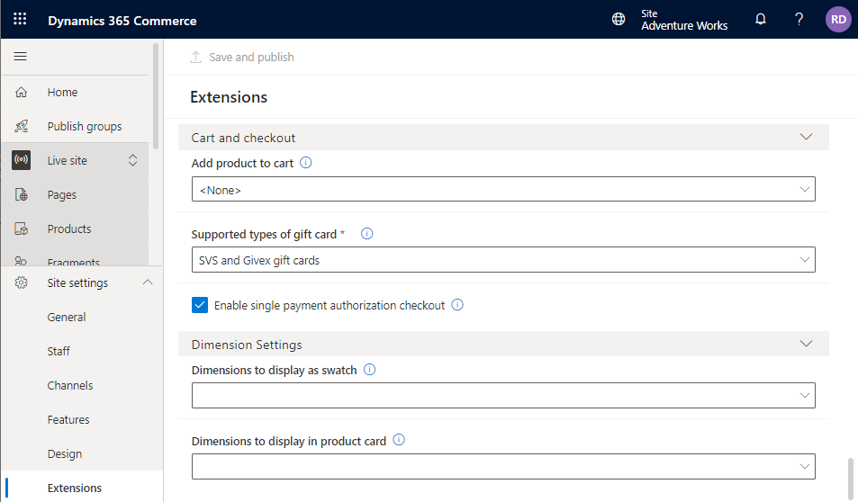
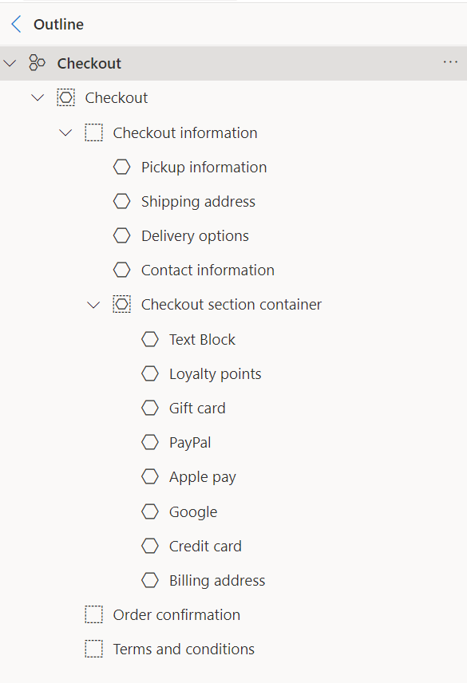

# Enhanced payments in storefront checkout

[!include [banner](../includes/banner.md)]

This article provides an overview of enhanced strong customer authentication (SCA) support for storefront checkout in Microsoft Dynamics 365 Commerce.

## Key terms

| Term | Description |
|---|---|
| SCA | Strong customer authentication enables a cardholder's identity to be verified by the bank that issued the card when an online purchase is attempted. This process is typically completed via a redirect from the storefront checkout flow to a page that is hosted by the card's issuing bank. There, the cardholder's identity is verified. The cardholder is then directed back to the storefront checkout flow, where the order proceeds through checkout. |
| Redirect | The action of moving an online shopper's browsing session out of the context of the merchant's storefront. |
| Card token | An alias that is used to refer to a real payment card number. Card tokens enable a reference to an actual payment card to be saved. At the same time, they help prevent the security issues that can occur when real payment card numbers are saved. |

Traditionally, the storefront checkout process made two distinct calls to the payment processor. The first call was used to tokenize the card number that was entered in the payment processor's embedded HTML iFrame element during checkout. During this call, SCA was also enabled, so that the cardholder could be authenticated with the card's issuing bank as required. The second call used the card token that was obtained from the first call to request the actual authorization response.

This two-call method for acquiring payment authorizations wasn't ideal for all cases, for the following reasons:

- The first call used a zero-amount authorization request to request the payment token. However, not all payment processors support zero-amount authorization requests.
- Because SCA was done during the first call, the liability shift that SCA granted was evident only in the tokenization request, not in the actual authorization request.

Aside from technical issues, the traditional storefront checkout process also caused confusion for merchants, because they saw many zero-amount requests when they reviewed payment processing activity.

To address these issues, payments in Commerce storefront checkout have been refactored so that they require only a single request. This single request performs all the necessary functions that are related to payment processing:

- It obtains a card token, if card tokens are supported, in case the authorization expires and a new authorization is required for fulfillment.
- It supports SCA during the actual authorization request. Therefore, the liability shift is evident in the authorization for the amount due.

## Key changes from the traditional storefront checkout flow

### No order review step

After the payments flow is initiated, there's no step to review and submit the order. After payment details are entered, customers have only the **Place order** option. If the payment method that was provided requires SCA, customers are redirected to the bank's authentication page. After authentication is completed, customers are directed back to the checkout page, and the order is processed.

The flow that was just described also applies to payment methods that redirect by default, such as PayPal. After payment details are provided to PayPal, the redirect back to the checkout page initiates order placement.

In the traditional flow, after the payment details were entered in the embedded iFrame element, a **Save and continue** button became available. When the customer selected this button, the tokenized payment was added to the checkout. In demonstration environments, there could also be a step that either collected the customer's email address or had the customer agree to terms of use. In the new flow, the validation that was previously done when the customer selected the final **Save and continue** button is now done when the customer selects the **Place order** button. Therefore, one fewer click is required on the customer's part, and a page load is eliminated from the checkout flow.

## Payment connector support

By default, the out-of-box payment connectors for Adyen and PayPal support the enhanced payment flows during checkout.

> [!IMPORTANT]
> - Only Adyen connector versions **V002** and **V003** support enhanced SCA.
> - Because of SCA requirements that went into effect in the European Union (EU) on January 1, 2021, version **V001** of the Adyen connector should no longer be used. For information about how to configure the Adyen connector to use versions **V002** or **V003**, see [Set up a processor for new credit cards](adyen-connector-setup.md#set-up-a-processor-for-new-credit-cards).

## Enable enhanced payments in storefront checkout in Commerce site builder

To enable the enhanced payments feature in Commerce site builder, follow these steps.

1. In the site that you want to edit, expand **Site settings**.
2. Select **Extensions**.
3. Scroll down to **Cart and checkout**, and select the **Enable single payment authorization checkout** checkbox.
4. Select **Save and publish**.

## Checkout module placement

Due to a change in the way the checkout flow places the order when SCA is enabled, the checkout section container on your checkout page should be the last module in the **Checkout information** module node. 

A common setup for the checkout information module block when using SCA places modules in the following order:

- **Pickup information**
- **Shipping address**
- **Delivery options**
- **Contact information**
- **Checkout section container** (which includes text block, loyalty points, gift card, payment(s), and billing address modules within it)

## Additional resources

[Payments FAQ](payments-retail.md)

[Dynamics 365 Payment Connector for PayPal](../paypal.md)

[Dynamics 365 Payment Connector for Adyen](adyen-connector.md)

[Adyen redirect](../adyen_redirect.md)

[!INCLUDE[footer-include](../../includes/footer-banner.md)]
