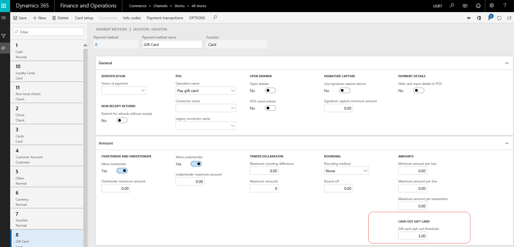
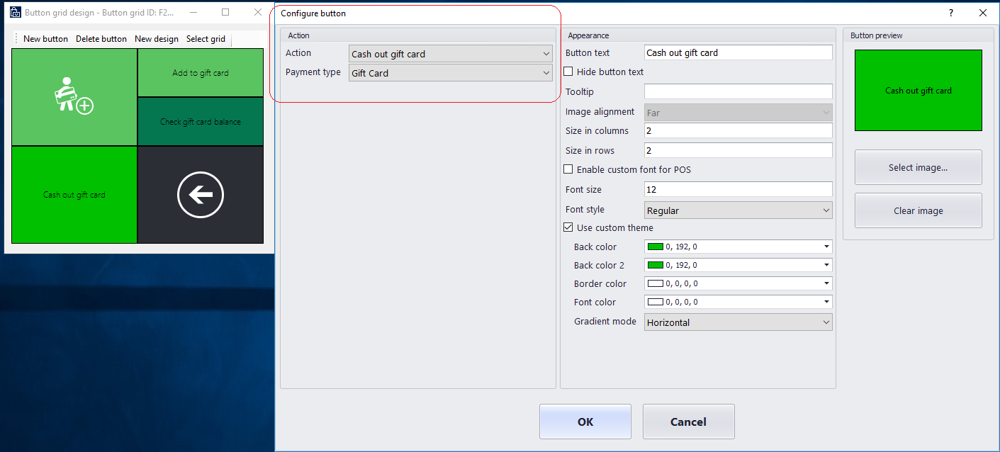
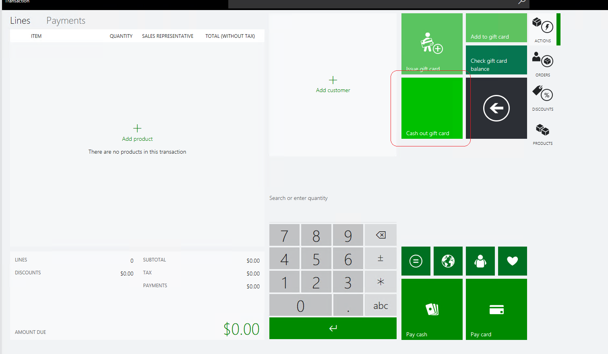

---
# required metadata

title: Cash out gift card balance for a retail customer
description: This topic provides information about the cash out gift card functionality that is available in Microsoft Dynamics 365 Commerce.
author: rapraj
ms.date: 02/08/2019
ms.topic: article
ms.prod:
ms.technology: 

# optional metadata

# ms.search.form: 
# ROBOTS: 
audience: IT Pro
ms.devlang: 
ms.reviewer: tfehr
# ms.tgt_pltfrm: 
ms.custom: 
ms.assetid: 
ms.search.region: Global
ms.search.industry: retail
ms.author: rapraj
ms.search.validFrom: 2019-10-02
ms.dyn365.ops.version: Dynamics 365 10.0
---

# Cash out gift card balance for a retail customer

[!include [banner](../../includes/banner.md)]

This topic provides an overview of the cash out gift card feature for the Dynamics 365 Retail Modern POS (MPOS). 

The purpose of the cash out feature is to allow cashiers to cash out the remaining amount on a gift card. Retailers often need to exchange a low balance gift card for cash at the customer's request. 

## Prerequisites
- The payment connector and corresponding payment gateway or processor must support the feature. The *payment connector* is an extension which facilitates communication between Dynamics 365 Commerce (and associated components) and a payment service. The connector described in this topic was implemented using the standard payments SDK.
- If the gift cards are external gift cards, the external gift card must be configured for both the Headquarters and the POS. Before the gift card can be configured, the retailer must have an account with an external gift card service provider.

## Scenarios
The cash out gift card feature is applicable to a scenario where, for example, in Washington state, the cash out threshold is $5. Retailers in this case will have the option to set up an operation to cash out a gift card and set the gift card balance limits under which the cash out operation can be enabled.

## Configure Headquarters

1. Open the **All stores** page.
2. In the list, select the **Houston** store.
3. On the **Action Pane**, select **Set up** &gt; **Payment methods**.
4. Search for **payment methods** to open the **Payment methods** page.
5. Select the **Gift Card** payment method, and then follow these steps:

    1. In the **Amount** FastTab section, select the **Cash Out Gift Card** field.
    2. In the **Cash Out Gift Card** field, enter the **Gift card Cash out threshold** amount.
    3. Select **Save**.

    

6. Open the **Button grid** page.
7. In the navigation bar on the left side of the page, search for **F2S1M**, and select the filtered option.
8. On the **Action Pane**, select **Designer** to download the button designer application.
9. When the grid designer appears, right-click on an empty (gray) area, and then select **New button**.

    

10. Right-click the new button, and then select **Button properties**.
11. Set the **Action**, **Cash out gift card**, and **Text on button** properties according to the following matrix.

    | Action            | Payment type       | Text on button        |
    |-------------------|--------------------|-----------------------|
    |Cash out gift card |     Gift Card      | Cash out gift card    |

    When you've finished, your button layout should resemble the following illustration.

    

12. Click **Ok** and close the designer.
13. Search for **Distribution Schedule**.
14. In the navigation bar on the left side of the page, search for **1090**, **1115**, and **1070**.
15. On the **Action Pane**, select **Run now**.
16. Check the status of the job by searching for **Download sessions**.
17. Wait until **Applied** appears next to all the jobs, and then close the browser.

## Configure and test Retail Modern POS

1. Start the Retail Modern POS (MPOS) application.
2. Sign in by using the standard credentials.
3. When you're prompted, select **Perform a non-drawer operation**.
4. On the main screen, select **Select hardware station**.
5. On the bar on the right side of the page, select **Manage**.
6. Turn on **Virtual Peripherals**, and then select **OK**.
7. In the **Available paired stations** field, select **Virtual Peripherals**.
8. You're prompted to either open a new shift or perform non-drawer operations. You can now open a new shift.
9. On the main screen, select **Current transaction**.
10. Select **Gift cards**.
11. Select **Cash out gift card**.
12. Enter or scan the gift number.
13. The line for **gift card cash out** will be added to the **Current transaction** for cash out.
14. Select the **Cash** payment method and the drawer will open when the transaction is completed. 

       

## Troubleshooting 

For all general issues, you should always consult the Modern POS or IIS Hardware Station event logs. The logs can be found under these nodes in the Windows event log:
  - **Application and Services Logs > Microsoft > Dynamics > Commerce-ModernPOS**
  - **Application and Services Logs > Microsoft > Dynamics > Commerce-Hardware Station**

[!INCLUDE[footer-include](../../includes/footer-banner.md)]