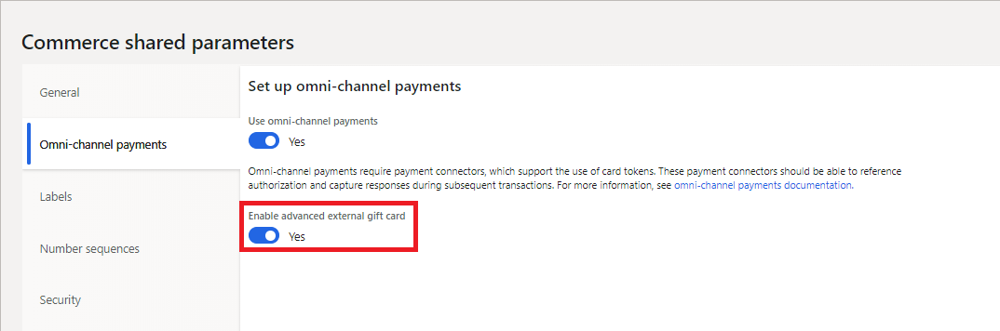

---
# required metadata

title: Support for external gift cards
description: This topic provides information about the support for external gift cards that is now available in Microsoft Dynamics 365 Commerce.
author: sericks007
manager: AnnBe
ms.date: 02/03/2020
ms.topic: article
ms.prod:
ms.service: dynamics-365-retail
ms.technology: 

# optional metadata

# ms.search.form: 
 # ROBOTS: 
audience: Developer
ms.devlang: 
ms.reviewer: rhaertle
ms.search.scope: Operations, Retail
# ms.tgt_pltfrm: 
ms.custom: 
ms.assetid: 
ms.search.region: Global
ms.search.industry: retail
ms.author: ivanv
ms.search.validFrom: 2017-10-02
ms.dyn365.ops.version: Application update 4
---

# Support for external gift cards

[!include [banner](../../includes/banner.md)]

This article describes setup steps for enabling external gift cards in the Modern POS, Call Center and Storefront.

      > [!NOTE]
      > External gift card support for Call Center is new for 10.0.10. Support for external gift cards in the Storefront will be added in a future version. 

Microsoft Dynamics 365 Commerce supports both "internal" and "external" gift cards. Internal gift cards are entirely managed from within Dynamics 365 Commerce, while external gift cards are administered by a third party. If a retailer's operations are entirely run within Dynamics, then sometimes internal gift cards are the best solution. For complex enterprises that span multiple geographies and point of sale systems, it is often best to use a third party to manage gift card balances and to allow gift cards to be used across those systems.

Similar to other card payment types, external gift card support must be built into the payment connector in use. The out of box payment connector for Adyen supports external gift cards through SVS and Givex through the POS, call center, and e-commerce storefront.

## External gift card setup

      > [!NOTE]
      > Some setup steps assume demo data is in use. Steps may vary depending depending on dataset in use.

### Card Types

1. Search for **Card Types** 
2. Click **New**, add the following values, and then click **Save**:

| Field Name     | Value              |
|----------------|--------------------|
| Card ID        | EXTGC              |
| Card type name | External Gift Card |
| Card types     | Gift card          |
| Card issuer    | *Any description*  |

### Card Numbers

1. Without navigating from the card types form, select the newly created gift card, then click **Card numbers**.
2. Provide the card number range to be used for external gift cards and click **Save**.

| Field Name         | Value              |
|--------------------|--------------------|
| Card number from   | 6000               |
| Card number to     | 6999               |
| Digits to identify | 4                  |

In this example, any gift card with the first 4 digits of **6036** will map to the gift card set up in the **Card types** section.

### Payment Methods

1. Search for **Payment methods** to open the **Payment methods** page.
2. Click **New**, and then follow these steps:

    1. In the **Payment method** field, enter **12**.
    2. In the **Payment method name** field, enter **External Gift Card**.
    3. In the **Default function** field, select **Card**.
    4. Select **Save**.

## Store setup

1. Open the **All stores** page.
2. In the list, select the **San Francisco** store.
3. On the Action Pane, click **Set up** &gt; **Payment methods**.
4. Click **New**.
5. In the **Payment method** field, enter **12**. The **Payment method name** and **Function** fields should then be set automatically.
6. On the **General** FastTab, set the following fields:

    - Set the **Operation name** field to **Pay gift card**.
    - Set the **Connector name** field to **TestConnector**.

9. On the **Posting** FastTab, set the **Gift card item number** field to **0010**.

    

10. Click **Save**.
11. Click **Card setup** and click **New** to map the gift card payment method to the newly created external gift card payment method for the San Francisco store.

## POS setup

1. In Dynamics 365 Commerce Headquarters, search for **Hardware profiles** to open the **POS hardware profile** page.
2. On the **POS hardware profile** page, follow these steps:

   1. On the navigation bar on the left side of the page, select **Virtual**.
   2. Select **Edit**.
   3. On the **EFT service** FastTab, in the **Connectors** grid, select the first entry, **TestConnector**.
   4. In the **Supported Tender Types** field, add **GiftCard**.

       

   5. Select **Save**.

      > [!NOTE]
      > You can also use the **New** button to create multiple payment connectors. In this way, you can take advantage of the support for multiple connectors that has been added to the solution. You can then have different payment connectors for different payment methods. For example, all credit cards can be processed through one connector, but the gift card can be processed through a different connector.
      
### Update button grid

1. Go to the **Button grid** page.
2. In the navigation bar on the left side of the page, search for **F2S1M**, and select the filtered option.
3. On the Action Pane, click **Designer** to download the button designer application.
4. When the grid designer appears, right-click on an empty (gray) area, and then click **New button**.

    

5. Right-click the new button, and then select **Button properties**.
6. Set the **Action**, **Payment type**, and **Text on button** properties according to the following matrix.

    | Action            | Payment type       | Text on button        |
    |-------------------|--------------------|-----------------------|
    | Issue gift card   | External Gift Card | Ext Issue gift card   |
    | Add to gift card  | External Gift Card | Ext Add to gift card  |
    | Gift card balance | External Gift Card | Ext Gift card balance |
    | Pay gift card     | External Gift Card | Ext Pay gift card     |

    When you've finished, your button layout should resemble the following illustration.

    

7. Close the designer.
8. Search for **Distribution Schedule**.
9. In the navigation bar on the left side of the page, search for **1090**, **1115**, and **1070**.
10. On the Action Pane, click **Run now**.
11. Check the status of the job by searching for **Download sessions**.
12. Wait until **Applied** appears next to all the jobs, and then close the browser.

    > [!NOTE]
    > If you are using Retail Commerce Scale Unit (RCSU) that is located in the store, you need to perform an IIS rest to clear the cache. You can either do this through the IIS application or open an admin Command Prompt window and enter `iisreset`. Otherwise, wait for the RCSU to be updated.

## Update merchant properties

As of 10.0.6, this step is no longer required.

1. In File Explorer, go to **C:\\Program Files (x86)\\Microsoft Dynamics 365\\70\\Retail Hardware Station\\ConfigurationUtility**.
2. Run the **HardwareStationConfigurationUtility** executable program.
3. Configure the utility by entering the correct Commerce Scale Unit URL, and then select **Install**.
4. To verify that the download was successful, go to **C:\\ProgramData\\Microsoft Dynamics AX\\Retail Hardware Station**, and look at the timestamp of the **MerchantInformation.xml** file. It should be very recent.

## Configure and test Modern POS

1. Start the Modern POS (MPOS) application.
2. Sign in by using the standard credentials.
3. When you're prompted, select **Perform a non-drawer operation**.
4. On the main screen, select **Select hardware station**.
5. On the bar on the right side of the page, select **Manage**.
6. Turn on **Virtual Peripherals**, and then select **OK**.
7. In the **Available paired stations** field, select **Virtual Peripherals**.
8. You're prompted to either open a new shift or perform non-drawer operations. You can now open a new shift.
9. On the main screen, select **Current transaction**.
10. Select **Gift cards**.
11. Select **Ext Issue gift card**.
12. Enter a number that starts with **9**, and then provide an amount.
13. After items are added to the cart, you can pay by using cash or a card.

When using the test connector to demonstrate external gift card support, the card number **61234** should be used to make payments. PIN will not be prompted in POS when using the test connector. The test connector should **NEVER** be used in Production.

## External gift cards for Call Center and Storefront

Note: This feature is new for 10.0.9 and must be enabled through the **Omni-channel payments** tab in **Commerce shared parameters**. Support for gift cards in the out of box storefront will come in a future release. **Use omni-channel payments** should also be enabled. 

### Tokenization

The out of box implementation and payments SDK support for external gift cards in Call Center and Storefront requires tokenization. External gift cards issued and managed through the back office do not include the full gift card number in the UI and it is not written to the database. 

Where an external gift card number is saved for later reference. For example, on an order line, the gift card number will always be masked. When processing external gift cards, tokens are utilized to reference the actual gift card number. 

### Purchases and refunds

When an external gift card is used for a purchase, the tender line for the gift card is saved as a prepayment. This means that the funds for the purchase are captured at the time of order creation. 

External gift cards are not eligible for refund. This partly to prevent refunding to a gift card that has been discarded by the user. If an unprocessed order includes an external gift card as payment and the customer wishes to cancel the order, a new gift card or some other form of credit must be issued to the customer.  

Gift cards lines which are being issued as part of an order may be cancelled prior to fulfillment. 

### Issuing through fulfillment

Physical gift cards and virtual gift cards have distinct fulfillment methods. Physical gift cards, or those that map to a shipping type mode of delivery, must be issued directly with the gift card provider as part of order processing. The gift card number must then be mapped to the order line as part of the pick list registration process, upon completion the masked gift card number is saved back to the order line. The issued gift card is then activated as part of order invoicing.  

Virtual gift cards are issued as part of order invoicing. When a gift card line is marked as "Packed", it becomes eligible for issuance. Issuance of virtual gift cards occurs as part of invoicing. Upon invoicing, the gift card number is obtained from the provider through the payment connector. The number for the activated gift card is then sent to the gift card recipient via email. Upon invoicing, the masked gift car number is then saved back to the order line. 

### Using modes of delivery for gift card products in Call Center and e-Commerce

The Call center and Storefront channels are different from POS in that gift cards are issued by adding a line item to a transaction, instead of by using a dedicated operation. Specifically, gift card products for e-commerce and call center can be mapped to product variants or modeled as standard products. 

If product variants are used, the person creating the gift card order will be prompted to select the variant. That product variant will then have its own relevant appliable mode of delivery available.

Modes of delivery must support the type of gift card. For example, a gift card product variant of style "Physical" must be mapped to a mode of delivery related to shipping, and a gift card product variant of style "e-mail" must be mapped to an electronic mode of delivery. 

The electronic mode of delivery is defined on the **Customer orders** tab in **Commerce parameters**. 

## Setup for Call Center and Storefront

#### Payment services setup
In the back office, navigate to **Payment services** and configure the payment services account for the Call Center. Each payment connector will have different setup steps. The payment service used by the call center is the one marked as "Default" in the payment services setup. 

###### Adyen external gift card setup

For an example of how to set up payment services, visit the [documentation for the Adyen payment connector](https://docs.microsoft.com/en-us/dynamics365/retail/dev-itpro/adyen-connector?tabs=8-1-3).

For Call Center and Storefront, the following gift cards are supported by the Adyen connector:

    | Brand   | Gift card type   | Supported | Activation      |
    |---------|------------------|-----------|-----------------|
    | SVS     | Physical         | Yes       | Manally         |
    | SVS     | Email            | Yes       | Programatically |
    | Givex   | Phsycal          | Yes       | Manually        |

   > [!NOTE]
   > In the out of box Adyen connector, gift card is configured by default. Follow instructions in the above linked documentation for specifying the gift card provider in the merchant properties of the payment connector. 

##### Test connector external gift card setup

To set up external gift cards for the test connector, select **Dyn Online** and in the **Supported Tender Types** field add *;GiftCard* after *Debit*. Next click **Credit card types** and assign a payment journal to the gift card payment method.
  
#### Gift card product setup

The following steps illustrate how to set up an external gift card using product masters. Product masters are not required for external gift cards, but can be helpful when both physical and email gift cards are in use. 

1. Navigate to **Style group** and click **New**.
2. Provide a name and description such as **Gift** and **Gift card style group**.
3. Add styles to suit the types of gift cards available, such as **Physical** and **Email**, then save.
3. Navigate to **Product masters** and click **New**. 
4. Provide a product number such as **Gift**, assign a retail category and for the **Product dimension group** select **Style**, then click **OK**.
5. On the product master, select the style group **Gift** created in step 2.
6. Select **Product** &gt; **Dimension groups** and assign the **Storage dimension group** and **Tracking dimension group**, then click **Save**.
7. Click **Product variants**, then **Variant suggestions**, edit the gift card variant numbers as needed and click **Create**.

8. Click **Release products**, click **Next**, click **Next**, select a company such as **USRT**, then click **Next**, and finally **Next** to release the product master.  
9. Navigate to **Modes of delivery**. Select the **Electronic** mode of delivery and add the **Email** gift card variant. Ensure that applicable call centers and online channels are included. 

10. Select a shipping mode of deliver and add the **Physical** gift card variant and **Save**.
11. Navigate to **Process delivery modes** and click **OK**.

   > [!NOTE]
   > Gift cards are not currently supported for MPOS customer order creation or for pickup in store.

12. Navigate to **Released products by category** and select the external gift card item. 
13. Assign the following attributes:
   
    | Fasttab           | Field               | Value                 |
    |-------------------|-------------------- |-----------------------|
    | General           | Item model group    | MA_Retail             |   
    | Purchase          | Purchase order unit | ea                    |
    | Sell              | Sales order unit    | ea                    |
    | Sell              | Allow price adjust  | Yes                   |
    | Manage inventory  | Inventory unit      | ea                    |
    | Manage costs      | Posting item group  | Any                   |

14. Click **Save**

For Storefront, the gift card must also be included in the Storefront's assortment. For details, visit the (Assortment management)[https://docs.microsoft.com/en-us/dynamics365/commerce/assortments]topic.

#### Setup notification emails for virtual gift cards

For information related to email setup, visit (Configure email functionality)[https://docs.microsoft.com/en-us/dynamicsax-2012/appuser-itpro/configure-email-functionality-in-microsoft-dynamics-ax].

To set up email notifications for retail, vist the (email notification profile article)[https://docs.microsoft.com/en-us/dynamics365/commerce/email-notification-profiles].

The **Retail email notification type** for gift cards issued via email is **Issue gift card**.

#### Call Center setup

1. Navigate to **All call centers** 
2. In the list, select a call center.
3. On the Action Pane, select **Channel** &gt; **Channel users**, then add a user and click **Save**, then close the channel users form. Users must be call center users when accessing **Customer service** and creating orders for Call Center capabilities to be enabled. 
4. Back on the Call Center form, select **Set up** &gt; **Payment methods**.
4. Select **New**.
5. In the **Payment method** field, enter **12**. The **Payment method name** and **Function** fields should then be set automatically.
6. On the **General** fasttab, select the connector to be used for the external gift card. 
7. Click **Card setup** and click **New** to map the gift card payment method to the external gift card payment method.
11. Expand the **Posting** fasttab and specify general ledger accounts for the external gift cards. In demo data, **112140** can be used for general ledger account number. 
11. Click **Save**, then click **Card setup**.
12. Click **New** and select the external gift card previously created and click **Save**.
13. Close the **Card setup** page and refresh the payment methods page.
14. Select the external gift card payment method and assign the **TestConnector* under **Gift card account**.
15. On the **Posting** fasttab, assign the gift card item number.
16. Click **Save**, then click **Card setup**.
17. The **Card setup** page for the internal gift card page will now provide the additional configuration parameters **Check expiration date** and **PIN required**. Set those as required by the external gift card provider.

#### Issuing in call center

1. As a Call Center user, navigate to **Customer Service**.
2. Add a customer using the **Search** function.
3. Click **New sales order**
4. 
## Troubleshooting 

### Issue: An error occurs when you start the HardwareStationConfigurationUtility program

1. From an elevated command prompt, open the **HardwareStationConfigurationUtility.exe.config** file in Notepad.
2. In the file, follow these steps:

    1. Replace the **DataServiceUrl** value with the correct Commerce Scale Unit URL.
    2. Verify that the **AADLogonUrl** value is correct.

3. Save and close the file.
4. Restart the utility.

### Issue: A token error occurs when you try to pair virtual peripherals

1. Exit MPOS.
2. Go to **C:\\Program Files (x86)\\Microsoft Dynamics 365\\70\\Retail Hardware Station\\Package**.
3. From an elevated command prompt, open the **Web.config** file in Notepad.
4. Replace the **RetailServer** value with the correct Commerce Scale Unit value.
5. Save and close the file.
6. Restart MPOS.
7. If the issue persists, exit MPOS, use Task Manager to end any instances of dllhost.exe that are running, and then do another reset of Internet Information Services (IIS).
