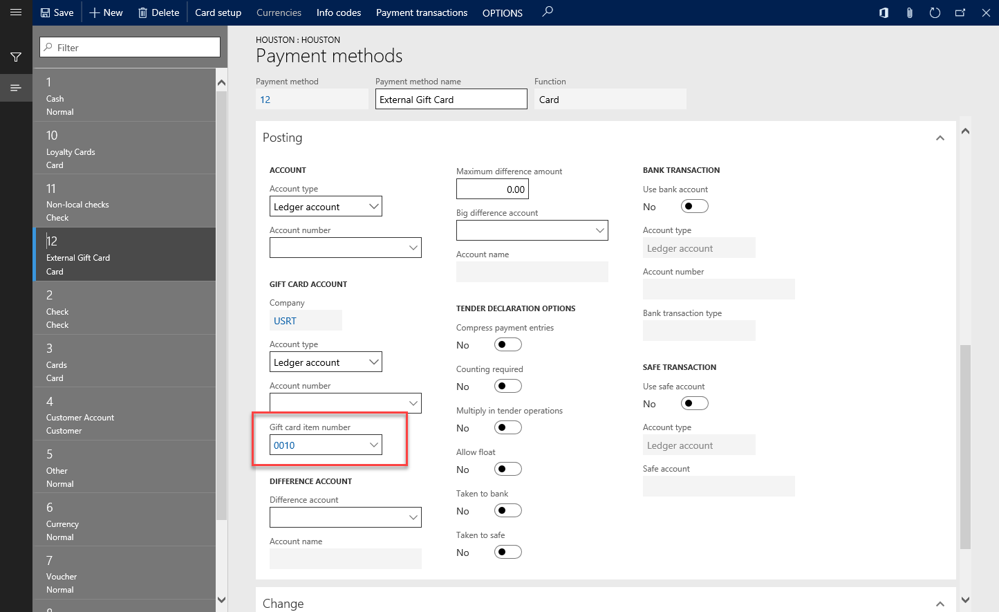
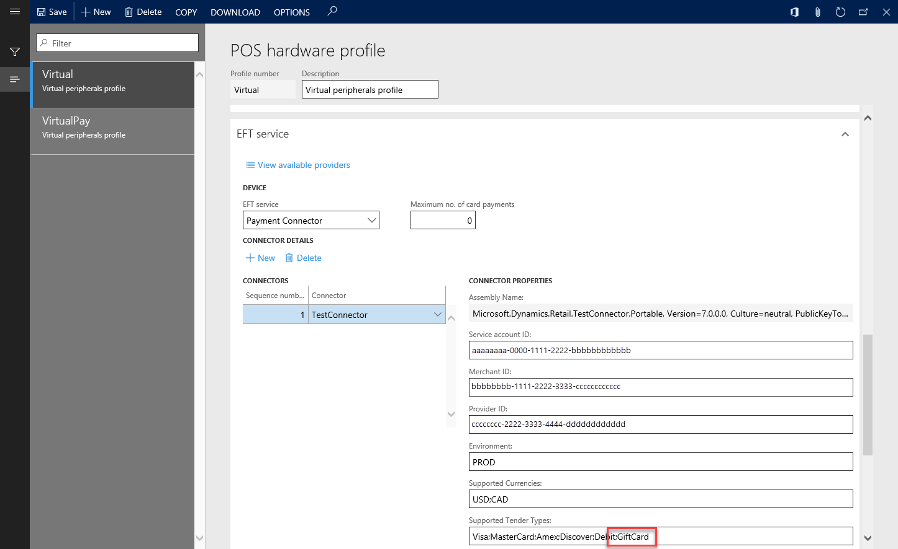
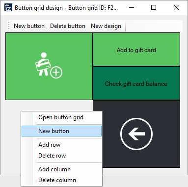
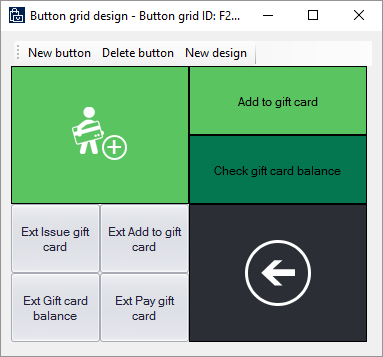
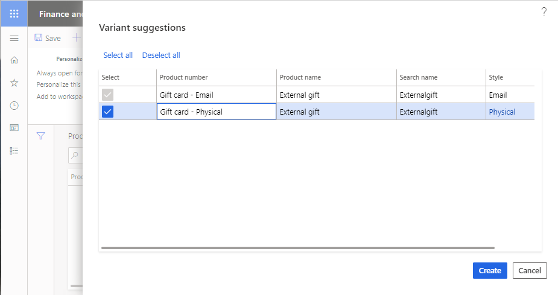
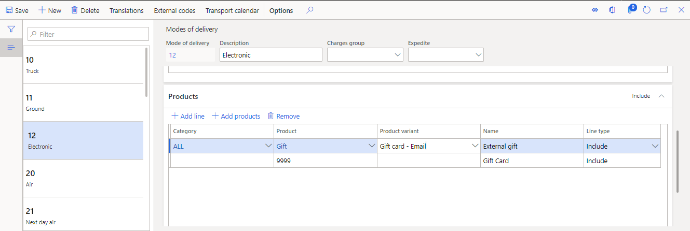
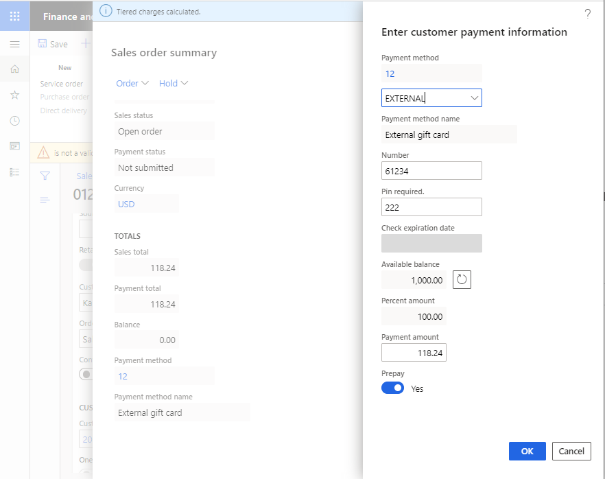

# Support for external gift cards

[!include [banner](../../includes/banner.md)]

This article explains how to set up external gift cards in the Microsoft Dynamics 365 Commerce Store Commerce app, the call center, and the storefront.

Microsoft Dynamics 365 Commerce supports both *internal* and *external* gift cards. Internal gift cards are managed entirely in Dynamics 365 Commerce, whereas external gift cards are administered by a third party. If a retailer's operations are run entirely in Microsoft Dynamics, internal gift cards are sometimes the best solution. For complex enterprises that span multiple countries or regions, and multiple point of sale (POS) systems, it's often best to use a third party to manage gift card balances and enable gift cards to be used across those systems.

Like support for other card payment types, support for external gift cards must be built into the payment connector that is used. The out-of-box payment connector for Adyen supports external gift cards through SVS and Givex in POS, the call center, and the e-commerce storefront.

## External gift card setup

> [!NOTE]
> Some setup steps assume that demo data is used. The steps might vary, depending on the dataset that is used. The test connector is for sandbox purposes only. The test connector is not supported for use in UAT or production environments. 

### Card types

1. Search for **Card Types**. 
2. Select **New**, add the following values, and then select **Save**.

    | Field name     | Value                  |
    |----------------|------------------------|
    | Card ID        | **EXTGC**              |
    | Card type name | **External Gift Card** |
    | Card types     | **Gift card**          |
    | Card issuer    | Enter any description. |

### Card numbers

1. On the **Card types** page, select the newly created gift card, and then select **Card numbers**.
2. Specify the range of card numbers that should be used for external gift cards, and then select **Save**.

In the following example, if the first four digits of a card number are **6036**, the card will be mapped to the gift card that you set up in the "Card types" section of this article.

| Field name         | Value |
|--------------------|-------|
| Card number from   | 6000  |
| Card number to     | 6999  |
| Digits to identify | 4     |

### Gift card item numbers

The **Gift card item number** field values mentioned below in the store setup, call center setup, and online store setup sections should differ from the ID values used to configure internal gift cards (as described in [Set up gift cards](https://learn.microsoft.com/en-us/dynamicsax-2012/appuser-itpro/set-up-gift-cards#set-up-gift-cards-1). External and internal gift cards use these references to determine their processing route in the system. Because external and internal gift cards are processed differently within the system (with external gift cards using the payment gateway), **Gift card item number** values for external gift cards shouldn't match any values in the **Commerce parameters \> Posting \> Gift card \> Gift card product** value set.

### Payment methods

1. Search for **Payment methods** to open the **Payment methods** page.
2. Select **New**, and then follow these steps:

    1. In the **Payment method** field, enter **12**.
    2. In the **Payment method name** field, enter **External Gift Card**.
    3. In the **Default function** field, select **Card**.
    4. Select **Save**.

## Store setup

1. Search for **All stores** to open the **All stores** page.
2. Select the **San Francisco** store in the list.
3. On the Action Pane, on the **Set up** tab, in the **Set up** group, select **Payment methods**.
4. Select **New**.
5. In the **Payment method** field, enter **12**. The **Payment method name** and **Function** fields should then be set automatically.
6. On the **General** FastTab, set the following fields:

    - Set the **Operation name** field to **Pay gift card**.
    - Set the **Connector name** field to **TestConnector**.

9. On the **Posting** FastTab, set the **Gift card item number** field to **0010**.

    

10. Select **Save**.
11. Select **Card setup**, then select **New** to map the gift card payment method to the newly created external gift card payment method for the San Francisco store.
12. If the gift card number can be entered in the POS in addition to on the payment terminal, expand the **General** FastTab and set **Allow manual entry** to **Yes**.

## POS setup

1. In Dynamics 365 Commerce Headquarters, search for **Hardware profiles** to open the **POS hardware profile** page.
2. In the left pane, select **Virtual**.
3. Select **Edit**.
4. On the **EFT service** FastTab, in the **Connectors** grid, select the first entry, **TestConnector**.
5. In the **Supported Tender Types** field, add **GiftCard**.

    

6. Select **Save**.

    > [!NOTE]
    > You can also use the **New** button to create multiple payment connectors. In this way, you can take advantage of the support for multiple connectors that has been added to the solution. You can then have different payment connectors for different payment methods. For example, all credit cards can be processed through one connector, but gift cards can be processed through a different connector.

### Update the button grid

1. Go to the **Button grid** page.
2. In the navigation bar on the left side of the page, search for **F2S1M**, and select the filtered option.
3. On the Action Pane, select **Designer** to download the button designer application.
4. When the grid designer appears, right-click on an empty (gray) area, and then select **New button**.

    

5. Right-click the new button, and then select **Button properties**.
6. Set the **Action**, **Payment type**, and **Text on button** properties according to the following matrix.

    | Action            | Payment type       | Text on button        |
    |-------------------|--------------------|-----------------------|
    | Issue gift card   | External Gift Card | Ext Issue gift card   |
    | Add to gift card  | External Gift Card | Ext Add to gift card  |
    | Gift card balance | External Gift Card | Ext Gift card balance |
    | Pay gift card     | External Gift Card | Ext Pay gift card     |

    When you've finished, your button layout should resemble the following illustration.

    

7. Close the designer.
8. Search for **Distribution Schedule**.
9. In the navigation bar on the left side of the page, search for **1090**, **1115**, and **1070**.
10. On the Action Pane, select **Run now**.
11. Check the status of the job by searching for **Download sessions**.
12. Wait until **Applied** appears next to all the jobs, and then close the browser.

    > [!NOTE]
    > - If you're using Retail Commerce Scale Unit (RCSU) that is located in the store, you need to perform an IIS reset to clear the cache. You can either do this through the IIS application or open an admin Command Prompt window and enter `iisreset`. Otherwise, wait for the RCSU to be updated.
    > - Existing buttons on the version F2S1m button grid (or version F*n*S1M for layout) can be similarly configured for internal gift cards. The existing issue gift card (sometimes depicted with the card and plus symbol button in the existing layout) requires that the button properties have the **Action** property set (for example, to **Issue gift card**) and the **Payment type** property set (for example, to **Gift card** for internal gift cards). Similarly, for the preconfigured **Add to gift card** and **Check gift card balance** buttons, the gift card **Payment type** properties should be set if the buttons are intended to handle internal gift cards.

## Configure and test Store Commerce

1. Start the Store Commerce application.
2. Sign in by using the standard credentials.
3. When you're prompted, select **Perform a non-drawer operation**.
4. On the main screen, select **Select hardware station**.
5. On the bar on the right side of the page, select **Manage**.
6. Turn on **Virtual Peripherals**, and then select **OK**.
7. In the **Available paired stations** field, select **Virtual Peripherals**.
8. You're prompted to either open a new shift or perform non-drawer operations. You can now open a new shift.
9. On the main screen, select **Current transaction**.
10. Select **Gift cards**.
11. Select **Ext Issue gift card**.
12. Enter a number that starts with **9**, and then provide an amount.
13. After items are added to the cart, you can pay by using cash or a card.

When you use the test connector to demonstrate support for external gift cards, you should use card number **61234** to make payments. You won't be prompted for a personal identification number (PIN). The test connector should **never** be used in production.

## External gift cards for the call center and storefront

> [!NOTE]
> External gift card support for call center and storefront is enabled in the **Feature management** workspace. Enable **Omni-channel payments**, then enable **Enable advanced external gift card**. For additional steps required to set up external gift cards in the storefront, please visit the docs article dedicated to  [E-commerce digital gift cards](../digital-gift-cards.md). 
> 
#### Adyen external gift card setup

For an example that shows how to set up payment services, see the [documentation for the Adyen payment connector](adyen-connector.md?tabs=8-1-3).

For the call center and storefront, the Adyen connector supports the following gift cards.

| Brand   | Gift card type   | Supported | Activation       |
|---------|------------------|-----------|------------------|
| SVS     | Physical         | Yes       | Manually         | 
| SVS     | Email            | Yes       | Programmatically |
| Givex   | Physical         | Yes       | Manually         |

> [!NOTE]
>  Only gift cards of type "Email" can be issued in an online order at this time. 
>  In the out-of-box Adyen connector, gift cards are not configured by default. To specify the gift card provider in the merchant properties of the payment connector, follow the instructions in the [documentation for the Adyen payment connector](adyen-connector.md?tabs=8-1-3).

### Tokenization

The out-of-box implementation and Payments software development kit (SDK) support for external gift cards in the call center and storefront requires tokenization. When external gift cards are processed, tokens are used to refer to the actual gift card number. This is important for 3rd party implementations because without tokens, external gift card processing may not function correctly. For example, if a gift card payment is captured when it's added to an order, but an issue occurs during order creation, the gift card payment will be reversed using references (tokens) to the transaction itself, not using the actual gift card number. 

### Purchases and refunds

When an external gift card is used for a purchase, the tender line for the gift card is saved as a prepayment. Therefore, the funds for the purchase are captured when the order is created.

External gift cards aren't eligible for refunds. In part, this limitation is in place to prevent a refund from being given for a gift card that the user has discarded. If an unprocessed order includes an external gift card as payment, and the customer wants to cancel the order, a new gift card or some other form of credit must be issued to the customer.

Gift cards lines that are issued as part of an order can be canceled before fulfillment.

### Issuing gift cards through fulfillment

Physical gift cards and virtual gift cards have distinct fulfillment methods.

Physical gift cards are gift cards that are mapped to a mode of delivery of the **Shipping** type. They must be issued directly through the gift card provider as part of order processing. The gift card number must then be mapped to the order line as part of the pick list registration process. Next, the masked gift card number is saved back to the order line. The gift card that is issued is then activated as part of order invoicing.

Virtual gift cards are issued as part of order invoicing. When a gift card line is marked as **Packed**, it becomes eligible to be issued. Virtual gift cards are issued as part of invoicing. When invoicing occurs, the gift card number is obtained from the provider through the payment connector. The number for the activated gift card is then sent to the gift card recipient via email. When invoicing occurs, the masked gift card number is then saved back to the order line.

### Using modes of delivery for gift card products in the call center and e-commerce

In the call center and storefront channels, unlike in POS, a dedication operation isn't used to issue gift cards. Instead, gift cards are issued by adding a line item to a transaction. Specifically, gift card products for e-commerce and the call center can be either mapped to product variants or modeled as standard products.

If product variants are used, the person who creates the gift card order is prompted to select the variant. The relevant mode of delivery will then be available for that product variant.

Modes of delivery must support the type of gift card. For example, a gift card product variant of the **Physical** style must be mapped to a mode of delivery that is related to shipping. A gift card product variant of the **Email** style must be mapped to an electronic mode of delivery. The electronic mode of delivery is defined on the **Customer orders** tab of the **Commerce parameters** page.

> [!NOTE]
> Currently, Commerce only supports digital gift cards. For information about setting up digital gift cards, see [E-commerce digital gift cards](../digital-gift-cards.md). 

## Setup for the call center and storefront

### Payment services setup

In the back office, on the **Payment services** page, configure the payment services account for the call center. Each payment connector requires different setup steps. The payment service that the call center uses is marked as **Default**.

## Call center setup

1. Search for **All call centers** to open the call centers page.
2. Select the **Fashion call center** store in the list.
3. On the Action Pane, on the **Set up** tab, in the **Set up** group, select **Payment methods**.
4. Select **New**.
5. In the **Payment method** field, enter **12**. The **Payment method name** and **Function** fields will then be set automatically.
6. On the **General** FastTab, set the following fields:
    - In the **Operation name** field, select **Pay gift card**.
    - In the **Connector name** field, select **TestConnector**.  

    > [!NOTE] 
    > If the **Connector name** field is disabled, save the record, and then on the Action Pane, select **Electronic payment setup**. Select **+New** to add a payment type, configure the payment type, and then select **Save**. The connector field should now be selectable. 

9. On the **Posting** FastTab, set the **Gift card item number** field to **0010**.
10. Select **Save**.
11. Select **Card setup**, and then select **New** to map the gift card payment method to the newly created external gift card payment method for the **Fashion call center**.

## Online store setup

1. Search for **Online stores** to open the online stores page.
2. Select the **Fabrikam extended online** store in the list.
3. On the Action Pane, on the **Set up** tab, in the **Set up** group, select **Payment methods**.
4. Select **New**.
5. In the **Payment method** field, enter **12**. The **Payment method name** and **Function** fields will then be set automatically.
6. On the **General** FastTab, set the following fields:

    - In the **Operation name** field, select **Pay gift card**.
    - In the **Connector name** field, select **TestConnector**.

9. On the **Posting** FastTab, set the **Gift card item number** field to **0010**.
10. Select **Save**.
11. Select **Card setup**, and then select **New** to map the gift card payment method to the newly created external gift card payment method for the **Fabrikam extended online store**.

## Online store payments setup

To configure the payment accounts for your online store to use Adyen for external gift card processing, see [Configure additional information for the Adyen connector](adyen-connector-setup.md#configure-additional-information-for-the-connector). 

#### Test connector external gift card setup

To set up external gift cards for the test connector, on the **Payment services** page, select **Dyn Online**, and then, in the **Supported Tender Types** field, add **GiftCard** after **Debit**. Then select **Credit card types**, and assign a payment journal to the gift card payment method.

### Gift card product setup

The following procedure shows how to set up an external gift card by using product masters. Product masters aren't required for external gift cards. However, they can be helpful when both physical and virtual gift cards are used.

1. Search for **Style groups** to open the **Style groups** page.
2. Select **New**.
3. Enter a name (for example, **Gift**) and a description (for example, **Gift card style group**).
4. Add styles to suit the types of gift cards that are available. For example, add **Physical** and **Email** styles.
5. Save your changes.
6. Search for **Product masters** to open the **Product masters** page.
7. Select **New**.
8. Enter a product number (for example, **Gift**), and assign a retail category.
9. In the **Product dimension group** field, select **Style**.
10. Select **OK**.
11. In the product master, select the style group that you created earlier (**Gift**).
12. On the Action Pane, on the **Product** tab, in the **Set up** group, select **Dimension groups**, and then assign a storage dimension group and a tracking dimension group.
13. Select **Save**.
14. Select **Product variants**, select **Variant suggestions**, and edit the gift card variant numbers as you require.
15. Select **Create**.

    

16. Select **Release products**, select **Next** two times, select a company (for example, **USRT**), and then select **Next**. Finally select **Next** to release the product master.
17. Search for **Modes of delivery** to open the **Modes of delivery** page.
18. Select the **Electronic** mode of delivery, and add the **Email** gift card variant. Make sure that applicable call centers and online channels are included.

    

19. Select **Save**.
20. Search for **Process delivery modes** to open the **Process delivery modes** dialog box.
21. Select **OK**.

    > [!NOTE]
    > Gift cards aren't currently supported for Store Commerce customer order creation or for in-store pickup.
    > Gift cards being issued as part of e-commerce orders may only use **Email** modes of delivery. Those gift cards cannot have physical modes of delivery mapped to them. 

22. Search for **Released products by category** to open the **Released product details** page.
23. Select the external gift card item.
24. Set the following values.

    | FastTab           | Field               | Value                 |
    |-------------------|-------------------- |-----------------------|
    | General           | Item model group    | MA\_Retail            |
    | Purchase          | Purchase order unit | ea                    |
    | Sell              | Sales order unit    | ea                    |
    | Sell              | Allow price adjust  | Yes                   |
    | Manage inventory  | Inventory unit      | ea                    |
    | Manage costs      | Posting item group  | Any                   |

25. Select **Save**.

For the storefront, the gift card must also be included in the storefront's assortment. For more information, see [Assortment management](../assortments.md).

> [!NOTE]
> The gift card product used for external gift card setup in POS should not use product masters with item variants. Gift cards based on item variants may still be used for payments, balance inquiries, and cash out in POS, but gift card products associated with the POS for issuance must be standard products. 

### Set up notification emails for virtual gift cards

For information about email setup, see [Configure email functionality](/dynamicsax-2012/appuser-itpro/configure-email-functionality-in-microsoft-dynamics-ax).

For information about how to set up email notifications for Commerce, see [Set up an email notification profile](../email-notification-profiles.md).

For gift cards that are issued via email, the value of the **Retail email notification type** field is **Issue gift card**.

### Call center setup

1. Search for **All call centers** to open the **Call center** page.
2. In the list, select a call center.
3. On the Action Pane, on the **Channel** tab, in the **Users** group, select **Channel users**.
4. Add a user, select **Save**, and then close the **Channel users** page.

    > [!IMPORTANT]
    > Users must be call center users when they access the **Customer service** page and create orders. Otherwise, call center capabilities won't be available.

5. Back on the **Call center** page, on the Action Pane, on the **Set up** tab, in the **Set up** group, select **Payment methods**.
6. Select **New**.
7. In the **Payment method** field, enter **12**. The **Payment method name** and **Function** fields should then be set automatically.
8. On the **General** FastTab, select the connector that should be used for the external gift card.
9. Select **Card setup**, and then select **New** to map the gift card payment method to the external gift card payment method.
10. On the **Posting** FastTab, specify general ledger accounts for the external gift cards. In demo data, **112140** can be used as the general ledger account number.
11. Select **Save**.
12. Select **Card setup**.
13. Select **New**, select the external gift card that you created earlier, and then select **Save**.
14. Close the **Card setup** page, and refresh the **Payment methods** page.
15. Select the external gift card payment method, and then, on the **General** FastTab, in the **Gift card account** section, in the **Connector name** field, assign the **TestConnector** connector.
16. On the **Posting** FastTab, assign the gift card item number.
17. Select **Save**.
18. Select **Card setup**.
19. The **Card setup** page for the internal gift card now includes two additional configuration fields: **Check expiration date** and **PIN required**. Set these fields as required by the external gift card provider.

### Issue external gift cards in the call center

1. As a call center user, search for **Customer service** to open the **Customer service** page.
2. Add a customer by using the **Search** function.
3. Select **New sales order**.
4. Select **Header**, and add a valid mode of delivery.
5. Select **Lines**.
6. In the **Item number** field, specify the gift card item number.
7. In the **Variant number** field, specify the variant number if you're using a product master.
8. In the **Unit price** field, specify the unit price for the gift card.

    > [!NOTE]
    > If modes of delivery are mapped to variants, and if **Electronic** modes of delivery are specified for any gift cards, the gift card type should automatically be set to **Email** on the **Packing** tab.

9. On the **Line details** FastTab, on the **Packing** tab, follow one of these steps:

    - For virtual gift cards, set the **Buyer name**, **Buyer email**, **Recipient name**, **Recipient email**, and **Gift message** fields.
    - For physical gift cards, set the **Buyer name**, **Recipient name**, and **Gift message** fields.

10. On the **Price and discount** tab, in the **Reason code** field, specify the reason for the price override.
11. Select **Complete**, add a payment, and submit the order.

For physical external gift cards, complete the following steps to register the gift card number:
1. Select **Pick and pack > Generate picking list**. 
2. Select **Quantity=All** and then select **OK**. A dialogue that warns about posting the doc without printing will be displayed. Select **OK**.
3. Select **Pick and pack > Picking list registration**. Under the **Lines** menu, select **Register gift card number**. Under the **Register gift card number** property menu, enter the number in the **Number** field, and then select **OK**.
> [!NOTE]
> If the error message "Credit card process failed, due to 'Declined'" is displayed, the gift card has already been activated. You should select a different card number.

When you're finished with the registration process, return to the sales order. The **Gift card number** and **Expiration** fields are displayed with the added information under the **Lines details > Packaging** section.

### Pay by using external gift cards in the call center

1. As a call center user, create an order, and select **Complete**.
2. On the **Payments** FastTab, select **Add**.
3. Select the external gift card payment method, and enter the number and PIN, if applicable. For the test connector, **61234** can be used as the number, and the PIN isn't validated.
4. Use a percentage amount or a payment amount to define the payment amount.

    

5. Select **OK**.
6. Select **Submit** to complete the order.

[!INCLUDE[footer-include](../../includes/footer-banner.md)]
