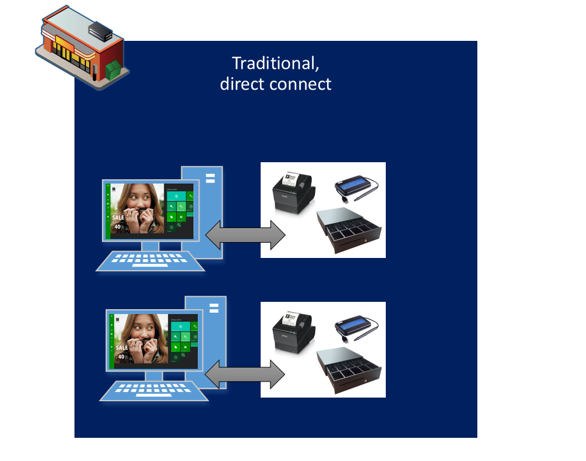
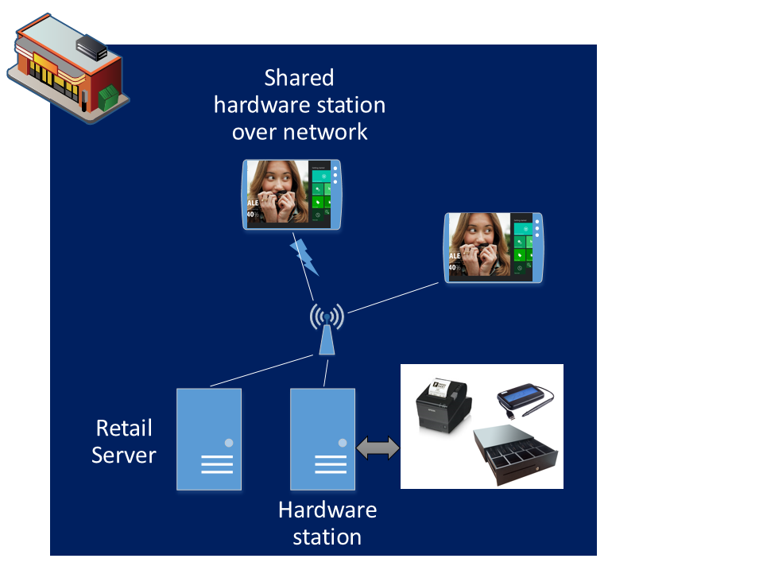
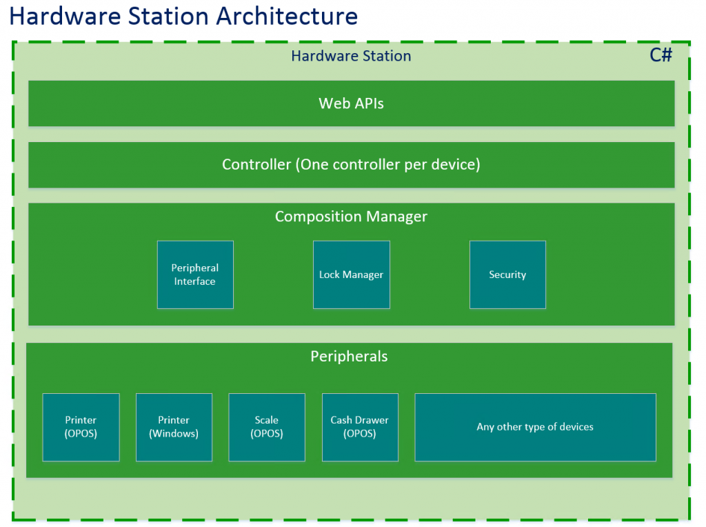
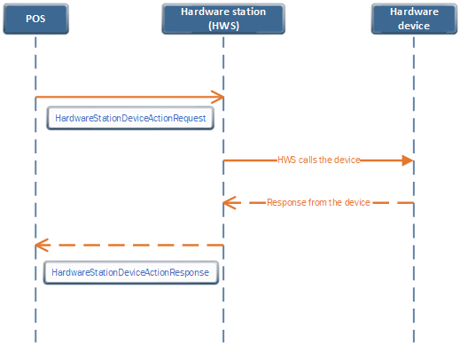

# Integrate the POS with a new hardware device and generate the extension installer

[!include [banner](../../includes/banner.md)]

This article explains how to integrate the point of sale (POS) with a new hardware device and generate the extension installer. 

## Hardware Station overview

Hardware Station is used by Modern POS and Cloud POS to connect to hardware peripherals, such as printers, cash drawers, scanners, and payment terminals. 





## Hardware Station setup

Before you start, use the information in [Configure and install Retail hardware station](../retail-hardware-station-configuration-installation.md) to install Hardware Station, and to get a feel of what hardware is and how it's installed.

## Hardware Station architecture

Hardware Station exposes Web APIs for Hardware Station application programming interfaces (APIs). Hardware Station can be extended either by implementing a new controller for a new device (for example, a cash dispenser) or by overriding an existing controller for an existing device type (for example, a new Audio Jack magnetic stripe reader (MSR) implementation).



## Hardware Station extensibility scenarios

Extensibility in Hardware Station is achieved by using the [Managed Extensibility Framework (MEF)](/dotnet/framework/mef/), which is supported by .NET. **Extensibility guideline:** Always write your extension in your own extension assembly. That way, you're writing a true extension, and upgrades will be much easier. There are two basic scenarios for extension:

-   **Adding a new device** – The out-of-box Hardware Station doesn't already support the device (for example, a cash dispenser). Therefore, you must add support for the new device in Hardware Station.
-   **Adding a new device type for an existing device** – The out-of-box Hardware Station implementation already supports the device (for example, an MSR), but you must add support for a specific device type (for example, an Audio Jack MSR implementation).

To call custom Hardware station APIs from the POS, you must use a request and a response:

+ **HardwareStationDeviceActionRequest** – The request that is sent from the POS to Hardware station.
+ **HardwareStationDeviceActionResponse** – The response that the POS receives from Hardware station.

The class that you extend depends on the version of the Retail software development kit (SDK) that you're using.

+ For Retail SDK version 10.0.11 or later, you extend the **IController** interface.

## HardwareStationDeviceActionRequest

The following code example shows the definition of **HardwareStationDeviceActionRequest**.

```TypeScript
class HardwareStationDeviceActionRequest<TResponse extends HardwareStationDeviceActionResponse> extends Request<TResponse> {
    readonly device: string;
    readonly action: string;
    readonly actionData: any;
    constructor(device: string, action: string, actionData: any, correlationId?: string);
}
```

The following table describes the parameters.

| Parameter  | Data type | Description |
|------------|-----------|-------------|
| device     | String    | The device name that is passed to the Hardware station request should match the **Export** attribute that is added in the Hardware station Device extension controller class. |
| action     | String    | The method that should be called in the Hardware station extension. The method name should be passed as a string value. The core POS Hardware station layer will then call the corresponding method from your Hardware station extension code. The method should exactly match the method name in your Hardware station extension. The Hardware station extension should be passed as a parameter. |
| actionData | any       | A custom parameter for the extension to pass. |

### Sample code

The following code example creates a **HardwareStationDeviceActionRequest** object.

```TypeScript
let hardwareStationDeviceActionRequest: HardwareStationDeviceActionRequest<HardwareStationDeviceActionResponse> =
    new HardwareStationDeviceActionRequest("Export attribute in Hardware station controller class",
        "extension method name in Hardware station", "Custom parameters/you can also pass custom object");
return this.extensionContextRuntime.executeAsync(hardwareStationDeviceActionRequest);
```

## HardwareStationDeviceActionResponse

The following code example shows the definition of **HardwareStationDeviceActionResponse**.

```TypeScript
class HardwareStationDeviceActionResponse extends Response {
    readonly response: any;
    constructor(response: any);
}
```

The following table describes the parameters.

| Parameter  | Data type | Description |
|------------|-----------|-------------|
| response   | any       | The response that is sent from the Hardware station extension code to the POS. |

## End-to-end flow

The follow diagram shows the flow between the POS, Hardware station, and the hardware device.



## Hardware station extension

To call your new hardware device, you must implement the Hardware station code. You call your hardware device from that code.

To implement the Hardware station extension for Retail SDK version 10.0.11 or later, follow these steps.

1. Create a new C# class library project by using the Microsoft .NET Framework version 4.6.1. Alternatively, use one of the samples in the Retail SDK as a template. (You can find the samples at **...\\RetailSDK\\SampleExtensions\\HardwareStation\\**.) We recommend that you use a sample as a template.
2. In the extension project, use the NuGet package manager to add the **Microsoft.Dynamics.Commerce.Hosting.Contracts** package. You can  find the NuGet packages in the **RetailSDK\\pkgs** folder.
3. Add a new controller class that extends the **IController** interface.
4. Add the **RoutePrefix** attribute to the controller class to expose the controller class to clients.

    ```csharp
    [RoutePrefix("ISVEXTENSIONDEVICE")]
    ```

5. To implement your custom logic to call the hardware device, in the controller class, add a method that has the **HttpPost** attribute. This method will be passed as the second parameter (action parameter) to the POS **HardwareStationDeviceActionRequest**. From the extension method, the extension can call other requests, such as printing and cash drawer requests. Just include the relevant NuGet packages from the Retail SDK.

    ```C#
    [HttpPost]
    public async Task<bool> IsReady(IEndpointContext context)
    {
    }
    ```

6. Build the project.

To implement the Hardware station extension for Retail SDK versions that are earlier than version 10.0.11, follow these steps.

1. Create a new C# class library project.
2. Add a new controller class that extends **HardwareStationController** and **IHardwareStationController**.
3. Add the **Export** attribute to the controller class. The **Export** attribute must be in all uppercase letters, and you must pass the value as a parameter from the POS extension. The device parameter that is passed from the POS **HardwareStationDeviceActionRequest** must match this value.
4. To implement your custom logic to call the hardware device, add your method in the controller class. This method will be passed as the second parameter (action parameter) to the POS **HardwareStationDeviceActionRequest**.
5. Build the project.

To deploy the Hardware station extension in Modern POS and test it by using the local Hardware station, follow these steps.

1. Copy the output library to the **C:\\Program Files (x86)\\Microsoft Dynamics 365\\70\\Retail Modern POS\\ClientBroker\\ext** folder.
2. Open the **HardwareStation.Extension.config** file.
3. In the **composition** section, add the extension library details.

    ```Xml
    <add source="assembly" value="your extension library name" />
    ```
 
4. Save the file.
5. Close Modern POS if it's running.
6. Open Task Manager, and end the **dllhost.exe** task.
7. Open Modern POS, and configure it to use the local Hardware station.
8. Validate your scenario.

To test by using Cloud POS, deploy the dynamics-link library (DLL) of the Hardware station extension to the shared Hardware station **ext** folder. Then update the **HardwareStation.Extension.config** file with the custom library in the shared Hardware station folder.

## Retail SDK samples

The Retail SDK includes some samples that you can use for reference.

+ **POS:** \\RetailSDK\\POS\\Extensions\\FiscalRegisterSample
+ **Hardware station:** \\RetailSDK\\SampleExtensions\\HardwareStation\\Extension.FiscalRegisterSample

## Sample code for Retail SDK version 10.0.11 or later

```csharp
namespace Contoso
{
    namespace Commerce.HardwareStation.ISVExtensionDevice
    {
        using Microsoft.Dynamics.Commerce.Runtime.Hosting.Contracts;
        using System;
        using System.Threading.Tasks;

        /// <summary>;
        /// Sample hardware station extension
        /// </summary>

        [RoutePrefix("ISVEXTENSIONDEVICE")]
        public class ISVExtensionDeviceController : IController
        {
            /// <summary>
            /// Sample.
            /// </summary>

            /// <param name="request">Custom request.<param>
            /// <returns>Result of Custom response.</returns>

            [HttpPost]
            public async Task<CustomResponse> Sample(CustomRequest request, IEndpointContext context)
            {
                CustomResponse response;
                try
                {
                    response = new CustomResponse();
                }
                catch (Exception ex)
                {
                    throw ex;
                }
                return await Task.FromResult(response);
            }
        }
        public class CustomResponse
        {
            public string sampleProp { get; set; }
            public CustomResponse()
            {
                this.sampleProp = "sampleValue";
            }
        }
    }
}
```

## Sample POS code to call the Hardware station extension

From your POS extension, call the Hardware station by using the following pattern.

```TypeScript
let hardwareStationDeviceActionRequest: HardwareStationDeviceActionRequest<HardwareStationDeviceActionResponse> =
    new HardwareStationDeviceActionRequest("ISVEXTENSIONDEVICE",
        "Sample", "Custom parameters or custom object");
return this.extensionContextRuntime.executeAsync(hardwareStationDeviceActionRequest);
```

> [!NOTE]
> If you are not using the independent POS packaging SDK or sealed HWS installer then follow the steps in [Create deployable packages](retail-sdk/retail-sdk-packaging.md) to generate the package for deployment.

## Package the HWS extension with Modern POS to use local HWS

> [!NOTE]
> This section is applicable if you are using POS independent packaging SDK with version 10.0.22 or later of finance and operations apps.
 
To package the HWS extension with Modern POS to use local HWS, the HWS extension must be packaged with the POS. In the Modern POS JavaScript project, add a reference to your HWS project. Then use the POS installer project to create extension installer. For more information, see the sample JavaScript project in the [Dynamics365Commerce.InStore/src/PosSample/ModernPos/ModernPos.jsproj GitHub repo](https://github.com/microsoft/Dynamics365Commerce.InStore).

If you have only HWS extension, remove all the other unwanted project references from the sample. The **ModernPos.jsproj** project creates the **msix** installer and then the installer project consumes this and creates the **exe** installer. THe HWS extension will be deployed as a UWP app extension.

## Generate an extension installer for the Hardware station

Dynamics 365 Commerce 10.0.18 and later supports sealed installers. You can generate an extension installer separately from the base installer, and the installer can be independently installed and serviced. This will work only if you are using the [sealed self-service installers](enhanced-mass-deployment.md). 

To generate the sealed extension installer for the Hardware station, follow these steps:

1. Download the [sample Hardware station installer project](https://github.com/microsoft/Dynamics365Commerce.InStore/tree/release/9.31/src/HardwareStationSample/HardwareStation.Installer) from GitHub and open the **HardwareStation.Installer.csproj** project in Visual Studio.
2. Add your Hardware station extension project as a project reference to the **HardwareStation.Installer.csproj** installer project. Remove the existing sample project reference from the **HardwareStation.Installer.csproj** project.

    The installer project consumes the **Microsoft.Dynamics.Commerce.Sdk.Installers.HardwareStation** package to generate the extension installer. The sample installer project class extends the **ExtensionPackageInstallerSetup** class to implement the installation steps.

3. To update the installer name, set the **InstallerName** variable in the sample code.
4. The sample installer project can be updated to perform additional logic during installation. For example, you could ping a server. To add logic, use the **HardwareStationExtensionPackageInstallerSetup.cs** file in the **HardwareStation.Installer.csproj**.
5. You can also add pre- and post-steps to the installer by implementing the **IExtensionInstallerStep** interface. To add steps, use the **TestExtensionInstallerPreInstallStep.cs** file and **TestExtensionInstallerPostInstallStep.cs** in the **HardwareStation.Installer.csproj** sample installer project.
6. Build the extension **HardwareStation.Installer.csproj** project to generate the shared Hardware station extension installer. The output of the project is the extension installer. You can find the generated extension installer path in the Visual Studio Output window after build is finished.
7. Deploy the shared Hardware station extension for Point of Sale (POS) and test it in your scenario.

    > [!NOTE]
    > The sealed shared Hardware server installer must be installed before running the extension installer.

8. Run the extension installer generated by using the command prompt. Open the command prompt in admin mode and run the installer with the **install** parameter. To uninstall, run the extension installer with the **uninstall** parameter. For example:

    ```dos
    C:\HardwareStation.Installer\bin\Debug\net461> .\HardwareStation.Installer.exe install
    ```

9. Close POS if it's running.
10. Open POS and configure it to use the shared Hardware station.
11. Validate the extension hardware station scenario.

[!INCLUDE[footer-include](../../includes/footer-banner.md)]

