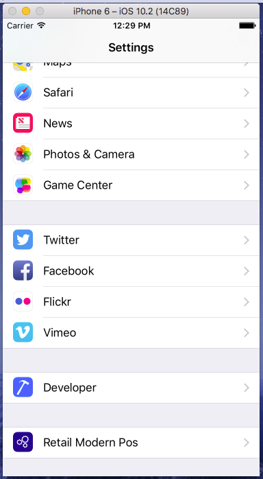
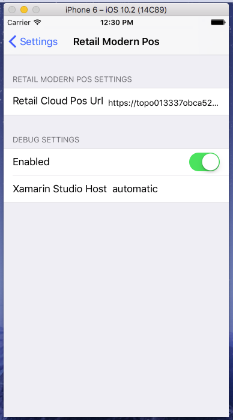

---
# required metadata

title: Set up POS hybrid app on Android and iOS
description: This topic shows how to set up the POS hybrid app on Android and iOS.
author: mugunthanm 
manager: AnnBe
ms.date: 11/25/2019
ms.topic: article
ms.prod: 
ms.service: dynamics-365-retail
ms.technology: 

# optional metadata

# ms.search.form: 
# ROBOTS: 
audience: Developer
# ms.devlang: 
ms.reviewer: rhaertle
ms.search.scope: Operations, Retail 
# ms.tgt_pltfrm: 
ms.custom: 
ms.assetid: 
ms.search.region: global
ms.search.industry: Retail
ms.author: mumani
ms.search.validFrom: 2018-29-10
ms.dyn365.ops.version: AX 8.0, AX 8.1

---
# Set up POS hybrid app on Android and iOS
[!include [banner](../includes/banner.md)]

This topic shows how to build and run the Retail POS hybrid app on Android and iOS devices. 

## Overview

Retail hybrid app is shell built using [Xamarin](https://docs.microsoft.com/xamarin/). Inside the shell is a Web view controller that loads the cloud POS, which is based on the Commerce Scale Unit URL specified in the settings of this app. This is a Retail hybrid app shell for Android and iOS which will internally load the Cloud POS. For more information, see [Cloud POS](https://docs.microsoft.com/dynamics365/unified-operations/retail/mpos-or-cpos).

## Development tools
The Retail hybrid app supports the Android and iOS phone platforms. The app is built by using Xamarin, which means that you must install Xamarin on your development computer. To build the iOS app, you must have a Mac that has Xamarin installed. Although you can do development for both Android and iOS on a computer that runs Microsoft Windows, you must use a Mac to complete the build for the iOS platform. If your Mac is a shared team resource, you might want to use a Mac just for the build process. You must copy the Retail software development kit (Retail SDK) on all the computers that you use for development. The Retail SDK is available in all developer VMs that are provisioned for using [Microsoft Dynamics Lifecycle Services (LCS)](https://lcs.dynamics.com/).

For more information about Xamarin, see the [Xamarin documentation](https://docs.microsoft.com/xamarin/).

## Set up and install Xamarin on Windows

To set up and install Xamarin on Windows, go to <https://docs.microsoft.com/xamarin/android/get-started/installation/windows>.

### Update Xamarin

After you've installed Xamarin, you must update it to the latest stable version.

-   **Windows** - In Microsoft Visual Studio, click **Tools** &gt; **Options** &gt;**Environment** &gt; **Xamarin** &gt; **Other**.
-   **Mac** - In Xamarin Studio, click **Check for Updates** &gt; **Update channel**. For more information about this step, see [Change the Updates Channel](https://developer.xamarin.com/recipes/cross-platform/ide/change_updates_channel/).

### Build the Android Retail hybrid app

1. When installation is complete, launch Visual Studio and sign in with your Microsoft account (this is the same account that you use with Windows). Check for Xamarin updates by clicking **Tools > Options > Xamarin** or **Tools > Options > Xamarin > Other**. Here you’ll find a **Check Now** link. If you do not see an option for Xamarin in **Tools > Options**, review your installation, or try restarting Visual Studio. You can also search for Xamarin in the **Options** dialog box. If needed, download and install the latest version.
      
2.  In the Retail SDK folder, open SampleExtensions\HybridApp\Android\solution. Build and deploy using the emulator and verify that everything appears as it should.
  
3.  Using the [Visual Studio Emulator for Android](https://visualstudio.microsoft.com/vs/msft-android-emulator/ "Visual Studio Emulator for Android") or any emulator for Android, launch the POS hybrid app and enter the Commerce Scale Unit URL and save.
  
4.  You should be able to sign in and activate the device.

### Build the iOS Retail hybrid app

### Connecting to a Mac

If you're developing on Windows and using the Mac just for building the iOS app then you must connect the computer that runs Windows and the Mac. For instructions, see [Connecting to the Mac](https://developer.xamarin.com/guides/ios/getting_started/installation/windows/connecting-to-mac/).

 ## Set up and install Xamarin on iOS

For more detailed steps on installing Xamarin on iOS, refer to [Xamarin.iOS installation](https://docs.microsoft.com/xamarin/ios/get-started/installation/).

  1.  Download and install Xcode from <https://developer.apple.com/xcode/>. Add your Apple ID using the instructions described in [Adding your account to Xcode](https://developer.apple.com/library/content/documentation/IDEs/Conceptual/AppStoreDistributionTutorial/AddingYourAccounttoXcode/AddingYourAccounttoXcode.html#//apple_ref/doc/uid/TP40013839-CH40-SW1) (apple.com).
  
  2.  Download and install Xamarin by following the instructions in [Installing and configuring Xamarin.iOS](https://developer.xamarin.com/guides/ios/getting_started/installation/mac/) (xamarin.com).
  
  3.  When you have completed installing Xamarin on both the Windows and Mac computers, follow the instructions in [Connecting to the Mac](https://developer.xamarin.com/guides/ios/getting_started/installation/windows/xamarin-mac-agent/) (xamarin.com). After you do this, you can work with iOS and Mac from Visual Studio on the Windows computer.
  
  ### Build the iOS Retail hybrid app
  
  1.  In the Retail SDK folder, open SampleExtensions\HybridApp\iOS\solution.
      After connecting to the Mac and building the application in Visual Studio, select the iOS device type and deploy the app on the selected device.
      
         
      
  2.  Using the Emulator, go to **Settings > RetailMPOS**. Enter the Commerce Scale Unit URL.
      
         
      
         
      
  3.  Launch the MPOS app. You should be able to sign in and activate the device.
  
## Dedicated hardware station support for the hybrid Android app
  
Starting in release 8.1.3, dedicated hardware station support has been added to the hybrid Android app. In the same way that the Retail Modern POS has built-in support for peripheral devices, the Android app can also use the dedicated hardware station to connect to peripherals without needing to deploy an IIS-based hardware station.
Out of the box, the hybrid Android app supports using payment terminals and receipt printers over network connections. Communicating with devices over a network typically requires adherence to a proprietary communication protocol specified by the manufacturer. For the hybrid Android app, out-of-the- box integrations are provided for the Dynamics 365 payment connector for Adyen and Epson receipt printers. 

### Out-of-the-box supported devices

| Device | Description |
| --- | --- |
| Payment terminals | Any supported by the [Adyen Payment Terminal API](https://www.adyen.com/blog/introducing-the-terminal-api) through the Dynamics 365 Payment Connector for Adyen. |
| Receipt printer | Network enabled Epson printers which support the Epson SOAP HTTP interface. |

Support for other payment processors and peripheral devices can be implemented by ISVs through the Payments and Hardware SDKs. 

### Set up peripherals to work with the hybrid Android app

To enable direct hardware support for the hybrid Android app, set up a dedicated hardware station in the same way it would be set up for MPOS. Instructions for setting up the dedicated, or IPC, hardware station can be found in [Retail peripherals](../retail-peripherals-overview.md#modern-pos-for-windows-with-an-ipc-built-in-hardware-station-1)

> [!NOTE]
> The dedicated hardware station provided with demo data should not be used with the hybrid Android app. To test the hybrid Android app in an environment with demo data, delete the existing hardware stations and create a new dedicated hardware station. 
>
> To do this, go to **Retail and Commerce > Channels > Stores > All stores**. Select the store that will be used, typically "HOUSTON". 
>
> In the store details form, scroll down to the **Hardware stations** FastTab. Remove the existing dedicated hardware station, then select **Add** to add a new hardware station of type **Dedicated**. A description is optional. No other details are necessary for the hardware station. 

To set up the payment connector, follow the standard setup steps noted in the [Dynamics 365 Payment Connector for Adyen](https://docs.microsoft.com/dynamics365/unified-operations/retail/dev-itpro/adyen-connector?tabs=8-1-3#setup-and-configuration). Skip the section labeled "Update the Modern POS or IIS Hardware Station configuration."

Out of the box, the Android app communicates with network-enabled Epson printers that support Epson's ePOS-Print protocol. To enable this interface, connect the Epson printer to the network. ePOS-Print is enabled through a web interface that allows users to access Epson network-enabled printers through a browser. This web interface is typically reached by opening a web browser and typing http://<printer IP address>. The IP address for the printer can be obtained by connecting it to the network, then turning it off and on. After the network IP address is obtained, a receipt that displays the printer's IP address will print. For more information about configuring ePOS-Print, refer to the documentation provided by Epson. 
      
After the Epson printer has ePOS-Print enabled, turn the printer off and turn it back on. When the device comes back online, a receipt should print to indicate the device's IP address. Note the device's IP address and navigate to the POS register form in Dynamics 365. Select the register being set up and open for editing. On the **Register** tab in the ribbon area, note the subheading labeled **Hardware** with an available action called **Configure IP addresses**. Use this action to specify the IP address for the printer that is being used by this specific register. If the **IP address** field is not available for the printer, check the hardware profile assigned to the register to ensure that the printer type is set to **Network**. A port is not required for the out-of-the-box support for Epson printers.

**New for 10.0.8** - Cash drawers connected to Epson network printers via drawer kick (dk) port are now supported. To use a cash drawer connected to a network-enabled Epson printer, configure the printer according to the directions above. Set the cash drawer to type 'Network' in the hardware profile. Navigate to the register or hardware station the hardware profile is assigned to and use the **Configure IP addresses** function to set the IP address for the cash drawer, which is the same as the address configured for the printer.

### Sharing peripherals using built-in peripheral support

Payment terminals and receipt printers can be shared among Android POS clients and other MPOS devices. While peripherals can still be shared through an IIS hardware station; the addition of built-in peripheral support for Android POS enables sharing of these devices without deploying the hardware station as a web service.

To share devices among Android POS clients, instead of assigning the IP and hardware profile to the register, the hardware profile should be set on the dedicated hardware station itself. To do this, go to **Retail and Commerce > Channels > Stores > All stores**. Select the store and open for editing. Next, scroll down to the list of hardware stations for the store and assign the hardware profile with network payment terminal, EFT settings, and network printer directly to the hardware station itself. For this scenario, the EFT terminal ID will also need to be assigned to the hardware station at the store level.

## Additional resources
- [Payments FAQ](payments-retail.md)

