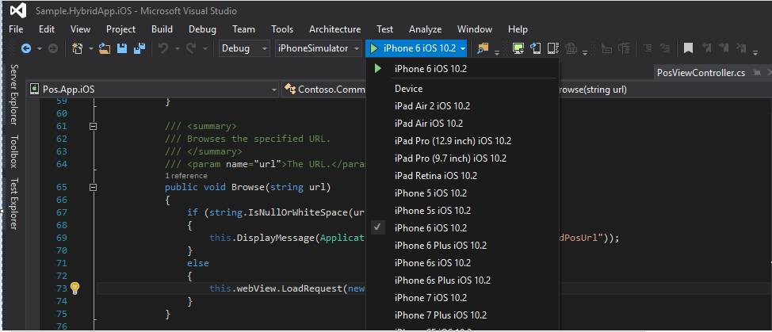
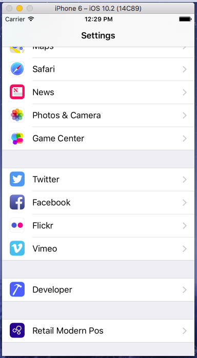
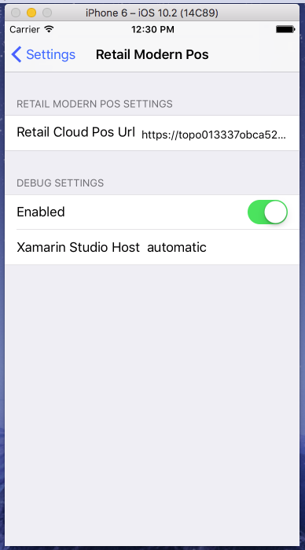

# Set up POS hybrid app on Android and iOS

[!include [banner](../includes/banner.md)]

This article shows how to build and run the Retail point of sale (POS) hybrid app on Android and iOS devices. 

> [!NOTE]
> The Retail Hybrid apps are being replaced by the Store Commerce apps for Android and iOS. For more information, see [Store Commerce app for mobile platforms](store-commerce-mobile.md).

The Retail hybrid app is a shell that was built by using [Xamarin](/xamarin/). Inside the shell is a Web view controller that loads Cloud POS (CPOS), which is based on the Commerce Scale Unit URL that is specified in the settings of this app. The Retail hybrid app shell is for Android and iOS, which will internally load CPOS. For more information, see [Cloud POS](/dynamics365/unified-operations/retail/mpos-or-cpos).

The Store Commerce apps for [Microsoft Windows](store-commerce.md) and [mobile platforms](store-commerce-mobile.md) are the next generation of POS applications for Dynamics 365 Commerce. Modern POS (MPOS) and the Retail hybrid app will be deprecated in October 2023. Microsoft recommends that you use Store Commerce or CPOS for all new deployments. Existing customers should plan to migrate MPOS and the Retail hybrid app to Store Commerce. 

## Development tools

The Retail hybrid app supports the Android and iOS phone platforms. The app is built by using Xamarin, which means that you must install Xamarin on your development computer. To build the iOS app, you must have a Mac that has Xamarin installed. Although you can do development for both Android and iOS on a computer that runs Microsoft Windows, you must use a Mac to complete the build for the iOS platform. If your Mac is a shared team resource, you might want to use a Mac just for the build process. You must copy the Retail software development kit (Retail SDK) on all the computers that you use for development. The Retail SDK is available in all developer VMs that are provisioned for using [Microsoft Dynamics Lifecycle Services (LCS)](https://lcs.dynamics.com/).

For more information about Xamarin, see the [Xamarin documentation](/xamarin/).

## Set up and install Xamarin on Windows

To set up and install Xamarin on Windows, go to [Windows Installation](/xamarin/android/get-started/installation/windows).

### Update Xamarin

> [!NOTE]
> We recommend that you use Xamarin.Android SDK version < 10.0. 

After you've installed Xamarin, you must update it to the latest stable version (Xamarin.Android SDK version must be < 10.0).

- **Windows:** In Microsoft Visual Studio, select **Tools \> Options \> Environment \> Xamarin \> Other**.
- **Mac:** In Xamarin Studio, select **Check for Updates \> Update channel**. For more information about this step, see [Change the Updates Channel](https://developer.xamarin.com/recipes/cross-platform/ide/change_updates_channel/).

### Build the Android Retail hybrid app

> [!NOTE]
> We recommend that you use Visual Studio 2019 or later to build the Android app.

To build the Android Retail hybrid app, follow these steps.

1. When installation is completed, open Visual Studio, and sign in by using your Microsoft account (the same account that you use with Windows). Check for Xamarin updates by selecting **Tools \> Options \> Xamarin** or **Tools \> Options \> Xamarin \> Other**. You will find a **Check Now** link. If you don't see an option for Xamarin at **Tools \> Options**, review your installation, or try to close and reopen Visual Studio. You can also search for Xamarin in the **Options** dialog box. Download and install the latest version as needed.
1. In the [Retail SDK folder](retail-sdk/retail-sdk-overview.md#download-the-retail-sdk), open **SampleExtensions\HybridApp\Android\Sample.HybridApp.Android.sln**. Build and deploy using the emulator and verify that everything appears as it should.

    > [!NOTE]
    > If you want to add a custom Azure Active Directory (Azure AD) host URL for activation, in the solution edit the **PosActivity.cs** file, search for the string array variable named **AadHostUrls**, and then add your custom Azure AD host URL to the array. 
  
1. Using the [Visual Studio Emulator for Android](https://visualstudio.microsoft.com/vs/msft-android-emulator/ "Visual Studio Emulator for Android") or any emulator for Android, launch the POS hybrid app and enter the Commerce Scale Unit URL and save.
1. You should be able to sign in and activate the device.

### Build the iOS Retail hybrid app

### Connect to a Mac

If you're developing on Windows and using a Mac just to build the iOS app, you must connect the computer that runs Windows with the Mac. For instructions, see [Connecting to the Mac](https://developer.xamarin.com/guides/ios/getting_started/installation/windows/connecting-to-mac/).

## Set up and install Xamarin on iOS

To set up and install Xamarin on iOS, follow these steps.

1. Download and install Xcode from <https://developer.apple.com/xcode/>. Add your Apple ID by following the instructions in [Adding your account to Xcode](https://developer.apple.com/library/content/documentation/IDEs/Conceptual/AppStoreDistributionTutorial/AddingYourAccounttoXcode/AddingYourAccounttoXcode.html#//apple_ref/doc/uid/TP40013839-CH40-SW1) (apple.com).
1. Download and install Xamarin by following the instructions in [Installing and configuring Xamarin.iOS](https://developer.xamarin.com/guides/ios/getting_started/installation/mac/) (xamarin.com).
1. When you've finished installing Xamarin on both the Windows computer and the Mac, follow the instructions in [Connecting to the Mac](https://developer.xamarin.com/guides/ios/getting_started/installation/windows/xamarin-mac-agent/) (xamarin.com). After you've connected to the Mac, you can work with iOS and Mac from Visual Studio on the Windows computer.

For more detailed information about how to install Xamarin on iOS, see [Xamarin.iOS installation](/xamarin/ios/get-started/installation/).

### Build the iOS Retail hybrid app

1. In the [Retail SDK folder](/retail-sdk/retail-sdk-overview#download-the-retail-sdk), open **SampleExtensions\\HybridApp\\iOS\\solution**. After you've connected to the Mac and built the application in Visual Studio, select the iOS device type, and deploy the app on the selected device.
      
    
   
1. In the Emulator, go to **Settings \> Retail Modern Pos**, and enter the Commerce Scale Unit URL.
      
    
      
    
      
1. Open the MPOS app. You should now be able to sign in and activate the device.

## Hybrid app signing and distribution

To sign and distribute the Android and iOS app, refer to the following options:

**Android**
- [Signing the Android Application Package](/xamarin/android/deploy-test/signing/?tabs=windows)
- [Android app distribution](https://developer.android.com/distribute/marketing-tools/alternative-distribution)

**iOS**
- [iOS Code Signing](https://developer.apple.com/support/code-signing/)
- [iOS app distribution](https://developer.apple.com/documentation/xcode/preparing-your-app-for-distribution)

## Dedicated hardware station support for the hybrid Android app

Starting in release 8.1.3, dedicated hardware station support has been added to the hybrid Android app. In the same way that the Retail Modern POS has built-in support for peripheral devices, the Android app can also use the dedicated hardware station to connect to peripherals without needing to deploy an IIS-based hardware station.
Out of the box, the hybrid Android app supports using payment terminals and receipt printers over network connections. Communicating with devices over a network typically requires adherence to a proprietary communication protocol specified by the manufacturer. For the hybrid Android app, out-of-the- box integrations are provided for the Dynamics 365 Payment Connector for Adyen and Epson receipt printers. 

### Out-of-the-box supported devices

| Device | Description |
| --- | --- |
| Payment terminals | Any supported by the [Adyen Payment Terminal API](https://www.adyen.com/blog/introducing-the-terminal-api) through the Dynamics 365 Payment Connector for Adyen. |
| Receipt printer | Network-enabled Epson printers that support the Epson SOAP HTTP interface.
Network-enabled Star Micronics printers.
 |
| Cash drawer | Introduced in Dynamics 365 Commerce version 10.0.8: Cash drawers that are connected to network-enabled printers via the drawer kick (d/k) port. |

Support for other payment processors and peripheral devices can be implemented by ISVs through the Payments and Hardware SDKs. 

### Set up peripherals to work with the hybrid Android app

To enable direct hardware support for the hybrid Android app, set up a dedicated hardware station in the same way it would be set up for MPOS. Instructions for setting up the dedicated, or IPC, hardware station can be found in [Retail peripherals](../retail-peripherals-overview.md#modern-pos-for-windows-with-an-ipc-built-in-hardware-station-1)

> [!NOTE]
> The dedicated hardware station that includes demo data should not be used with the hybrid Android app. To test the hybrid Android app in an environment that has demo data, delete the existing hardware stations, and create a new dedicated hardware station. Go to **Retail and Commerce \> Channels \> Stores \> All stores**, and select the store that will be used (typically **HOUSTON**). On the store details page, on the **Hardware stations** FastTab, remove the existing dedicated hardware station, and then select **Add** to add a new hardware station of the **Dedicated** type. A description is optional. No other details are required for the hardware station. 

To set up the payment connector, follow the standard setup steps noted in the [Dynamics 365 Payment Connector for Adyen](/dynamics365/unified-operations/retail/dev-itpro/adyen-connector?tabs=8-1-3#setup-and-configuration). Skip the section labeled "Update the Modern POS or IIS Hardware Station configuration."

For details on setting up network connected peripherals the docs [Support for network peripherals](./network-peripherals.md).

## Additional resources

[Payments FAQ](payments-retail.md)

[!INCLUDE[footer-include](../../includes/footer-banner.md)]
