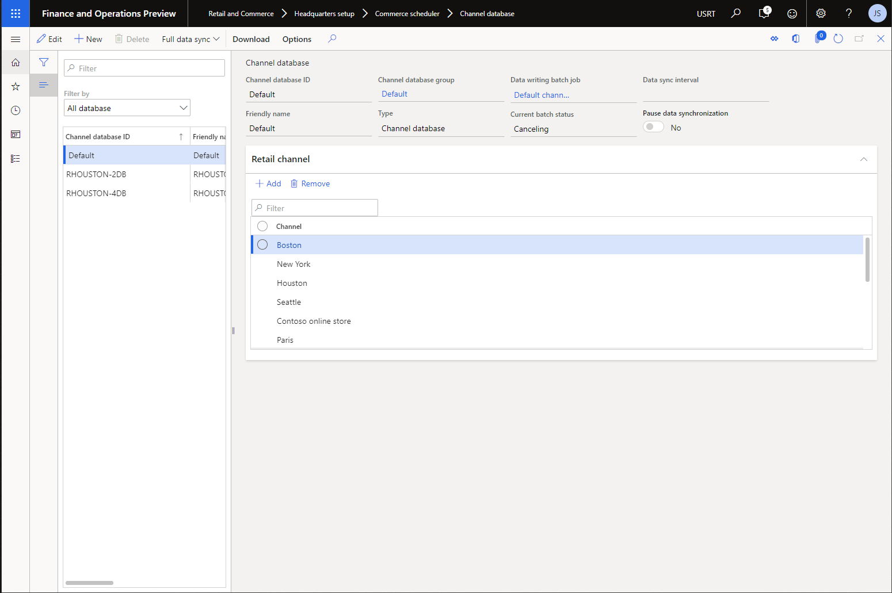

---
# required metadata

title: Commerce Data Exchange implementation guidance
description: This topic is intended for people who implement functionality that is related to data synchronization (Commerce Data Exchange, often known as CDX) in a Commerce environment. It gives an overview, implementation tips, and overall guidance that should be considered as you plan your implementation in regards to pages, setup, configuration, best practices, and more.
author: jashanno
manager: AnnBe
ms.date: 08/01/2020
ms.topic: article
ms.prod: 
ms.service: dynamics-365-retail
ms.technology: 

# optional metadata

ms.search.form: RetailTerminalTable, RetailDevice
# ROBOTS: 
audience: IT Pro
# ms.devlang: 
ms.reviewer: sericks
ms.search.scope: Core, Operations, Retail
# ms.tgt_pltfrm: 
ms.custom: 
ms.assetid: 
ms.search.region: global
ms.search.industry: Retail
ms.author: jashanno
ms.search.validFrom: 2020-08-31
ms.dyn365.ops.version: 10.0.12
---

# Commerce Data Exchange implementation guidance
[!include[banner](../includes/banner.md)]

This topic is intended for people who implement functionality that is related to data synchronization (Commerce Data Exchange, often known as CDX) in a Commerce environment. It gives an overview, implementation tips, and overall guidance that should be considered as you plan your implementation in regards to pages, setup, configuration, best practices, and more.

## Overview
Data configuration and synchronization is crucial to a proper implementation.  Regardless of business needs, IT infrastructure, and overall preparedness, if data is not being correctly synchronized, the entire environment is effectively useless.  As such, it is top priority to understand what is required to configure, generate, synchronize, and verify data synchronization across a full implementation. From Headquarters, through the Commerce Scale Unit, to the brick and mortar stores utilizing Modern POS and other in-store components.  Commerce Data Exchange (CDX) is the Commerce functionality replicate and synchronize data across databases.  However, CDX is different than common data replication functionality.  CDX additionally allows filtering to minimize data sets by generating data only specific to the channels specified for selection, filtering specific tables from offline databases, and filtering expired records for data that is no longer in use, such as expired discounts.

Before going through this content, it is important to know the concepts of a channel (store), registers and devices, and the concept of the offline database as a part of Modern POS.  As such, it is recommended to review some of the resources at the bottom of this content such as the Devices implementation guide and the Commerce architecture documents. 

### Important Headquarters pages
The **Channel database** page is used to create, review, and edit the channel databases used in Commerce Scale Units (both Cloud and Self-hosted) and offline databases used with Modern POS.  Each database created here refers to a single, physical database (1:1 mapping).  The channel or offline database is associated to a channel database group.  From this page, full synchronizations of a scheduler job can be created for a selected channel or offline database.

The **Channel database group** page is used to create, review, and edit the channel database groups.  Each group is associated to one or more databases (channel or offline). The database group is responsible for gathering the relevant data (That is required by all channel and offline databases associated to the database group) necessary to be generated as part of the CDX data synchronization.

[Channel database](./media/ChannelDatabaseGroup.png)

The **Channel profile** page is used to create, review, and edit the channel profiles.  Each channel profile stores the URLs relevant to the network-based communication necessary within a channel.  A channel profile will typically have a Retail Server URL and a Cloud POS URL.  Additionally, frequently there will also be a Media Server Base URL (This URL is the internet addressable location of images used by POS, eCommerce, and other Dynamics 365 Commerce channels).  A channel profile is automatically generated for a Commerce Scale Unit (Cloud) but must be manually generated as part of the Commerce Scale Unit (Self-hosted) configuration and installation steps.

[Channel database](./media/ChannelProfile.png)

The **Offline profile** page is used to create, review, and edit the offline profiles.  Each offline profile allows a user to configure offline related settings, including configurations such as the ability to **allow manual switch to offline before sign-in**, **Enable advanced offline switching**, and **Pause offline synchronization**.  These feature configurations are discussed in this and related documents referenced at the end of this document.
[Channel database](./media/OfflineProfile.png)

The **Commerce channel schema** page is used to create, review, and edit the channel schemas.  By default, one schema is already created and available named **AX7**.  The channel schema is required to provide the means of "how" to read the Headquarters database for Commerce data.  This is also where the configuration is located to exclude customer related data from data synchronization to offline databases.  This feature will be discussed in this and other documents referenced at the end of this document.

[Channel database](./media/ChannelSchema.png)

The **Distribution schedule** page is used to create, review, and edit the distribution schedule jobs.  These schedule jobs associate which channel database groups will run the associated scheduler job (Detailed next).  A schedule job can be marked active and has a singular direction of data associated to it (Typically download, to send data down to the channels).  By default, all Commerce related jobs already exist and are prepared for use with any generated Commerce Scale unit (Cloud).  From this page, delta synchronizations can be created for a selected schedule job.

[Channel database](./media/DistributionSchedule.png)

The **Scheduler job** page is used to create, review, and edit the job selected from the schedule job.  This job has a series of associated subjobs.  This job also is associated to a channel schema (Typically the **AX7** schema originally created.  A job can be excluded from synchronization to offline databases.
[Channel database](./media/SchedulerJob.png)

The **Scheduler subjob** page is used to create, review, and edit the subjob.  A subjob is associated to one or more jobs (Seen via the scheduler job form).  A subjob is associated to a single table within the Headquarters database.  This subjob shows the channel field mapping, which lists all the related fields utilized within the database table.
[Channel database](./media/SchedulerSubjob.png)

The **Download sessions** and **Upload sessions** pages are used to review and edit download or upload sessions previously created through the data packages generated via the above described pages.  These pages showcase how many rows of data exist to be synchronized, when the data was made available and when it was synchronized, and the overall size of the data package.  These pages allow for some amount of management and troubleshooting of data packages, such as seeing what errors may have occurred and canceling or deleting jobs that are causing any issue.  This is described more in the [Best practices](CDX-Best-Practices.md) document.

### Data synchronization overview
When a job is run (Scheduler job), the channel database group (Channel database group) selects the relevant data for all channel or offline databases (Channel database) associated to itself from the fields listed in the accumulated subjobs (Scheduler subjob.  The product of this selection of data is a data package.  Data packages is a file or files zipped together containing all previously selected data (or selected delta of data, typically) required to be applied to one or more destination databases (Whether that be a Channel database or Offline database).

Data is generated and flows in a very specific way (Download or upload).  It is important to understand how the various pages are used and how this data generation occurs to be able to understand how best to configure the timing and select what data to be synchronized.  When done properly, higher performance and lower Headquarters utilization is achieved.

[Commerce Data Exchange - Association Map](./media/CommerceDataExchange-AssociationMap.png)

This visual showcases the various pages in Headquarters (Previously described in this document) and how they associate to one another.  When fully configured across all of the pages shown, CDX data generation will be able to occur.  Data synchronization occurs in two pages, download and upload.  CDX data generation is required for downloads.  Point of Sale data generated while offline requires data synchronization upload.

[Commerce Architecture - Data Synchronization](./media/CommerceArchitecture-DataSynchronization.jpg)

This visual showcases the download and upload data flows.  Data packages generated through CDX flow downward from Headquarters to the Commerce Scale Unit and to Modern POS offline databases.  Transactional data flows upward from the Modern POS offline databases to Commerce Scale Unit and Headquarters.

### Overview of package management
As packages are created, they are processed and sent out into Azure storage, prepared for downloading to Channel database or Offline database.  These packages, through the stages from creation to fully applied, are able to be viewed as a detailed list in the **Download sessions** page.  Similarly, as transactions are uploaded, there is an **Upload sessions** page.  Within these pages, it is possible to somewhat manage the packages as they proceed.

Generally, packages will automatically retry, and take care of, themselves.  However, there are a variety of scenarios that could occur to cause a package to become stuck in some fashion, retrying endlessly without success or failing outright.  In these scenarios, the feature ability to delete or manually retry troublesome jobs can be valuable in troubleshooting the package application process.

### Important CDX related features (All available in version 10.0.12 or above)
| Feature name | Feature description |
|--------------|---------------------|
| Advanced offline | A series of configurations in the **Offline profile** to enable additional offline switching scenarios, the ability to switch to offline prior to POS login, and enhanced Headquarters availability testing to switch to offline more frequently and return to online status more easily. |
| Offline data exclusion | Also called Data sizing improvements, this feature set allows the ability to flag specific data to be excluded from offline databases (And not be synchronized in the future).  This additionally includes the ability to fully remove all customer-related data from offline databases. |
| Forced **Batch processing** and inability to use recurrence with a **Full sync** | Beginning in 10.0.11, it is not possible to **Run now** from the **Distribution schedule** without running with **Batch processing**. This change was made intentionally due to accidental creation of performance issues by running jobs during the busiest environment usage times. Another change that was made as a part of this feature enhancement was to disallow **Recurrence** when running a **Full data sync** (Full job sync) from the **Channel database** page in Headquarters (Only a single occurrence may be executed). |

The above features will be mentioned and referenced in this and related documents that can be found throughout this document and referenced at the end of this document.
Statement on how these features will be discussed later in the document, such as implementation considerations sub-heading (And possibly resources to other docs if decided to break apart).

#### Advanced offline
This feature is configurable in the **Offline profile**. There are three configurations related to this feature:
 - Allow manual switch to offline before sign in
 - Enable advanced offline switching
 - System health check interval (mins)
 
 **Allow manual switch to offline before sign in** allows Modern POS users to switch to offline prior to signing into the POS.  This assists in scenarios where timeouts could occur before signing in completes or scenarios where atypical response codes are occurring from the Commerce Scale Unit (Cloud or Self-hosted).  With this configuration turned on, a Modern POS user (With an offline database) could navigate to the **Settings** menu from the POS sign in screen.  In this menu, there will be a new option to switch to offline.  Selecting this option allows a user to login directly against the offline database instead of first attempting to sign in via a call to the Commerce Scale Unit.

**Enable advanced offline switching** enhances how easily and often Modern POS switches to offline.  Typically, Modern POS will attempt to maintain its online status as much as possible, switching to offline only when required to continue functionality.  This functionality focuses on switching more frequently, especially in scenarios around login and additional Commerce Scale Unit responses that could be considered a delay to POS operation.  This functionality is most valuable in scenarios where speed is a higher priority than maintaining availability to online only features. (An example would be loyalty).

**System health check interval (mins)** works as a sub-feature to the **advanced offline** feature just discussed. Normally, without the above feature turned on and the Modern POS in offline mode, there is a configured period of time (Based on configuration in the **Offline profile**) that the POS waits for and will then attempt to reconnect to the Commerce Scale Unit during the next operation call that occurs. This **advanced offline** health check feature functions as a more frequent, operation independent method of checking online availability and switching more quickly as soon as online functionality is again available.

#### Offline data exclusion
This feature began shipping in 10.0.11 and completed in 10.0.12 for the full feature set. This feature is meant to enable the ability to reduce how much data is synchronized to offline databases. Through the **Scheduler job** and **Scheduler subjob** pages in Headquarters, it is possible to exclude data (tables) when synchronizing data to the offline database.  On each of these pages, there is a field titled **Exclude from offline databases**.

On the **Scheduler job**, setting this field to **Yes** stops all generated data packages (For this job) to not be synchronized to offline databases.  If a **Full data sync** is started (From the **Channel database** page) for this excluded job, the relevant tables in offline databases will be emptied (Clearing any data that had previously existed).  On the **Scheduler subjob**, setting this field to **Yes** specifies that the associated table is not synchronized to offline databases for any job containing this subjob (For example, the table **DIRPARTYTABLE** is used by three jobs, so excluding this table would exclude synchronization to offline databases of this table's data for each of these jobs.  As a note, it is not recommended to exclude this table (Subjob)).

Last, this feature is the first steps into row-level filtering. On the **Commerce channel schema** (Navigate to **Retail and Commerce > Headquarters setup > Commerce scheduler > Channel database group** and then select the **Commerce channel schema** value (The default value is **AX7**) to navigate to this page) headquarters page, there is a field titled **Filter shared customer data tables**. Configuring this new field will flag all customer data in shared tables.  This configuration only functions for standard Microsoft created tables (Tables that are not custom created). Setting this field to **Yes** will create a pop-up that states **This will remove customer data from the records in the channel data distribution only. All schedule jobs that contain customer data also need to be marked to skip offline synchronization.** with the options to select **Yes** or **No**. This pop-up is to remind the user that all customer data jobs (By default, this is only the 1010 job) must also be configured to **Exclude from offline databases** as specified above.  As an example of this filtering, the table **DIRPARTYTABLE** is used for both customers and employees, so this filtering will flag all customer records at the row level to not be synchronized to offline databases.  When combined with the previously explained job exclusion, all customer data will be excluded from synchronization to offline databases.

## Implementation considerations
This section describes configurations that should be considered as implementation planning begins. The features showcased here are related to data management and data configuration. It is highly valuable to additionally read through the [Best practices](CDX-Best-Practices.md) document prior to following the guidance showcased in this sub-heading.

 - **Create a Scheduler job calendar** - How often will each job occur?  How many times per day will each job occur?  Will large, non-critical jobs occur only during off-hours when the overall environment is not in heavy use?  Create a calendar (Physical or virtual to preference) to assist with knowing the details of how jobs will intersect with other performance impacting workloads like statement posting, hours of operation, batch processing for external data, and any customizations that could push or pull data at specified times (Or maybe frequently across the day just like a CDX job).
 - **Pause offline synchronization** - This **Offline profile** configuration should be used to its fullest abilities as a retail organization expands.  Growing is good and data generation should be managed to minimize performance impact on the currently operating business.  This feature can allow creation of channels and registers and databases without requiring massive performance impacting data generation long before the registers will ever be used.
 - **Advanced offline** - Utilizing the previously described advanced offline features can be helpful if it fits in with the priorities and values of the retail organization.  It is valuable to utilize the advanced health check interval to maximize online time, however, this functionality will also be more forceful in pushing the register to offline if Headquarters (Or the Commerce Scale Unit) becomes unresponsive or unavailable for any reason.  Maximizing the performance of registers by quickly switching to offline (And not waiting for timeouts or repeated retry responses) can be very valuable but this must be understood and managed against the standard seamless offline model that attempts to stay online as long as possible (Allowing for operations like loyalty, additional payment methods, and customer orders). 
 - **Offline data exclusion** - Simply put, a small dataset is typically faster than a large dataset.  Excluding data that is not relevant to the functionality of the offline database is valuable in reducing the overall database size (For example, SQL Express only allows for a 10GB database) as well as minimizing what data is queried as part of general operations while offline by the POS terminal. This feature changes heavily based upon the business requirements of the retail organization, so it is critical to know what data is necessary for customizations to function or even the data necessary for standard day to day operations. For example, if a customer is not critical to be attached to a transaction, then customers could be excluded from the offline databases.  How about **Loyalty information** or **Modes of delivery**? **OPEN QUESTIONS ON TABLES TO EXCLUDE!!!!!!!**
 - **Channel database groups** - At a minimum, two channel databse groups should exist.  One for the initial Commerce Scale Unit (Cloud) in use and one for any (Or all) offline databases in use.  In large retail enterprises, there could potentially be more than one offline focused channel database group (Separated by similarity of data within their associated channels (Stores)).  Additionally, it is useful to have a dummy channel database group for purposes of being able to configure new channel databases, registers with offline support (offline databases would be created), and potentially new but unused Commerce Scale Units (Either Cloud or Self-hosted). This dummy group would not be associated to any **Distribution schedule** jobs, therefore no data generation would ever occur for anything associated to it. As time and the implementation progresses, the associated entities (Channel (Store), register offline databases, etc.) would be re-associated to the correct database group. A great (and arguably better) alternative to this is to utilize the **Pause offline synchronization** feature explained previously.

## Resources

- [Commerce Data Exchange troubleshooting](CDX-Troubleshooting.md) 
- [Commerce Data Exchange best practices](CDX-Best-Practices.md) 
- Dynamics 365 Commerce architecture overview](../commerce-architecture.md) 
- [Select an in-store topology](retail-in-store-topology.md) 
- [Device management implementation guidance](../implementation-considerations-devices.md) 
- [Configure, install, and activate Modern POS (MPOS)](../retail-modern-pos-device-activation.md) 
- [Configure and install Commerce Scale Unit (self-hosted)](retail-store-scale-unit-configuration-installation.md) 
