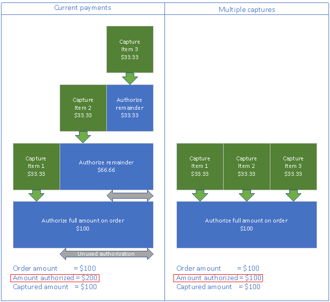

# Incremental capture for order invoicing

[!include [banner](../includes/banner.md)]

This article describes out-of-box support for incremental capture as part of order invoicing in Dynamics 365 Commerce. This article also describes how to enable incremental capture for the Dynamics 365 Payment Connector for Adyen, and how incremental capture can be added to third-party payment connectors using the payments software development kit (SDK).

When incremental capture is enabled, orders that are fulfilled over time with multiple invoices will reference the original authorization for multiple invoices and captured payments. This contrasts with legacy support for fulfilling orders with multiple invoices, which causes a new authorization to be obtained every time a portion of the order is fulfilled and the balance due changes.

Incremental capture is supported out-of-box with the Dynamics 365 Payment Connector for Adyen when orders are fulfilled from the POS and Commerce headquarters. 

Many merchants fulfill orders in multiple shipments. By default, the out-of-box process for handling credit card payments for orders that are fulfilled over multiple shipments is to capture payments as those shipments are invoiced and then get a new payment authorization for the balance due for the remaining items that must be shipped. This process ensures that payment capture can be consistently supported across payment processors. 

However, there are also some downsides. For example, when an authorization is partially captured, and a new authorization is then created for the balance due, the old authorization and new authorization might overlap. In this case, open authorizations that exceed the order total might appear against customer payment cards, possibly resulting in authorizations that exceed open balances that are available for credit cards, or card issuers blocking cards from being processed due to suspicion of fraud.

To address these issues, incremental capture support has been introduced for the Dynamics 365 Payment Connector for Adyen and payments SDK. If a processor supports incremental capture, payment connectors can be updated to capture against a single authorization multiple times over the course of order fulfillment. 

The following illustration shows the difference between the different payment capture frameworks when multiple captures are done against a single authorization.



Incremental capture support for headquarters invoicing (in other words, any invoicing that occurs as part of order fulfillment in headquarters) was first added to the payments SDK in Commerce version 10.0.13. In Commerce version 10.0.18, incremental capture support through the SDK has been extended to channels outside of headquarters. For the storefront, Store Commerce, and call center this extended support means that authorizations created for new orders can be marked as **SupportsMultipleCaptures**. When those orders are later invoiced in headquarters or Store Commerce, payments can be captured and the original authorization will be retained and referenced when payments are captured for subsequent invoices. 

## Enable incremental capture

### Prerequisite features

The following features must be enabled prior to enabling incremental capture. 

| Feature name | Description |
|---|---|
| Unified payment posting journal defaults for Commerce | This feature changes the way that business logic creates customer payment and customer refund payment journals for orders that are created through the call center, POS, or e-commerce channel. |
| Omni-channel payments | This feature enables omni-channel payment scenarios such as buy online, pick up in store (BOPIS). For more information, see [Omni-channel payments overview](../omni-channel-payments.md). |  
| Duplicate payment protection on invoicing | This feature enables duplicate payment protection for invoicing scenarios. Commerce payment functionality may affect customizations in invoicing scenarios. If your organization has invoicing customizations, make sure that they're refactored before you turn on Commerce payment functionality in production environments. | 
| Enable refunds over multiple captures | This functionality improves that capability to do multiple linked refunds against an order. |
| Enable manual void of expired credit card payment lines when authorizations are expired | This feature adds support for manual deletion of payment lines if they expire and the authorization can't be refreshed. |
| Omni-channel Commerce order payments. | This feature rationalizes payments across channels and enables editing of payments for storefront and POS orders within the call center. Previously listed features are prerequisites for this feature, so this feature should be enabled last. For more information, see [Omni-channel Commerce order payments](commerce-payments.md). |

### Enable the "Extensibility to support incremental credit card capture" feature

This feature was originally introduced for incremental capture for headquarters invoicing through the payments SDK and has been augmented to also enable incremental capture support through the Dynamics 365 Payment Connector for Adyen and all channels. 

To enable the "Extensibility to support incremental credit card capture" feature in Commerce headquarters, follow these steps.

1. Go to **System administration \> Workspaces \> Feature management**. 
1. Select the **All** tab to show all available features.
1. Search for **Extensibility to support incremental credit card capture**.
1. Select the feature and then select **Enable now**.

### Set the credit card authorization parameter

To set the credit card authorization parameter in headquarters, follow these steps.

1. Go to **Accounts receivable \> Setup \> Accounts receivable parameters**. 
1. In the left navigation pane, select **Credit card**.
1. On the **Set up information for the delivery of shipments** FastTab, under **Setup**, ensure that the **Credit card authorization** option is set to **Yes**. If set to **No**, the incremental capture functionality won't work properly.

### Enable incremental capture for the Dynamics 365 Payment Connector for Adyen

In addition to enabling the "Extensibility to support incremental credit card capture" feature, the value of the **Enable Request Protection** property must also be set to **True** in the Dynamics 365 Payment Connector for Adyen merchant properties for every channel where the connector is used. If the value is set to **False** or left blank, incremental capture won't be enabled for the connector. When the property is set to **True**, a tracking ID is added to requests to the payment provider to prevent duplicate requests. Tracking ID support for third-party payment connectors is explained in the [Uptake incremental capture for third-party payment connectors](#uptake-incremental-capture-for-third-party-payment-connectors) section below.

Some payment methods don't support incremental capture. Those payment methods can be configured in the**Non incremental capture payment methods** field of the Dynamics 365 Payment Connector for Adyen merchant properties. The value set in this field should match the "Payment Method Variant/Card type" string used by Adyen to identify card types in authorization responses. The payment method variant strings can be found in Adyen on the [PaymentMethodVariant](https://docs.adyen.com/development-resources/paymentmethodvariant). If there are multiple card types that should be exempt from incremental capture, they should be separated by semicolons. 

One example of a payment method variant that doesn't support incremental capture is Interac. In the Adyen documentation, the string listed for the Interac payment method variant is **interac**. If payment services are being configured for a Canadian merchant that accepts Interac, this payment method variant should be added to the list of "Non incremental capture payment methods" in the connector merchant properties.  

Merchants enabling incremental capture for the Dynamics 365 Payment Connector for Adyen should also contact Adyen to ensure that the **allowMultiplePartialCapture** flag set to **Yes** on their merchant account. If this flag isn't enabled at the merchant account level, the capture logic at the time of invoicing will fall back to legacy supported flows. 

## Uptake incremental capture for third-party payment connectors

To uptake support for incremental capture as part of headquarters invoicing for third-party payment connectors, and to support incremental capture across all channels, you must upgrade to the payments SDK that is provided in Commerce version 10.0.18.

### IPaymentReferenceProvider

This version of the payment SDK adds the **IPaymentReferenceProvider** interface. This interface supports using a **PaymentTrackingID** value for each request and response. The **PaymentTrackingID** value can be used to track payment requests. It also ensures that, between back-office invoicing requests and the processor, duplicate requests can be caught before they're resent. In this way, it helps prevent duplicate payments.

Here's a sample implementation from the SampleConnector.cs file in the payments SDK.

```xml
#region ITrackingSupport
/// <summary>
/// Get the payment provider reference to safeguard against duplicate requests.
/// </summary>
/// <param name="command">The payment operation that will use the tracking ID.</param>
/// <param name="amount">The payment transaction amount.</param>
/// <returns>Returns the PaymentTransactionReferenceData.</returns>
/// <remarks>List of supported commands can be seen in the constants defined in <see cref="Microsoft.Dynamics.Retail.PaymentSDK.Portable.Constants.SupportedCorrelationCommands"/></remarks>
public PaymentTransactionReferenceData GetPaymentReferenceData(string command, decimal amount)
{
    PaymentTransactionReferenceData paymentTransactionReferenceData = new PaymentTransactionReferenceData();
    paymentTransactionReferenceData.Amount = amount;
    paymentTransactionReferenceData.Command = command;
    paymentTransactionReferenceData.IdFromConnector = Guid.NewGuid().ToString();
    paymentTransactionReferenceData.InitiatedDate = DateTime.UtcNow;
    return paymentTransactionReferenceData;
}
#endregion
```

The following sample from the AuthorizeRequest.cs file in the payments SDK uses a **PaymentTrackingID** value.

```xml
authorizeRequest.PaymentTrackingId = PaymentUtilities.GetPropertyStringValue(
    hashtable,
    GenericNamespace.TransactionData,
    TransactionDataProperties.PaymentTrackingId);
```

### Support for multiple captures

If a payment processor supports multiple captures, the **SupportsMultipleCaptures** property for authorization responses from the connector should be set to **True**. If the property is set to **False**, or if it isn't provided, the authorization won't be eligible for incremental capture. In this case, if there's a new balance due after invoicing, a new authorization will be obtained. 

Here's a sample from the AuthorizationResponseProperties.cs file in the payments SDK.

```xml
/// <summary>
/// Gets the SupportsMultipleCaptures property.
/// </summary>
public static string SupportsMultipleCaptures
{
    get { return "SupportsMultipleCaptures"; }
}
```

As back-office invoicing processes captures against authorizations that are enabled for multiple captures, the total captured amount is tracked. Capture requests continue to reference the original authorization until it's fully captured.

Authorizations that are expired according to Accounts receivable parameters aren't eligible for incremental capture. 

The **SupportsMultipleCaptures** property isn't global. It's specific to the authorization. An environment might have both connectors that support incremental capture and connectors that don't support it.

## Incremental capture user experience

The incremental capture user experience is no different from the user experience when incremental capture isn't enabled. The key difference is that when incremental capture is enabled, if the original authorization is still valid, a new authorization won't be obtained after an order is partially invoiced. Instead, the existing authorization will be retained and used for subsequent payment captures. 

For users investigating payment issues in headquarters or in their processor's portal, incremental capture orders will appear as having a single authorization with multiple payment captures mapped to it, as opposed to legacy flows where authorizations and captures would have a 1:1 ratio. 

## Additional resources

[Payments FAQ](/dynamics365/unified-operations/retail/dev-itpro/payments-retail)

[Dynamics 365 Payment Connector for Adyen](adyen-connector.md?tabs=8-1-3)

[Omni-channel Commerce order payments](commerce-payments.md)

[!INCLUDE [footer-include](../../includes/footer-banner.md)]
