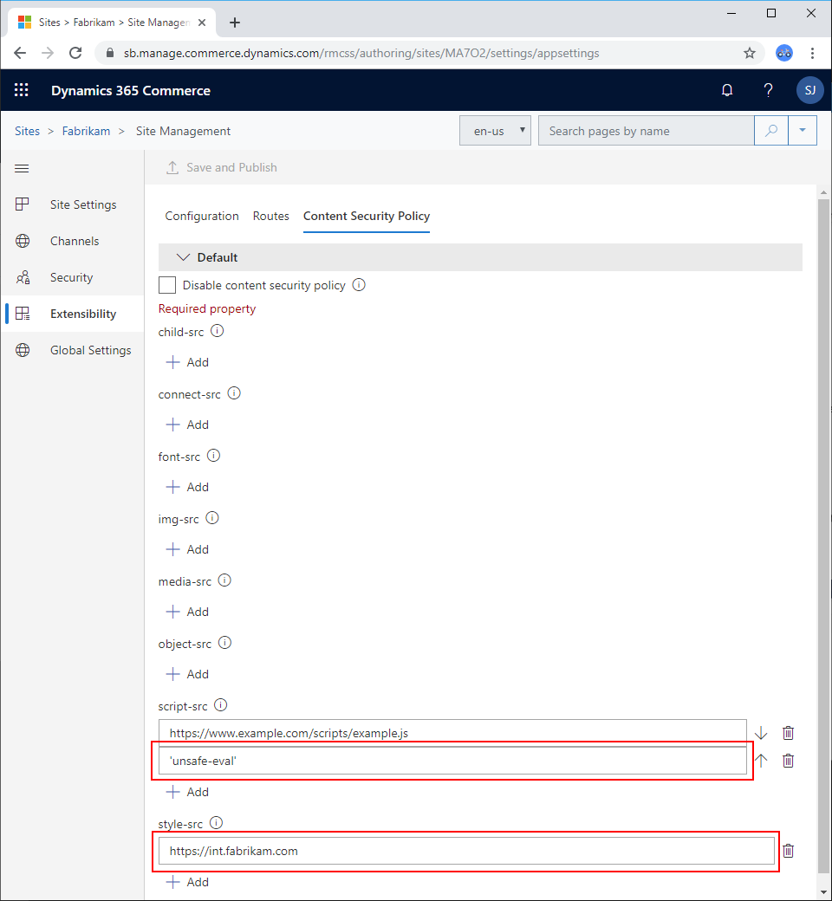

# Manage Content Security Policy (CSP)

[!include [banner](../includes/banner.md)]

This article describes how to manage Content Security Policy (CSP) in Microsoft Dynamics 365 Commerce.

CSP is an extra layer of security that helps detect and mitigate some types of web attacks. The purpose of these attacks can range from data theft, to site defacement, to the distribution of malware. CSP provides an extensive set of policy directives that help you control the resources that a site page is allowed to load. Each directive defines the restrictions for a specific type of resource.

When you turn on CSP for an e-commerce site, it helps enhance security by blocking connections, scripts, fonts, and other types of resources that come from unknown or malicious sources. In Dynamics 365 Commerce, CSP is turned on by default. However, most sites need extra configuration. The Dynamics 365 Commerce online software development kit (SDK) provides a default list of allowed source URLs that style, script, and application programming interface (API) calls can use. You can edit this list on the **Extensions** tab in the site builder tool.

For more information about CSP, see [Content Security Policy Reference](https://content-security-policy.com/).

## CSP settings

### Turn off CSP for a site

To prevent CSP from applying policies to your site, turn it off for that site in site builder.

To turn off CSP for a site, follow these steps:

1. In site builder, select the site you're working on.
1. Select **Site settings**, and then select the **Extensions** tab.
1. On the **Content security policy** tab, select the **Disable content security policy** check box.

    :::image type="content" source="../media/content-security-policy-disable.png" alt-text="Screenshot of the Disable content security check box on the Content Security Policy tab.":::

1. Select **Save and publish**.

### Enable report only mode

If you enable CSP, the browser doesn't enforce the content security policy. However, it reports any violations to URIs specified by the report-uri directive.

To enable report only mode, follow these steps:

1. In site builder, select the site you're working on.
1. Select **Site settings**, and then select the **Extensions** tab.
1. On the **Content security policy** tab, select the **Enable report only mode** check box.

### Enable nonce

When you enable nonce (number used once), it blocks the execution of all inline scripts except those scripts specified within the [inline script](../e-commerce-extensibility/script-injector.md) module. A unique cryptographic nonce is generated and added to each script specified in the CSP header.

To enable nonce, follow these steps:

1. In site builder, select the site you're working on.
1. Select **Site settings**, and then select the **Extensions** tab.
1. On the **Content security policy** tab, select the **Enable Nonce** check box.

## CSP directives in Commerce

Use the following CSP directives on Commerce sites.

| Directive   | Description |
|-------------|-------------|
| child-src   | This directive defines valid sources of web workers and nested browsing contexts that elements such as **\<frame\>** and **\<iframe\>** load. |
| connect-src | This directive defines the URLs that you can make AJAX requests to. |
| font-src    | This directive defines valid sources of fonts. |
| frame-ancestors | This directive specifies valid parents that can embed a page by using **\<frame\>**, **\<iframe\>**, **\<object\>**, **\<embed\>**, or **\<applet\>** elements. Setting this directive to "none" is similar to specifying the "X-Frame-Options: DENY" directive, which is also supported in older browsers. |
| frame-src   | This directive defines valid sources for nested browsing context loading by using elements such as **\<frame\>** and **\<iframe\>**. |
| img-src     | This directive defines valid sources of images. |
| media-src   | This directive defines valid sources of audio and video, such as HTML5 **\<audio\>** and **\<video\>** elements. |
| object-src  | This directive defines valid sources of plug-ins, such as **\<object\>**, **\<embed\>**, and **\<applet\>** elements. |
| report-uri  | This directive defines URI(s) that the browser posts CSP violation reports to. These violation reports consist of JSON documents sent through an HTTP POST request to the specified URI. |
| script-src  | This directive defines valid sources of JavaScript. |
| style-src   | This directive defines valid sources of stylesheets. |

### Example: Configure a CSP directive

The following example procedure shows how to configure a CSP directive so that an external script can be called from your site.

1. In site builder, select the site you're working on.
1. Select **Site settings**, and then select the **Extensions** tab.
1. On the **Content security policy** tab, under **script-src**, select **Add**, and then enter the full URL of the external script that you want to call.

    :::image type="content" source="../media/content-security-policy.png" alt-text="Screenshot of the URL for an external script on the Content Security Policy tab.":::

1. Select **Save and publish**.

## Interpret and fix CSP errors

When you first configure CSP for a site, some pages might not load at all or might not work as intended. CSP blocks external connections, scripts, fonts, and other types of resources from loading. Fortunately, CSP logs some helpful errors that you can use to fix, tune, and clean up unwanted or unneeded requests.

The following illustration shows an example of CSP errors in a web browser's developer tools.


There are two CSP errors in this example:

- The **Eval** function is blocked by default, because it can cause arbitrary JavaScript execution. To allow this function, add **'unsafe-eval'** to your site's **script-src** directive. The single quotation marks are required.
- The external stylesheet is blocked. To allow a stylesheet to be loaded from an external domain, add the URL to your site's **style-src** directive.

The following screenshot shows what the fixed settings look like on the **Content Security Policy** tab in Commerce.



## Update page mocks that use CSP

If you're testing modules by using the online SDK in a development environment, you can also add CSP by using page mocks. In a page mock, you must either add a top-level **"appContext"** property or go to the existing top-level **"appContext"** property, and create a property under it that is named **"contentSecurityPolicy"**. Add key/value pairs of directives to policies, as shown in the following example.

```json
"appContext": {
	"contentSecurityPolicy": {
		"script-src": ["https://www.w3schools.com/js/myScript.js"],
		"font-src": ["https://*.commerce.dynamics.com"]
	}
}
```

> [!NOTE]
> If you add CSP policies in a page mock, the page mock doesn't include any of the default CSP policies that the platform provides.

You can turn off CSP in a page mock by using the following code.

```json
"appContext": {
	"contentSecurityPolicy": {
		"disableContentSecurityPolicy": true
	}
}
```

## Additional resources

[Manage e-commerce users and roles](../manage-ecommerce-users-roles.md)

[Add script code to site pages to support telemetry](../add-telemetry.md)

[Search engine optimization (SEO) considerations for your site](../search-engine-optimization-considerations.md)

[!INCLUDE[footer-include](../../includes/footer-banner.md)]
