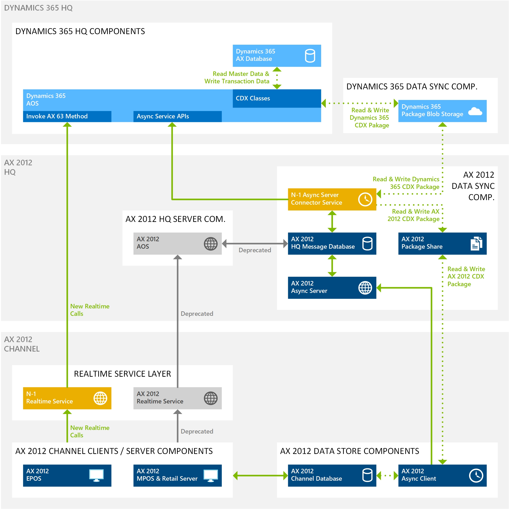
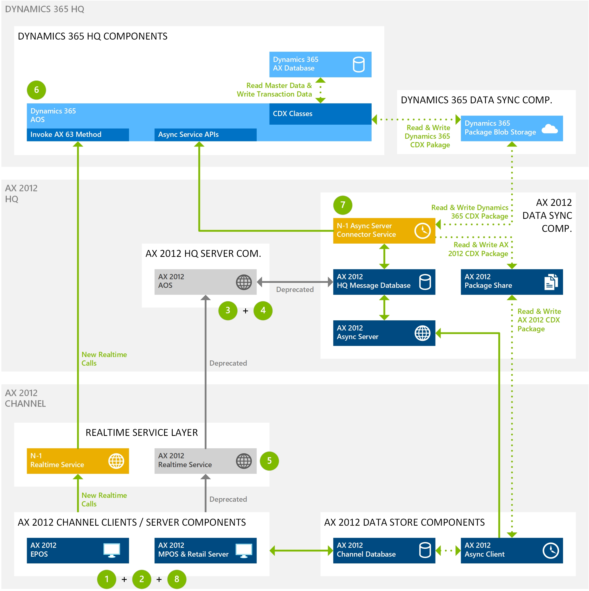

# Phased Rollout (N-1) installation, configuration, and cutover guide

[!include [banner](../../includes/banner.md)]

> [!WARNING]
> Support for Microsoft Dynamics AX 2012 R3 is ending. Although upgrade and migration are still supported, make a note of the dates that are relevant to this end of support. For more information, see [End of mainstream support for Microsoft Dynamics AX 2012 R3](../../fin-ops-core/fin-ops/get-started/mainstream-support-ax-2009-2012.md).

This article explains how to set up Phased Rollout (N-1) components so that your Microsoft Dynamics AX 2012 R3 channel components, such as Microsoft Dynamics AX for Retail Modern Point of Sale (MPOS) and Commerce Scale Unit, or Microsoft Dynamics AX for Retail Enterprise Point of Sale (EPOS), can work with Microsoft Dynamics 365 Commerce Headquarters.

## Key terms

| Term | Description |
|---|---|
| N-1 Async Server Connector Service | A component that is used to synchronize data packages between Headquarters and the AX 2012 R3 channel components. |
| N-1 Real-time Service | A component that supports real-time calls from the AX 2012 R3 channel components to Headquarters. |

## Overview

The sections in this article describe the following steps, which you must complete to set up an environment with N-1 components. These steps assume that Headquarters is already deployed, and that an AX 2012 R3 environment is currently running.

- **[Set up Azure AD accounts](#set-up-azure-ad-accounts)** – This section explains how to set up the Microsoft Azure Active Directory (Azure AD) accounts that the N-1 components use to connect to Headquarters.
- **[Configure N-1 components](#configure-n-1-components)** – This section explains how to configure the N-1 components in Headquarters.
- **[Install N-1 components](#install-n-1-components)** – This section explains how to download and install N-1 components in the existing AX 2012 R3 environment.
- **[Cutover steps to switch to N-1](#cutover-steps-to-switch-to-n-1)** – This section explains how to use the new N-1 components to cut an existing AX 2012 R3 environment over from the AX 2012 R3 headquarters to the Dynamics 365 Headquarters.
- **[Troubleshooting steps](#troubleshooting-steps)** – This section describes troubleshooting steps for typical issues.
- **[Required KBs for N-1](#required-kbs-for-n-1)** – This section lists the Microsoft Knowledge Base articles (KBs) that are required in order to set up an N-1 environment.

### High-level architecture

The following illustration shows a high-level overview of the N-1 setup.

## Verify that the N-1 license key is turned on

Before you start to configure and install the N-1 components, make sure that the corresponding license key is turned on. This license key is automatically turned on during an upgrade from AX 2012 R3 to Microsoft Dynamics 365 Commerce. However, because the steps that follow require this key, you should verify that it's turned on before you continue.

1. Sign in to Commerce Headquarters, and go to **System administration \> Setup \> License configuration**.
2. On the **Configuration keys** tab, expand the **Commerce** key, expand the **Commerce scheduler** key, and verify that the check box for the **Retail Data Commerce Exchange backward compatibility** key is selected.

    > [!NOTE]
    > If the key isn't turned on, contact Microsoft Support for help turning it on.

## Set up Azure AD accounts

> [!IMPORTANT]
> To help maintain a high level of security across the company, we strongly recommend that you create a new client ID and secret for this installation. This step requires a new Web App.

1. Generate an Azure Web App to create a client ID and secret for Connector for Microsoft Dynamics AX. For instructions, see the "Create an Azure Active Directory application" section in [Create an Azure Active Directory Application](/azure/azure-resource-manager/resource-group-create-service-principal-portal).
2. After you've finished creating the client ID and secret, the client ID must be accepted in Commerce. Go to **System administration \> Setup \> Azure Active Directory applications**. Enter the client ID in the **Client Id** column, enter descriptive text in the **Name** column, and enter **RetailServiceAccount** in the **User ID** column.

## Configure N-1 components

Follow the steps in this section to configure the N-1 components in Headquarters.

### Connector for Microsoft Dynamics AX

1. Sign in to Commerce Headquarters, and go to **Retail and Commerce \> Headquarters setup \> Commerce scheduler \> Connector for Microsoft Dynamics AX**.
2. On the Action Pane, select **New**, and set the following fields.

    | Section | Field | Description | Sample value |
    |---|---|---|---|
    | Header | Profile | Enter a unique name for the N-1 profile that you're setting up. You should create one profile for each environment/server where the AX 2012 R3 Real-time Service is currently installed. | AXConnect |
    | Header | Description | Enter descriptive text to help identify the profile. | Connector for AX2012 |
    | **Connection** | Server | Enter the name of the server where the N-1 Real-time Service will be installed. (This server is the same server where the AX 2012 R3 Real-time Service is currently installed.) | sampleserver.local |
    | **Connection** | Port | Enter the port that the N-1 Real-time Service will use. | 8017 |
    | **Connection** | Web application name | Enter the name to use for the N-1 Real-time Service in Microsoft Internet Information Services (IIS). | Real-timeServiceAX63 |
    | **Connection** | Protocol | Select the protocol that the AX 2012 R3 Real-time Service currently uses. | https |
    | **Connection** | Common name | Enter the friendly name of the certificate that the N-1 Real-time Service uses. | samplecertificate.local |
    | **Connection** | Passphrase | Enter the passphrase to use for the N-1 Real-time Service. | |
    | **Connection** | Language | Select the language that is associated with the stores that are mapped to the N-1 Real-time service. | EN-US |

3. When you've finished, select **Save**.

### Commerce shared parameters

1. Sign in to Headquarters, and go to **Retail and Commerce \> Headquarters setup \> Parameters \> Commerce shared parameters**.
2. On the **Security** tab, set the following fields.

    | Field | Description | Sample value |
    |---|---|---|
    | Real-time Service profile | Select the profile that you created on the **Connector for Microsoft Dynamics AX** page in the previous section. | AXConnect |
    | TS password encryption name | Enter the algorithm that is used to connect to the transaction service. You should set this field to **SHA256**. | SHA256 | 
    | Legacy device algorithm | Enter the AX 2012 R3 device algorithm. | AES |

### Commerce scheduler parameters

1. Sign in to Headquarters, and go to **Retail and Commerce \> Headquarters setup \> Parameters \> Commerce scheduler parameters**.
2. On the **HQ Message Database** FastTab, set the following fields.

    | Field | Description | Sample value |
    |---|---|---|
    | SQL Server instance name | Enter the name of the Microsoft SQL Server instance that hosts the existing AX 2012 R3 HQ Message Database. | sampleinstance |
    | Server name | Enter the name of the server that hosts the existing AX 2012 R3 HQ Message Database. | sampleserver |
    | Database name | Enter the name of the AX 2012 R3 HQ Message Database. In AX 2012 R3, the default name was **HQMessageDB**. | HQMessageDB |

3. When you've finished, select **Save**.

### Working folders

> [!NOTE]
> The field values that are described here are the default values that are automatically set when environments are upgraded from AX 2012 R3. However, you should verify that they are correct. These values must be manually entered for environments that haven't been upgraded from AX 2012 R3.

1. Sign in to Headquarters, and go to **Retail and Commerce \> Headquarters setup \> Commerce scheduler \> Working folders**.
2. Make sure that the following field values are set in the grid.

    | Field | Description | Sample Value |
    |---|---|---|
    | Name | The name of the working folder. | File storage for N-1 |
    | Description | A description of the working folder. | File storage for N-1 |
    | Download path | The network path where the AX 2012 R3 Commerce Data Exchange (CDX) download packages are stored. | \\\\sampleserver\\Download |
    | Upload path | The network path where the AX 2012 R3 CDX upload packages are stored. | \\\\sampleserver\\Upload |

3. When you've finished, select **Save**.

### Channel database group

> [!NOTE]
> The field values that are described here are the default values that are automatically set when environments are upgraded from AX 2012 R3. However, you should verify that they are correct. These values must be manually entered for environments that haven't been upgraded from AX 2012 R3.

1. Sign in to Headquarters, and go to **Retail and Commerce \> Headquarters setup \> Commerce scheduler \> Channel database group**.
2. For each physical channel database in the AX 2012 R3 environment, on the Action Pane, select **New**, and set the following fields.

    | Section | Field | Description | Sample value |
    |---|---|---|---|
    | Header | Name | Enter the name of the channel database group that is used for the AX 2012 R3 environment. | Default\_AX63 |
    | Header | Description | Enter a description of the channel database group that is used for the AX 2012 R3 channel environment. | Default group for AX63 channel database |
    | **General** FastTab | Channel schema | Select the AX 2012 R3 schema. This field must be set to **AX2012R3**. | AX2012R3 |
    | **General** FastTab | Working folders | Select the reference to the working folders record that is used for the synchronization of CDX data packages. You created this working folders record in the previous section. | workingfolder |

3. When you've finished, select **Save**.

### Channel database

> [!NOTE]
> The field values that are described here are the default values that are automatically set when environments are upgraded from AX 2012 R3. However, you should verify that they are correct. These values must be manually entered for environments that haven't been upgraded from AX 2012 R3.

1. Sign in to Headquarters, and go to **Retail and Commerce \> Headquarters setup \> Commerce scheduler \> Channel database**.
2. For each physical channel database in the AX 2012 R3 environment, on the Action Pane, select **New**, and set the following fields.

    | Section | Field | Description | Sample value |
    |---|---|---|---|
    | Header | Channel database ID | Enter a unique identifier for the physical channel database. This value should be derived from the AX 2012 R3 environment. | Default\_AX63\_Database |
    | Header | Channel database group | Select the channel database group that the channel database is mapped to. This value should be derived from the AX 2012 R3 environment. | Default\_AX63\_DatabaseGroup |
    | Header | Type | Select the type of the channel database record. This field must be set to **Channel database**. | Channel database |
    | Header | Data sync interval | Select the interval at which to run the CDX data synchronization. **This field must be left blank.** | |
    | Header | Username (Case Sensitive) | Enter the user name to use to connect to the AX 2012 R3 channel database. | channeluser |
    | Header | Password | Enter the password to use to connect to the AX 2012 R3 channel database. | *passphrase* |
    | Header | Database name | Enter the name of the AX 2012 R3 channel database. | SampleChannelDB |
    | Header | Server name | Enter the name of the server that hosts the AX 2012 R3 channel database. | sampleserver |
    | **Channel** FastTab | Channel | Select **Add** to add the list of channels for Phased Rollout (N-1) that are mapped to the channel database. The values should be derived from the AX 2012 R3 environment. | London |

3. When you've finished, select **Save**.

### Channel profiles

> [!IMPORTANT]
> This section applies only if the existing AX 2012 R3 environment uses Retail Server to interact with the channel database. If direct channel database access is enabled from the AX 2012 R3 MPOS, you can skip this step.

> The field values that are described here are the default values that are automatically set when environments are upgraded from AX 2012 R3. However, you should verify that they are correct. These values must be manually entered for environments that haven't been upgraded from AX 2012 R3.

1. Sign in to Headquarters, and go to **Retail and Commerce \> Channels \> Stores \> All stores**.
2. For each Retail Server that is hosted in the N-1 environment, on the Action Pane, select **New**, and set the following fields.

    | Section | Field | Description | Sample value |
    |---|---|---|---|
    | Header | Name | Enter a unique name for the N-1 channel profile that you're setting up. You should create one profile per environment/server where you currently have installed the AX 2012 R3 Retail Server. You should create one profile for each environment/server where the AX 2012 R3 Retail Server is currently installed. | Default\_AX63\_Profile |
    | **Profile properties** | Property key | Enter the key for the Retail Server URL that is used in the AX 2012 R3 environment. This field must be set to **Retail Server URL**. | Retail Server URL |
    | **Profile properties** | Property value | Enter the Retail Server URL that is used in the AX 2012 R3 environment. | `http://localhost"35080/RetailServer/V1` |
    | **Profile properties** | Property key | Enter the key for the Hardware Station URL that is used in the AX 2012 R3 environment. | Hardware Station URL |
    | **Profile properties** | Property value | Enter the Hardware Station URL that is used in the AX 2012 R3 environment. | ipc://localhost |

3. When you've finished, select **Save**.

### All stores

> [!NOTE]
> The field values that are described will be set if the Headquarters environment was upgraded from the AX 2012 R3 headquarters.

1. Sign in to Headquarters, and go to **Retail and Commerce \> Channels \> Stores \> All stores**.
2. For each store that is mapped to the N-1 environment, select the channel ID. Then, on the store details page, on the **General** FastTab, set the following fields.

    | Field | Description | Sample value |
    |---|---|---|
    | Live channel database | Select the channel database that you mapped the store to and set it up for earlier. | Default\_AX63\_Database |
    | Channel profile | Select the channel profile that you mapped the store to and set it up for in the previous section. | Default\_AX63\_Profile |

3. When you've finished, select **Save**.

### Initialize the AX 2012 scheduler

1. Sign in to Headquarters, and go to **Retail and Commerce \> Headquarters setup \> Commerce scheduler \> Initialize AX 2012 retail scheduler**.
2. Select **OK**.

### Distribution schedule

> [!NOTE]
> The field values that are described will be set if the Headquarters environment was upgraded from the AX 2012 R3 headquarters.

1. Sign in to Headquarters, and go to **Retail and Commerce \> Retail and Commerce IT \> Distribution schedule**.
2. In the left pane, select each distribution schedule that has the suffix **AX63**. Then, on the **Channel database groups** FastTab, make sure that the entries that you created earlier are mapped to the distribution schedule.

### Workers

> [!NOTE]
> The field values that are described will be set if the Headquarters environment was upgraded from the AX 2012 R3 headquarters.

1. Sign in to Headquarters, and go to **Retail and Commerce \> Employees \> Workers**.
2. Select the name of each worker who will sign in to the AX 2012 R3 environment. Then, on the worker details page, on the **Commerce** tab, on the **Commerce** FastTab, set the **Password** field.

## Install N-1 components

Before you run the Connector for Microsoft Dynamics AX installers, make sure that the following requirements are met:

- The installer requires that the Microsoft .NET Framework version 4.5.1 be installed on the system.
- The installers install the Connector for Microsoft Dynamics AX applications only on the following operating systems. Before you install any component, you must update the operating system with all service packs and updates that are available for it.

    - Windows 7 Professional, Enterprise, or Ultimate edition (both x86 and x64 architectures). Home edition and embedded edition aren't supported.
    - Windows 8.1 Update 1 Pro or Enterprise edition (both x86 and x64 architectures). Standard edition isn't supported.
    - Windows 10 Pro or Enterprise edition (both x86 and x64 architectures). Home edition isn't supported.
    - Microsoft Windows Server 2012 R2 or Microsoft Windows Server 2016.

### Async Server Connector Service

The installer validates that all prerequisites are met. These prerequisites include SQL prerequisites, such as a local installation of SQL Server, or the alternative prerequisites, such as SQL Command Line Utilities and other required SQL connectivity installations.

To meet prerequisites, the SQL Server that is connected to must have Full-text search and, at a minimum, support for Transport Layer Security (TLS) 1.2. For Microsoft SQL Server 2012, Service Pack 3 must be installed, at a minimum. For Microsoft SQL Server 2014, Service Pack 2 must be installed.

If a system restart is required, the installer shows this requirement. Although the restart is recommended, the installer can continue without it.

When you're ready, follow these steps to download and install the component.

1. Sign in to Headquarters, and go to **Retail and Commerce \> Headquarters setup \> Commerce scheduler \> Connector for Microsoft Dynamics AX**.
2. Select the connector that you created earlier.
3. On the Action Pane, on the **Download** tab, select **Async Server Connector service** to download the installer file, and then select **Configuration file** below **Async Server Connector service** to download the corresponding configuration file. Make sure that the configuration file is saved next to the installer file.
4. After the installer and configuration files are downloaded, double-click the installer file, and follow these steps:

    1. Verify the Application Object Server (AOS) URL (the URL that is used to access Headquarters), and then select **Next**.
    2. If a specific user is required, enter the user name and password that the service should run as. By default, the installer automatically generates a service account to use. This approach is more secure and is recommended, but it can't be used when the database is located on a separate computer. Select **Next** to continue.
    3. Enter the application ID (client ID) and secret that are associated with this Connector for Microsoft Dynamics AX installation.
    4. Select **Install**.

    > [!NOTE]
    > - For information about how to correctly generate an Azure Web App to create a client ID and secret, see the "Basics of Registering an Application in Azure AD" section in [Create an Azure Active Directory Application](/azure/azure-resource-manager/resource-group-create-service-principal-portal).
    > - When you create the Web App, the initial URI and URL don't have to be any specific value. Only the application ID (client ID) and secret that are created are important.

5. After an application ID (client ID) and secret are created, the application ID must be accepted in Commerce. Go to **Retail and Commerce \> Headquarters setup \> Azure Active Directory applications**. Enter the application ID in the **Client Id** column, enter descriptive text in the **Name** column, and enter **RetailServiceAccount** in the **User ID** column.
6. Sign in to Headquarters, and go to **Retail and Commerce \> Headquarters setup \> Parameters \> Commerce shared parameters**.
7. On the **Identity Providers** tab, select the provider that has an **Issuer** value that begins with `HTTPS://sts.windows.net/`. The values on the **Relying parties** FastTab are automatically set, based on your selection.
8. On the **Relying parties** FastTab, select **Add**. Enter the application ID (client ID) that was created for this installation. Set the **Type** field to **Public** and the **UserType** field to **Worker**. Then, on the Action Pane, select **Save**.
9. On the Action Pane, select **Save**.

### N-1 Real-time service

1. Sign in to Headquarters, and go to **Retail and Commerce \> Headquarters setup \> Commerce scheduler \> Connector for Microsoft Dynamics AX**.
2. Select the connector that you created earlier.
3. On the Action Pane, on the **Download** tab, select **Real-time service for Dynamics AX 2012 R3** to download the installer file, and then select **Configuration file** below **Real-time service for Dynamics AX 2012 R3** to download the corresponding configuration file. Make sure that the configuration file is saved next to the setup file.
4. After the installer and configuration files are downloaded, double-click the installer file, and follow these steps:

    1. Verify the AOS URL (the URL that is used to access Headquarters), and then select **Next**.
    2. Select a valid SSL certificate to use for HTTPS communication, and then select **Next**.

        The certificate must use private key storage, and server authentication must be listed in the enhanced key usage property. Additionally, the certificate must be trusted locally, and it can't be expired. It must be stored in the personal certificate store location on the local computer.

    3. If a specific user is required, enter the user name and password that the application pool should run as. By default, the installer automatically generates a service account to use. This approach is more secure and is recommended, but it can't be used when the database is located on a separate computer. Select **Next** to continue.
    4. Verify the HTTPS port that should be used, and verify that the host name of the computer is correct. Select **Next** to continue.

        The HTTPS port is listed in the Store system profile. To access the Store system profile, on the **Store details** page, on the **Store systems** FastTab, select the profile ID of the selected Store system. The installer automatically enters the host name. If the host name must be changed for the installation, change it here. The host name must be the fully qualified domain name (FQDN) of the system, and it must match the value that you entered on the **Connector for Microsoft Dynamics AX** page earlier in this article.

    5. Enter the application ID (client ID) and secret that are associated with this Connector for Microsoft Dynamics AX installation. Then select **Install**.

        This application ID and secret can be the same application ID and secret that you used in the Async Server Connector service installation. For information about how to correctly generate an Azure Web App to create a client ID and secret, see the "Basics of Registering an Application in Azure AD" section in [Create an Azure Active Directory Application](/azure/azure-resource-manager/resource-group-create-service-principal-portal). When you create the Web App, the initial URI and URL don't have to be any specific value. Only the application ID (client ID) and secret that are created are important.

## Cutover steps to switch to N-1

This section gives the recommended step-by-step instructions to switch an existing AX 2012 R3 channel environment from the AX 2012 R3 headquarters to the Commerce Headquarters. Note that these instructions are generic. Different implementations will likely have to deviate from these steps to accommodate specific business or technical requirements.

### Prerequisites

Follow these steps to prepare your environment for the cutover.

| Step | Details | Timeline |
|---|---|---|
| 1. Deploy Headquarters. | Headquarters is up and running. Cloud POS (CPOS) can be used to validate functionality in the environment. | Weeks or months before the cutover |
| 2. Install the Commerce application (X++) KBs. | Install the KBs that are listed in the [Required KBs for N-1](#required-kbs-for-n-1) section to make sure all issues that are related to N-1 are addressed. | Weeks or months before the cutover |
| 3. Set up Azure AD accounts. | Follow the instructions in the [Set up Azure AD accounts](#set-up-azure-ad-accounts) section to create the accounts that are required for the N-1 components to authenticate against Headquarters. | Weeks or months before the cutover |
| 4. Configure Headquarters. | Follow the instructions in the [Configure N-1 components](#configure-n-1-components) section to configure all the settings for the N-1 components before they are installed. | Weeks or months before the cutover |
| 5. Configure Headquarters. | Go to **Retail and Commerce** &gt; **Headquarters setup** &gt; **Parameters** &gt; **Commerce shared parameters**, select the **Security** tab, and change the value in **TS password encryption name** to "SHA256". |
| 6. Install the N-1 components. | Follow the instructions in the [Install N-1 components](#install-n-1-components) section to install the N-1 components. Note that the N-1 Async Server Connector Service component should be installed but immediately turned off to ensure that AX 2012 R3 and Dynamics 365 CDX packages aren't mixed. | Weeks or months before the cutover |

### Preparation

Follow these steps to prepare a few days before the cutover is scheduled.

| Step | Details | Timeline | How to validate that this step is done |
|---|---|---|---|
| 1. Stop all AX 2012 R3 download jobs. | Make sure that all AX 2012 R3 download jobs are stopped in the AX 2012 R3 headquarters. | At least a couple days before the cutover | All packages in the AX 2012 R3 network share for upload jobs are processed, and no new packages appear. |
| 2. Do a full synchronization of all **AX63** CDX download jobs in Headquarters. | Run the CDX download jobs to make sure that the packages are generated and dropped in the Azure Blob storage blob, so that the N-1 Async Server Connector Service can consume them during cutover. | At least a couple days before the cutover | CDX download jobs are in the **Available** state on the **Download Sessions** page in Headquarters. |

### Cutover steps

Follow these steps to do the actual cutover.

| Step | Details | Timeline | How to validate that this step is done |
|---|---|---|---|
| 1. Close all shifts. | Make sure that all shifts are closed. | After store closing | Manually validate with the stores that the shifts are closed. |
| 2. Clean up any suspended transactions. | Make sure that all suspended transactions are cleaned up. | After the previous step | Manually validate with the stores that the shifts are closed. |
| 3. Synchronize all transactional data. | Make sure that all transactional data is synchronized through the CDX upload jobs to the AX 2012 R3 headquarters. | After the previous step | All packages in the AX 2012 R3 network share for upload jobs are processed, and no new packages appear. |
| 4. Disable AX 2012 R3 CDX upload jobs. | Make sure that all AX 2012 R3 upload jobs are disabled, so that packages are no longer being picked up. | After the previous step | Manually validate through the AX 2012 R3 headquarters UI that the CDX upload jobs are disabled. |
| 5. Shut down the AX 2012 R3 Real-time Service. | Connect to the server that hosts the AX 2012 R3 Real-time Service, start IIS, right-click the AX 2012 R3 Real-time Service, and stop the service. | After the previous step | Manually validate in IIS that the service is stopped. |
| 6. Run the **Reset metadata synchronization** command in Headquarters. | In Microsoft Dynamics AX, go to **Retail and Commerce \> Headquarters setup \> Commerce scheduler \> Connector for Microsoft Dynamics AX**, and select **Reset metadata synchronization** to reset the **HQMessageDB** database in the AX 2012 R3 environment for N-1 cutover. | After the previous step | Not applicable |
| 7. Turn on the N-1 Async Server Connector Service. | Connect to the server that hosts the N-1 Async Server Connector Service, and enable the Microsoft Windows service. | After the previous step | The status of download jobs on the **Download Sessions** page in Headquarters changes from **Available** to **Applied**. |

The following illustration is a visual representation of these steps.

## Troubleshooting steps

This section describes some typical issues that you might encounter, and the steps that you can follow to investigate or recover from them.

### Runtime

This section describes troubleshooting steps for errors that you might encounter during the runtime of the application.

#### Metadata synchronization fails

| Field | Value |
|---|---|
| Event Log | Microsoft-Dynamics-Commerce-AsyncServerConnectorService/Operational |
| Sample Event Log Error Message | Async server connector service encounters error in download timer tick. CorrelationId {4c9cd9a0-d4e3-43e5-80da-59ea2eb01acf}; Error details: Microsoft.Dynamics.Retail.AsyncServerConnector.Service.Exceptions.SyncMetadataException: Failed synchronizing metadata. ---\> Microsoft.Dynamics.Retail.AsyncServerConnector.Service.Exceptions.MessageDBOperationException: Failed updating metadata in HQ message DB. ---\> System.Data.SqlClient.SqlException: A connection was successfully established with the server, but then an error occurred during the login process. (provider: SSL Provider, error: 0 - The certificate chain was issued by an authority that is not trusted.) ---\> System.ComponentModel.Win32Exception: The certificate chain was issued by an authority that is not trusted |
| Troubleshooting Steps | This could have happened because the Synch service web.config connection string has the TrustServerCertificate set to false. To fix the issue browse the Sync service website and open the web.config. Find the connectionStrings section, update the TrustServerCertificate to True if it is false. |

#### Metadata synchronization fails

| Field | Value |
|---|---|
| Event Log | Microsoft-Dynamics-Commerce-AsyncServerConnectorService/Operational |
| Sample Event Log Error Message | Async server connector service encounters error in download timer tick. CorrelationId {73d9d0d3-4d12-42ca-ac65-3f1f947c7840}; Error details: Microsoft.Dynamics.Retail.AsyncServerConnector.Service.Exceptions.SyncMetadataException: Failed synchronizing metadata. ---\> Microsoft.Dynamics.Retail.AsyncServerConnector.Service.Exceptions.MessageDBOperationException: Failed updating metadata in HQ message DB. ---\> System.Data.SqlClient.SqlException: Cannot open database "HQMessageDB" requested by the login. The login failed. Login failed for user 'localhost\\RetailAsUser'. |
| Troubleshooting Steps | This could have happened because the user who runs the Async server connector service does not have access to the HQ message database. To fix the issue run services.msc, check the user who runs the Async server connector service. Provide this user access to HQ message database in SQL. |

#### Metadata synchronization fails, or CDX jobs are successfully downloaded but aren't applied

| Field | Value |
|---|---|
| Event Log | Microsoft Dynamics AX Retail : Async Client SynchClientService |
| Sample Event Log Error Message | Unable to communicate with server for download. Please check username/password, server and database connections. Error Details: System.ServiceModel.CommunicationException: An error occurred while making the HTTP request to `https://localhost:44300/SynchService/DownloadService.svc`. This could be due to the fact that the server certificate is not configured properly with HTTP.SYS in the HTTPS case. This could also be caused by a mismatch of the security binding between the client and the server. ---\> System.Net.WebException: The underlying connection was closed: An unexpected error occurred on a send. ---\> System.IO.IOException: Authentication failed because the remote party has closed the transport stream. |
| Troubleshooting Steps | This could have happened because of the following reasons.  1) The user ID and password that we provide in async client does not match the channel database user ID and password that we provide in AX.  2) The async service end point is not reachable. `https://localhost:44300/SynchService/DownloadService.svc`. It is critical to note that typically the user is in the form of **Contoso/Administrator** (domain/user). In the following steps, this has been known to cause errors (communication or inability to save) if the domain is utilized in the **AsyncClientConfigurationUtility** utility. We recommend that the user ID in this utility does not contain the domain prefix that is used in the server installation and configuration.  To fix this issue:  1) Launch the Async client configuration utility (AsyncClientConfigurationUtility.exe) from the async client install location. Under the **Async Server connection tab > Authentication information (case sensitive) > Update the Channel database ID, User name and Password** fields as per the values provided under N-1 channel database (**Retail and Commerce > Headquarters setup > Channel database**) in AX.  2) Select **Test connection** in the utility. If the connection is successful, restart the Async client service. If the connection fails, go to N-1 channel database (**Retail and Commerce-> Headquarters setup > Channel database**) in AX, update the Username and password, and then save. Go to **Retail scheduler parameters** in AX and select **Reset metadata synchronization**. This will populate the HQ message database with the new values. Repeat step 1 again.  3) If the async server end point (`https://localhost:44300/SynchService/DownloadService.svc`) is not reachable, check the bindings of the service and make sure there is an associated certificate. If the issue still exists, check to be sure that the **Working folders** were specified for all the Channel database groups that were linked to `AX2012R3` retail channel schema. |

#### CDX jobs are successfully downloaded but aren't applied

| Field | Value |
|---|---|
| Event Log | Microsoft Dynamics AX Retail : Async Client SynchClientService |
| Sample Event Log Error Message | Exception during DownloadAgent.Execute. Error Details: System.IO.FileNotFoundException: Could not load file or assembly 'Microsoft.Dynamics.Retail.StoreConnect.Request.Base, Version=6.3.0.0, Culture=neutral, PublicKeyToken=31bf3856ad364e35' or one of its dependencies. The system cannot find the file specified. File name: 'Microsoft.Dynamics.Retail.StoreConnect.Request.Base, Version=6.3.0.0, Culture=neutral, PublicKeyToken=31bf3856ad364e35' at Microsoft.Dynamics.Retail.SynchClient.Core.DownloadAgent.ApplySessionFileToClientDatabase(SessionManager sessionMgr, String fileName) at Microsoft.Dynamics.Retail.SynchClient.Core.DownloadAgent.ProcessDownloadSession(DownloadSession session) at Microsoft.Dynamics.Retail.SynchClient.Core.DownloadAgent.Execute() |
| Troubleshooting Steps | This could have happened because the AX63 store connect components were not installed on the environment. To fix the issue install the AX63 store connect components on the environment that is running the async client component. |

#### N-1 Async Server Connector Service communication exception

| Field | Value |
|---|---|
| Event Log | Microsoft Dynamics AX Retail : Async Client SynchClientService |
| Sample Event Log Error Message | Unable to communicate with server for download. Please check username/password, server and database connections. Error Details: System.ServiceModel.CommunicationException: An error occurred while making the HTTP request to `https://localhost:44300/SynchService/DownloadService.svc`. This could be due to the fact that the server certificate is not configured properly with HTTP.SYS in the HTTPS case. This could also be caused by a mismatch of the security binding between the client and the server. ---\> System.Net.WebException: The underlying connection was closed: An unexpected error occurred on a send. ---\> System.IO.IOException: Authentication failed because the remote party has closed the transport stream. |
| Troubleshooting Steps | Make sure the HQ Message DB has data. Use the asyncClient configuration tool to validate the connection is successful. |

#### AX 2012 R3 MPOS activation fails with an error on step 1

| Field | Value |
|---|---|
| Event Log | Microsoft Dynamics AX Retail : Retail Server RetailServer |
| Sample Event Log Error Message | Microsoft.Dynamics.Commerce.Runtime.UserAuthenticationException: An error occurred during logon. ---\> Microsoft.Dynamics.Commerce.Runtime.ConfigurationException: The published channel cannot be found in local database. Please make sure at least 1 retail channel is published to this DB through AX. |
| MPOS Error on Activation Screen | DA1002: A server side error occurred that prevents user from logging on. Please check the server log for detailed information or contact your IT support. |
| Troubleshooting Steps | Make sure the CDX download jobs ran successfully and the channel database has data. |

#### AX 2012 R3 MPOS activation fails with an error on step 2

| Field | Value |
|---|---|
| Event Log | Microsoft Dynamics Retail Modern POS |
| Sample Event Log Error Message | Dynamics-Error: LoginViewModel ActivateDevice Logon failed. ErrorMessage: ; ErrorCode: Microsoft\_Dynamics\_Commerce\_Runtime\_HeadquarterTransactionServiceMethodCallFailure; |
| MPOS Error on Activation Screen | DA2001 |
| Troubleshooting Steps | Device you are trying to activate is already active. Please deactivate the device and try the activation. |

#### AX 2012 R3 MPOS activation fails with an error on step 2

| Field | Value |
|---|---|
| Sample Event Log Error Message | Exception occurred: [04/19/2018 19:26:51] Microsoft.Dynamics.Commerce.Runtime.UserAuthenticationException: An error occurred during logon. ---\> Microsoft.Dynamics.Commerce.Runtime.StorageException: Failed to read from the database. See inner exception for details. DatabaseErrorCode: 0 ---\> Microsoft.Dynamics.Commerce.Runtime.Data.DatabaseException: Invalid object name 'crt.EMPLOYEEPERMISSIONSVIEW'. ---\> System.Data.SqlClient.SqlException: Invalid object name 'crt.EMPLOYEEPERMISSIONSVIEW'. at System.Data.SqlClient.SqlConnection.OnError(SqlException exception, Boolean breakConnection, Action'1 wrapCloseInAction) at System.Data.SqlClient.TdsParser.ThrowExceptionAndWarning(TdsParserStateObject stateObj, Boolean callerHasConnectionLock, Boolean asyncClose) |
| MPOS Error on Activation Screen | DZ1001 |
| Troubleshooting Steps | Device you are trying to activate is already active. Please deactivate the device and try the activation. |

#### AX 2012 R3 MPOS activation fails with an error on step 9

| Field | Value |
|---|---|
| Event Log | Microsoft Dynamics Retail Modern POS |
| Sample Event Log Error Message | Dynamics-Error: LoginViewModel ActivateDevice Logon failed. ErrorMessage: Sorry, something went wrong with the encryption on your device. Please contact your system administrator.; ErrorCode: MICROSOFT\_DYNAMICS\_POS\_DATAENCRYPTIONERROR; |
| MPOS Error on Activation Screen | DA3122: Sorry, something went wrong with the encryption on your device. Please contact your system administrator. |
| Troubleshooting Steps | Check the Real-time Service profile filed in the CDX Backward compatibility section of the store. This must be set to the RTS profile that you created for N-1. |

## Required KBs for N-1

The following list describes all the KBs that are required for N-1 to work correctly.

### Dynamics 365 Retail – Microsoft Dynamics 365 7.2 headquarters

| KB number | Title |
|---|---|
| 4095190 | Expose RetailSharedParameter's TransactionServiceProfileID in the RetailSharedParameters form as it is required to enable N-1 functionality when customer did not follow the official upgrade process to move data from 6.3 to Dynamics 365. |
| 4095209 | The Real-timeServiceAX63 N-1 component's webconfig contains an invalid authentication type name. This causes issue when the component tries to authenticate with the transaction service in Dynamics 365 |
| 4095189 | RetialTransactionServiceProfile table's Protocol column is not being synced to the old version channel databases from the new version Dynamics 365 AX database. |
| 4095191 | The user is not allowed to set the retail server URL to be http based URL as only secured URLs are allowed. This prevents the user from connecting to old (6.3) version retail servers while running in backward compatibility mode. |
| 4132456 | \[Upgrade \& N-1\]\[Designer\] Number pad height should be extensible |
| 4095926 | Upgrade \& N-1: Return order fails from 63MPOS as the transaction was not found on a N-1 non upgrade environment. |
| 4095664 | Allow Microsoft Dynamics AX 2012 clients connecting to AX7.2 HQ to create new customers. |
| 4132454 | N-1 version of 1070 fails due to duplicate record exception caused by the CompanyImage\_AX63 subjob. |
| 4131243 | When running Dynamics 365 Retail in N-1 mode, the user is not able to set the HardwareStationURL using the AX client hence may not be able to configure the 6.3 hardware station properly. |
| 4338120 | Async service connector installer should use provided HQ message db name instead of always using a default name regardless of the HQ message database name provided by the user. |
| 4337834 | When running Dynamics 365 in N-1 backward compatibility the N-1 (6.3)version MPOS may fails while adding or updating customer from MPOS due to missing methods in RetailTransactionService. |
| 4337864 | When running Dynamics 365 in N-1 backward compatibility the N-1 (6.3)version MPOS may fails during login or payment when attempting to load or use the hardware profile payment merchant property. |
| 4132453 | Running the N-1 version of the Product download job(1040\_AX63) fails when moving data to the InventDim table in the 6.3 version channel database |
| 4206905 | POS reports throw errors when they are run in non-upgrade N-1 environment. |
| 4133289 | Running the N-1 version of the Product - Refunds from Journal or existing transactions failing |
| 4161086 | CDX table distribution ignores 'FieldValue' link types added on root table nodes and hence does not use that information for filtering the table using the provided condition (x++ fix) |
| 4161099 | CDX table distribution ignores 'FieldValue' link types added on root table nodes and hence does not use that information for filtering the table using the provided condition (Binary changes) |

[!INCLUDE[footer-include](../../includes/footer-banner.md)]
