# Set up new environments, Azure DevOps, and branches for projects

[!include [banner](../includes/banner.md)]
[!include [banner](../includes/retail-sdk-deprecation-banner.md)]


Most environments for Microsoft Dynamics 365 Commerce projects are hosted in the cloud. They are either Microsoft-hosted on a Microsoft subscription or cloud-hosted on a customer subscription. By default, environments are Microsoft-hosted. You can use cloud-hosted environments to provide more control over a development or build environment. For more information, see the [Lifecycle Services (LCS) user guide](../../fin-ops-core/dev-itpro/lifecycle-services/lcs-user-guide.md).

## Development Tier 1 environments

Development environments are called Tier 1 environments. There are three options for hosting a development environment:

+ The Commerce app comes with one Sandbox Tier 1 environment. (For more information, see the [Microsoft Dynamics 365, Enterprise edition, Licensing Guide](https://query.prod.cms.rt.microsoft.com/cms/api/am/binary/RE1CkHI).)
+ A cloud-hosted environment that you run on your own Microsoft Azure subscription. This type of environment is known as "cloud-hosted" in Microsoft Dynamics Lifecycle Services (LCS).
+ A downloaded virtual machine (VM) that you host in a location of your choice.

If your implementation of Commerce includes code extensions, we recommend that you use a development environment where you have administrator privileges. If you don't have administrator privileges in your development environment, you won't be able to install programming tools or configure the operating system.

The hosting model that you choose has a financial impact. You can reduce some of the hosting cost by using a Tier 1 environment as a simple test environment or golden configuration environment. One Tier 1 environment is free with your Dynamics 365 subscription. Although this approach isn't ideal, it should work for most projects.

If you want to extend channel components, see [Prepare the development environment](#prepare-the-development-environment) to learn how to configure a development environment so that it's ready for development.

> [!NOTE]
> You can shut down cloud-hosted environments at any time. This capability helps reduce the hosting cost.

A hosting alternative is to download a virtual hard disk (VHD) from LCS and host it locally on a server. From a development perspective, VHD images have the same capabilities as a hosted VM. The only difference is that LCS deployments aren't supported on VHDs. However, command-line deployments are supported.

The following table shows the advantages and disadvantages of each hosting model. Use this information to evaluate the model that will work best for your project.

<table>
<thead>
<tr>
<th>Hosting model</th>
<th>Advantages</th>
<th>Disadvantages</th>
</tr>
</thead>
<tbody>
<tr>
<td>Microsoft-hosted environment (in an LCS project, default or based on an add-on)</td>
<td>Your subscription includes one Tier 1 environment. We recommend that you use this environment as a build environment.
<p>Telemetry data is collected and is available on the LCS diagnostics page.</p>
</td>
<td>Users can't perform administrative actions.
<p>Users can't install any tools or certificates.</p>
</td>
</tr>
<tr>
<td>Cloud-hosted environment (in an LCS project, private subscription)</td>
<td>You have full administrative rights.
<p>You can install tools and certificates.</p>
</td>
<td>There is additional cost. You can mitigate this cost by shutting down the environment.</td>
</tr>
<tr>
<td>Self-hosted downloaded VM</td>
<td>The experience depends on the host. The experience can be much faster if the VM runs on a solid-state drive (SSD).</td>
<td>You can't deploy packages from LCS.</td>
</tr>
</tbody>
</table>

Tier 2 and higher machines are multi-box environments for multiple test and verification purposes. Production environments are hands-off, and the size of the environment is determined by the sizing process in LCS.

## Branches, build definitions, and environments

Branching is an important practice in software development. The [Branching and Merging Primer](/previous-versions/aa730834(v=vs.80)) article describes the advantages of branching:

> [!NOTE]
> A branching and merging strategy involves a tradeoff between risk and productivity. You trade the safety of working in isolation for the increased productivity of working with other people. The productivity increases come with a cost—the additional effort required for merging software assets sometime in the future.
>
> Using branches provides better isolation and control of individual software assets and increases productivity, because teams or individuals can work in parallel. However, using branches also requires an increase in merge activities and therefore risk, because you must later reassemble branches into a whole.

There is no single best strategy for creating branches. The strategy depends on the project and the size of the implementation. 

The following illustration shows three code branches: Dev, Main, and ProdRel1. The numbers indicate the order of setup.

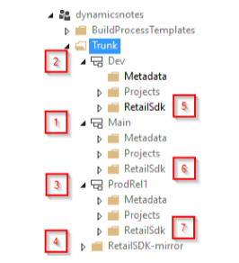

Here is an explanation of the setup. The numbers in brackets refer to the numbers in the preceding illustration:

- The **Dev** branch \[2\] is used for daily work that isn't ready for testing or might not be stable, but that must be shared with other developers. For larger teams, you might want to have multiple Dev branches for different features or purposes.
- The **Main** branch \[1\] is for changes that meet a certain quality bar and are ready for testing by other people. This testing might include user acceptance tests, performance tests, integration tests, and sanity tests after hotfixes. Deployable packages for this branch must be created by a build environment. As a best practice, you should not generate X++ packages in a Tier 1 environment and then deploy those packages into an official test or production environment. Otherwise, uncommitted source changes could be included. The correct approach is always to deploy packages that were built on official build environments.
- The **ProdRel1** branch \[3\] holds all source code exactly as it's deployed in a production environment at any given point. A build environment can be used but isn't required. If packages from the Main branch are deployed to a production environment, the code should be merged (from Main to ProdRel1) after a production deployment. By having a branch for production, you can generate official builds later if you require them.
- All three branches hold both X++ code (extensions and hotfixes in Metadata folders) and a copy of the Retail software development kit (SDK) in **RetailSdk** folders \[5, 6, 7\]. The Retail SDK includes base Microsoft code and code extensions. This base code and the code extensions can differ in each branch.
- The **RetailSdk-mirror** folder \[4\] is used to bring in Microsoft changes to the Retail SDK. It isn't used for development or build purposes. It should be updated only when a new version or hotfix is used.

For small projects, it's acceptable to have only two branches (Main = Dev branch). However, developers must be more disciplined, because any code submissions can immediately affect the quality of test builds. 

You can build deployable packages out of multiple branches. In this case, you must have one build definition for each branch that can be built. The initial build definition is automatically created when a build environment is deployed (Main branch). You can make copies of the build for other branches. You must make small additions to incorporate the Commerce code.

The following high-level steps are used to set up an environment so that development work can begin. For details about the numbers in brackets, see the previous illustration and the related information.

1. Deploy a build environment and an empty Main branch in Microsoft Azure DevOps \[1\].
2. Deploy a development environment.
3. Create the Dev branch and the release branch (for example, ProdRel1 in the previous illustration) \[2, 3\].
4. Add the Retail SDK \[4–7\].
5. Prepare the development environment.
6. Optional: Deploy a second build environment for a different release branch.
7. Prepare the build definitions.

After you've completed all these steps, your branches, environment, and builds will be ready.

The following sections explain each step in detail.

## Deploy a build environment and an empty Main branch in Azure DevOps

Use the LCS portal to deploy a new build environment. We recommend that you use a cloud-hosted environment, because you will have more options and capabilities if you have administrative rights. See the table about the various environment hosting models in the "Development Tier 1 environments" section, earlier in this article.

Start by creating a new Azure DevOps project if you don't already have one. In your Azure DevOps account, select **New project**.

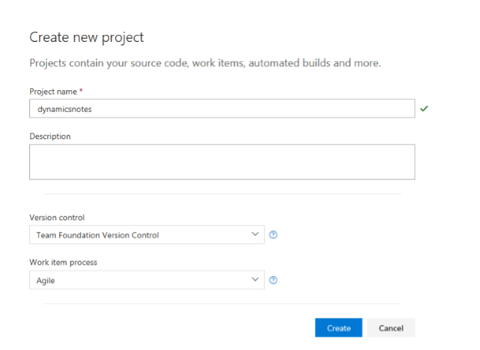

After you create the new Azure DevOps project, you must give Azure DevOps access to it. First, create a new personal access token on the Azure DevOps account. Then configure the LCS project with the correct URL and personal access token.

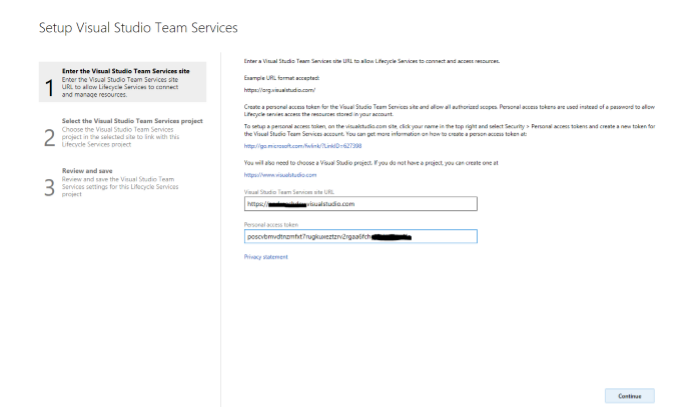

After the LCS project is linked to Azure DevOps, you're ready to deploy.

Add a new environment, select the version, select **DEVTEST** as the topology, and select a build environment. On the next page, enter a meaningful name for the environment. Then enter a similar name for the build agent.

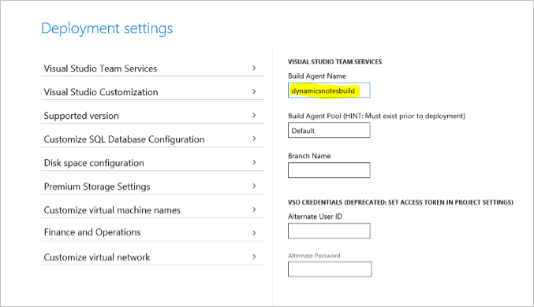

Next, under **Customize virtual machine names**, enter a unique name, and then deploy the VM.

The build box is deployed, and the build definition and Main branch are created, as shown in the following illustration. This process might take a couple of hours.

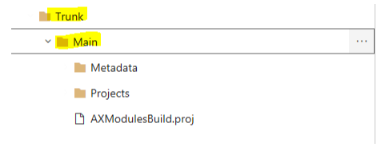

The build appears in the list of build definitions.

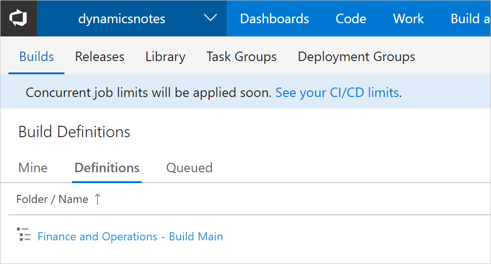

The build definition appears in the **Agents for pool Default** grid.

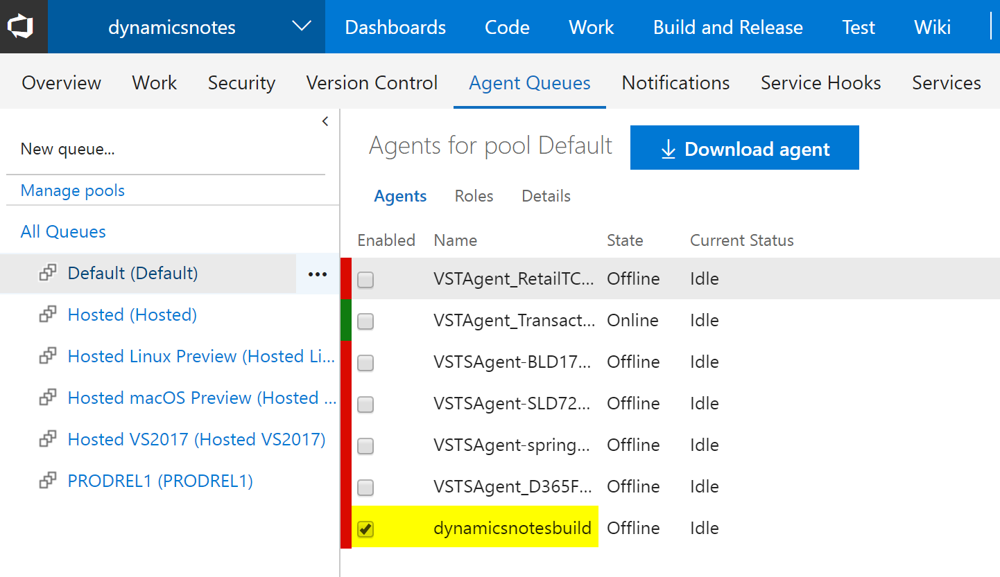

## Deploy a development environment

Use the LCS portal of your implementation project to create a cloud-hosted development environment. 

1. Make sure that you're signed in to the correct user account. This user account is used to create the tenant of the development machine. For example, if you're signed in to LCS as `lily@pad.com`, the environment is set up for the @pad.com tenant and expects users from that tenant. Although other users can be added, point of sale (POS) activation must be done by a user from that tenant. In some cases, user accounts from different domains can be used, such as when customers, partners, or other parties use email accounts from different domains. In these cases, coordination is required during POS activation, because only the tenant that was used during deployment can activate users.
2. Select the correct version, select **DEVTEST**, and then select **DEV**. Enter a meaningful and unique name, and make sure that the machine name is also unique in the advanced settings. The process of preparing the machine might take a couple of hours.

Because there is currently no Dev branch, you can skip the process of mapping Azure DevOps to the local directories. However, you will have to complete that process later.

## Create the Dev and release branches

As previously mentioned, you must have a branch that holds changes that are often made but less often tested. You must also have a branch that holds the source code for production. The following illustration shows the expected hierarchy.

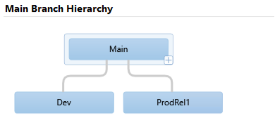

Follow these steps to create the branches.

1. Sign in to a development environment.
2. Start Microsoft Visual Studio as an administrator. Use an account that has access to the Azure DevOps project.
3. In Team Explorer, connect Visual Studio to the Azure DevOps project, if this connection doesn't already exist.
4. Map the **Trunk**/**Main** folder to a local folder (if this mapping doesn't already exist). This mapping is temporary.
5. In Source Control Explorer, right-click the **Main** folder, and then select **Branching and Merging** \> **Convert to Branch**.
6. Right-click the **Main** branch, select **Branching and Merging** \> **Branch**, and name the new branch **Dev**.
7. Use **Pending Changes**, and submit this change to Azure DevOps.
8. Right-click the **Main** branch, select **Branching and Merging** \> **Branch**, and name the new branch **ProdRel1**.
9. Use **Pending Changes**, and submit this change to Azure DevOps.

At this point, Source Depot Explorer in Visual Studio resembles the following illustration.

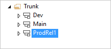

## Add the Retail SDK

Next, you must add the Retail SDK to each of the three code branches, so that code changes can be propagated from Dev to Main and eventually to ProdRel1. This step also enables separate changes between these branches, as for the X++ code. Therefore, we will have the Retail SDK in every branch, together with the X++ code. 

First, add the mirror branch. The Retail SDK mirror branch is required as a baseline for code merges when updates from Microsoft are imported. The process for taking updates will be explained later in this article.

The mirror branch or folder is only required one time per project.

1. Find the unchanged Retail SDK that has the exact version that you want to start your development with. This Retail SDK can be found on every development machine on the service drive, or in every downloaded hotfix. You can uniquely identify a version of the Retail SDK by inspecting the Microsoft-version.txt file. This file should not be changed, except by an update to the Retail SDK mirror folder.

    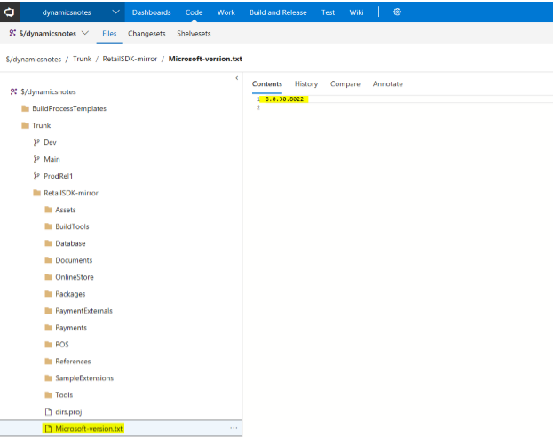

2. In Source Control Explorer, right-click the **Trunk** folder, and then select **Add Items to Folder**.
3. Select the top folder in the Retail SDK, and then select **Next**.
4. Visual Studio shows the number of files that will be added. Make sure that the **RetailSdk** folder is under the **Trunk** folder.
5. Make sure that there are 0 (zero) excluded items by selecting items and then selecting **Include items**.

    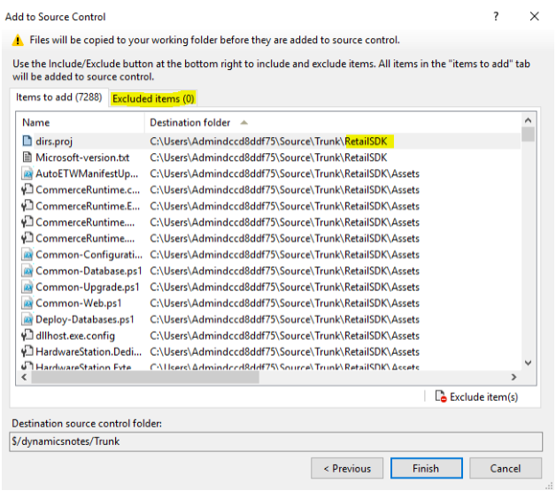

6. Select **Finish**. This process will take a few minutes.
7. When the process is completed, rename the folder **RetailSdk-mirror**.

Next, you must branch to each branch. Follow the same path that the code changes will flow in: first to Dev, then to Main, and then to ProdRel1.

1. Select the folder for the mirror branch, right-click, and then select **Branching and Merging** \> **Branch**.
2. Go to the **Dev** branch, append **/RetailSdk** to the name, and then select **OK**.

    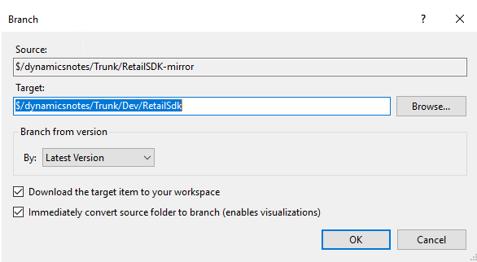

3. Use **Pending Changes**, and submit the changes.
4. Follow the same steps to branch the **RetailSdk** folder of the **Dev** branch to the **Main** branch.
5. Follow the same steps to branch the **RetailSdk** folder of the **Main** branch to the **ProdRel1** branch.

At this point, you have the code branches and code locations for the X++ and Commerce extensions setup. In Source Control Explorer, the file structure should resemble the following illustration.

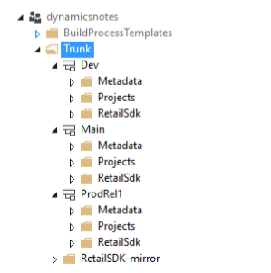

You should also change the version of the Commerce customization. This version should differ in the Dev, Main, and ProdRel1 branches. Either change the Customization.settings file, or add a new global.props file in the **RetailSdk\\BuildTools** folder. For example, you can number Dev as 1.0.0.x, Main as 1.0.1.x, and ProdRel1 as 1.0.2.x.

## Prepare the development environment

You can now prepare the development environment for Commerce development tasks. The development environment will map the code locations for both X++ and the Retail SDK in the Dev branch to local folders. The Metadata folder (X++) must be always mapped to the PackagesLocalDirectory folder. The location of the RetailSdk folder must follow these guidelines:

- The location should be somewhere inside the local user's folder.
- The file path of any file is limited to 256 characters. Therefore, use a short path for the root of the Retail SDK. For example, you can use **c:\\users\\\<user name\>\\Source\\RetailSdk**.

To map X++ and the Retail SDK, you must edit the current workspace. Select **Pending Changes** \> **Actions** \> **Workspaces**, and update the current workspace so that it resembles the following illustration. As was previously mentioned, you should map the Metadata folder of the branch to the PackagesLocalDirectory folder and the RetailSdk folder to a short folder of your choice.

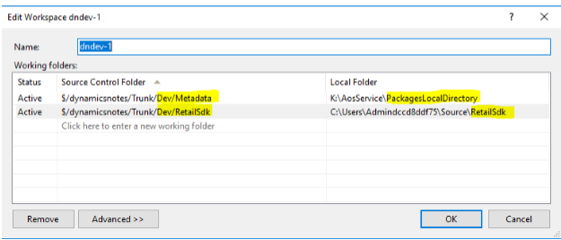

The download of the files can take a few minutes.

Regardless of whether there are customizations in the code branches, the following steps prepare your development box so that you can write and run code. Some steps are optional, depending on the customizations that are planned.

1. Install your favorite development tools. For information about one automated script, see [Auto-Installing most needed dev tools in 5 mins with Chocolatey](https://dynamicsnotes.com/auto-installing-most-needed-dev-tools-in-5-mins/).
2. To help reduce the compile time, exclude the code folders from Microsoft Windows Defender.
3. If there is already code in the **Dev/Metadata** folder, build all Commerce models. Select all the models, and then select **Database sync**.
4. To speed up the development experience, switch to Microsoft Internet Information Services (IIS). For instructions, see [MSDyn365FO. How to switch from IIS Express to IIS on development VM](https://ievgensaxblog.wordpress.com/2018/04/02/msdyn365fo-how-to-switch-from-iis-express-to-iis-on-development-vm/). This step can be done only on the Tier 1 VM where you have administrative privileges (cloud-hosted environment).
5. Optional: Restore a recent copy of a production database that has good data.

    1. Rename the existing database **AxDB\_Orig**.
    2. In Microsoft SQL Server Management Studio, restore the .bak file. (If a .bacpac file exists, follow the steps in [Copy a database from Azure SQL Database to a SQL Server environment](/dynamics365/unified-operations/dev-itpro/database/copy-database-from-azure-sql-to-sql-server).)
    3. In Visual Studio, refresh the model store.
    4. In Visual Studio, do a full build if the source and destination environments of the database are on different versions.
    5. In Visual Studio, run a full database synchronization.
    6. Make sure that the Batch service is running.
    7. Run the Environment reprovisioning tool. (Find the latest version in the LCS Asset library, and deploy it by using the **Maintain** function.)
    8. Verify that the tool succeeded. The following query should show the URLs of all local development machines that were updated.

        ```sql
        select * from dbo.RETAILCHANNELPROFILEPROPERTY where ISSYSTEMRECORD = 1
        ```

    9. In Commerce, run the **Initialize Commerce Scheduler** job to delete old data.

6. Make sure that you can sign in to Commerce by using your user account. If you aren't the Admin user in the production database, run the Admin provisioning tool to take ownership. (This tool is in the **PackagesLocalDirectory/bin** folder.)
7. Verify that Commerce Data Exchange (CDX) data synchronization works. In Commerce, go to **Download sessions**. You should see many applied sessions. If you don't see them, select job **9999**, and run it.
8. Install TypeScript version 2.2.2 from <https://www.microsoft.com/download/details.aspx?id=48593>.
9. Do a full build of the Retail SDK from a command prompt.

    1. Open an MSbuild command prompt for Microsoft Visual Studio 2015 as an administrator.
    2. Change the directory to the location of your Retail SDK on the local VM.
    3. Type **msbuild**, and then press Enter. The build should succeed.

10. Add the development/sample Retail Modern POS (MPOS) certificate to the local machine's trusted root certificate store: **...\\RetailSDK\\BuildTools\\ModernPOSAppxSigningCert-Contoso.pfx**. Set the password to an empty string.
11. Install MPOS or MPOSOffline by running the installer at **...\\RetailSDK \\References\\YourCompany|Contoso.ModernPOSSetupOffline.exe**. You must complete this step one time to deploy the ClientBroker files.
12. In Visual Studio, open **ModernPOS.sln** (as an administrator), and do a full rebuild.
13. Press F5 to start MPOS in the debugger.
14. In Commerce, open the **Channel profiles** page, and copy the Commerce Scale Unit URL for the default channel profile.
15. Open a browser window, and paste the URL into the address bar. You should be able to browse to your local Commerce Scale Unit.
16. In Commerce, add external user credentials to any worker (for activation), save the password, and don't allow a password reset on first sign-in.
17. In Commerce, run job **1060** (**AX/Distribution schedule**).
18. Activate MPOS by using the same Azure Active Directory (Azure AD) user that you added in step 16. Paste the Commerce Scale Unit URL, select a store and a register, and finish the activation.

You should now be able to run MPOS in the debugger from your local sources.

The process of preparing a development environment is now completed. At this point, any extension code (X++, Commerce runtime \[CRT\], Commerce Scale Unit, channel SQL, and POS) can be written, debugged, tested, and submitted to Azure DevOps.

## Optional: Deploy a second build environment for a different release branch

If you must maintain multiple releases at the same time, you must create deployable packages from different code branches (for example, Main2 or Main3, and/or ProdRel1 or ProdRel2).

The steps to set up a second build environment are the same as the steps for the first build environment. At this point, an Azure DevOps project, and the link between the LCS project and the Azure DevOps project, already exist.

To separate the build environments, we recommend that you create a new Azure DevOps agent queue for the release branch. Although there are ways to share an agent queue (and its build environment) for multiple branches, this approach can be tricky.

Currently, the build environment must be on the same platform and binary hotfix version as the target environment during deployment. Otherwise, LCS might reject the deployable package because of version incompatibility.

First, create a new Azure DevOps agent queue.

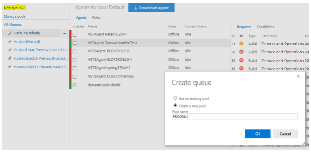

When you deploy from LCS, use **PRODREL1** as the name of the agent pool.

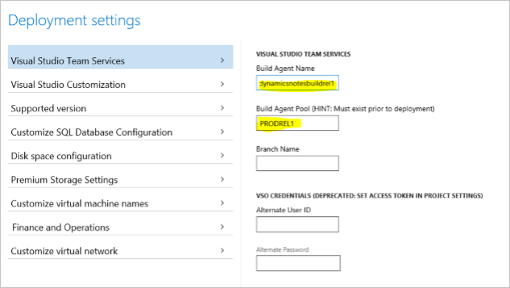

Next, on the **Customize virtual machine names** tab, enter a unique name, and then deploy the new build. The process of deploying a new build and creating a new agent queue can take a couple of hours.

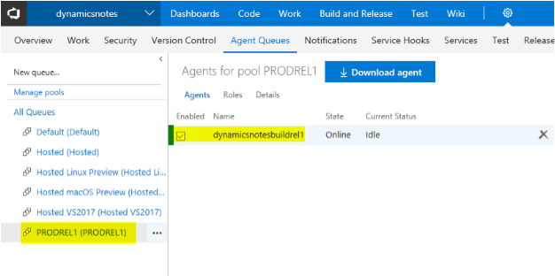

## Prepare the build definitions

After you complete the steps earlier in this article, you should have one build definition and two agent queues, and each agent queue should have one agent. To build different branches, you must configure the build definition differently. Therefore, you must clone the build definition.

However, before you clone the build definition, you must add the Retail SDK into the build, so that you don't have to complete this step twice. To edit the existing build definition, which is named **Unified Operations platform - Build Main**, follow the steps in [Integrate the Retail SDK with the continuous build system (Azure DevOps)](/dynamics365/unified-operations/retail/dev-itpro/retail-sdk/integrate-retail-sdk-continuous-build) to integrate the Retail SDK into the metadata build of the Main branch.

If you had multiple build branches and environments, just clone the build definition, and name the new build definition so that it's clear which branch it's for. (The clone feature is available in the Azure DevOps portal). Select the new agent queue that you created, and change the following paths in any build steps or source mappings. (In the paths, change **Main** to **ProdRel1**.)

- Source mappings
- Retail SDK build step
- Retail SDK copy binaries step
- Build the solution step (X++ build)
- Retail SDK copy packages step

## Tips

- You can speed up an official build by making these changes in the **Variables** section of the build definition:

    - Set **DeployReports** to **0**.
    - Set **SkipSourcePackageGeneration** to **1**.

- Change the version of the Commerce customization in each branch. The version should be different in the Dev, Main, and ProdRel1 branches. Either change the Customization.settings file, or add a new global.props file under the **RetailSdk\\BuildTools** folder. You can use any kind of numbering for the file name. For example, you can number Dev as 1.0.0.x, Main as 1.0.1.x, and ProdRel1 as 1.0.2.x.
- For efficiency, shut down build or development environments when they aren't being used.
- If you're using cloud-hosted Tier 1 development environments (where you have administrative privileges), you can switch from IIS Express to IIS. Using IIS for running all web application is more robust, more performant, and avoids the switching. For more information, see [MSDyn365FO. How to switch from IIS Express to IIS on development VM](https://ievgensaxblog.wordpress.com/2018/04/02/msdyn365fo-how-to-switch-from-iis-express-to-iis-on-development-vm/).
- For prototyping purposes, a developer might want to change the Retail SDK on a development VM without using Azure DevOps source control. Always keep the original Retail SDK untouched, and make a copy that you can work in temporarily. In that way, you can take the unchanged Retail SDK into your mirror branch later, if it's required.
- Currently, a build environment must be on the same platform and binary hotfix version as the target environment.

## Additional resources

[Update code and environments for Retail projects](./updating-environments.md)

[Testing and performance issues](./retail-implementation-testing-performance.md)


[!INCLUDE[footer-include](../../includes/footer-banner.md)]
