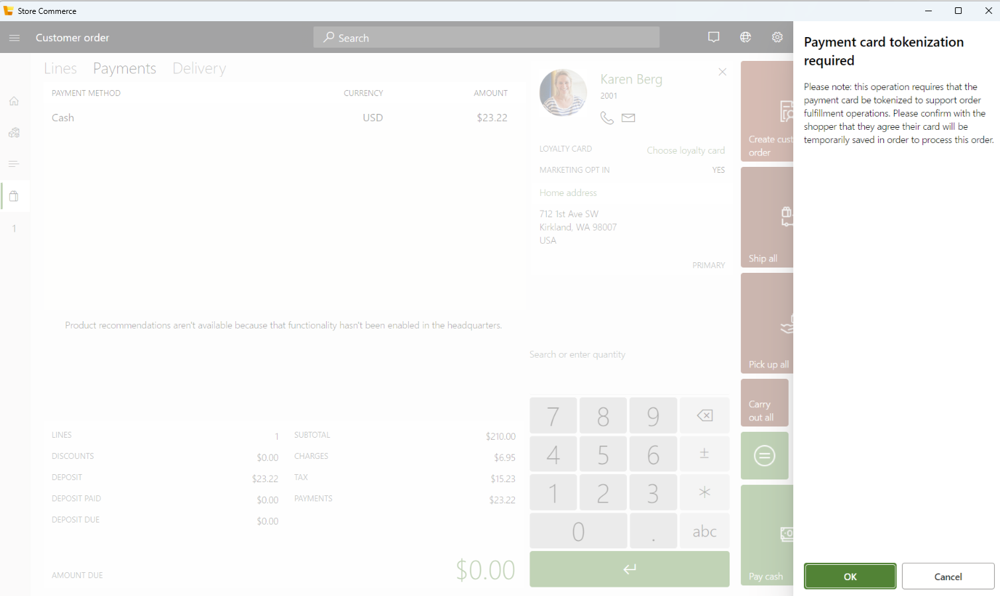

# Configure nonrecurring payment tokens

[!include [banner](../includes/banner.md)]

This article describes how to configure and use payment processing with nonrecurring payment tokens in Microsoft Dynamics 365 Commerce.

Payment processing actions in Dynamics 365 Commerce save payment card tokens. These tokens can then be used for downstream sales order changes, resubmission of authorizations that are close to expiration, and "card on file" caching for future customer orders. In direct configurations, card payment tokens have a "recurring detail" reference that can be used for unscheduled, merchant-initiated transactions. In Commerce version 10.0.40, payment processing can handle payments without saving a recurring customer card token. This ability applies to online stores, call center orders, and point of sale (POS) customer orders that require future shipment.

## Key terms

| Term | Description |
|---|---|
| Token | A referenced XML blob in the Commerce system that stores payment references for transactional purposes. |
| Recurring | A type of card payment token that is intended to be reused for future transactions, either scheduled or unscheduled. |
| Nonrecurring | A type of card payment token that is nonreusable or absent.
| Card on file | A saved card reference token that is specific to a customer's account and that the customer agrees to save for future use in the Commerce system or payment gateway. |

## Prerequisites

Before you can set up an environment to use nonrecurring payment tokens, these prerequisites must be met:

- The following features must be enabled in Commerce headquarters at **System administration** \> **Workspaces** \> **Feature management**:

    - **Enable use of nonrecurring tokens in Commerce**
    - **Extensibility to support incremental credit card capture**
    - **Restrict Payment Token usage to Order context**

- For online channels to support nonrecurring tokens, the **Enable single payment authorization checkout** setting must be enabled in Commerce site builder, at **Site settings** \> **Extensions** \> **Card and checkout**.
- For customers who use the Dynamics 365 Payment Connector for Adyen, the **Tokenization** field's **Recurring** setting must be disabled in the Adyen portal, at **Settings** \> **Checkout settings**. This setting exists at the merchant account level and affects all transactions under the merchant account. When it's enabled, it forces a recurring detail reference for all transactions against the merchant account. When it's disabled, the Dynamics 365 Payment Connector for Adyen sets recurring details as needed for transactional situations. If the **Enable use of nonrecurring tokens in Commerce** feature is disabled for the Commerce environment, the **Recurring** setting must be enabled in the Adyen portal to enable operability with the Dynamics 365 Payment Connector for Adyen.

> [!WARNING]
> If the feature “Enable unified payments experience in POS” is enabled then the nonrecurring token feature does not work as expected. This is a temporary limitation and will be fixed.

## Authorization patterns with nonrecurring payment tokens

Commerce payment authorizations are used to ensure that a customer's credit is available for the amount of a transaction before the funds are "captured" or finalized as a charge on the customer's card or digital wallet. For customer orders where items from the order are still being picked, packed, and invoiced, the capture is triggered on the invoicing action during the order management process. In the time between order placement (when the card or wallet issuer authorizes the credit amount as available) and capture (when the customer's credit is charged), the transaction in Commerce is maintained as an authorization state.

Authorizations against a card or wallet issuer can expire if they're kept open for a specific amount of time. The expiry timeframe depends on the issuer and is unknown to the Commerce system and the payment gateway. Typically, the expiration is determined when a request for capture is sent and the payment gateway passes back the issuer's "decline" response. To prevent attempts to capture against an expired authorization, the Commerce system tracks a set of parameters to determine whether an authorization is expired.

When a recurring card payment token is used against an order, there are some scenarios in the system where a new merchant-initiated transaction is performed against the order and the recurring token is used to get a new authorization. When the **Enable use of nonrecurring tokens in Commerce** feature is enabled in headquarters, if any customer order doesn't have a recurring token associated with it, a new payment authorization is obtained from the customer before the order is allowed to proceed.

When nonrecurring tokens are used in Commerce, the following scenarios still require a recurring detail payment token to obtain an authorization:

- Future orders
- Installments
- Unlinked refunds

In these scenarios, a message informs the user that a recurring token payment is required. Microsoft recommends that you align training for these processes with your company's compliance policy for saving payment tokens.

### Configure authorization expiration settings

Commerce tracks a **Number of days before expired** setting in headquarters to determine whether credit card and digital wallet authorizations are expired. This protective setting prevents an attempted funds capture against an authorization that the issuer might consider expired and invalid. The setting is found in headquarters at **Accounts receivable** \> **Setup** \> **Accounts receivable parameters** \> **Credit card**. In a normal Commerce payments setup, the **Credit card authorization** option on the same page is set to **Yes**.

In addition to the **Number of days before expired** setting, the expiration in days can be specified for each store's electronic payment types. To specify the expiration in days for electronic payment types, in headquarters, go to your store at **Retail and Commerce** \> **Channels** \> **Online stores**. On the Action Pane, on the **Set up** tab, in the **Set Up** group, select **Payment methods**. Select a payment method (for example, **Cards**), and then, on the Action Pane, select **Electronic payment setup**. Select **Edit**, and then, on the **General** tab, enter a **Pre-authorization duration in days** value for each of the selected electronic payment types. Then select **Save**. This setting also appears on the **Authorization management** page (**Retail and Commerce** \> **Channels** \> **Call centers** \> **Call center credit cards** \> **Authorization management**), so that it can be used for reference against specific pending authorizations.

The **Pre-authorization duration in days** setting is used as the primary attribute to measure an authorization's expiration for the transaction, based on the payment method that the customer uses. By default, if no value is set, the system uses the value of the **Number of days before expired** setting in the **Accounts receivable parameters** section.

### Monitor expired authorizations

Credit card authorizations that are expired in the system return the payment tracking to **Pending Authorization**. The order is put on hold, and the **Do Not Process** header attribute is set to **True** on the sales order header. In Commerce headquarters, users can monitor expired authorizations on the **Authorization management** page (**Retail and Commerce** \> **Channels** \> **Call centers** \> **Call center credit cards** \> **Authorization management**). To view a list of pending authorizations, in the **Status** dropdown list, select **Pending Authorization**. The record's **Status** field shows **Open order**, and the **Expired** field on the **The authorization response** FastTab shows **Yes**.

When a record is selected, details for the customer account, sales order, and payment status are shown. Users can also view the credit card and authorization response details for more context about a declined authorization. To collect a new payment, select the sales order number to go to the sales order, and then process a new payment line against the order's balance. If there are previous authorizations against the balance, it reflects the amount of any authorized but expired payment lines (or any open and unapplied payment lines).

## Payment flow updates using nonrecurring payment tokens

After it's enabled, the use of nonrecurring tokens has specific payment flow patterns, depending on the operating channel.

### Saved card on file

A payment card token can continue to be saved against a customer record for scenarios where a card on file is required and there's an agreement with the customer to save the card for future use.

To view, add, or delete credit cards that are stored against a customer, in headquarters, go to **Accounts receivable** \> **Customers**, and select a customer record. On the **Customer** tab, in the **Set up** group, select **Credit cards** to open the **Customer credit cards** page. There, you can view, add, or delete credit cards that are stored against the customer.

Before you add a new card, ensure that a default payment connector is configured on the **Payment services** page (**Accounts receivable** \> **Payments setup** \> **Payments services**).

> [!NOTE]
> For information about how to add a new card for the Adyen connector, see [Set up Dynamics 365 Payment Connector for Adyen](adyen-connector-setup.md).

To add a new card, on the **Customer credit cards** page, select **New**. On the **New customer credit card** page, enter the customer's card details and billing address information, and then select **OK** to save the card information. The card is now available in the customer's credit card list.

> [!WARNING]
> Cards must be saved only with the customer's agreement, as defined by your company's compliance practices and customer terms and agreements.

A saved card on file can be used for future sales order references in a call center. For more information, see the [Call center payments](#call-center-payments) section.

To delete a card on file, on the customer details form, select the **Customer** tab. In the **Setup** group, select **Credit cards** to open the **Customer credit cards** form. Select the card that you want to delete, and then select **Delete**.

### Point of sale payments

#### Cash and carry transactions

When customers pay for goods that they're leaving the store with, the transaction is referred to as a "cash and carry" transaction. In this case, the payment is resolved through a captured payment at the end of the transaction. There's no need for the system to use or save a card payment token and hence the card is not tokenized. From user experience perspective, there is no change if the **Enable use of nonrecurring tokens in Commerce** feature is enabled or disabled.

#### Customer orders

A customer order can be placed from the POS, which sets up a sales order that is fulfilled through a shipment to the customer. The customer order has two payment-related concepts, namely Deposit, Remaining balance. Assuming the feature **Enable use of nonrecurring tokens in Commerce** is enabled, since the deposit amount is captured along with order placement, the cart used for deposit is not tokenized. However, whether the card used to pay the remaining balance will be tokenized or not depends on the “Requested shipping date” of the order lines. If the requested shipping dates of all the order lines are within a system defined threshold whose default value is 7 days, then no card payment token is saved to place the order. But if the requested shipping date of any of the order lines exceeds a system defined threshold, then the system enforces the card to be tokenized to avoid payment failure during order fulfillment. To enforce the tokenization, when the cashier tries to take a card authorization for the remaining balance, a dialog is displayed to the cashier prompting the cashier to follow the business procedures as per your organization's compliance standards for getting the customer’s consent to save their card information for the current order. Refer the below image.

.

If the customer agrees for saving the card information for this order, then the cashier can press the “Ok” button to continue with the authorization, else, they will have to press the “Cancel” button. The cashier will not be able to proceed with the authorization for such orders unless the customer agrees to allow the system to save their card information, or the requested shipping date is changed and brought within the system defined threshold. By default, this system defined threshold is set to 7 days and is not exposed via any configuration. The retailer can reach out to the Microsoft support team to update this value to any desired value as per their business needs. The name of the property that defines this threshold is "Payments.MinOrderProcessingDaysForStoringCardToken". 

Currently, the Commerce system doesn't extend the authorization for a non-recurring token. If a nonrecurring token expires before an order is invoiced, the invoice action fails unless the retailer obtains a new token by contacting the customer. If your business generally has long lead times for customer orders which result in expired authorizations, then to avoid the need to contact the customer to get a new authorization, you can request Microsoft support to enable a property named “Payments.AlwaysStoreCardTokenOnOrderBalanceAuthorization” in your environment. This property enforces all customer order authorizations for the remaining balance to be tokenized and hence the cashier will see the above-mentioned dialog indicating the authorization will be tokenized for remaining balance authorizations. In other words, the cash and carry transactions and customer order deposit will not be tokenized but the remaining balance authorizations will be tokenized. 
If the above-mentioned approach does not work, then disable the non-recurring token feature and provide your recommendation to Microsoft on how this feature can be further improved to meet your business requirements. 
> [!NOTE]
> Even if the card is tokenized, the card payment token is associated only with the current sales order, and it isn't available to use for other orders.

 Just like any other order, such orders can be modified in call center and POS. During editing the order in POS, since the system does not allow the cashier to change any existing payment lines, there is no impact of this feature on editing orders in POS. The details describing the impact of editing orders in the call center can be found in the later section of this document. 

### Call center payments

Call center users can create or edit existing sales orders in Commerce. When payment is submitted in a call center, a payment page is presented, so that the user can accept payment details. On the **Enter customer payment information** page, for credit card payment methods, the call center associate must fill in the payment method information. The call center associate then has two options for entering the card number information:

- Use the **Number** dropdown list to select among the saved cards on file for the customer account of the sales order. This list represents recurring payment card tokens that were previously saved against the customer record. It references the card holder information and the last four digits of the saved card's information.
- Select the plus sign (**+**) to open the **New customer credit card** page. This page renders the configured payment service provider's payment acceptance page in an iFrame element. Credit card information is entered directly with the payment service provider. The lower **Billing Address** section is specific to the Commerce system. It can be used to include the payment request to the payment gateway and save the billing address information against the customer's record as an **Address** entry. When the **Restrict Payment Token usage to Order context** feature is enabled, a **Save payment information** checkbox is made available to the call center associate. If this checkbox is selected, the payment information that is entered can be saved as a recurring token for future reference in the **Number** dropdown list. This token can also be viewed as a listed reference on the **Customer credit cards** page (**Customer** \> **Customer credit cards**). The **Save payment information** checkbox should be selected only with the customer's agreement, as defined by your business compliance processes. Associates can select **View disclaimer** to open a dialog box that shows this suggestion.

On the **Call center parameters \> Payment** form, system administrators can set the **Allow customer card on file** option to show (**Yes**) or hide (**No**) the **Save payment information** checkbox on the payment page. For more information, see [Limit payment token usage](limit-token-usage.md).

> [!WARNING]
> As mentioned in the Customer order section, currently, the Commerce system doesn't extend the authorization for a non-recurring token. If a nonrecurring token expires before an order is invoiced, the invoice action fails unless the retailer obtains a new token by contacting the customer. If your business generally has long lead times for orders which result in expired authorizations, then to avoid the need to contact the customer to get a new authorization, you can train the call center users to request the customers to provide the consent to save the card token during order capture and record this consent by checking the **Save payment information** checkbox.

#### Future order authorizations

Commerce authorizations support processing of future orders when a shipment is set for a date in the future that might extend beyond the typical authorization validity period. The system can request an authorization at a future time only if a saved card on file (recurring payment token) is saved against the customer or the sales order.

To configure future order authorizations, in headquarters, go to **Retail and Commerce** \> **Channel setup** \> **Call center setup** \> **Call center parameters**. On the left navigation pane, select **Payment**, and then, under **Credit card authorizations**, set the **Future orders** option to **Yes**. The **Delay authorization** option can also be set to **Yes**. In this case, the system waits to authorize the order until the ship date reaches the configured value of the **Future order days** setting. For example, if the **Future order days** setting value is **7**, the order is authorized when the current date is seven days ahead of the ship date.

When future order authorizations are configured, if a value is specified for the **Requested ship date** setting when sales orders are created in a call center, those sales orders are compared against the **Future order days** date. If the current date is in the date range that those settings define, the **Authorization resubmit** job requests authorization.

#### Edit orders in a call center

While editing the orders in call center, if the user manually modifies the order and presses the Complete button and modifies the existing authorized payment line to reflect the new order total, then the payment connector attempts to adjust the existing authorization. The authorization adjustment requests the new authorization total against the pre-existing original authorization. If the request is approved, the authorization is adjusted in the Commerce system. If it's declined, the original authorization is considered declined, and a new payment is required to complete the transaction.

### Online storefront payments

For online storefront payments that use credit cards or digital wallets, the payment module processes an online customer's entered payment information. When the **Enable use of nonrecurring tokens in Commerce** feature is enabled, all online transactions are processed in the Commerce system, but the payment card token isn't saved. The payment module presents the configured payment processor's payment acceptance page in an iFrame element.

When the Dynamics 365 Payment Connector for Adyen is configured for the online store, if the **Allow saving payment information in e-commerce** parameter is set to **True**, the Adyen iFrame element presents a **Save for my next payment** checkbox to the authenticated customer. This mechanism enables the customer's credit card to be saved with Adyen, so that it can be presented in the Adyen iFrame element at the time of the authenticated user's next checkout. However, this mechanism doesn't save the card on file in the Commerce system as described in the [Saved card on file](#saved-card-on-file) section. The online storefront's generated sales order processes the payment without a saved payment card token.

If the online storefront's authorization expires before the order is fulfilled (that is, if the payment isn't captured before the authorization expires), the payment is set to **Declined** in the Commerce system. This event sets the **Do not process** flag on the sales order header, and a new payment must be retrieved against the order. You can manage orders in the declined state in headquarters at **Retail and Commerce** \> **Channels** \> **Call centers** \> **Call center credit cards** \> **Authorization management**.

## Additional resources

[Limit payment token usage](limit-token-usage.md)

[Set up Dynamics 365 Payment Connector for Adyen](adyen-connector-setup.md)

[!INCLUDE[footer-include](../../includes/footer-banner.md)]
