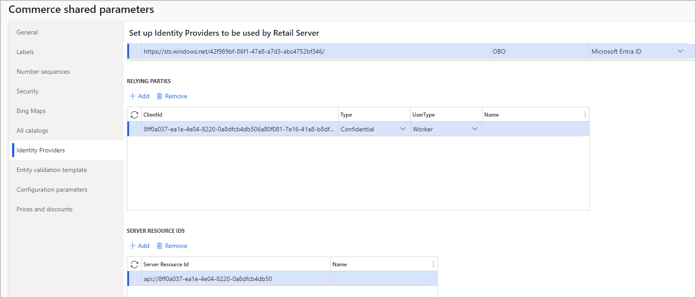

# Set up and configure on behalf of (OBO) functionality in Commerce headquarters

[!include [banner](../includes/banner.md)]

This article describes how to set up and configure on behalf of (OBO) functionality in Microsoft Dynamics 365 Commerce headquarters.

## Add identity providers to Commerce shared parameters

First, you must add the identity provider that you created in [Create and configure a Microsoft Entra application for account manager sign-in](obo-create-aad-application.md) to **Commerce shared parameters** in Commerce headquarters.

To add identity providers to Commerce shared parameters in headquarters, follow these steps.

1. Go to **Retail and Commerce \> Headquarters setup \> Parameters \> Commerce Shared parameters \> Identity Providers**.
1. Under **Identity providers**, select **Add**, and then set the following fields:

    1. **Issuer:** Enter `https://sts.windows.net/<TENANTID>/`, where `<TENANTID>` is the ID of your Microsoft Entra business-to-business (B2B) tenant.
    1. **Type:** Select **Microsoft Entra ID**.
    1. **Name:** Enter a name for the identity provider.

1. Under **Relying parties**, select **Add**, and then set the following fields:

    1. **ClientID:** Enter the client ID of Microsoft Entra B2B application (for example, "8ff0a037-ea1e-4e04-8220-0a8dfcb4db50").
    1. **Type:** Select **Confidential**.
    1. **User Type:** Select **Worker**.

1. Under **Server resource IDs**, select **Add**, and then set the following fields:

    1. **Server Resource Id:** Enter `https://<APPLICATIONIDURI>`, where `<APPLICATIONIDURI>` is the ID of the Microsoft Entra B2B application (for example, "api://8ff0a037-ea1e-4e04-8220-0a8dfcb4db50".)
    1. **Name:** Leave this field blank.
  
1. On the action pane, select **Save**.

    

1. Go to **Retail and Commerce \> Headquarters setup \> Distribution schedule**.
1. In the left navigation menu, select the **1110 Global configuration** job.
1. On the action pane, select **Run Now**.

## Create and configure a sales group

This section describes how to associate account managers who use OBO functionality with B2B organizations. 

### Configure account managers in headquarters

> [!NOTE]
> The following procedure can be skipped for account managers who already use Microsoft Entra sign-in on POS devices.

To configure account managers in headquarters, follow these steps.

1. Go to **Human Resources \> Workers \> Employees**. 
1. Select an account to be configured (for example, `user@adventure-works.com`). 
1. Select **Commerce**, select **Associate existing identity**, search for the email address associated with the account, select the account, and then select **OK**.
1. Go to **Retail and Commerce \> Headquarters setup \> Distribution schedule**.
1. In the left navigation pane, select the **1060** job.
1. On the action pane, select **Run Now**.

## Create a sales group containing account managers

Next, you must create and configure a sales group in headquarters. For information about how to create sales groups, see [Create a commission sales group for a worker](../tasks/worker.md#create-a-commission-sales-group-for-a-worker).

Create a sales group of one or more account managers. For OBO functionality to work, the sales group must include, at a minimum, one sale representative. Assign commission percentages, if your organization assigns commissions. A commission percentage can equal 0 (zero).

### Associate a sales group with a B2B buyer organization

To associate a sales group with a B2B buyer organization in headquarters, follow these steps.

1. Go to **Sales and Marketing \> Customers \> All customers**.
1. Find the customer of type **Organization** that must be managed by the sales group that you created (for example, "Contoso B2B"), and then select its name or account number.

    > [!NOTE]
    > The customer of type **Organization** must have an address book specified in the **Address book** field.

1. On the **Sales order defaults** FastTab, under **Sales group**, enter the sales group ID of the sales group that you created.
1. On the action pane, select **Save**.

Any member of the specified sales group will now be able to work on behalf of any user in the selected customer B2B buyer organization.

In the customer hierarchy that corresponds to this customer organization (**Retail and Commerce \> Customers \> Customer hierarchies**), the sales group should now be shown as a read-only value in the **Sales Groups** section.

### Complete the synchronization of sales representatives in headquarters

To complete the synchronization of sales representatives in headquarters, follow these steps.

1. Go to **Retail and Commerce \> Headquarters setup \> Commerce scheduler \> Initialize Commerce scheduler**.
1. Set **Delete existing configuration** to **No**.
1. Set **Update subjobs only** to **No**.
1. Select **OK**. 
1. Go to **Retail and Commerce \> Headquarters setup \> Distribution schedule**.
1. In the left navigation pane, select the **1060** job.
1. On the action pane, select **Run Now**.
   
## Additional resources

[Create and configure a Microsoft Entra application for account manager sign-in](obo-create-aad-application.md)

[Create and modify pages for on behalf of (OBO) functionality](obo-add-pages-site-builder.md)

[Update Commerce headquarters with the new Microsoft Entra B2C information](update-hq-aad-b2c-info.md)

[Configure a worker](../tasks/worker.md)

[Enter worker information](../../human-resources/hr-personnel-enter-worker-information.md)
