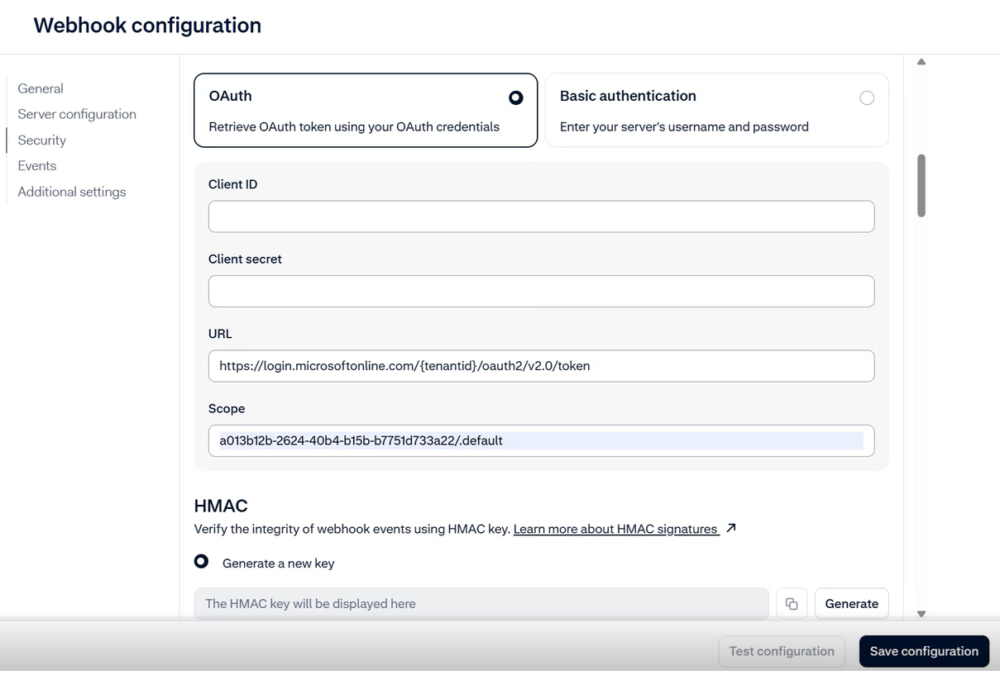
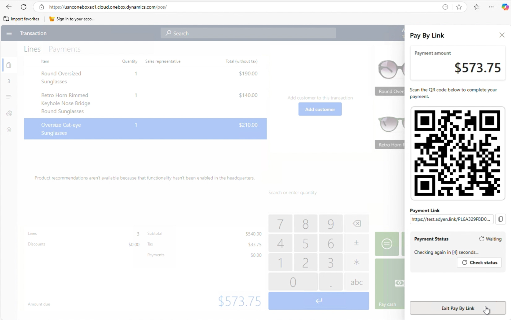

# Enable pay by link in POS by using the Adyen connector

[!include [banner](../includes/banner.md)]

This article explains how to set up and enable the pay by link payment method to capture payments in stores in Microsoft Dynamics 365 Commerce.

Pay by link functionality enables merchants to offer modern payment methods that give customers the flexibility to choose their preferred payment method. Pay by link eliminates the need for a payment terminal. Therefore, store associates can be mobile and accept various types of payments. In addition, pay by link enables customers to pay from their current location. In this way, it can help reduce checkout lines and therefore expedite the checkout process.

Pay by link functionality is a controlled release. To check participation availability for the pilot release, contact your Adyen account manager.

## Prerequisites

### Enable OAuth authentication from Adyen

Payment notifications for the pay by link payment method use Open Authorization (OAuth)–based authentication. To enable OAuth setup in the Commerce HQ in 10.0.44, you must contact Microsoft Support and ask to have a flight enabled in your Commerce environments.

> [!NOTE]
> The time to live (TTL) value for the OAuth token must be 3,599 seconds. This should be the default value from the Adyen side when you choose OAuth based authentication and should not require any additional configuration from your side on Adyen portal. 

### Link your Commerce environment to a Dataverse environment

The payment notification service uses Dataverse. Therefore, to receive payment notifications, you must link your Commerce environment to a corresponding Dataverse environment. Learn more in [Connect finance and operations apps with a new Microsoft Dataverse instance](/dynamics365/fin-ops-core/dev-itpro/power-platform/environment-lifecycle-connect-finops-new-dv) and [Connect finance and operations apps with an existing Microsoft Dataverse instance](/dynamics365/fin-ops-core/dev-itpro/power-platform/environment-lifecycle-connect-finops-existing-dv).

### Minimum required versions

The pay by link feature is available as of the Commerce 10.0.44 release. The following minimum versions of the various components are required:

- **Store Commerce App/ Cloud Point of Sale**: 9.54.25148.1
- **Commerce Scale Unit**: 9.54.25137.4
- **Commerce headquarters**: 10.0.44

### Required role to complete the setup

Some of the steps require a Commerce headquarters user who is either an administrator or has the **Commerce Payment Administrator** role assigned to them in Microsoft Power platform.

## Setup

### Enable the features required for pay by link

To enable payment notifications for pay by link, enable the following features in the **Feature management** workspace:

- Enhanced wallet support and payment improvements. Learn more in [Wallet payment support](/dynamics365/commerce/dev-itpro/wallets).
- The unified payments experience in POS. Learn more in [Check out faster with optimized payment flows](/dynamics365/commerce/dev-itpro/faster-checkout-pos).
- The **Payments Notification** feature.
- The **Pay By Link Payment** feature.

### Create a webhook to receive payment notifications from Adyen

The following information is required to create a webhook in the Adyen portal:

- The URL of the payment notification service
- OAuth credentials for authentication against the payment notification service

The payment notification service URL is where Adyen sends the notifications. You can get this URL from Commerce headquarters. Go to **Commerce shared parameters** \> **Payment notifications**, and copy the value of the **Payment notifications end point URL** field. If the field is blank, the Commerce environment isn't linked to a Dataverse environment. In this case, contact your Commerce administrator or Microsoft Support for help.

To create the OAuth credentials, you must register a new application in the Azure portal. Payment notifications from Adyen then use the new application's credentials to communicate securely with the payment notification service.

#### Register a new application in the Azure portal

To register a new application in the Azure portal, follow these steps.

1. Sign in to the [Azure portal](https://portal.azure.com/) by using a work or school account.
1. If your account gives you access to more than one tenant, select your account in the upper-right corner. Then set your portal session to the Microsoft Entra tenant that you want.
1. In the left pane, select the **Microsoft Entra ID** service, and then select **App registrations** \> **New registration**.
1. On the **Register an application** page, enter your application's registration information:

    - **Name**: Enter a meaningful application name. This name is shown to users of the app.
    - **Supported account types**: Any of the available options should work.
    - **Redirect URI**: This field isn't needed.

1. Select **Register**.

After the new application is registered, on the **Overview** page, copy the values of the following properties:

- Application (client) ID
- Directory (tenant) ID

Next, you must create a client secret for the application. Go to the **Certificates & secrets** section, and then select **New client secret**. Provide a description and an expiration period for the secret. Ensure that you create a business process for rotating the secret, because payment notifications fail after the secret expires. Copy the secret value, and save it somewhere for later use.

To create a new webhook, follow these steps.

1. Go to the Adyen portal, and then go to the **Developers** section.
1. Create a standard webhook.
1. In the **Server configuration** section, in the **URL** field, paste the **Payment notifications endpoint URL** value that you copied earlier.
1. Keep the default values for the **Method** field (**JSON**) and the **Encryption protocol** fields (**TLS v1.3**).
1. In the **Security** section, select **OAuth**, and enter values for the following properties:

    - **Client ID**: Enter the **Application (client) ID** value that you copied earlier.
    - **Client secret**: Enter the **Secret value** value that you copied earlier.
    - **URL**: Enter `https://login.microsoftonline.com/{tenantid}/oauth2/v2.0/token`. Replace **\{tenantID\}** with the **Directory (tenant) ID** value that you copied earlier.
    - **Scope**: Enter **a013b12b-2624-40b4-b15b-b7751d733a22/.default**.

    

1. Generate a new Hash-based Message Authentication Code (HMAC) key, and copy it. You won't be able to view this key again. Therefore, keep it somewhere safe.
1. In the **Events** section, select **Authorization**.
1. Under **Additional settings**, in the **Card** section, select the **Include card bin** and **Include Subvariant** options.
1. Leave the remaining fields set to their default values, and save the configuration.

> [!NOTE]
> Don't test the configuration yet, because the setup isn't completed. The configuration is validated after the next step.

> [!IMPORTANT]
> - If you save the configuration on the Adyen portal and it generates a **Domain could not be resolved** error message, it's due to a known issue with the placement of the period (.) separator in the subdomain segment of the payment notification endpoint URL. The period (.) separating the subdomain segments is currently placed one character too far to the right. This issue is resolved in Commerce version 10.0.45.
> - To resolve the issue for Commerce versions before 10.0.45, move the period separator one character to the left so that the second segment contains two characters instead of one. This adjustment ensures that the URL resolves correctly and can be used to create a webhook.
> - For example, if the incorrect URL format is `<30 or 31 characters>.<1 character>.organization.api.powerplatform.com/dynamics/api/payment/notifications/1`, the correct URL format should be:`<29 or 30 characters>.<2 characters>.organization.api.powerplatform.com/dynamics/api/payment/notifications/1`. Put differently, if the incorrect URL is `https://xxxxxxxxxxxxxxxxxxxxxxxxxxxabc5.0.organization.api.powerplatform.com/dynamics/api/payment/notifications/1`, it should be modified to be  `https://xxxxxxxxxxxxxxxxxxxxxxxxxxxabc.50.organization.api.powerplatform.com/dynamics/api/payment/notifications/1`.
> - If you need assistance identifying or correcting the payment notification endpoint URL in your configuration, contact Microsoft support.

### Update Commerce headquarters with the HMAC and application client ID details to authenticate the payment notifications sent by Adyen

To update the details to authenticate the payment notifications that Adyen sends, follow these steps.

1. In headquarters, go to **Commerce shared parameters**.
1. In the **Payment notification** section, enter values for the following properties:

    - **Data verification HMAC key**: Enter the HMAC key that you copied earlier.
    - **Payment notifications client ID**: Enter the **Application (client) ID** value that you copied earlier.

1. Save the configuration.

    > [!NOTE]
    > Only Commerce headquarters users who have either the **Administrator** or **Commerce Payment Administrator** role in Microsoft Power Platform can save the configuration.

#### Test the connection to the payment notification service

To test the connection, follow these steps.

1. Go to the Adyen portal.
1. Edit the webhook that you created earlier, and then select **Test configuration**. If the connection fails, review all the values that you entered when you created the webhook to validate that they're correct. If you make any changes (for example, if you change the keys), wait 20 minutes before you test the connection again. In this way, you ensure that caching doesn't affect the test. If the issue persists, contact Microsoft Support.

### Set up the pay by link payment method for the store

You can create the pay by link payment method either as a dedicated button or as a new payment method that is shown in the list of payment methods. You can also add it to the existing payment method that was created for credit/debit cards. In this way, when a cashier selects the existing payment method, the POS shows pay by link as one of the input types for payment capture.

In both cases, the pay by link option is shown only if the administrator selects **Pay By Link** as a payment input type for a payment method. In headquarters, open the **Payment methods** page, and select a payment method. Then, on the Action Pane, select **Payment Input Type**. To create a dedicated payment method for pay by link, select only **Pay By Link** on the **Payment Input Type** page. To add pay by link as one of the input type options for capturing payments, select **Pay By Link** together with **Payment on terminal** and **Manual entry** (optional).

> [!NOTE]
> The **Payment Input Type** button is available only for payment methods where the **Function** field is set to **Card** or **Wallet**, and the **Operation name** field is set to **Pay card**.

If **Manual entry** is added as a payment input type, when a cashier selects the payment method in POS, the customer is prompted to manually enter their credit card number on the payment terminal. In addition, when the manual entry option is enabled, the **Allow manual card numbers** property (**Electronic payment setup** \> **Allow manual card numbers**) is set to **True** and disabled. If the manual entry option is removed, the **Allow manual card numbers** property remains disabled, but it can be edited by the user.

To support payment options such as Quick Response (QR) code–based wallets, setup of bin ranges isn't sufficient. New card types must be created and mapped to corresponding payment variants. These card types must be added to the payment method where pay by link is enabled. Learn more in [Wallet payment support](/dynamics365/commerce/dev-itpro/wallets).

> [!NOTE]
> If you create a new payment method for pay by link, you don't have to add electronic payment types that were previously added to other payment methods that are available for the store. For example, if the **Visa**, **Mastercard**, **American Express** payment types were previously added to the **Cards** payment method, you don't have to add them to the pay by link payment method. The system looks through all the payment methods that are associated with the store to find a matching electronic payment type that is used for payments.

Pay by link doesn't require that Hardware station is enabled for Cloud POS or the Store Commerce app. If you want to use pay by link with a register that isn't paired with a hardware station, you must configure the register to use Commerce Scale Unit for "card not present" processing. (Commerce Scale Unit is also known as Retail Server.) In headquarters, open the register page, and then, in the **General** section, set the **Card not present processing** field to **Use retail server**.

> [!IMPORTANT]
> If you don't intend to pair a hardware station with POS, contact Microsoft Support, and ask to have the **Payments.PayByLinkVisibleWhenHWSOrTerminalInactive** flight enabled in your environment. This flight is automatically enabled as of Commerce version 10.0.45.

### Define the behavior for the payment link

You can control some payment link experiences by configuring key-value pairs in the **Custom Settings** property in the **Adyen connector** section of the hardware profile that the register uses. You can control the following experiences:

- **Payment expiration duration** — To control this experience, add a value for the **PaymentLinkDuration** key.
- **Inclusion of the Adyen store information in the payment link** – To control this experience, add a value for the **Store** key.
- **Requirement for shoppers to enter their information before payment** – To control this experience, add a value for the **RequiredShopperFields** key.

You can skip any of the preceding key-value pairs in **Custom Settings**. If you don't add a value for the **PaymentLinkDuration** key, Adyen's default duration of 24 hours is used. If you don't add a value for the **Store** key, only payment methods that don't depend on the Adyen store are shown. If you don't add a value for the **RequiredShopperFields** key, the related fields aren't shown to customers before they use the payment link.

For example, you add the value `{"PaymentLinkDuration":"02:00", "Store":"Test_Store", "RequiredShopperFields":"email,name,phone,billingAddress,deliveryAddress"}` for the **Custom Settings** property. In this case, the Adyen payment connector sets the payment link expiration to two hours, the payment link is associated with the **Test_Store** store, and customers must enter their name, email address, phone number, delivery address, and billing address before they make the payment.

For test environments, you must set the **Gateway environment** property of the Adyen connector in the hardware profile to **Test**. For production environments, set the value of the **Gateway environment** property to **Live**, and set the **Optional Domain** property to the prefix value that is found in the Adyen customer portal.

To set up the Adyen connector in the hardware profile, follow these steps.

1. Sign in to the live environment of the Adyen customer portal.
1. In the left pane, under **Developers**, select **API URLs**.
1. For **Select a data center**, select the appropriate data center, based on your region.
1. Copy the prefix value, and paste it into the **Optional Domain** property field of the Adyen connector.
1. Run the **9999** distribution schedule job.

## Payment experience for pay by link

When the pay by link payment method is selected, the POS displays a dialog. This dialog shows basic customer information, such as the name, email address, and primary delivery address. The values are automatically taken from the customer who is added to the transaction. However, the cashier can change the values before they create the payment link. If no customer is added to the transaction, the name and email fields are blank, and the store's address is used as the default delivery address.

Although none of this information is required to generate the payment link, it's recorded against the customer details for the payment link. Some payment methods might require some of this payment information. Therefore, those payment methods don't work if the information is missing.

After the payment link is created, the system shows the payment link and a corresponding QR code. The cashier can copy the payment link and send it to the customer via any communication method that is available on their device. Alternatively, the customer can scan the QR code from their phone.

The payment link is an Adyen-hosted webpage that can be branded to meet your needs. To learn more about the branding options, contact Adyen.

Some payment methods, such as "buy now, pay later," require that a billing address is provided for the customer. By default, the payment link that is created excludes billing address information. If the **RequiredShopperFields:billingAddress** key-value pair is added in the **Custom Settings** property of the hardware profile, when the payment link is opened, the customer must enter their billing address to view the payment options.

While the customer is making the payment, the system automatically checks the payment status every five seconds. The cashier can also manually check the payment status by selecting **Check status**.

Sometimes, the cashier might have to cancel the payment link. For example, cancellation might be required because the customer wants to add or remove items. In this case, the cashier can select **Exit Pay By Link** and then **Cancel payment link**. After the payment link is canceled, it's considered expired and can't be used to accept payments.

If the customer needs more time, and the cashier wants to help other customers in the meantime, the cashier can select **Cancel payment link** and then **Suspend payment link**. If the cashier has the required permissions, this action suspends the transaction. The cashier can then help the next customer in line. This action can also be helpful for "line busting" scenarios, where a store associate scans customer items, generates a payment link, and then suspends the transaction. The customer can then make the payment at any time before they reach the counter. When they reach the counter, the cashier can resume the suspended transaction and check for the payment. If the payment was received, a payment line is added when the transaction is resumed. If the payment wasn't received, the cashier can check the payment status by viewing the incomplete payment line in the **Payments** section of the transaction.

### Suspended transactions

The suspended transaction screen now includes a **Has payment link** column. A value of **Yes** in this column indicates that a transaction that has an active payment link was suspended. The cashier can select suspended transactions and try to void them. The system first automatically expires any unused payment links for those transactions. However, used payment links remain unchanged. We recommend that the cashier checks the payment status of suspended transactions before they void the transactions.

When the shift is being closed, if the **Void when closing shift** configuration is enabled in the functionality profile for the store, the system follows the previously described logic. It tries to expire unused payment links before the suspended transactions are voided.

In Commerce version 10.0.44, the pay by link payment method supports scenarios where the payment must be captured, and the customer is in the store and wants to make a payment. Pay by link can also be used to capture customer order deposits, payment for invoices, and customer account deposits in POS. In future releases, the capability to create orders that have pending payments will allow for other scenarios. For example, a store associate can create a customer order that has the customer's shipping details and generate a payment link for the customer. The customer can then make the payment whenever they're ready. If the payment isn't received within the predefined duration, the order is canceled.

## Known limitations

In the 10.0.44 release, the pay by link payment method has the following known limitations:

- Pay by link doesn't support unreferenced returns. Therefore, a payment link can't be generated for negative amounts. However, the original payment is automatically refunded if there are referenced returns.
- Pay by link supports only payment capture. The links can't be used to authorize the remaining balance on customer orders.
- Pay by link doesn't support partial payments through the payment link. In addition, customers can't use a gift card to pay part of the amount and then a different payment method to pay the balance. Instead, the cashier can create a payment link for the partial amount and send it to the customer. After the payment is received, the cashier can create a second link for the balance. This limitation is mitigated in the Commerce version 10.0.45 release.
- No payment link can be created while the POS is in offline mode. If a payment link is created while the POS is online, but the POS then goes offline, the system can't check the payment status. The cashier can't cancel the payment link, but they can proceed without canceling it.
- Commerce version 10.0.44 doesn't support some payment methods, such as Klarna, that require that a country/region code is provided. This limitation is mitigated in the Commerce version 10.0.45 release.

## What-if scenarios

Although Microsoft thoroughly tested various scenarios, there are edge cases that are hard to predict. The following tips can help cashiers fix issues that they encounter.

### Scenario 1: The cashier wants to cancel the payment, but payment link cancellation fails

The payment link dialog is modal, and the cashier can close it only if the payment link is canceled or the transaction is suspended. If cancellation of the payment link fails either because of connectivity issues or because the POS is offline, the cashier can suspend the transaction. Then, when the POS is online again, the cashier can recall or void the transaction.

However, if a partial payment exists for the transaction, the transaction can't be suspended. Whenever a payment link can't be canceled, the system shows an error message. However, it also gives the cashier the option to continue without canceling the payment link. If the cashier selects **Yes**, the payment link dialog is closed. The cashier can then void the existing payment and suspend the transaction.

If a transaction that has a payment link is voided, the system tries to expire the active payment link. However, cancellation isn't guaranteed. If there are no connectivity issues, and the payment wasn't made by using the payment link, the payment link is canceled. However, if there are connectivity issues, or the payment was made, the payment link isn't canceled even though the transaction is voided.

### Scenario 2: The customer made a payment or claims they completed the payment, but the POS can't receive the payment

Although the payment process is fast, some payment methods might take a few extra seconds. If the POS doesn't receive the payment after a minute, the cashier can try to cancel the payment link. If cancellation of the payment link fails, the customer made the payment. If the payment link is canceled, the customer payment wasn't successful, and the customer's balance isn't affected.

If payment cancellation fails because the customer made the payment, the cashier can suspend the transaction and make a note of the transaction details for reference. A headquarters user must then refund the payment from the Adyen portal. The cashier can create a new transaction for the customer and assure them that their previous payment will be refunded.
