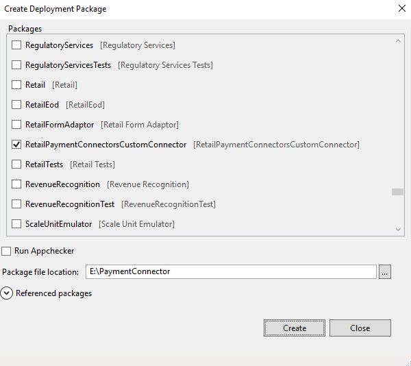

# Create Commerce payment packaging for finance and operations deployment

[!include [banner](../../includes/banner.md)]

This article explains how to package a payment connector for finance and operations deployment in Microsoft Dynamics 365 Commerce.

In releases that are earlier than 10.0.10, you use the Commerce software development kit (SDK) to create a payment connector package. (The Commerce SDK was previously known as the Retail SDK.) In the 10.0.10 release and later, you can use only Visual Studio to create an Application Object Server (AOS) payment connector package. Packages that you create by using this approach can be deployed for both earlier deployments and self-service deployments by using [all-in-one packages](../../fin-ops-core/dev-itpro/dev-tools/aio-deployable-packages.md).

> [!NOTE]
> In releases that are earlier than 10.0.10, you can create a single payment package and use it both for Application Explorer and for the commerce channel and cloud components (Commerce Scale unit). In the 10.0.10 release, you must create two packages. One package is for Application Explorer, and you create it by using the Dynamics 365 packaging model. The other package is for the commerce channel and cloud components, and you create it by using the Commerce SDK. The previous approach, where the Commerce SDK is used to create Application Explorer payment packaging, is obsolete (deprecated) as of the 10.0.10 release.

To create a payment package that you can deploy, follow the steps in the next section.

> [!NOTE]
> The steps for using the Commerce SDK to create the package for the commerce channel and cloud components haven't changed. For more information, see [Create and deploy connector](deploy-payment-connector.md).

## Create an AOS payment package in the 10.0.10 release

1. In Visual Studio, on the **Dynamics 365** menu, select **Model Management \> Create model**.
2. Enter the model name, the model publisher, and other required details. Then select **Next**.

    The model name must be prefixed with (that is, start with) **RetailPaymentConnectors**. After this prefix, add information about the custom model name. For example, the model that you create might be named **RetailPaymentConnectorsCustomConnector**. Only model names that begin with the **RetailPaymentConnectors** prefix will be loaded in the Commerce payment connector options.

    

3. Select the **Create new package** option, and then select **Next**.
4. Select the required referenced package, and then select **Next**.
5. Select **Finish** to finish creating the model.
6. In Solution Explorer, select the project, right-click **References**, and then select **Add Reference**.
7. Add all the payment connector assemblies and their dependencies to the project as references.

    
    
[!NOTE]
> All payment connector dll’s must be portable, having portable and non-portable payment connector dll’s will cause issues when loading the connector.

8. If your extension needs an HTML and CSS file for the implementation, then add them as a resource file to your project. During deployment, the HTML files will be copied to the AosService\WebRoot\Resources\Html folder. The CSS files will be copied to the AosService\WebRoot\Resources\Styles folder, then accessed with the following URL format.

Ex: GetPaymentAcceptPoint implementation should be updated to return this URL, if required.

```
https://AOSUrl/resources/html/Myhtml.html
https://AOSUrl/resources/styles/Mycss.css
```
> [!NOTE]
> Only HTML and CSS file formats added as Resources to the project will be copied to the AosService\WebRoot\, other file formats added as Resources will not be copied to AosService\WebRoot\. If you need the file in AosService\WebRoot\ folder then migrate it to HTML file format or host the non-supported file formats externally. IF hosted externally, hosting has to be managed by the custome or partner.

9. If you don't have any other payment X++ extensions that are related to the payment connector, build the solution.

> [!NOTE]
> If there are no other extensions package, then continue with these steps. If you have additional extensions packages, then combine all of them into  all-in-one deployable packages. If you do not do this, this package will override other packages. For more information, see [All-in-one deployable packages](../../fin-ops-core/dev-itpro/dev-tools/aio-deployable-packages.md).

10. To create the deployable package, on the **Dynamics 365** menu, select **Deploy \> Create Deployment Package**.
11. Select the model that you created earlier, specify the location of the package file, and then select **Create**.


    

    Visual Studio builds the model and creates the deployable package.

12. After the deployable package has been created, sign in to Microsoft Dynamics Lifecycle Services (LCS), and then, in your LCS project, select the **Asset Library** tile.
13. Upload the deployable package that you created.

## Apply a deployable package

For information about how to apply a deployable package to an environment, see [Apply updates to cloud environments](../../fin-ops-core/dev-itpro/deployment/apply-deployable-package-system.md).

## Remove a deployable package

For information about how to uninstall or remove a deployable package from an environment, see [Uninstall a package](../../fin-ops-core/dev-itpro/deployment/uninstall-deployable-package.md).


[!INCLUDE[footer-include](../../includes/footer-banner.md)]

