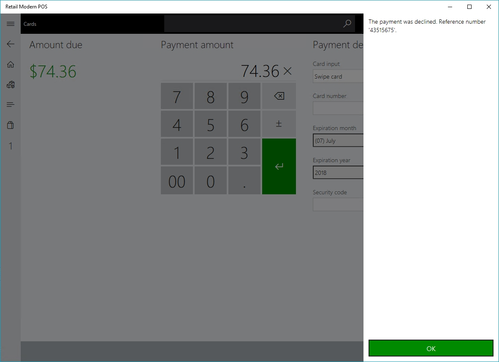
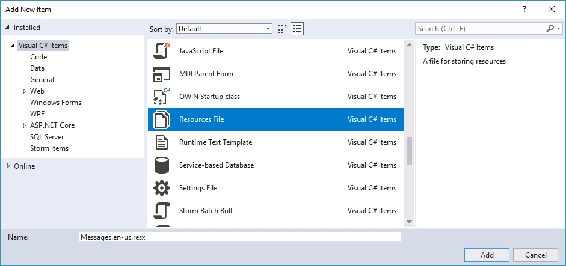
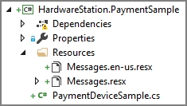
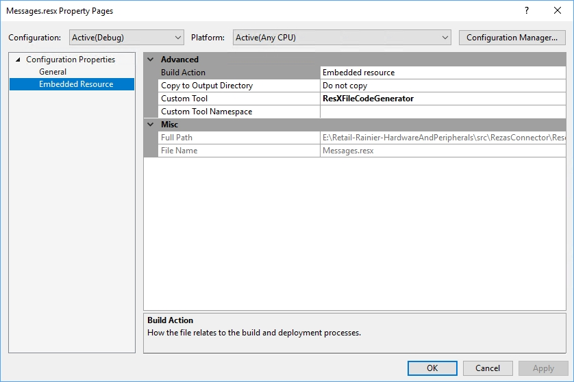
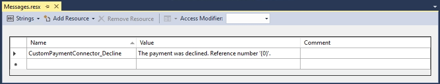

# Create custom localized error messages for payment terminal extensions

[!include[banner](../includes/banner.md)]

This article explains how to create custom localized error messages for payment terminal extensions. These custom error messages are most often used so that the payment terminal can give the cashier who is using the point of sale (POS) terminal relevant information about why a specific payment was unsuccessful. For example, the external payment terminal or gateway might return unique identifiers (such as reference numbers or transaction identifiers) that are relevant for troubleshooting with the payment provider.

## Key terms

| Term | Description |
|---|---|
| Payment connector | An extension library that is written to integrate the POS with a payment terminal. |

## Overview
The remaining sections in this article describe the following steps for creating custom localized error messages for payment terminal extensions:

- **[Create custom error messages](#create-custom-error-messages)** – This section explains how to create custom error messages in the payment connector that can be returned and shown in the POS.
- **[Create localized error messages](#create-localized-error-messages)** – This section explains how to localize the error messages in the payment connector that are returned and shown in the POS.

## Create custom error messages
To trigger a custom error message in the POS, you must set the appropriate error in the **Errors** property of the **paymentInfo** object that is passed to the **AuthorizePaymentTerminalDeviceResponse** object. Specifically, you must set the **isLocalized** parameter on the constructor of the **PaymentError** object to **true** to force the POS to use the custom error message instead of the built-in error message for a declined payment.

``` csharp
namespace Contoso.Commerce.HardwareStation.PaymentSample 
{ 
    /// <summary>
    /// <c>Simulator</c> manager payment device class.
    /// </summary>
    public class PaymentDeviceSample : INamedRequestHandler
    {
        /// <summary>
        /// Gets the collection of supported request types by this handler.
        /// </summary>
        public IEnumerable<Type> SupportedRequestTypes
        {
            get
            {
                return new[]
                {
                    typeof(AuthorizePaymentTerminalDeviceRequest),
                    ...
                };
            }
        }

        /// <summary>
        /// Executes the payment device simulator operation based on the incoming request type.
        /// </summary>
        /// <param name="request">The payment terminal device simulator request message.</param>
        /// <returns>Returns the payment terminal device simulator response.</returns>
        public Response Execute(Microsoft.Dynamics.Commerce.Runtime.Messages.Request request)
        {
            ThrowIf.Null(request, nameof(request));
            Type requestType = request.GetType();
            Response response;
            if (requestType == typeof(AuthorizePaymentTerminalDeviceRequest))
            {
                response = this.AuthorizePayment((AuthorizePaymentTerminalDeviceRequest)request);
            }
            else if (...)
            {
                ...
            }
            else
            {
                throw new NotSupportedException(string.Format(CultureInfo.InvariantCulture, "Request '{0}' is not supported.", request));
            }
            return response;
        }

        /// <summary>
        /// Authorize payment.
        /// </summary>
        /// <param name="request">The authorize payment request.</param>
        /// <returns>The authorize payment response.</returns>
        public AuthorizePaymentTerminalDeviceResponse AuthorizePayment(AuthorizePaymentTerminalDeviceRequest request)
        {
            ThrowIf.Null(request, "request");
            ...

            // Assuming the external payment terminal/gateway returned a decline and a reference number.
            // Construct the custom error message and set the payment error on the 'paymentInfo' object set
            // on the response.
            PaymentInfo paymentInfo = new PaymentInfo();
            bool isLocalized = true;
            string errorMessage = string.Format("The payment was declined. Reference number '{0}'.", referenceNumber);
            PaymentError paymentError = new PaymentError(ErrorCode.Decline, errorMessage, isLocalized);
            paymentInfo.Errors = new PaymentError[] { paymentError };
            return new AuthorizePaymentTerminalDeviceResponse(paymentInfo);
        }
    }
}
```

The following illustration shows how the custom error message appears in the POS.



## Create localized error messages

### Create resource files for each locale
To return localized error messages from the payment connector to the POS, you must create localized resource files for each locale that you plan to support. To create a resource file, follow these steps.

1. In Microsoft Visual Studio, right-click the connector project (or a subfolder, as required), and then select **Add \> New Item**.
2. In the new **Add New Item** dialog box, select **Visual C# Items** in the left pane and **Resource File** in the center pane.

    

Note that a culture-specific postfix (for example, **en-us**) is required in the file name of every resource file that you create, so that localized satellite assemblies can be generated.

When you've finished, the following resource files should be present in your project. Although the following illustration shows only one extra locale (**en-us**), you can add support for as many locales as you require.

Make sure that a culture-neutral resources file (**Messages.resx** in this example) is defined. This file is used as a fallback if the file for a specific culture is missing.



You must also make sure that the correct properties are set for the resource files in Visual Studio, as shown in the following illustration.



### Create custom localized error messages
Every resource file must contain every error message that you want to customize and localize. The following illustration shows an example of a resource file. Notice that the **CustomPaymentConnector_Decline** entry is referenced in the code to retrieve the appropriate message for a specific locale. Every resource file for every locale should have an identical set of localized messages.



### Load the localized message in the connector code
The following example shows how you can use the resource files that you created earlier in your payment connector code to load a localized message. The process consists of two steps:

1. Make sure that **terminalSettings** is retrieved during the **OpenPaymentTerminalDeviceRequest** request, to access the locale for the request.
2. During the **AuthorizePaymentTerminalDeviceRequest** call (or equivalent calls), use the **Locale** property on **terminalSettings** to retrieve the correct resource file for the localized message.

> [!NOTE]
> The following example has been significantly simplified to show the mechanics of loading localized messages during the runtime of your payment connector code. However, we recommend that you introduce a new set of classes to manage loading of the appropriate resource file.

``` csharp
namespace Contoso.Commerce.HardwareStation.PaymentSample 
{ 
    /// <summary>
    /// <c>Simulator</c> manager payment device class.
    /// </summary>
    public class PaymentDeviceSample : INamedRequestHandler
    {
        // Cached version of the terminal settings retrieved during the OpenPaymentTerminalDeviceRequest call.
        private SettingsInfo terminalSettings;

        // Resource manager to retrieve localized messages.
        private ResourceManager messagesResourceManager;

        /// <summary>
        /// Initializes a new instance of the <see cref="PaymentDeviceSample"/> class.
        /// </summary>
        public PaymentDeviceSample()
        {
            this.messagesResourceManager = new ResourceManager("Contoso.Commerce.HardwareStation.PaymentSample.PaymentDeviceSample .Resources.Messages", typeof(PaymentDeviceSample).GetTypeInfo().Assembly);
        }

        /// <summary>
        /// Gets the collection of supported request types by this handler.
        /// </summary>
        public IEnumerable<Type> SupportedRequestTypes
        {
            get
            {
                return new[]
                {
                    typeof(OpenPaymentTerminalDeviceRequest),
                    typeof(AuthorizePaymentTerminalDeviceRequest),
                    ...
                };
            }
        }

        /// <summary>
        /// Executes the payment device simulator operation based on the incoming request type.
        /// </summary>
        /// <param name="request">The payment terminal device simulator request message.</param>
        /// <returns>Returns the payment terminal device simulator response.</returns>
        public Response Execute(Microsoft.Dynamics.Commerce.Runtime.Messages.Request request)
        {
            ThrowIf.Null(request, nameof(request));
            Type requestType = request.GetType();
            Response response;
            if (requestType == typeof(OpenPaymentTerminalDeviceRequest))
            {
                response = this.Open((OpenPaymentTerminalDeviceRequest)request);
            }
            else if (requestType == typeof(AuthorizePaymentTerminalDeviceRequest))
            {
                response = this.AuthorizePayment((AuthorizePaymentTerminalDeviceRequest)request);
            }
            else if (...)
            {
                ...
            }
            else
            {
                throw new NotSupportedException(string.Format(CultureInfo.InvariantCulture, "Request '{0}' is not supported.", request));
            }
            return response;
        }

        /// <summary>
        /// Open the payment terminal.
        /// </summary>
        /// <param name="request">The open request.</param>
        /// <returns>The open response.</returns>
        private Response Open(OpenPaymentTerminalDeviceRequest request)
        {
            this.terminalSettings = request.TerminalSettings;
            ...
        }

        /// <summary>
        /// Authorize payment.
        /// </summary>
        /// <param name="request">The authorize payment request.</param>
        /// <returns>The authorize payment response.</returns>
        public AuthorizePaymentTerminalDeviceResponse AuthorizePayment(AuthorizePaymentTerminalDeviceRequest request)
        {
            ...

            // Assuming the external payment terminal/gateway returned a decline and a reference number. Construct 
            // the custom error message and set the payment error on the 'paymentInfo' object set on the response.
            PaymentInfo paymentInfo = new PaymentInfo();
            CultureInfo cultureInfo = new CultureInfo(this.terminalSettings.Locale);
            string localizedString = this.messagesResourceManager.GetString("CustomPaymentConnector_Decline", cultureInfo);
            string errorMessage = string.Format(localizedString, referenceNumber);
            bool isLocalized = true;
            PaymentError paymentError = new PaymentError(ErrorCode.Decline, errorMessage, isLocalized);
            paymentInfo.Errors = new PaymentError[] { paymentError };
            return new AuthorizePaymentTerminalDeviceResponse(paymentInfo);
        }
    }
}
```


[!INCLUDE[footer-include](../../includes/footer-banner.md)]
