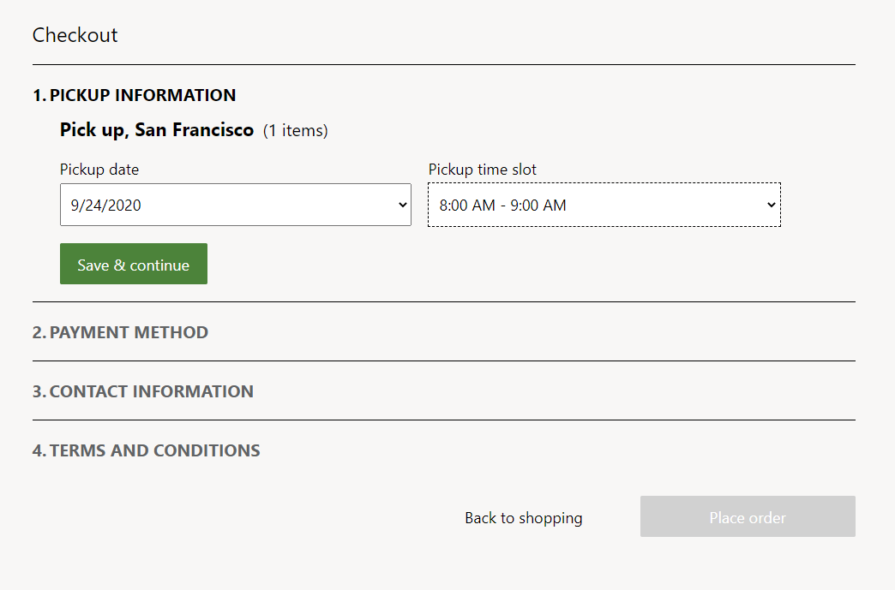
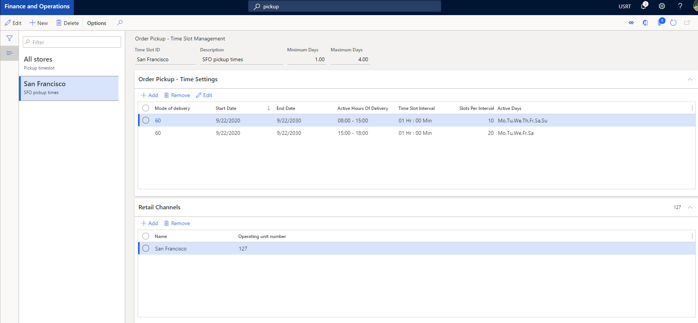
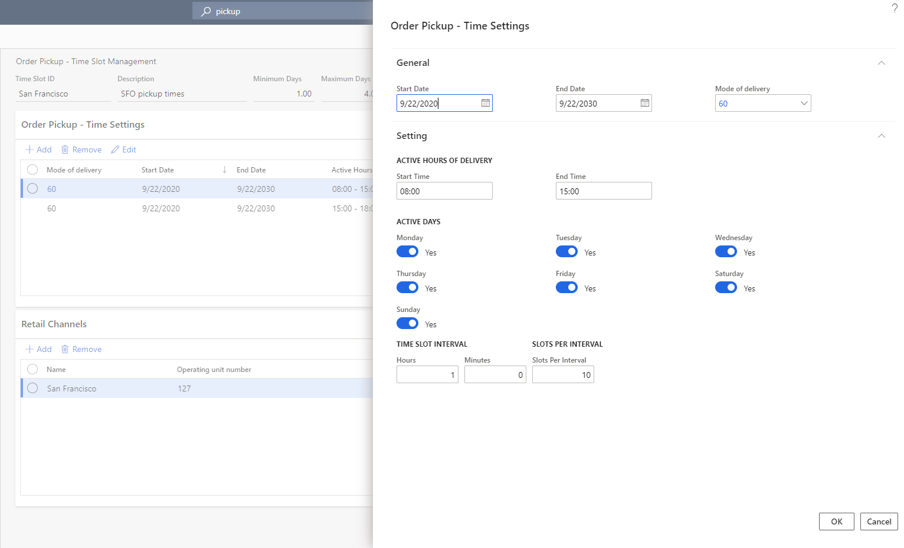
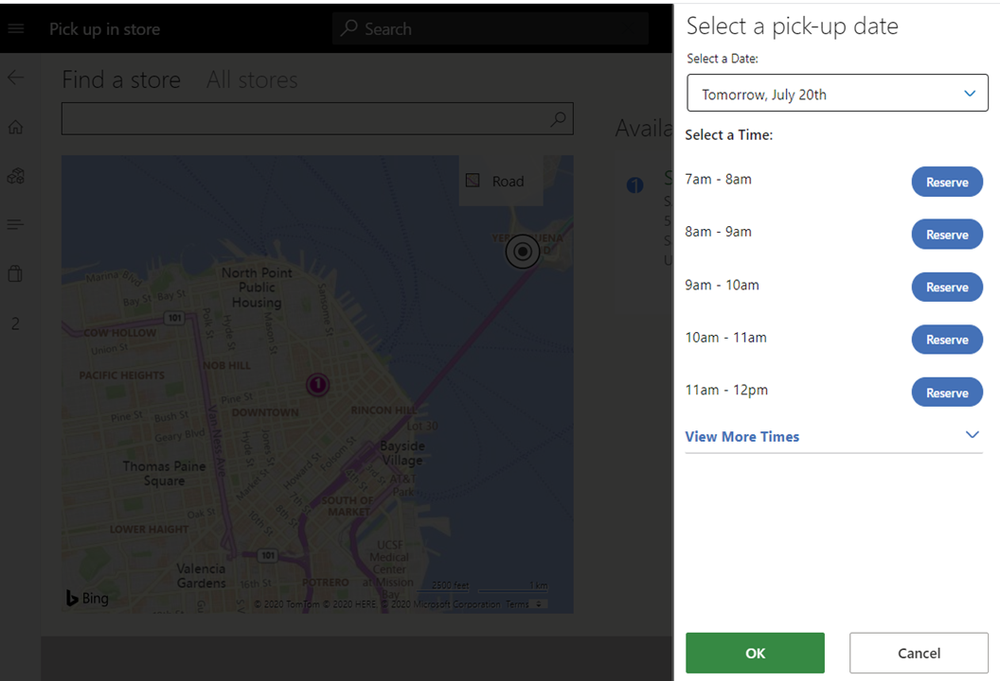
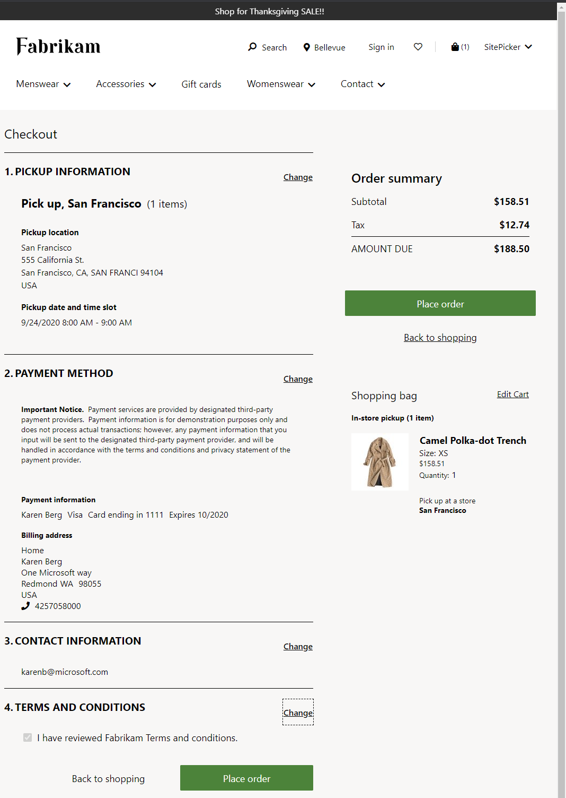
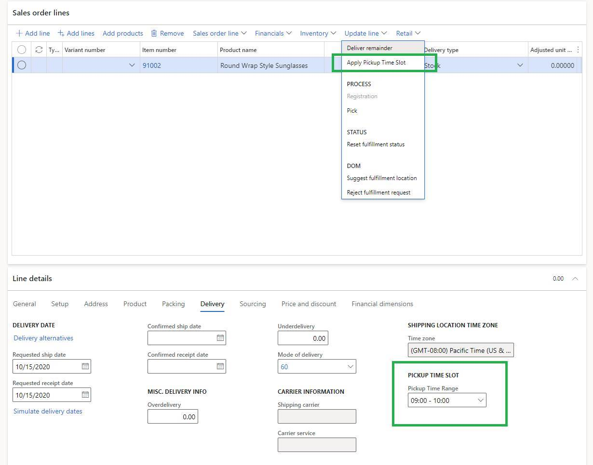

# Create and update time slots for customer pickup

[!include [banner](../../includes/banner.md)]

This article describes how to create, configure, and update customer pickup time slots in Commerce headquarters.

The time slot feature gives retailers a way to define a time slot for items that the customer pickup delivery mode is turned on for. Time slots let retailers define the days and times when orders can be picked up from a store. Retailers can also define the number of orders that can be picked up during a given period. In this way, retailers can limit the number of orders that can be picked up on a given day and at a given time. The result is a better-quality experience for their customers.

> [!NOTE]
> The time slot feature is available in Microsoft Dynamics 365 Commerce version 10.0.15 and later.

The following illustration shows an example of time slot selection during e-commerce checkout.

## Time slot properties

A time slot is a specific interval when a customer can choose to pick up an order from a specific store or location. The time slot management feature is available only when the customer pickup delivery mode is configured in Dynamics 365 Commerce.

A time slot is defined by using the following properties:

- **Mode of delivery** – Specify the pickup mode of delivery that the time slot applies to.
- **Minimum Days** and **Maximum Days** – Specify the earliest and latest dates that can be selected for pickup relative to the date when the order is placed. 

    The **Minimum Days** property ensures that there is enough time for the retailer to process the order before it's ready for pickup. The **Maximum Days** property ensures that the user can't select a date that is too far in the future. For example, if the minimum value is set to **1**, and an order is placed on September 20, the earliest day that the order will be available for pickup is the next eligible day (September 21). In a similar way, by setting a maximum value, you can define the maximum number of days that an order can be picked up. When minimum and maximum values are defined, site users can see and select only a specific set of days during their checkout experience.

    You can set the minimum value to a decimal value that is less than 1. For example, if pickup is available four hours after an order is placed, set the minimum value to **0.17** (= 4 ÷ 24, rounded up to two decimal places). However, if you set the minimum value to a decimal value that is more than 1, it's always rounded up to the nearest whole number. For example, a value of **1.2** will be rounded up to **2**. Similarly, if you set the maximum value to a decimal value, it's always rounded up to the nearest whole number. 

- **Start Date** and **End Date** – Specify the start and end dates of the time slot. Each time slot entry has a start date and an end date. Therefore, you have the flexibility to add different time slots throughout the year (for example, pickups during holiday hours). If a time slot's start and dates are changed after an order is placed, the changes won't apply to that order. When you define start and end dates, you must consider store closure dates (for example, Christmas day) and ensure that time slots aren't defined for those days.
- **Active Hours of Pickup** – Specify the period when pickup is allowed. For example, the pickup times might be between 2 PM and 5 PM every day. This property enables the pickup times to be independent of store hours. Therefore, the retailer can configure pickup times that meet its specific business requirements. When you define the active hours of pickup, you must consider store hours and ensure that pickup times aren't defined for times when the store is closed.

    > [!NOTE]
    > The hours for store pickup must be defined in the time zone of the appropriate store.

- **Time Slot Interval** – Specify the duration that can be allotted to each time slot. For example, the duration of each time slot might be in increments of 15 minutes, 30 minutes, or one hour. If time slot value is 0, the time slot is available for the entire duration between the start and end time.
- **Slots Per Interval** – Specify the number of customer or orders that can be served for pickup during each time slot interval. For example, enter **1**, **2**, **3**, or any other whole number.
- **Active Days** – Specify the days of the week when the pickup time slots are active. This property lets the retailer define the days when it wants to support pickup orders.
- **Retail Channels** – Specify the retail channels. Each time slot can be associated with one or more retail stores. Depending on each store's hours of operation, one or more time slot entries can be created and associated with a channel. 

<!--  -->

Only one time slot template can be configured per channel. These channels include brick-and-mortar stores, call centers, mobile devices, and e-Commerce sites.

## Configure the time slot feature in Commerce headquarters

Time slots must be defined for each pickup mode of delivery in Commerce headquarters, so that point of sale (POS) and e-commerce channels can reference them.

- Only one time slot template can be associated with each store or channel.
- Each time slot that is created should be unique to each delivery mode in each template.
- After the time slot feature is configured, the time slot calendar will be available to the selected stores or store groups. It will also be visible at the POS, for reference.

To configure the time slot feature in Commerce headquarters, follow these steps.

1. Go to **Commerce** \> **Channel setup** \> **Store pickup time slot**.
1. Select **New** to create a new time slot template. To use an existing template, select the template in the left pane.
1. Enter values in the **Time Slot ID** and **Description** fields.
1. On the **Order Pickup - Time Settings** FastTab, select **Add**.
1. In the **Order Pickup - Time Settings** dialog box, define the date range, mode of delivery, active hours of delivery, active days, time slot interval, slots per interval, and other settings.

    If time slots will be static for the foreseeable future, set the **End Date** field to **Never**.

    > [!NOTE]
    > You can create multiple templates, but only one template can be associated with a single channel or store.

    

1. When you've finished, select **OK**.
1. If the time slots in a day will vary, create additional entries on the **Order Pickup - Time Settings** FastTab to ensure that the dates and times don't overlap.
1. On the **Retail Channels** FastTab, select **Add** to associate the time slot template with the stores or channels where it will be used.
1. In the **Choose organization nodes** dialog box, use the arrow buttons to select (or clear the selection of) the stores, regions, and organizations that the template should be associated with.

    <!--  -->

1. When you've finished, select **OK**.
1. On the **Distribution schedule** page, run the **1070** and **1135** jobs to sync the data to the channels.

## Time slot selection for POS orders

At the POS, when an order or order line is identified for pickup, the cashier can select the pickup store or location, and a date and time slot. If a customer has a pickup order for a different store, the cashier can select dates when the pickup will be available in that store. The store lookup will provide a reference to the dates and store times.

The following illustration shows an example of time slot selection for a POS order.

## Time slot selection for e-commerce orders

For information about how to make time slot selection available for e-commerce orders, see [Pickup information module](../pickup-info-module.md).

> [!NOTE]
> Users can view or edit pickup time slots on a Commerce site's checkout page only if the pickup information module has been added to that page. If the checkout page doesn't include the pickup information module, orders will be placed without letting users specify or view time slot information.

The following illustration shows an example of an e-commerce order where a pickup time slot has been selected.

## Time slot selection for call center orders

In the call center app, call center agents can select the pickup store or location, as well as a date and time slot as highlighted in the following illustration.

## Additional resources

[Pickup information module](../pickup-info-module.md)

[!INCLUDE[footer-include](../../includes/footer-banner.md)]
