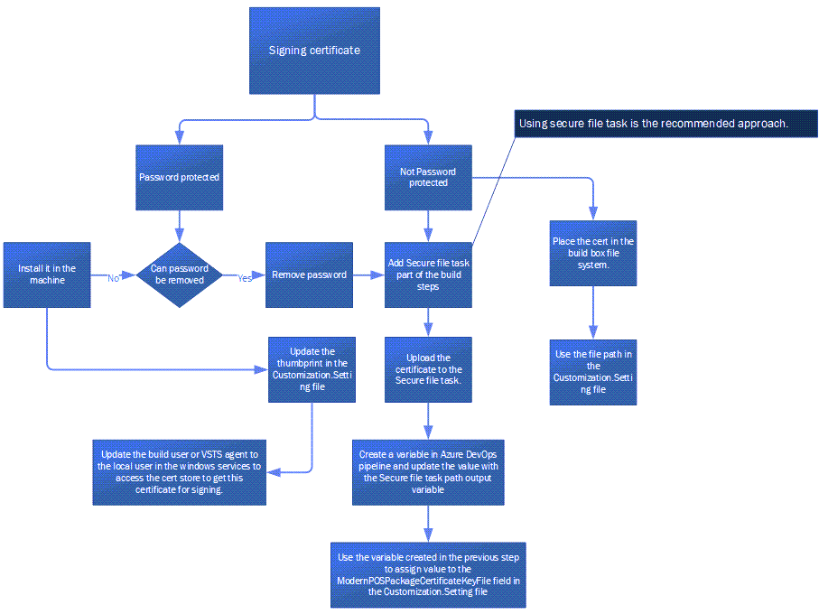
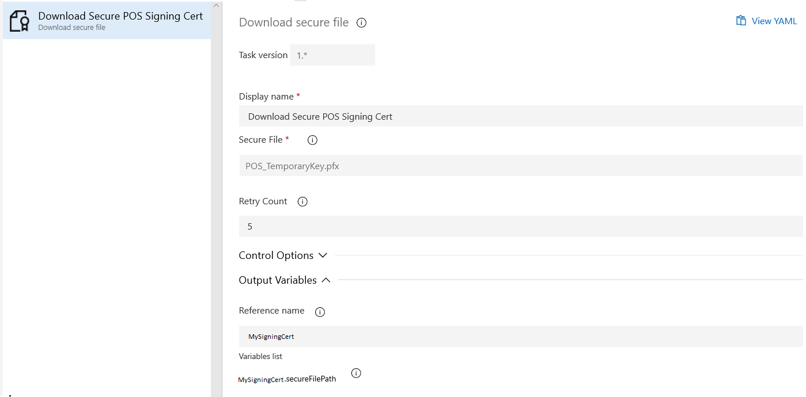

# Sign the MPOS .appx file with a code signing certificate

[!include [banner](../includes/banner.md)]
[!include [banner](../includes/retail-sdk-deprecation-banner.md)]

To install Modern POS (MPOS) you must sign the MPOS app with a code signing certificate from a trusted provider and install the same certificate on all the machines where MPOS is installed under the trusted root folder for the current user.

> [!NOTE]
> Microsoft recommends that you proactively plan to renew and/or rotate your certificates in advance of their expiration. However, an expired MPOS certificate will only prevent the installation of new MPOS updates, and will not cause the MPOS application to stop functioning.

To sign the MPOS app with a certificate, use one of these options in the **Retail SDK\\Build tool\\Customization.settings** file:

- Add the Secure file task part of Azure DevOps build steps and upload the certificate to secure the file task. Use the secure file task output path variable as a parameter in the Customization.settings file.
    > [!NOTE]
    > The Secure File task doesn’t support a password protected certificate. You must remove the password before uploading this task. Because the certificate is uploaded to the secure file system task in Azure, you can remove the password only for this step. However, you should discuss removing the password with your security experts to determine if this is the correct action for your project. Don’t remove the certificate password for other scenarios.
- Use a certificate that is in the file system. To do this, download or generate a certificate and place it in the file system where the build is running. The Microsoft-hosted agent or build user should have access to this path and file.
- Use thumbprint to look up in the certificate in the store and sign in with that certificate.

## Use a Secure File task for Universal Windows Platform app signing

> [!NOTE]
> You can also use Azure Key Vault to store the certificate and use the Azure sign tool to sign the Modern POS .appx file and self-service installers. For sample pipeline scripts and additional information, see [Set up a build pipeline in Azure DevOps to generate Commerce self-service packages](build-pipeline.md#set-up-a-build-pipeline-in-azure-devops-to-generate-commerce-self-service-packages).

Using a Secure File task is the recommended approach for Universal Windows Platform (UWP) app signing. For more information about package signing, see [Configure package signing](/windows/uwp/packaging/auto-build-package-uwp-apps#configure-package-signing). This process is shown in the following image.



> [!NOTE]
> Currently the OOB packaging supports signing only the .appx file, the different self-service installers like MPOIS, RSSU, and HWS are not signed by this process. You need to manually sign it using SignTool or other signing tools. The certificate used for signing the .appx file must be installed in the machine where Modern POS is installed.

## Steps to configure the certificate for signing in Azure Pipelines

### Certificate in the file system/secure location

Download the [DownloadFile task](/visualstudio/msbuild/downloadfile-task) and add it as the first step in the build process. The advantage of using the Secure File task is that the file is encrypted and placed in the disk during build no matter if the build pipeline succeeds, fails, or is canceled. The file is deleted from the download location after the build process is completed.

1. Download and add the Secure File task as the first step in the Azure build pipeline. You can download the Secure File task from [DownloadFile](https://marketplace.visualstudio.com/items?itemName=automagically.DownloadFile).
1. Upload the certificate to the Secure File task and set the Reference name under Output Variables, as shown in the following image.
    > [!div class="mx-imgBorder"]
    > 
1. Create a new variable in Azure Pipelines by selecting **New Variable** under the **Variables** tab.
1. Provide a name for the variable in the value field, for example, **MySigningCert**.
1. Save the variable.
1. Open the **Customization.settings** file from **RetailSDK\\BuildTools** and update the **ModernPOSPackageCertificateKeyFile** with the variable name created in the pipeline (step 3). For example:

    ```Xml
    <ModernPOSPackageCertificateKeyFile Condition="'$(ModernPOSPackageCertificateKeyFile)' ==''">$(MySigningCert)</ModernPOSPackageCertificateKeyFile>
    ```
    This step is required if the certificate is not password protected. If the certificate is password protected, continue with the following steps.
    
1. If you want to timestamp the MPOS .appx file when signing it with a certificate, open the **Retail SDK\\Build tool\\Customization.settings** file and update the **ModernPOSPackageCertificateTimestamp** variable with the timestamp provider (for example, `http://timestamp.digicert.com`).
1. On the pipeline’s **Variables** tab, add a new secure-text variable. Set the name to **MySigningCert.secret** and set the value of the password for the certificate. Select the lock icon to secure the variable.
1. Add a **Powershell Script** task to the pipeline (after the Download Secure File and before the Build step). Provide the **Display** name and set the Type as **Inline**. Copy and paste the following into the script section.

    ```powershell
    Write-Host "Start adding the PFX file to the certificate store."
    $pfxpath = '$(MySigningCert.secureFilePath)'
    $secureString = ConvertTo-SecureString "$(MySigningCert.secret)" -AsPlainText -Force
    Import-PfxCertificate -FilePath $pfxpath -CertStoreLocation Cert:\CurrentUser\My -Password $secureString
    ```

1. Open the **Customization.settings** file from **RetailSDK\\BuildTools** and update the **ModernPOSPackageCertificateThumbprint** with the certificate thumbprint value.

    ```Xml
       <ModernPOSPackageCertificateThumbprint Condition="'$(ModernPOSPackageCertificateThumbprint)' == ''"></ModernPOSPackageCertificateThumbprint>
    ```

For details about how to get the thumbprint for a certificate, see [retrieve a certificate's thumbprint](/dotnet/framework/wcf/feature-details/how-to-retrieve-the-thumbprint-of-a-certificate#to-retrieve-a-certificates-thumbprint). 

## Download or generate a certificate to sign the MPOS app manually using msbuild in SDK

If a downloaded or generated certificate is used to sign the MPOS app, then the update the **ModernPOSPackageCertificateKeyFile** node in the **BuildTools\\Customization.settings** file to point to the pfx file location (**$(SdkReferencesPath)\\appxsignkey.pfx**). For example:

```xml
<ModernPOSPackageCertificateKeyFile Condition="'$(ModernPOSPackageCertificateKeyFile)' ==''">$(SdkReferencesPath)\appxsignkey.pfx</ModernPOSPackageCertificateKeyFile>
```

In this case, the certificate file name is **appxsignkey.pfx**, located in the **Retail SDK\\Reference** folder.

## Use thumbprint to sign the MPOS app

If you use thumbprint to sign the MPOS app, then install the certificate locally. Update the thumbprint value in the **ModernPOSPackageCertificateThumbprint** node in the **BuildTools\\Customization.settings** file.

This option will work if the build user is a local user. However if you are using the Azure DevOps agents to generate the build, then the agent may not have permission to access the cert store to use the certificate for signing or the build machine will not have the certificate installed. In this case, the workaround is to change the build user to local user and install the certificate in the box. However, this option will not work if you don’t have admin access to the box.

> [!NOTE]
> If the .pfx file or Secure File task option is used to sign the app, then leave the **ModernPOSPackageCertificateThumbprint** node in **Customization.settings** empty. If the thumbprint option is used, then leave **ModernPOSPackageCertificateKeyFile** empty. If both the values are updated, then the build will fail.

### Certification renewal

### Renew a certificate from trusted CA

Contact your certifying authority (CA) for the certificate renewal process. For a trusted certificate, no action is required on the MPOS side.

### Renew a self-signed certificate

Don’t use the sample certificate available in the Retail SDK for production. It can be used only for development purposes. The sample Contoso certificate can't be renewed and the sample certificate included in Retail SDK version 10.0.16 or earlier will expire on December 31, 2020. If this certificate, or a self-signed certificate, has been used to sign a customized Modern POS, there is a strong possibility that Modern POS will not function properly after this  date.

### Impact

If the above is true for you, the issue you will be encountering is that the installer will not be able to run after December 31, 2020. Depending on the corporate IT policies used, Modern POS may not be able to function. It is critical that you test this by changing the date temporarily to a future date, to determine the impact to your organization.

### Steps to determine the issue

1.	Use Windows settings to change the computer clock to a date and time in the year 2021.
2.	Verify that Modern POS can be opened, sign in can occur, and a transaction can be completed.
3.	Verify that Modern POS Self-service installer is able to be run, and if so, that installation will complete successfully.
4.	Return the Windows clock settings to the correct date and time.

If you can complete all of these steps without issues, then you will be able to operate on the current certificate past December 31, 2020.  

### Steps going forward 

It is highly recommended that you renew the previously used certificate. We strongly recommend that you obtain a new certificate. To do this, you must perform one of the following actions:

- **Preferred** - Obtain a code signing certificate from a trusted certificate authority.

- **Not Preferred** - Generate a self-signed code signing certificate to use. This is typically used only for development purposes within a domain and is not recommended for production. 

- **Available as a temporary Solution** - Use the renewed Contoso code signing certificate. This is typically used for testing purposes, so it's not recommended that it be deployed in production.

Next, generate a new customized Modern POS package that is signed using this certificate obtained from one of the actions above. Depending on the certificate, one of the following steps must be followed:

- If using a new, trusted certificate (or a new, self-signed certificate), you will be  required to install a new certificate on every device. After that, you need to take the newly created Modern POS Package (installer), uninstall the existing application, and then reinstall the new Modern POS package. You will need to perform a device activation of Modern POS on every device.

- If using the renewed Contoso certificate, you will be required to install the new certificate on every device and install the Modern POS Package (installer). You are not required to uninstall, however you must reinstall on the device. Note that device activation of Modern POS will not be required. This option is a temporary solution. Only use this option to avoid reactivation and resolve the issue before obtaining a new trusted certificate.


[!INCLUDE[footer-include](../../includes/footer-banner.md)]
