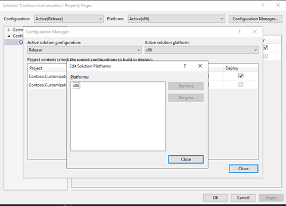

# Create an .appx file for a Modern POS extension package

[!include [banner](../../includes/banner.md)]
[!include [banner](../../includes/retail-sdk-deprecation-banner.md)]

This article explains how to create a Modern Point of Sale (MPOS) packaging project by using Visual Studio 2017. These steps are required only if you're developing extensions for MPOS. The MPOS extension packaging project generates the [MSIX Windows app package](/windows/msix/overview) that will extend the MPOS app.

1. Create a new JavaScript Universal Windows Platform (UWP) app project:

    1. In Solution Explorer, select and hold (or right-click) the solution, select **Add**, and then select **New Project**.
    2. Find **Windows JavaScript**, and select **Blank App (Universal Windows)**.
    3. Name the project **ModernPos**.
    4. Set the **Target version** field to **Windows 10, version 1809 (10.0; Build 17763)**.
    5. Set the **Minimum version** field to **Windows 10, version 1809 (10.0; Build 17763)**.

2. Delete the following source folders and files that are generated:

    + **js** folder
    + **css** folder
    + **index.html** file
    + **package.appxmanifest** file

    > [!NOTE]
    > Don't delete the image file that is used as the logo for the app package (**images\\StoreLogo.png**), unless you include a replacement logo.

3. Edit the project, and import the properties (.props) file that was created for the customization package.

    > [!NOTE]
    > Generation of the **package.appxmanifest** file depends on the properties from the customization package's .props file. Make sure that you import the .props file into the project.

4. Add a reference to the POS SDK NuGet package:

    1. In Solution Explorer, select and hold (or right-click) the project, and then select **Manage NuGet packages**.
    2. In the **NuGet Package Manager** window, on the **Browse** tab, search for **Microsoft.Dynamics.Commerce.Sdk.Pos**.
    3. Select the package, and then select **Install**.

5. Update the solution configuration so that it targets only x86 platforms:

    1. In Solution Explorer, select and hold (or right-click) the project, and then select **Properties**.
    2. Open Configuration Manager.
    3. On the **Active solution platform** menu, select **Edit**.
    4. Remove all platforms except **x86**.

    

6. Edit the JavaScript project file (.jsproj file) file to remove unsupported platform configurations:

    1. Save the project file.
    2. Unload the project by using Solution Explorer.
    3. In Solution Explorer, select and hold (or right-click) the project, and then select **Edit**.
    4. Delete the **ProjectConfiguration** includes for all platforms except **x86**. When you've finished, the **ProjectConfiguration** elements should resemble the following example.

        ```xml
        <ItemGroup Label="ProjectConfigurations">
            <ProjectConfiguration Include="Debug|x86">
                <Configuration>Debug</Configuration>
                <Platform>x86</Platform>
            </ProjectConfiguration>
            <ProjectConfiguration Include="Release|x86">
                <Configuration>Release</Configuration>
                <Platform>x86</Platform>
                <UseDotNetNativeToolchain>true</UseDotNetNativeToolchain>
            </ProjectConfiguration>
        </ItemGroup>
        ```

    5. Reload the project.

7. Add a reference from the MPOS .jsproj file to the **POS.Extension Package** project that you created earlier:

    1. In Solution Explorer, select and hold (or right-click) the MPOS project, select **Add**, and then select **Reference**.
    2. On the **Projects** tab on the left side of Reference Manager, select the **POS Extension Package** project that you created earlier.
    3. When you're prompted to confirm the unsupported reference, select **Yes**.

8. If your solution contains Commerce runtime (CRT) extension projects, add project references to each CRT extension project in the solution:

    1. In Solution Explorer, select and hold (or right-click) the MPOS project, select **Add**, and then select **Reference**.
    2. On the **Projects** tab on the left side of Reference Manager, select the CRT extension projects.

9. If your solution contains Hardware Station extension projects, add project references to each Hardware Station extension project in the solution:

    1. In Solution Explorer, select and hold (or right-click) the MPOS project, select **Add**, and then select **Reference**.
    2. On the **Projects** tab on the left side of Reference Manager, select the Hardware Station extension projects.

[!INCLUDE[footer-include](../../../includes/footer-banner.md)]
