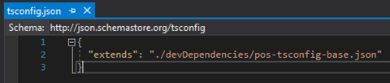

---
# required metadata

title: Create a POS extension package project 
description: This topic explains how to Create a POS extension package project.
author: mugunthanm
ms.date: 04/13/2021
ms.topic: article
ms.prod: 
ms.technology: 

# optional metadata

# ms.search.form: 
# ROBOTS: 
audience: Developer
# ms.devlang: 
ms.reviewer: rhaertle
# ms.tgt_pltfrm: 
ms.custom: 28021
ms.assetid: 
ms.search.region: Global
# ms.search.industry: 
ms.author: mumani
ms.search.validFrom: 04-13-2020
ms.dyn365.ops.version: AX 10.0.18

---

# Create a POS extension package project 

[!include [banner](../includes/banner.md)]

The steps below describe how to create a POS extension package project, set of extensions that when combined enable a custom end to end POS scenario using Visual Studio. POS extension package projects are applicable to both Modern POS and Cloud POS extension scenarios.

1.  Create a new .NET Standard Class Library Project with .NET Standard 2.0 and name it as POS.Extensions.
      
2.  Delete the class file that is created with the project.

3.  Create a shared properties file (XML file) to be used by all projects in the customization package (ex. CustomizationPackage.props), this shared file can be used for different Commerce extensions like CRT, RS, HWS etc.

    1.  It is recommended to add this file in the same directory as the solution file created in the previous step.

    2.  This file should contain the following property values:

        1.  PackagePublisher: The package publisher identity (ex. CN=Contoso Ltd.)

            -   If the package contains ModernPos extensions this must match the subject of the app signing certificate.

        2.  PackagePublisherDisplayName: The display name of the package publisher (Ex. Contoso Ltd.)

        3.  PackageVersion: The customization package version.

            1.  This must be a version string in quad notation where the Major version is not 0. (Ex. 1.0.0.0)

        4.  PackageName: The package name

            1.  This must be a string between 3 and 50 characters in length that consists of alpha-numeric and period or dash characters.

                1.  The string cannot end in a period.

        5.  PackageDisplayName: The package display name.

        6.  PackageDescription: The package description.

      

```XML
<Project>
	  <PropertyGroup>
	
	  <Version>1.0.0.0</Version>
	    <PackagePublisher Condition="'$(PackagePublisher)' == ''">$(Publisher)</PackagePublisher>
	    <PackagePublisherDisplayName Condition="'$(PackagePublisherDisplayName)' == ''">$(PublisherDisplayName)</PackagePublisherDisplayName>
	    <PackageVersion Condition="'$(PackageVersion)' == ''">$(Version)</PackageVersion>
	    <PackageName Condition="'$(PackageName)' == ''">Contoso.Commerce</PackageName>
	    <PackageDisplayName Condition="'$(PackageDisplayName)' == ''">Contoso POS Commerce Customization</PackageDisplayName>
	    <PackageDescription Condition="'$(PackageDescription)' == ''">Contoso POS Commerce Customization</PackageDescription>
	  </PropertyGroup>
	</Project>
```

4.  Edit the project file and add the import statement to include the customization package props file created in the step above.

```xml
<Import Project="..\CustomizationPackage.props" />
```

5.  Enable TypeScript support for the project

    1.  Right click the project in the solution explore and select "Manage NuGet packages."

    2.  Select the "Browse" tab in the NuGet Package Manager window

    3.  Search for "Microsoft.TypeScript.MSBuild"

        1.  Select the package and click Install, select the latest stable version.

            **Tip:** For the best IDE experience make sure that the TypeScript Tools for Visual Studio version you have installed matches the TypeScript NuGet package version. If you selected Microsoft.TypeScript.MSBuild version 4.2.3 , then you can install the Typescript 4.2.3 for Visual studio.

            Links for the Visual studio Typescript tool can be found here: [Releases · microsoft/TypeScript (github.com)](https://github.com/microsoft/TypeScript/releases)

6.  Add a reference to the POS SDK NuGet Package

    1.  Right click the project in the solution explore and select "Manage NuGet packages"

    2.  Select the "Browse" tab in the NuGet Package Manager window.

    3.  Search for "Microsoft.Dynamics.Commerce.Sdk.Pos"

    4.  Select the package and click Install.

> Tip: All the Commerce NuGet packages can be found from this public repository:
> <https://pkgs.dev.azure.com/commerce-partner/Registry/_packaging/dynamics365-commerce/nuget/v3/index.json>. 

Add the add the package source location in the nuget.config file of your extension project file, create a new nuget.config file for your project if it’s not created already:

```xml
<packageSources>
    <add key="dynamics365-commerce" value="https://pkgs.dev.azure.com/commerce-partner/Registry/_packaging/dynamics365-commerce/nuget/v3/index.json" />
    <add key="nuget.org" value="https://api.nuget.org/v3/index.json" />
    </packageSources>
```
7.  Create a tsconfig.json for your project

    1.  Right click the project file in solution explorer and select add new item.

    2.  Search "json" and select "TypeScript JSON Configuration File" and name it "tsconfig.json" and click "Add"

     

     3.  Remove all fields from the JSON and make it extend from the pos-tsconfig-base tsconfig by adding an "extends" field.

```Javascript
Ex:
{
"extends": "./devDependencies/pos-tsconfig-base.json"
 }
```
   

8.  Build the project to copy the POS dev dependencies to the project directory.

9.  Create the manifest file for your extension package.

    1.  Right click the project file in solution explorer and select add New item.

    2.  Search "json" and select "JSON File" and name it "manifest.json" and click "Add"


   3.  Add the reference to the POS Extension Manifest Schema

       1.  Add this line as the first line in manifest.json: *"$schema": "./devDependencies/schemas/manifestSchema.json"*

   4.  Add package information in your manifest.json file.

	    1.  name: The name of the extension package.

	    2.  description: A description of the extension package's functionality.

	    3.  publisher: The name of the extension package publisher or organization.

	    4.  version: The extension package version. This must follow semantic versioning pattern.

	    5.  minimumPosVersion: The minimum POS version required to run this extension package. This version number depends on POS NuGet package you are consuming, and the POS application installed. Ex: Extension project should not use POS APIs, extension artifacts from version higher than the POS App installed. During runtime, the POS Application will check the version of the extension package, if its higher than the installed POS Application then the extension package will not be loaded.

```Javascript
Ex:
{
"$schema": "./devDependencies/schemas/manifestSchema.json",
"name": "Contoso.Pos.Developer.Samples",
"publisher": "Contoso",
"version": "1.0.0",
"minimumPosVersion": "9.28.0.0",
"description": "An extension package containing POS developer samples to showcase various types of POS extensions.",
}
```
10.  If your solution contains Commerce Runtime extension projects then add project references to each of the Commerce Runtime extension projects in the solution.

    1.  Right click the Modern POS project in the Solution Explorer and click Add -&gt; Reference

    2.  Select the "Projects" tab on the left side of the Reference Manager.

    3.  Select the Commerce Runtime extension projects.

11.  All the base metadata for creating the extension is completed, now add your extension and update the manifest.json to include your extension. To develop the extension UX/logic refer the samples in the [GitHub](https://github.com/microsoft/Dynamics365Commerce.InStore/tree/release/9.28/src/PosSample/Pos.Extension).

After creating the extensions, it must be packaged to deploy to Cloud POS or MPOS. For MPOS [Create the appx file before creating the installer](pos-extension-appx.md).