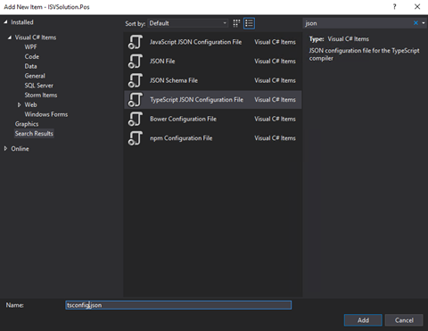

# Create a POS extension package project

[!include [banner](../../includes/banner.md)]

This article explains how to create a Point of Sale (POS) extension package project. A POS extension package project is a set of extensions that, when they are combined, enable a custom end-to-end POS scenario that uses Microsoft Visual Studio. POS extension package projects apply to extension scenarios for both Modern POS (MPOS) and Cloud POS (CPOS).

1. In Visual Studio, create a new .NET Standard class library project that uses .NET Standard 2.0, and name it **POS.Extensions**.
2. Delete the class file that is created together with the project.
3. Create a shared properties file (XML file) that all projects in the customization package will use. This shared file can be used for different Microsoft Dynamics 365 Commerce extensions, such as Commerce runtime (CRT), Retail Server, and Hardware Service extensions. Name the file. For this example, the file is named **CustomizationPackage.props**.
4. Add the file to the same directory as the solution file that you created.
5. Add the following property values to the file:

    + **PackagePublisher** – The identity of the package publisher (for example, `CN=Contoso Ltd.`). If the package contains MPOS extensions, this value must match the subject of the app signing certificate.
    + **PackagePublisherDisplayName** – The display name of the package publisher (for example, `Contoso Ltd.`).
    + **PackageVersion** – The version of the customization package. This value must be a version string in quad notation, where the major version isn't 0 (zero) (for example, `1.0.0.0`).
    + **PackageName** – The package name. This value must be a string that is between three and 50 characters long, and it must consist of only alphanumeric characters, and periods or hyphens. The string can't end in a period.
    + **PackageDisplayName** – The display name of the package.
    + **PackageDescription** – The package description.

    Here is an example of the XML file.

    ```xml
    <Project>
        <PropertyGroup>
            <Version>1.0.0.0</Version>
            <PackagePublisher Condition="'$(PackagePublisher)' == ''">$(Publisher)</PackagePublisher>
            <PackagePublisherDisplayName Condition="'$(PackagePublisherDisplayName)' == ''">$(PublisherDisplayName)</PackagePublisherDisplayName>
            <PackageVersion Condition="'$(PackageVersion)' == ''">$(Version)</PackageVersion>
            <PackageName Condition="'$(PackageName)' == ''">Contoso.Commerce</PackageName>
            <PackageDisplayName Condition="'$(PackageDisplayName)' == ''">Contoso POS Commerce Customization</PackageDisplayName>
            <PackageDescription Condition="'$(PackageDescription)' == ''">Contoso POS Commerce Customization</PackageDescription>
        </PropertyGroup>
    </Project>
    ```

6. Edit the project file, and add an **Import** statement to include the shared properties (.props) file that you created for the customization package.

    ```xml
    <Import Project="..\CustomizationPackage.props" />
    ```

7. Enable TypeScript support for the project:

    1. In Solution Explorer, select and hold (or right-click) the project, and then select **Manage NuGet packages**.
    2. In the **NuGet Package Manager** window, on the **Browse** tab, search for **Microsoft.TypeScript.MSBuild**.
    3. Select the package, select **Install**, and then select the latest stable version.

        > [!TIP]
        > For the best integrated development environment (IDE) experience, make sure that the version of the TypeScript Tools for Visual Studio that you install matches the version of the TypeScript NuGet package. If you selected version 4.2.3 of Microsoft.TypeScript.MSBuild, you can install Typescript 4.2.3 for Visual Studio.
        >
        > Links for the Visual Studio Typescript tool are available in [TypeScript/releases on GitHub](https://github.com/microsoft/TypeScript/releases).

8. Add a reference to the Retail SDK NuGet package:

    1. In Solution Explorer, select and hold (or right-click) the project, and then select **Manage NuGet packages**.
    2. In the **NuGet Package Manager** window, on the **Browse** tab, search for **Microsoft.Dynamics.Commerce.Sdk.Pos**.
    3. Select the package, and then select **Install**.

        > [!TIP]
        > All the Commerce NuGet packages can be found in the following public repository:
        >
        > [https://pkgs.dev.azure.com/commerce-partner/Registry/_packaging/dynamics365-commerce/nuget/v3/index.json](https://pkgs.dev.azure.com/commerce-partner/Registry/_packaging/dynamics365-commerce/nuget/v3/index.json)

    4. Add the package source location to the **nuget.config** file of your extension project file. (Create a **nuget.config** file for your project if it doesn't already exist.)

        ```xml
        <packageSources>
            <add key="dynamics365-commerce" value="https://pkgs.dev.azure.com/commerce-partner/Registry/_packaging/dynamics365-commerce/nuget/v3/index.json" />
            <add key="nuget.org" value="https://api.nuget.org/v3/index.json" />
        </packageSources>
        ```

9. Add a **tsconfig.json** file to your project:

    1. In Solution Explorer, select and hold (or right-click) the project, select **Add**, and then select **New item**.
    2. Search for **json**, and select **TypeScript JSON Configuration File**.
    3. Name the file **tsconfig.json**, and then select **Add**.

        

    4. Remove all the fields from the JavaScript Object Notation (JSON), and make the file extend from the **pos-tsconfig-base.json** file by adding an **extends** field. When you've finished, the XML file should resemble the following example.

        ```JSON
        {
            "extends": "./devDependencies/pos-tsconfig-base.json"
        }
        ```

10. Build the project to copy the POS dependencies to the project directory.

    > [!NOTE]
    > When building the empty POS extension project, you may see the following error, "Payload file doesn't exist". Be sure to include at least one .ts file in the project with POS extensions.

11. Create the manifest file for your extension package:

    1. In Solution Explorer, select and hold (or right-click) the project, select **Add**, and then **New item**.
    2. Search for **json**, and select **JSON File**.
    3. Name the file **manifest.json**, and then select **Add**.
    4. In the **manifest.json** file, add the reference to the POS extension manifest schema by adding the following JSON as the first line.

        ```JSON
        {
            "$schema": "./devDependencies/schemas/manifestSchema.json"
        }
        ```

    5. Add the following package information:

        + **name** – The name of the extension package.
        + **description** – A description of the extension package's functionality.
        + **publisher** – The name of the extension package's publisher or organization.
        + **version** – The version of the extension package. This value must follow the semantic versioning pattern.
        + **minimumPosVersion** – The minimum POS version that is required to run the extension package. The version number depends on the POS NuGet package that you're consuming and the POS app that is installed. For example, the extension project should not use POS APIs or extension artifacts from a version that is later than the version of the POS app that is installed. At runtime, the POS app checks the version of the extension package. If it's later than the version of the installed POS app, the extension package won't be loaded.

        Here is an example of a manifest file.

        ```JSON
        {
            "$schema": "./devDependencies/schemas/manifestSchema.json",
            "name": "Contoso.Pos.Developer.Samples",
            "publisher": "Contoso",
            "version": "1.0.0",
            "minimumPosVersion": "9.28.0.0",
            "description": "An extension package containing POS developer samples to showcase various types of POS extensions.",
        }
        ```

12. If your solution contains CRT extension projects, add project references to each CRT extension project in the solution:

    1. In Solution Explorer, select and hold (or right-click) the MPOS project, select **Add**, and then select **New item**.
    2. On the **Projects** tab on the left side of Reference Manager, select the CRT extension projects.

13. After you've created all the base metadata for the extension, add your extension, and update the **manifest.json** file so that it includes your extension. For information about how to develop the user interface (UI) and logic for the extension, see the samples in [Dynamics365Commerce.InStore on GitHub](https://github.com/microsoft/Dynamics365Commerce.InStore/tree/release/9.28/src/PosSample/Pos.Extension).

After you've finished creating the extensions, you must package them so that they can be deployed to CPOS or MPOS. For more information, see [Create an .appx file for a Modern POS extension package](create-pos-extension-appx.md).

[!INCLUDE[footer-include](../../../includes/footer-banner.md)]
