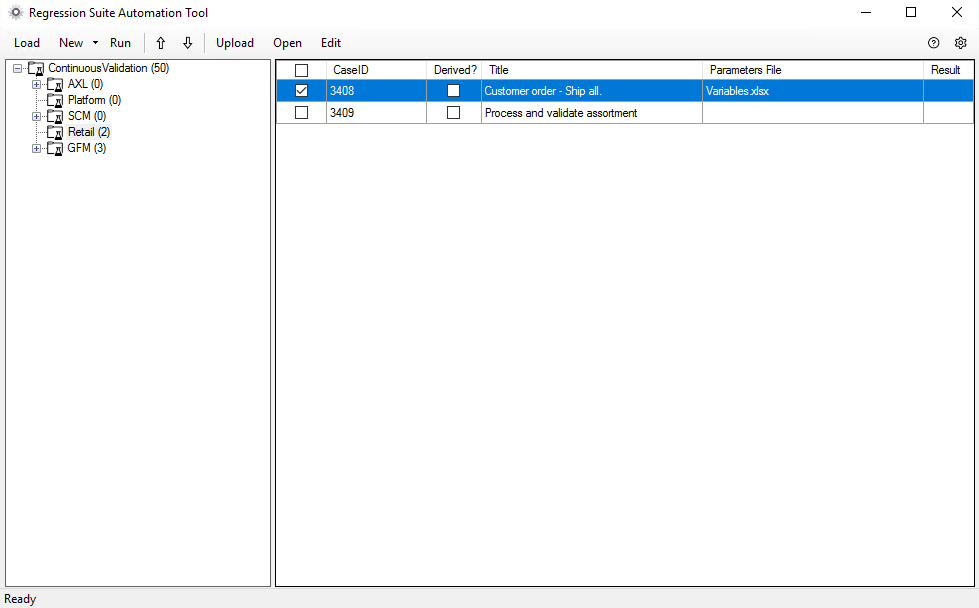

# Test recorder and Regression Suite Automation Tool for Store Commerce for web

[!include [banner](../includes/banner.md)]

This article explains how to use the new test recorder tool in Store Commerce for web to record business scenarios for user acceptance testing (UAT) and user interface (UI) testing. It also explains how to automate test validation by using the Regression Suite Automation Tool (RSAT). RSAT uses the Microsoft Azure DevOps test suite to download test cases. It then reports the results, together with the test execution status, back to Azure DevOps. The test cases can be manually created in Azure DevOps, or they can be synced from the Business process modeler (BPM) tool in Microsoft Dynamics Lifecycle Services (LCS) to Azure DevOps and then to RSAT.

This article applies to Dynamics 365 Retail and Dynamics 365 Finance version 10.0.5 (October 2019) and later.

> [!NOTE]
> The test recorder can only be used in Store Commerce for web with Google Chrome or the Microsoft Edge web browser.

## Test recorder

The test recorder in POS helps significantly reduce the time and cost of UAT. UAT is typically required before a Microsoft application update is applied, or before custom code and configurations are applied to your POS production environments.

The test recorder can record user actions in the client, and it provides exact fidelity for all controls and for all elements in the Document Object Model (DOM). In POS, the test recorder captures an event that has occurred and stores it, together with all relevant information about the corresponding user action, in real time. From this information, the test recorder can capture the type of user action (such as a button click, value entry, or navigation) and any data that is related to that user action (such as the value and type of input data, the view context, or the record context). However, password information isn't captured. During a recording session, the test recorder persists all the recorded information in memory. Then, at the end of the recording session, it generates an output file that includes enough detail so that RSAT can be used later to play back the actions just as the user performed them.

> [!IMPORTANT]
> The test recorder captures all the data that is entered during a recording session except POS user passwords. Don't record any personally identifiable information (PII), secrets, sensitive data, or user-specific data. All data that is entered during a recording session is stored in the Recording.xml file, and other users can see it in LCS and Azure DevOps, in the variables.xlsx and Recording.xml files, and during playback.

## Regression Suite Automation Tool (RSAT)

RSAT lets functional power users run test cases in POS. It then updates the test execution results in Azure DevOps for reporting and investigation purposes.

RSAT provides options for investigating test failures. It also decouples the test parameters from test steps and stores the parameters in Microsoft Excel files. In that way, the values of test parameters can easily be edited.

## Prerequisites

+ You must have a POS environment.
+ Your test environment must be running binary update 10.0.5 or later.
+ RSAT must have access to your test environment via a web browser.
+ You must have Excel installed to generate and edit test parameters.
+ You must have an Azure DevOps project to store and manage your test cases, test plans, and test case results.

## Enable test recording in the POS application

To turn on the test recording functionality in POS, follow these steps in Headquarters.

1. Go to **Retail and Commerce \> Channel Setup \> POS Setup \> Registers**.
2. Select the register where the test recording functionality should be turned on.
3. On the **Register** tab, on the **General** FastTab, set the **Enable task and test recorder** option to **Yes**.
4. Select **Save**.
5. Go to **Retail and Commerce \> Retail and Commerce IT \> Distribution schedule**.
6. Select the **Registers (1090)** job, and then select **Run now**.

## Controlling the test recorder

### Open the test recorder

To open the test recorder, sign in to Store Commerce for web, and then, on the **Settings** page, in the **Task and Test recorders** section, select **Open test recorder**.

### Stop a recording session

To end a recording session, select **Stop**. Note that you can't restart a recording session after you end it. Therefore, make sure that the recording session is completed before you end it.

### Pause a recording session

To temporarily stop (pause) a recording session, select **Pause**. Steps that you perform after you select **Pause** aren't recorded.

### Continue a recording session

To resume a recording session after you've paused it, select **Recording**.

### Start and end a task

To help organize your procedures, you can group steps together into tasks. To specify the beginning and end of a set of grouped steps, use the **Start task** and **End task** buttons. Select **Start task** to add a "Start Task" step, and then perform the steps that should be included in the group. After you've finished performing the steps for the group, select **End task**. 

Tasks can be nested inside other tasks. In this way, you can better organize very long and complex business processes.

> [!div class="mx-imgBorder"]
> 

### Add a new task

> [!div class="mx-imgBorder"]
> 

### Add an annotation

An annotation is additional text that you add to a step in a recording. For example, you can use annotations to give the user more context or instructions. You can add an annotation to any step by selecting the **Edit** button (pencil symbol) to the right of the step.

> [!div class="mx-imgBorder"]
> 

### Add text and notes

You can use the **Text** and **Notes** fields in the annotation dialog box to add text that should be associated with a step in a task guide.

+ **Text** – Text that you enter in this field appears *above* the step text in the test steps.
+ **Notes** – Text that you enter in this field appears *below* the step text.

### Change input values

You can change user input values that are entered during a recording session. For example, if you added product 0005 during the recording session, the product ID is stored by default in the Recording.xml file. If you want to specify a different product ID, you can change the value here. The value will be shown only if there is user input.

> [!div class="mx-imgBorder"]
> 

### Hide the test recorder pane

To hide and show the test recorder pane during a recording session, select the collapse button.

> [!div class="mx-imgBorder"]
> 

### Test recorder floating control

The test recorder floating control is useful when the test recorder pane is hidden during a recording session. The test recorder pane overrides non-error dialog boxes and/or part of the POS view. Therefore, you must sometimes hide the pane to add validation in the dialog boxes or select controls. If the test recorder pane is hidden, but you must still be able to access test recording functionality (for example, you must turn on validation mode, or pause or continue the recording session), you can use this floating control.

The following sections describe the controls on the floating control.

#### Move control

The move control lets you move the floating control within the POS app.

#### Validation mode

When you turn on validation mode, the recording session is paused. To continue the recording session, you must turn off validation mode.

#### Pause

To temporarily stop (pause) the recording session and continue the operation, select the **Pause** button. Steps that you perform after you select **Pause** aren't recorded.

#### Recording

To resume the recording session after you've paused it, select **Recording**.

## Record a test case in POS

### Create a recording

> [!IMPORTANT]
> Before creating the recording or test execution/playback, turn off the Show app tour and Show app introduction after sign-in. To do this, go to the **Settings \> Application help** section (applicable only if Dynamics 365 Commerce demo data is used). Turn this off in the demo data by running the following script in your channel database: Update [ax].[SYSSERVICECONFIGURATIONSETTING] SET VALUE = '0' WHERE NAME = 'APPTOUR'.

Follow these steps to create a new recording by using the test recorder:

1. Launch Store Commerce for web.

2. Select the hamburger icon on the left pane and select **Settings**. Don't sign in to Store Commerce for web. The sign-in step must be recorded as part of the test recording flow, so you need to launch the recorder before sign-in.)

3. On the **Settings** page, in the **Task and Test recorders** section, select **Open test recorder**.

    

4. Select **Create a new recording**.

    > [!div class="mx-imgBorder"]
    > 

5. Enter a name and description for the recording, and then select **Start**.

    The test recorder enters recording mode, and the recording session begins. The test recorder pane shows information and controls that are related to the recording session.
    
> [!NOTE]
> All test recording must begin from the Store Commerce for web sign-in page. If the recording is started from the home page, any transaction or  other page playback will fail and you will need to start the recording again from the sign-in page. 

6. Perform the needed actions in the POS user interface.

    > [!div class="mx-imgBorder"]
    > 

### Validation mode

When you use validation mode during a recording session, users can then validate values during test execution. For example, you can use the validation mode feature if you want to validate label text or an error message, or if you want to validate that the item price or tax is calculated correctly. To turn on validation mode during a recording session, use the **Enable validation mode** option.

1. Set the **Enable validation mode** option to **Yes**.
2. Select values or text in the POS to add a validation step. No validation is done for passwords, sensitive data, or fields where the test recorder can't get the field values. During test execution, the playback engine determines whether the value is the same. The test case then either passes or fails, depending on the result of the validation.

    > [!NOTE]
    > While validation mode is turned on, the test recorder will be in a paused state. It will just add validations steps, and POS won't respond to any user actions except the addition of validation steps. For example, in validation mode, you can't open a different POS view or use any POS functionality. To continue the recording session, you must turn off validation mode by setting the **Enable validation mode** option to **No**.

    

3. To end the recording session, select **Stop**.

### Download options

After you end a recording session, you can download the recording by selecting **Save to this PC**.

> [!div class="mx-imgBorder"]
> 

The .axtr file is saved to the local file system. You must manually upload this file to LCS or Azure DevOps and then either delete it from the file system or secure it. 

To upload to Azure DevOps directly:
1. Change the .axtr file extension to .zip.
2. Open the .zip package. 
3. Inside the package there will be a file with the name Recording.xml. Upload the Recording.xml to the test case in Azure DevOps. Don't upload the entire .zip or .axtr package.

## Install RSAT

Download the Microsoft Windows Installer (MSI) package file for RSAT from [Regression Suite Automation Tool](https://www.microsoft.com/download/details.aspx?id=57357). Double-click the MSI file to run it. After you install RSAT, you must install drivers for Selenium and the web browser. 

> [!NOTE]
> Before you run the test, you must set up Azure DevOps, and you must complete the required general settings and other required settings in RSAT. For detailed steps, see [Regression Suite Automation Tool installation and configuration](../../fin-ops-core/dev-itpro/perf-test/rsat/rsat-overview.md).

The following procedure describes the configuration that is required to run the POS test cases.

### Configure the POS settings

1. Open RSAT from your desktop.
2. Select the **Settings** button in the upper right to configure RSAT.
3. In the **Settings** dialog box, click the **Optional** tab and select the **Configure Retail POS** option to enable the Retail POS automation.
4. In the **Settings** dialog box, on the **Retail POS** tab, on the **Playback environment** tab, set the following fields:

    + **Cloud POS URL** – Enter the URL of the Cloud POS environment where you want to run the test.
    + **Commerce Scale Unit URL** – Enter the Commerce Scale Unit URL that should be used for device activation, if the device hasn't already been activated.

        > [!NOTE]
        > The Store Commerce for web and Commerce Scale Unit URL can be obtained from finance and operations environment. Navigate to **Retail and Commerce > Channel setup > Channel profiles**. You can also obtain the URLs from the LCS environment page.
   
   + **AAD user email** – Enter the email address of the Azure Active Directory (Azure AD) user that should be used for device activation. The Azure AD user must have permission to activate the device.
   + **AAD password** – Enter the password of the Azure AD user that should be used for device activation.
   + **Register number** – Enter the ID of the register number (channel) where the test should be run.
   + **Device** – Enter the ID of the device where the test should be run.
   + **Default wait time** – Enter the wait time, in seconds, before the test case fails if any element isn't found. During test execution, the playback engine keeps trying to find element until this default wait time has passed. It then fails the test case and notifies you that the element that was recorded wasn't found or loaded for playback.

    

5. Select the **POS login credentials** tab.

    During a recording session, the test recorder captures only the user name from the POS. It doesn't store any password. However, to run the test, you must have both the user name and the password that are used to sign in to POS. This tab captures the POS user name and password, so that the password information is securely stored outside the recording file. During test execution, the user ID is then mapped to the same user ID that is entered in RSAT, and the password is retrieved.
    
    Therefore, on the **POS login credentials** tab, you must enter all the user name and password information that was used during the recording session, so that the password can be retrieved during test execution. Otherwise, test execution will fail, and you will be notified that sign-in details weren't found.

    

6. Select **New**.

    

7. In the **Username** field, enter the user name for sign-in to POS.
8. In the **Password** field, enter the password for sign-in to POS.
9. Repeat steps 6 through 8 to enter other user names and passwords.
10. To edit a set of POS sign-in credentials, select **Edit**.
11. To delete a set of POS sign-in credentials, select **Delete**.

## Run tests

This section explains how to load test cases from Azure DevOps, generate automation files, modify test parameters, run tests, investigate results, and save your work back to Azure DevOps.

> [!NOTE]
> For detailed information about how to set up Azure DevOps and test cases, see [Regression Suite Automation Tool installation and configuration](../../fin-ops-core/dev-itpro/perf-test/rsat/rsat-overview.md). You must complete that setup before you start to run tests. Before test execution/playback, turn off the Show app tour and Show app introduction after sign-in. Turn this off in the demo data by running the following script in your channel database: Update [ax].[SYSSERVICECONFIGURATIONSETTING] SET VALUE = '0' WHERE NAME = 'APPTOUR'.

### Load test cases and create parameter files

In RSAT, select **Load** to download test cases and test case automation files from Azure DevOps. All test cases that belong to the test plan that is specified in the **Settings** dialog box are downloaded.

Test cases are organized by test suite under a common test plan. The test suites are the test suites that you created in your Azure DevOps project. By using RSAT, you can work with one test suite at a time. If RSAT can't load any test case, verify that your test plan was correctly created in Azure DevOps, and that it contains the required test suites and test cases.

If you're loading the test plan for the first time, the **Parameters File** column in the grid is blank, and you must generate test automation parameter files for your test cases.

To run the tests, generate the following test automation files:

- Test parameter files (Excel files that contain test case parameters)
- XML files that are required to run the tests

When you select **New**, test automation files are generated in your working directory. The Excel test parameter files appear in the **Parameters File** column in the grid.

For the test recording files, the **Generate Test Execution files only** option is unavailable. Because Store Commerce for web uses Selenium WebDriver directly to do the playback, no additional script file must be generated.

### Modify test parameters and validation values

This section explains how to modify Excel files by specifying input and validation parameters for your test run.

In RSAT, select one or more test cases to modify, and then select **Edit**. An Excel window is opened for each test case that you selected. Alternatively, you can open the Excel files directly from the working directory.

In addition to a **Summary** tab, the Excel file includes a **Variables** tab that has the details of all the variables that were generated. POS automatically generates variables for all the input values that are entered during a recording session. You don't have to generate the variables separately. Each variable has a unique variable ID that you can pass, in order, to different test cases in a single instance of test execution. All the variables on the **Variables** tab appear in the order that they were entered in during the recording session.

### Pass variables between test cases

To pass variables or values between POS test cases, or between POS and Headquarters test cases (in either direction), select the test cases in RSAT, and then open the Variables.xlsx file by selecting the Excel symbol in the tool. Copy the value in the **Variable ID** field (column C), and paste it into the **Variable value** field (column D). 

For example, you're using the test cases from the following tables and want to pass the receipt ID from the **Test case 1 - variable.xlsx** file to the **Test case 2 - variable.xlsx** file. In this case, copy the value in the **Variable ID** field (column C) of the **Test case 1 - variable.xlsx** file(**c8cc0571-9a27-b3c5-0749-c26c3cca6afe**). Then paste it into the **Variable value** field (column D) of the **Test case 2 - variable.xlsx** file, in braces: **{{c8cc0571-9a27-b3c5-0749-c26c3cca6afe}}**. The test cases must be sequenced in the correct order to pass the variable value, and all test cases must run in the same instance.

### Test case 1 – Variable.xlsx

| A  (Description)            | B (View name) | C (Variable ID)| D (Variable value) |
|---------------------------------|-------------------------------|------------------------------|--------------------------------------|
| Receipt Id "HOU123R456" | ShowJournalView        | c8cc0571-9a27-b3c5-0749-c26c3cca6afe   | HOU123R456     |

### Test case 2 – Variable.xlsx

| A  (Description)            | B (View name) | C (Variable ID)| D (Variable value) |
|---------------------------------|-------------------------------|------------------------------|--------------------------------------|
| Receipt Id "HOU123R456" | ShowJournalView  | 80f23afa-5b76-5442-d16a-6cc9b8b245cb| **{{c8cc0571-9a27-b3c5-0749-c26c3cca6afe}}** |

### Validate expected values

Validation of expected values is an important component of a test case. When you create your test cases, you can define validation parameters by using the test recorder in validation mode.

During the recording session, turn on validation mode. Then, while the test recorder is recording, select all the fields that must be validated. This action becomes a validation step that you can use with RSAT. The validation values will appear, in the order that they were entered in, on the **Variables** tab in the Excel file. You can then modify the values in the Excel file before test execution, and the new values will be used for data entry and validation during test execution.

### Run

In RSAT, select **Run** to run the selected test cases. You can run only test cases that automation files have been generated for. RSAT opens POS and runs the tests by using the data that is entered in Excel. After the test run, the results are updated in the **Result** column in RSAT, and also in Azure DevOps.

To change the order that test cases are run in, use the up arrow and down arrow buttons.

### Investigate results

After test cases have finished running, the pass or fail status appears in the **Result** column in RSAT. More details are available in Azure DevOps, and you can use them to investigate the results. From your Azure DevOps project page, go to **Test \> Runs**.

All error messages are also available locally at C:\\Users\\$YourUserName\\AppData\\Roaming\\regressionTool\\errormsg\<TestCaseId\>.txt.

## System and metadata files

The following table shows the files that are generated during recording sessions, test execution, and playback.

| File name      | Description | File generation flow | File save flow |
|----------------|-------------|----------------------|----------------|
| Recording.xml  | This file contains all the steps that are required to play back a recording. It includes all user-specific values for each step in the recording. | The file is generated by the user when that user records a test case and uploads it to Azure DevOps so that it can be used by RSAT. | The file is saved to disk when the test case is loaded into RSAT. |
| Variables.xml  | This file contains the values for all the variables that are used in the recording file. It's used by the playback tool. | The file is generated when the user selects **New \> Generate Test Execution and Parameter files** in RSAT. | The file is saved when the user selects **New \> Generate Test Execution and Parameter files**. |
| Variables.xlsx | This file contains the values for all the variables that are used in the recording file. It can be modified by the user and is used by the playback tool. | The file is generated when the user selects **New \> Generate Test Execution and Parameter files** in RSAT. | The file is saved when the user selects **New \> Generate Test Execution and Parameter files**. |
| OutputLog.txt  | This file contains a log of execution of the playback process. It includes a description of each step that was run. It might also include an exception. Depending on the exception, it might contain data that is available in the Recording.xml file. | The file is generated after the playback tool in RSAT has finished running, regardless of whether the test case was successfully played back. | The file is saved when a test case is played back. |
| Time.xml       | This file contains the list of steps, the user-edited description of each step, and the amount of time that the execution of each step required. | The file is generated after the playback tool in RSAT has finished running, but only if the test case was successfully played back. | The file is saved when a test case is successfully played back. |
| Out.xml        | This file contains the values for all the variables that are used in the recording file. For each variable, this file uses the updated value from the Variables.xlsx file. The playback tool uses this file to support test cases that depend on variables from other test cases. | The file is generated after the playback tool in RSAT has finished running, regardless of whether the test case was successfully played back. | The file is saved when a test case is played back. |
| In.xml         | This file contains the values for all the variables that are used in the recording file of every test case that was run before the current test case. It uses the updated values from each Variables.xlsx file. The playback tool uses this file to support test cases that depend on variables from other test cases. | The file is generated before the playback tool in RSAT is run, when multiple test cases are run. | The file is saved when the previous test case has finished running and before a new test case is run. |

You must manually delete these files and secure them as you require. All these files are stored in the RSAT working directory.

## Best practices

### Creating test cases by using the test recorder

+ Before creating the recording or test execution/playback, turn off the Show app tour and Show app introduction after sign-in. To do this, go to the **Settings > Application help** section (applicable only if Dynamics 365 Commerce demo data is used). Turn this off in the demo data by running the following script in your channel database: Update [ax].[SYSSERVICECONFIGURATIONSETTING] SET VALUE = '0' WHERE NAME = 'APPTOUR'.
+ Disable Chrome extension - If possible, disable the Chrome extension in the Chrome browser that is used to record and play back. The Chrome extension may change the DOM element xpath, which can result in test case failure because the element is not found during the execution of steps (xpath is different from the recording).
+ Keep individual recordings short, and focus on a business task that is performed by one user, such as the creation of a sale transaction. This approach makes it easier to maintain and reuse test cases.
+ Don't record any scenario that includes secrets.
+ Recording and playback must be done in the same screen layout and at the same resolution. If recording and playback are done in different layouts and at different resolutions, playback will fail.
+ You can't change the POS user name during playback of a recording. When you make a recording, always use the same user name that will be used later for playback.
+ Recording the POS activation flow is not supported.
+ Keystroke recording performance may be slow, so type slowly while recording so that all the events are captured property.
+ Peripheral emulation is currently not supported, use a keyboard wedge-based device.
+ Don't hold a key down during recording, as this could record multiple key press events.
+ Extension controls should follow the best practice of proper XPath and if possible have a unique ID for each HTML element.

## Troubleshooting guides

### Chrome driver

If playback fails by flickering (opens and closes browser multiple times without starting playback), this could be related to the Chrome driver version. Check the error log in the RSAT tool. If the error states that the Chrome driver version is not supported, then download the supported chromedriver.exe version mentioned in the error message and paste it in the …\Regression Suite Automation Tool\Common\External\Selenium folder.  You can download the Chrome driver from [ChromeDriver](https://chromedriver.chromium.org/downloads).

### Disable Chrome extension

If possible, disable the Chrome extension in the Chrome browser that is used to record and play back. The Chrome extension may change the DOM element xpath, which can result in test case failure because the element is not found during the execution of steps (xpath is different from the recording).

### .NET standard error

If you get the following 'netstandard' error, install .NET Framework 4.8 runtime. You can download the .NET Runtime from [Download SDKs](https://dotnet.microsoft.com/download/visual-studio-sdks).

Unhandled Exception: System.IO.FileNotFoundException: Could not load file or assembly 'netstandard, Version=2.0.0.0, Culture=neutral, PublicKeyToken=cc7b13ffcd2ddd51' or one of its dependencies. The system cannot find the file specified at Microsoft.Dynamics.Commerce.PosPlayback.RecordingsRunner.Program.Main(String[] args).Multifactor authentication:

### Multifactor authentication

If multifactor authentication is enabled for the device activation user, then playback may fail. If possible, disable the multifactor authentication for the activation user temporarily. After the activation is completed, then re-enable the multifactor authentication. Activation will be required only for the first-time playback. We recommend that you discuss this approach with your security experts before making this change.

[!INCLUDE[footer-include](../../includes/footer-banner.md)]

