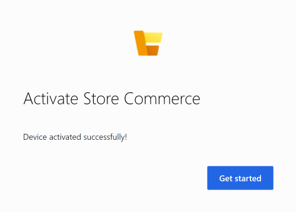

# Point of sale (POS) device activation

[!include [banner](../includes/banner.md)]

This article explains how to use guided device activation for the Store Commerce app for Windows, Android and iOS, as well as Store Commerce for web. The article also explains the client simplifications that help users easily activate devices without having to manually enter register and device ID information. 

See the troubleshooting steps at the end of this article for help with diagnosing activation issues. 

## Activate Store Commerce by using guided activation

1. Launch Store Commerce app or Store Commerce for web.

2. On the **Before you start** page, note the prerequisites, and then click **Next**.

    

4. Enter the requested URL (Retail Server URL or Cloud POS URL) and click **Next**. The Retail Server URL can be found in Headquarters in the Hardware Station section of the Store (Retail and Commerce -> Channels -> Stores -> [your store]). The Cloud POS URL can be found in the Cloud POS URL field under any device of type Retail Cloud POS (Retail and Commerce -> Channel Setup -> POS Setup -> Devices.)


    [](./media/p18.png)

4. Use your AAD credentials to sign in. The AAD account must already be mapped. For instructions, see [Configure, install, and activate Modern POS (MPOS)](../retail-modern-pos-device-activation.md). For Cloud POS, the server URL is automatically entered in the address bar. For Modern POS, you must copy and paste the server URL.

5. Click **Next** to populate the list of stores.

6. Select the correct store in the list and click **Next**.

    [](./media/p20.png)

7. Select the correct register and device and click **Activate**. 

    > [!NOTE]
    > The device can be **Pending**, **De-activated**, or **Activated**. Alternatively, if you turned on the HQ **Allow devices to be associated to registers from store** setting, you might see a list of registers that have no device associated with them. 

    [](./media/p22.png)

8. The device will now activate. When complete, you will see the following confirmation.  

    [](./media/p23.png)

## Create a device ID from Store Commerce

We have added features to create a device (that is, automatically generate a device ID) from Store Commerce so that the device can be associated with a register that doesn't yet have devices mapped to it. This functionality can be only be used in Store Commerce if you set the HQ settings as follows.

1. Go to **Retail and Commerce** &gt; **Headquarters setup** &gt; **Parameters** &gt; **Commerce shared parameters** &gt; **General**.
2. Under **Devices,** set **Allow register association from device** to **Yes**.
3. In Store Commerce, you can now add a device when you select a register that is listed as **No associated devices** in the guided activation flow.
4. After you select the register, you can either select a device that doesn't have register mapping or use the **Or, Add a Device** link.
5. Click the **Or, Add a Device** link, and then either enter the new device ID or select **Automatically create a new device ID for me**.
6. Click **Activate** to create a new device ID, associate it with the selected register, and complete the activation.

## Activate a device for Store Commerce for web using query string parameters

IT Pros can now configure device activation for Store Commerce for web by providing the device ID and register ID as the part of the Cloud POS URL. The link is available in the **Cloud POS URL** field on the **Devices** page. (**Retail and Commerce** &gt; **Channel setup** &gt; **POS setup** &gt; **Devices**). 

Store Commerce for web starts in Manual entry mode, and the Commerce Scale Unit URL, device ID, and register ID are pre-populated for activation.

## Troubleshooting for device activation problems

If you encounter errors while activating your POS device, use the following steps and suggestions to diagnose and correct them.

1. Complete the **Validate devices for activation** check in Headquarters (HQ), and make sure that the device passes validation.

2. On the client machine where you're activating the device, access the Commerce Scale Unit URL health check, and make sure that the health check is passed. Use the following format: `https://clxtestax404ret.cloud.test.dynamics.com/en/healthcheck?testname=ping`.

3. The worker must be mapped to a Microsoft Azure Active Directory (AAD) account (under **External identity**).

4. The AAD account to map must belong to the same tenant.

5. To map the worker to the AAD account, sign in to HQ by using the Admin account for Microsoft Dynamics Lifecycle Services (LCS).

6. Make sure that the worker is set up as a user in the Manager role (checked by validation).

7. Make sure that the channel is published (checked by validation).

8. Make sure that the channel database has the synced data from HQ, and that download jobs are running. To check this, run the following command in the channel database for the store.

   ```sql
   select * from crt.STORAGELOOKUPVIEW
   ```

   Make sure that data is returned, and that the result isn't empty.

9. Set up the hardware profile under **Register** (checked by validation).

10. Make sure that the register and store have a screen layout (checked by validation).

11. Make sure that a primary address is set up for the legal entity.

12. Make sure that the language is set up for the Commerce Data Exchange: Real-time Service user profile (JBB in the demo data).

13. Make sure that the Real-time Service profile has the correct access.

14. Make sure that the electronic funds transfer (EFT) configuration value is present.


[](./media/p15_11_16.png)

[!INCLUDE[footer-include](../../includes/footer-banner.md)]
