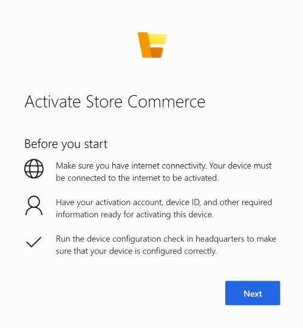
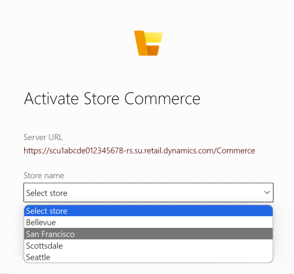

# Point of sale (POS) device activation

[!include [banner](../includes/banner.md)]

This article explains how to use guided device activation for Store Commerce for web and the Store Commerce app for Windows, Android, and iOS in Microsoft Dynamics 365 Commerce. This article also explains the client simplifications that help users easily activate devices without having to manually enter register and device ID information. 

For help with diagnosing activation issues, see [Troubleshoot device activation problems](#troubleshoot-device-activation-problems) below. 

## Activate Store Commerce using guided activation

1. Launch the Store Commerce app or Store Commerce for web.
1. On the **Before you start** page, review the prerequisites, and then select **Next**.

    

1. Under **Server URL**, enter either the Retail Server URL or the Cloud POS URL, and then select **Next**. You can find the Retail Server URL in Commerce headquarters in the **Hardware Station** section for your store at **Retail and Commerce \> Channels \> Stores \> \<your store\>**. You can find the Cloud POS URL in headquarters in the **Cloud POS URL** field under any device of type Retail Cloud POS at **Retail and Commerce \> Channel Setup \> POS Setup \> Devices**.

    [](./media/p18.png)

1. Sign in using your Azure Active Directory (Azure AD) credentials. The Azure AD account must already be mapped. For instructions, see [Configure, install, and activate Modern POS (MPOS)](../retail-modern-pos-device-activation.md). For Cloud POS, the server URL is automatically entered in the address bar. For Modern POS, you must copy and paste the server URL.
1. Select **Next** to populate the list of stores.
1. Select the correct store in the list, and then select **Next**.

    [](./media/p20.png)

1. Select the correct register and device, and then select **Activate**. 

    > [!NOTE]
    > The device status can be **Pending**, **De-activated**, or **Activated**. Alternatively, if you have the **Allow devices to be associated to registers from store** setting turned on in headquarters, you may see a list of registers that have no device associated with them. 

    [](./media/p22.png)

1. When device activation is complete, you'll see the following confirmation message.  

    [](./media/p23.png)

## Create a device ID from Store Commerce

Features have been added to Store Commerce to allow you to create a device (that is, automatically generate a device ID) from Store Commerce so that the device can be associated with a register that doesn't yet have devices mapped to it. This functionality can only be used in Store Commerce if you configure settings in headquarters.

To configure headquarters settings that allow you to create a device ID in Store Commerce, follow these steps.

1. Go to **Retail and Commerce \> Headquarters setup \> Parameters \> Commerce shared parameters \> General**.
1. Under **Devices,** set **Allow register association from device** to **Yes**.
1. In Store Commerce, you can now add a device when you select a register that is listed as **No associated devices** in the guided activation flow.
1. After you select the register, you can either select a device that doesn't have register mapping, or select **Or, Add a Device**.
1. For the latter option, select **Or, Add a Device**, and then either enter the new device ID or select **Automatically create a new device ID for me**.
1. Select **Activate** to create a new device ID, associate it with the selected register, and complete the activation.

## Activate a device for Store Commerce for web using query string parameters

You can configure device activation for Store Commerce for web by providing the device ID and register ID as the part of the Cloud POS URL. You can find the Cloud POS URL in headquarters in the **Cloud POS URL** field on the **Devices** page at **Retail and Commerce \> Channel setup \> POS setup \> Devices**. 

Store Commerce for web starts in manual entry mode, and the Commerce Scale Unit URL, device ID, and register ID are prepopulated for activation.

## Troubleshoot device activation problems

If you encounter errors while activating your POS device, follow these steps and suggestions to help diagnose and correct the related issues.

1. Complete the **Validate devices for activation** check in headquarters, and ensure that the device passes validation.
1. On the client machine where you're activating the device, run the Commerce Scale Unit URL health check, and confirm that the health check is passed. Use the following URL format: `https://clxtestax404ret.cloud.test.dynamics.com/en/healthcheck?testname=ping`.
1. Confirm that the worker is mapped to an Azure AD account (under **External identity**). This mapping is required.
1. Confirm that the Azure AD account for mapping belongs to the same tenant, which is required.
1. To map the worker to the Azure AD account, sign in to headquarters using the administrator account for Microsoft Dynamics Lifecycle Services (LCS).
1. Confirm that the worker is set up as a user in the manager role (checked by validation).
1. Confirm that the channel is published (checked by validation).
1. Confirm that the channel database has the synced data from headquarters and that download jobs are running by executing the following SQL command in the channel database for the store. After running the command, confirm that data is returned, and that the result isn't empty.

   ```sql
   select * from crt.STORAGELOOKUPVIEW
   ``

1. Set up the hardware profile under **Register** (checked by validation).
1. Confirm that the register and store have a screen layout (checked by validation).
1. Confirm that a primary address is set up for the legal entity.
1. Confirm that the language is set up for the **Commerce Data Exchange: Real-time Service** user profile (**JBB** in the demo data).
1. Confirm that the **Commerce Data Exchange: Real-time Service** profile is configured with the correct access.
1. Confirm that the electronic funds transfer (EFT) configuration value is present.

    [](./media/p15_11_16.png)


[!INCLUDE[footer-include](../../includes/footer-banner.md)]
