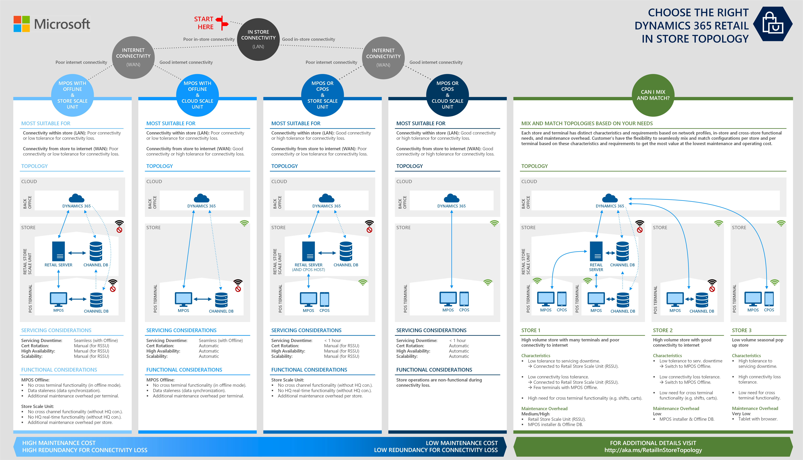

---
# required metadata

title: Select an in-store topology
description: This topic provides information about the various Dynamics 365 Commerce in-store topologies.
author: rassadi
manager: AnnBe
ms.date: 05/13/2019
ms.topic: article
ms.prod: 
ms.service: Dynamics-365-retail
ms.technology: 

# optional metadata

ms.search.form: SysAADClientTable, RetailTransactionServiceProfile
# ROBOTS: 
audience: IT Pro
# ms.devlang: 
ms.reviewer: rhaertle
ms.search.scope: Operations, Retail, Core
# ms.tgt_pltfrm: 
ms.custom: 44351
ms.search.region: Global
# ms.search.industry: 
ms.author: jashanno
ms.search.validFrom: 2019-03-01

---

# Select an in-store topology

[!include [banner](../../includes/banner.md)]

This topic provides an overview of the various Dynamics 365 Commerce in-store topologies. 

## Supported capabilities when connectivity is lost
| Operation | Without connectivity to Commerce Scale Unit (in MPOS Offline Mode) | Without connectivity to HQ (using RSSU) |
| --- | :-: | :-: |
| Cross terminal shifts (such as view, suspend, resume, close) | | ✔ | 
| Cross terminal transactions (such as view, suspend, resume)  | | ✔ |

## Supported operations when connectivity is lost
For a list of operations that are supported when the POS loses connectivity to the HQ, see [Online and offline point of sale (POS) operations](https://docs.microsoft.com/dynamics365/unified-operations/retail/pos-operations).

## Supported deployment and maintenance capabilities
Mass deployment is supported in Modern POS, but not in Commerce Scale Unit. For more information, see [Mass deployment of self-service components](https://docs.microsoft.com/dynamics365/unified-operations/retail/dev-itpro/retail-mass-deployment).

## Deployed components
The following components are deployed through a single installer. This means that they do not need to be installed individually.

### Modern POS
| Deployed component | Component type | Notes |
| --- | --- | --- |
| Modern POS App | Universal Windows Platform (UWP) Application | The Modern POS application running on the register. |
| Modern POS Client Broker | COM Surrogate hosting native binaries for the Modern POS | Hosts the Commerce Runtime to support operations to execute in offline mode as well as Async Client Libraries needed to synchronize data between the Modern POS and the HQ. | 
| Channel Database | SQL Database | Register specific Channel Database instance hosting data for the register.

### Commerce Scale Unit
| Installed component | Component type | Notes |
| --- | --- | --- |
| Commerce Scale Unit | IIS Web Service | Scale unit specific Commerce Scale Unit instance used by one or more stores. |
| Channel Database | SQL Database | Scale unit specific Store specific Channel Database instance hosting data for one or more stores. |
| Async Client Service | Windows Service | Component to synchronize master record data from the HQ to the store and transactional data from the store to the HQ. |
| Cloud POS | IIS Web Service | Cloud POS application that hosts POS functionality through a web browser. |

## Additional resources
### MPOS offline mode
For more information about MPOS offline mode, see:
- [Offline point of sale (POS) functionality](https://docs.microsoft.com/dynamics365/unified-operations/retail/pos-offline-functionality)
- [Online and offline point of sale (POS) operations](https://docs.microsoft.com/dynamics365/unified-operations/retail/pos-operations)
- [Mass deployment of self-service components](https://docs.microsoft.com/dynamics365/unified-operations/retail/dev-itpro/retail-mass-deployment)

### Commerce Scale Unit
The Commerce Scale Unit is a set of components that can be deployed in a customer environment, such as inside a store, that can support continuous operations if connectivity to the back office or headquarters (HQ) is lost. 

For more information, see:
- [Configure and install Commerce Scale Unit](https://docs.microsoft.com/dynamics365/unified-operations/retail/dev-itpro/retail-store-scale-unit-configuration-installation)
- [Commerce Scale Unit](https://docs.microsoft.com/dynamics365/unified-operations/retail/dev-itpro/retail-store-system-begin)
