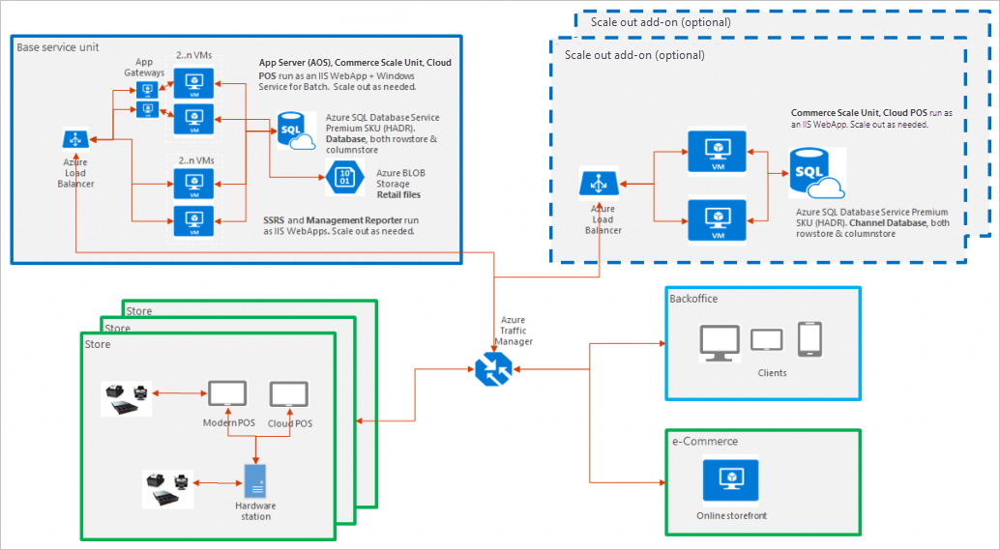
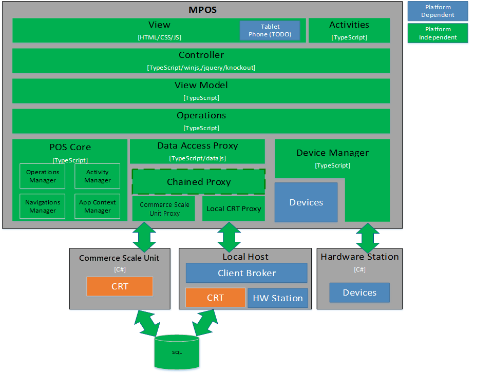
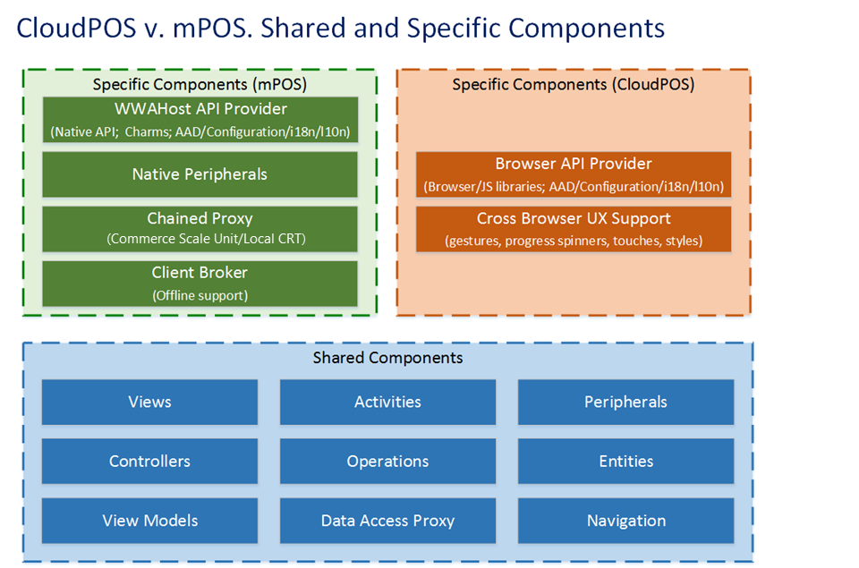

# Modern POS (MPOS) architecture

[!include [banner](../includes/banner.md)]

This article describes the POS topology.

## Modern POS topology

Users of Modern Point of Sale (POS) can perform various tasks on supported laptops, tablets, and phones. These tasks include processing sales transactions, viewing customer orders, managing daily operations and inventory, and viewing role-based reports. Both MPOS and Cloud POS are available in Microsoft Dynamics 365 Commerce. The Cloud POS is a hosted version of the POS app. Both the POS clients don't perform business functions or data processing. All business functions are provided by Commerce Scale Unit. Modern POS and Cloud POS clients can communicate with Commerce Scale Units. Modern POS client can also communicate with peripheral devices, such as cash drawers, credit card readers, and printers, by using Hardware Station. Hardware Station must be deployed in your store, and all Modern POS clients can connect to the same Hardware Station. The following diagram shows the high-level topology.

## Modern POS architecture

The view, view-controller, and devices layers depend on the operating system (for example, Windows RT) that you plan to deploy Modern POS on. The other layers are independent of the operating system. These layers use TypeScript classes and modules to implement Modern POS functionality such as workflows and entities. The following diagram shows the Modern POS technical architecture.

## Cloud POS and Modern POS architecture

Cloud POS is a hosted version of Modern POS, and varies only in the way that it is rendered on specific devices or in specific browsers. Additionally, Modern POS supports offline mode and therefore a local CRT. Other native peripheral support is also specific to Modern POS.

[!INCLUDE[footer-include](../../includes/footer-banner.md)]
